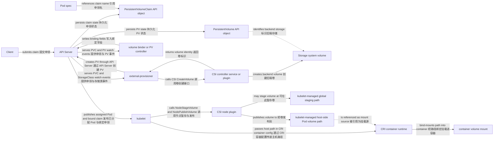

# 配置与存储

一句话：ConfigMap、Secret 和 Volume 把配置或数据交给 Pod，PV、PVC、StorageClass 与 CSI 则把应用的持久存储请求连接到具体存储能力。

它解决的是镜像外配置、敏感值分发、Pod 内文件系统组合以及 Pod 替换后的数据保留问题。ConfigMap/Secret/PVC 是 API resources；kubelet、CSI controller/node plugin 与存储系统才执行注入、供应、attach 和 mount。

## ConfigMap 与 Secret

| 方面 | ConfigMap | Secret |
| --- | --- | --- |
| 目的 | 非敏感配置 | 凭据、令牌、证书等敏感值 |
| API 数据 | `data`、`binaryData` | `data`（base64）、`stringData` 写入辅助字段 |
| Pod 使用 | 环境变量、命令参数或 volume 文件 | 同样可注入或挂载，另可被镜像拉取等机制引用 |
| 安全边界 | 普通 API 对象 | 需要更严格 RBAC、传输/静态加密和外部密钥管理 |

Secret 中的 base64 只是编码，不是 encryption；能读取 Secret API 或节点/容器内明文的主体仍可能取得内容。不要把敏感值提交到 Git，优先使用最小权限、etcd encryption at rest、短期凭据与合适的外部密钥方案。

通过 env/envFrom 注入的值在 container 启动时确定，API 对象改变不会自动更新既有进程环境。ConfigMap volume 与 Secret volume 是不同的 volume source；`projected` volume 则可以把 ConfigMap、Secret 等多个 source 组合到同一目录。以这些 volume 挂载的文件通常会由 kubelet 最终更新，但传播有延迟，应用还必须重新读取；使用 `subPath` 挂载的单文件不会收到这种自动更新。是否热加载由应用负责。

```yaml
apiVersion: v1
kind: ConfigMap
metadata:
  name: web-config
  namespace: demo
data:
  LOG_LEVEL: info
---
apiVersion: v1
kind: Secret
metadata:
  name: web-secret
  namespace: demo
type: Opaque
stringData:
  API_TOKEN: replace-outside-source-control
```

## Volume 生命周期

Pod `spec.volumes` 声明卷来源，container `volumeMounts` 把解析后的 volume 挂进自己的文件系统。同一 Pod 内多个 containers 可以共享某些 volume。Volume 生命周期由类型决定：`emptyDir` 与该 Pod UID 在当前 Node 上的生命周期一致，container 崩溃或同一 Pod 的 sandbox 被重新创建时数据仍会保留；当这个 Pod 从 Node 上被删除时，`emptyDir` 数据才随之删除。持久卷则独立于单个 Pod 生命周期。

不要把 container 可写层当持久存储。它随容器替换而丢失，而且不会天然被同 Pod 的其他 containers 共享。

## PV、PVC、StorageClass 与 CSI

PersistentVolume（PV）表示集群可用的一份存储资源；PersistentVolumeClaim（PVC）是命名空间内应用对容量、access modes 和 StorageClass 等能力的请求。volume binder / PV controller 观察这些 API objects，并通过 API Server 写入绑定字段，把兼容 PVC 与 PV 关联起来，通常形成一对一独占 claim 关系。PVC 只是被观察和更新的声明，不会主动请求 provisioner 或自行绑定 PV。Pod spec 引用 PVC；kubelet 解析 claim 后调用 CSI node plugin，把 volume 发布到 kubelet 管理的 host-side Pod volume path，再通过 CRI container config 让 runtime 将该路径挂入 container。Pod 并不直接 mount PVC API object，CSI node plugin 也不直接创建 container mount。

StorageClass 描述一类存储及 provisioner 参数，并可触发 dynamic provisioning。external-provisioner 观察 API Server 提供的 PVC 与 StorageClass 事件，调用 CSI controller service 的 `CreateVolume`；CSI driver/controller 创建后端 volume 并返回标识，external-provisioner 再通过 API Server 创建 PV API object。某些 StorageClass 使用 `WaitForFirstConsumer`，会等 Pod 调度约束已知后再供应或绑定，避免在错误 topology 创建存储。



Access modes 是存储与驱动声明的访问能力和调度约束，不是通用的文件系统写锁。`ReadWriteOnce` 通常表示可由单个 Node 读写，同一 Node 上多个 Pods 是否同时写入仍取决于应用和存储；需要单 Pod 语义时可评估 `ReadWriteOncePod` 及 CSI 支持。`ReadWriteMany` 也不提供应用级并发一致性。

PV 的 reclaim policy 决定 claim 释放后后端资产如何处理，常见为 `Delete` 或 `Retain`。删除 Pod 不等于删除 PVC；删除 PVC 后是否删除 PV/后端卷取决于绑定状态、保护 finalizers、reclaim policy 与 provisioner 行为，生产数据应先验证备份和恢复流程。

## Pod 引用 PVC 的最小例子

```yaml
apiVersion: v1
kind: PersistentVolumeClaim
metadata:
  name: web-data
  namespace: demo
spec:
  accessModes:
    - ReadWriteOnce
  resources:
    requests:
      storage: 1Gi
---
apiVersion: v1
kind: Pod
metadata:
  name: web-with-data
  namespace: demo
spec:
  containers:
    - name: web
      image: nginx:1.27
      volumeMounts:
        - name: data
          mountPath: /usr/share/nginx/html
  volumes:
    - name: data
      persistentVolumeClaim:
        claimName: web-data
```

```bash
kubectl -n demo get pvc web-data
kubectl get pv
kubectl -n demo describe pod web-with-data
```

PVC 长时间 Pending 不一定是错误：可能在等待 first consumer；也可能是没有默认 StorageClass、容量/access mode 不兼容、topology 冲突或 provisioner 失败。结合 PVC/Pod events 和 StorageClass 的 `volumeBindingMode` 判断。

## 继续阅读

前置：[网络与流量](/concepts/networking)。下一篇：[身份与安全](/concepts/security)，为 API、Pod runtime 和网络访问建立分层边界。
