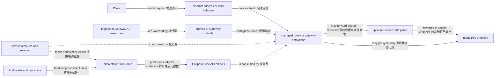

# 网络与流量

一句话：Kubernetes 网络用可路由的 Pod IP、稳定的 Service 名称、endpoint 元数据和可选的入口/策略资源，把会替换的 Pod 接到可发现、可控制的请求路径上。

它解决的是 Pod 地址短暂、后端副本变化、集群内发现、外部入口和东西向隔离问题。Service、Ingress、Gateway 与 NetworkPolicy 都是 API configuration；真正转发或拦截流量的是 CNI、Service data plane、proxy 或 gateway 等运行中实现。

## Pod IP 与 CNI

每个 Pod 通常获得集群 Pod 网络中的 IP，同一 Pod 内 containers 共享网络命名空间、IP 和端口空间，可通过 localhost 通信。Pod 被替换后 IP 可能改变，因此客户端不应把单个 Pod IP 当长期服务地址。

CNI 插件为 Pod 建立网络并报告网络结果；路由、封装、云网络集成和 NetworkPolicy enforcement 由具体实现决定。Kubernetes 网络模型要求 Pod 间通信具有一致地址语义，但并不规定数据包必须走哪种隧道、iptables 或 eBPF 路径。

## Service、EndpointSlice 与 DNS

Service 用稳定的虚拟地址或 DNS 名称代表一组后端。带 selector 的 Service 由控制器根据 Pod labels 生成 EndpointSlice；EndpointSlice 是 endpoint 地址及 `ready`、`serving`、`terminating` 等 conditions 的 API metadata，不是流量转发器。

| Service type | 暴露方式 | 主要注意点 |
| --- | --- | --- |
| `ClusterIP` | 集群内虚拟 IP；默认类型 | 数据面实现可能是 kube-proxy、eBPF 或其他机制 |
| `NodePort` | 每个合适 Node 的端口再转到 Service | 不等于生产级外部负载均衡器 |
| `LoadBalancer` | 请求外部负载均衡能力，通常也保留 ClusterIP 语义 | 实际地址、健康检查与转发路径取决于平台 |
| `ExternalName` | DNS CNAME 指向外部名称 | 无 selector，也不创建常规 endpoint 转发 |

CoreDNS 通常观察 Service 等 API 数据并提供集群 DNS。`web.demo.svc.cluster.local` 一类名称解析到 Service；headless Service 可返回 endpoint 地址。DNS 只负责发现，不保证后端 ready 或应用请求成功。

```yaml
apiVersion: v1
kind: Service
metadata:
  name: web
  namespace: demo
spec:
  selector:
    app: web
  ports:
    - name: http
      port: 80
      targetPort: http
```

```bash
kubectl -n demo get service web
kubectl -n demo get endpointslice -l kubernetes.io/service-name=web -o wide
kubectl -n demo run dns-check --rm -it --restart=Never --image=busybox:1.36 -- nslookup web
```

如果 Service selector 与 Pod labels 不匹配，控制器就不会发布这些 Pod 的 endpoint；如果 endpoint readiness 不可用，数据面通常不会把它作为可用后端。看到 Service 有 ClusterIP 并不表示它已有 usable endpoints，应先检查 selector、labels、Pod Ready condition 与 EndpointSlice conditions。

## 外部入口：Ingress 与 Gateway API

Ingress resource 描述面向 HTTP/HTTPS 的 host/path 路由；Ingress controller 观察 Ingress、Service 与 endpoint 元数据，并配置自己管理的 proxy/data plane。Ingress 对象本身不监听端口，也不存在一个 Kubernetes 内置通用 Ingress controller。

Gateway API 把基础设施与路由拆为 GatewayClass、Gateway、HTTPRoute 等 resources。Gateway controller 观察这些配置并管理 gateway data plane。不同实现支持的 Gateway API 版本、扩展和转发路径可能不同，应检查 `status.conditions` 与实现文档。

```yaml
apiVersion: networking.k8s.io/v1
kind: Ingress
metadata:
  name: web
  namespace: demo
spec:
  ingressClassName: example
  rules:
    - host: web.example.test
      http:
        paths:
          - path: /
            pathType: Prefix
            backend:
              service:
                name: web
                port:
                  name: http
```

`ingressClassName: example` 必须替换为集群中实际安装的 IngressClass；只有创建 resource 而没有相应 controller，不会产生可用入口。

## 实现中立的请求路径



该图不声称所有请求都经过 ClusterIP、kube-proxy 或某个固定进程：有的入口 proxy 经 Service data plane，有的直接消费 Service/EndpointSlice metadata 选择后端。实际链路应结合 CNI、入口实现和平台文档确认。

## NetworkPolicy 的边界

NetworkPolicy resource 用 Pod selector 和 ingress/egress rules 描述 L3/L4 允许流量；支持该能力的 CNI plugin 才会 enforcement。策略是按方向叠加允许规则：Pod 某方向未被任何 policy 选中时通常保持默认允许；一旦被选中，该方向仅允许所有适用 policy 的并集。

```yaml
apiVersion: networking.k8s.io/v1
kind: NetworkPolicy
metadata:
  name: allow-web-from-client
  namespace: demo
spec:
  podSelector:
    matchLabels:
      app: web
  policyTypes: [Ingress]
  ingress:
    - from:
        - podSelector:
            matchLabels:
              access: web
      ports:
        - protocol: TCP
          port: 80
```

常见误区是把 NetworkPolicy 当 API authorization、TLS 或 Service 路由规则。它不能替代 RBAC、应用身份或加密，而且 `podSelector` 只选择策略所在 Namespace 的 Pod；跨 Namespace 条件需显式使用 `namespaceSelector` 等规则，并确认 CNI 支持。

## 继续阅读

前置：[工作负载](/concepts/workloads)。下一篇：[配置与存储](/concepts/config-storage)，理解 Pod 如何读取配置并引用持久数据。
