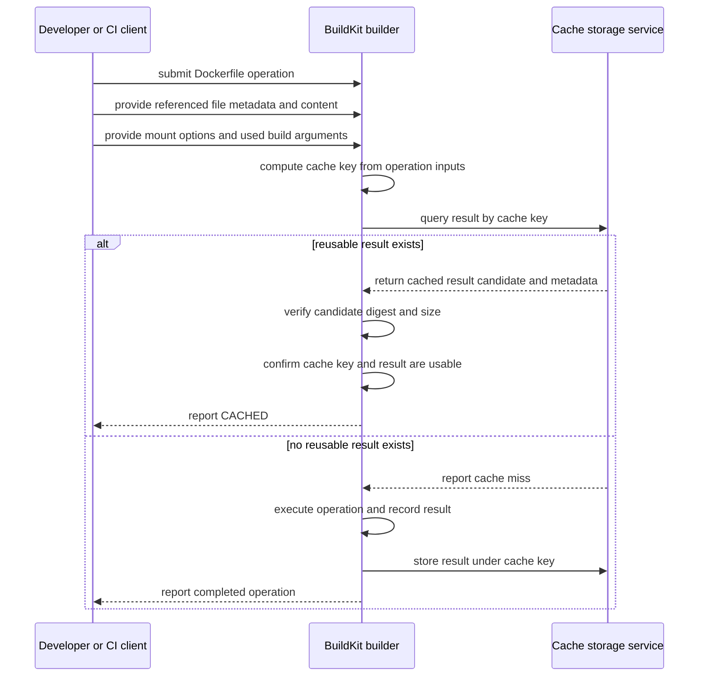

# BuildKit 缓存：复用、挂载与外部缓存

BuildKit 把 Dockerfile 转换为构建操作图，并尝试为每个操作找到可复用结果。缓存不是“按行记住上次命令输出”的黑盒：它把操作、输入与选项关联到 cache key，再复用由该键标识的结果。先理解 [Dockerfile](/docker-oci/build/dockerfile) 的 stage 和 context 边界，才能安全调整缓存。

## cache key 由哪些输入决定

缓存键不仅由 Dockerfile 指令文本决定。对具体操作，BuildKit 还会考虑它引用的文件 metadata/content、mount 选项，以及该操作实际使用的 build arguments 等输入；不同 frontend、exporter 和 BuildKit 版本可以有实现细节差异，不能把下面的模型当成 OCI 强制算法。



图中的 Developer/CI client、BuildKit 和 cache storage service 都是能发起请求或执行工作的参与者；Dockerfile 操作、文件输入和 cache key 只是消息中的数据，不会主动查询缓存。图以带 digest/size metadata 的内容寻址缓存后端表达信任边界：cache storage 只返回 candidate，消费它的 BuildKit 校验 descriptor 指向的字节与大小，再判断 cache key 和结果是否可用。嵌入式本地缓存可以使用不同内部表示，图不承诺固定进程拓扑，但存储端返回数据不等于消费侧已验证。

几个会直接影响调优的边界：

- `RUN` 的普通 shell 命令不会为了判断命中而先执行；命令文本和执行环境输入相同，才可能复用旧结果。`RUN apk update` 不会因为远端仓库变化而自行失效。
- `COPY`/`ADD` 和 `RUN --mount=type=bind` 会把引用文件的 metadata 与内容校验纳入相应缓存判断。Docker 文档明确指出文件修改时间 `mtime` 本身不用于这类 checksum；权限、大小或内容等其他变化仍可能失效。
- build argument 只有在进入某项操作求值时才影响该操作及下游缓存。声明但未使用的参数不应被当作可靠的“清空所有缓存”开关。
- secret 的值不参与 cache checksum；secret ID、mount path 等属性会参与。轮换秘密但需要重新执行相关步骤时，应另传一个非秘密 cache-bust `ARG`，同时仍用 secret mount 传秘密。

## 普通 layer 与三类 build mount

以下差异只讨论 BuildKit 的 Dockerfile `RUN --mount`，不要与 `docker run --mount` 的容器运行期挂载混为一谈：

| 输入/输出路径 | 构建时可见内容 | 是否成为该 `RUN` 的普通文件系统输出 | 主要用途 |
| --- | --- | --- | --- |
| 普通 stage root filesystem | 基础层与此前操作结果 | 是，新增、修改和删除会形成操作结果 | 生成最终要复制或保留的文件 |
| bind mount | context、stage 或其他显式来源 | 否，挂载覆盖目标路径，卸载后目标恢复 | 让命令读取大输入而不先 `COPY` |
| cache mount | builder 管理的可复用目录 | 否，目录内容独立于当前 layer 输出 | 包管理器或编译器缓存 |
| secret mount | 客户端临时提供的秘密 | 否，挂载本身不被提交 | 在单条命令中认证 |

bind mount 的来源内容仍可能参与 cache key；“不进入 layer”不表示“输入变化不影响缓存”。cache mount 的目录内容不会成为当前层的文件系统输出，且其内部状态不应成为构建正确性的唯一输入：同一个 Dockerfile 在空 cache mount 上也必须能成功，只是更慢。

secret mount 的内容不会进入镜像层，但这只保证挂载本身不是 layer 输出。如果 `RUN` 把秘密复制到普通路径、嵌入生成文件、打印到日志或上传到不可信端点，仍会泄露。秘密也不能通过 `ARG`、`ENV` 或普通 `COPY` 替代传入。

## 一个不增加依赖的 mount 示例

下面延续 `demo-api`。它用 bind mount 读取 `server.mjs` 做语法检查，再正常 `COPY` 运行文件；cache mount 只保存检查标记，即使该目录为空也不影响正确性：

```dockerfile
# syntax=docker/dockerfile:1
FROM node:24.11.1-alpine3.22
WORKDIR /app
RUN --mount=type=bind,source=server.mjs,target=/src/server.mjs,ro \
    --mount=type=cache,target=/tmp/demo-api-checks \
    node --check /src/server.mjs \
    && printf '%s\n' checked > /tmp/demo-api-checks/server.mjs
COPY --chown=node:node server.mjs ./server.mjs
ENV NODE_ENV=production PORT=3000
USER node
EXPOSE 3000
ENTRYPOINT ["node"]
CMD ["server.mjs"]
```

若真实构建需要认证，可把需要认证的那条操作写成独立步骤；此片段只演示 secret mount 生命周期，不应把 token 输出到任何普通路径：

```dockerfile
RUN --mount=type=secret,id=build_token,required=true \
    test -s /run/secrets/build_token \
    && node --check server.mjs
```

调用方必须用 `docker buildx build --secret id=build_token,src=<approved-file> ...` 提供文件，并让 `<approved-file>` 位于 build context 之外或被 `.dockerignore` 排除。实际认证命令应只访问批准的服务；不要为了演示创建或提交真实 token。

基础镜像 `node:24.11.1-alpine3.22` 的 tag 可变。生产环境应评审更新，并可用批准的 digest 替换 tag；cache hit 不能证明基础镜像仍符合当前审批策略。

## 指令顺序与失效范围

一个操作失效后，它的下游通常也需要重新求值。因此稳定输入应尽量靠前，高频变化的源码靠后。例如有 lockfile 的项目通常先复制 lockfile、恢复依赖，再复制应用源码；本示例没有 npm 依赖，不应为了展示这种模式添加空的依赖安装步骤。

不要把不同信任域的输入挤进同一个 `RUN`。将下载、验证和生成组合得过紧，任何输入变化都会扩大失效范围，也更难判断秘密或网络内容最终写到了哪里。相反，过度拆分同样可能产生无用 history 和维护负担；边界应围绕可复用输入与明确输出决定。

## `--no-cache` 与 `--pull` 解决不同问题

`--no-cache` 不等于重新拉取基础镜像。它禁止复用 Dockerfile 操作的构建缓存；`FROM` 引用仍可能解析到 builder 已有的本地基础内容。`--pull` 要求检查基础镜像引用的较新内容，但不禁用后续操作缓存，也不把可变 tag 固定为 digest。

前置条件是当前目录包含可构建的 `demo-api` 文件、Dockerfile 使用本页示例，并且 Docker CLI 可连接支持 Buildx 的 builder。要同时重新解析基础镜像并重新执行操作，可运行：

```bash
docker buildx build --pull --no-cache --load --tag demo-api:dev .
docker image inspect demo-api:dev --format 'id={{.Id}} created={{.Created}}'
```

成功证据是进度输出中的构建操作实际执行而不是显示 `CACHED`，并且 inspect 能找到新载入的 `demo-api:dev`。这仍不能证明 tag 背后的内容符合生产审批；应另外验证并记录基础镜像 digest。确认本次 tag 不被其他容器使用后清理：

```bash
docker image rm demo-api:dev
```

## 查看和回收本地缓存

`docker buildx du` 展示指定 builder 的可回收与占用情况；先确认 builder 名称和当前 Docker context，避免把远端或共享 builder 当成本机实验环境。以下示例假定已存在名为 `demo-api-cache` 的专用 builder：

```bash
docker buildx inspect demo-api-cache
docker buildx du --builder demo-api-cache
```

成功证据是 inspect 返回该 builder 的 driver/node 信息，`du` 列出 cache record、大小和 reclaimable 状态。命令只观察、不创建缓存，所以没有数据清理步骤；若这个 builder 本身就是本次实验创建且不再需要，可执行 `docker buildx rm demo-api-cache`，但这会删除它管理的缓存。

`docker builder prune` 会回收当前 Docker context 所连 daemon 的未使用构建缓存，是不可逆的清理操作，不是构建后必须执行的常规步骤。前置条件是已用 `docker system df` 查看 daemon 存储概况、确认 context 和消费者，并获得删除授权；交互执行：

```bash
docker builder prune --filter until=24h
```

命令会先要求确认，成功证据是输出删除记录和 reclaimed space。它本身就是清理，没有“撤销清理”的后续命令；取消提示或不确认是发现目标不明确时的正确结果。自定义 Buildx builder 应用 `docker buildx du --builder ...` 与 `docker buildx prune --builder ...` 管理，不能假定 `docker builder prune` 会覆盖所有远端 cache exporter。

## 导入与导出远端缓存

远端缓存让临时 CI builder 跨任务复用结果。以下 Registry 示例要求：调用方已登录一个批准的 Registry、对镜像与 cache ref 都有读写权限，当前 builder 使用支持 Registry exporter 的 driver，并把 `registry.example.com/team` 替换为真实受控仓库：

```bash
docker buildx build \
  --platform linux/amd64 \
  --tag registry.example.com/team/demo-api:dev \
  --cache-from type=registry,ref=registry.example.com/team/demo-api:buildcache \
  --cache-to type=registry,ref=registry.example.com/team/demo-api:buildcache,mode=max \
  --push .
docker buildx imagetools inspect registry.example.com/team/demo-api:dev
```

第一次运行可以没有可导入 cache；后续运行的可观察证据是进度输出显示从 `cache-from` 导入元数据并出现合适的 `CACHED` 操作，最终 inspect 能读取已推送引用。清理必须使用该 Registry 的已批准删除或保留策略分别处理 `demo-api:dev` 与 `demo-api:buildcache`；不要假设 `docker image rm` 会删除远端内容，也不要删除共享 cache ref。

远端 cache import/export 是供应链与数据边界：

- `mode=max` 可以导出中间 stage 的更多结果。任何写进普通文件系统输出的源码、配置、凭据或派生敏感文件都可能进入缓存 blob，即使最终镜像没有复制它。
- cache ref 应使用最小读写权限、项目隔离与保留策略。只从受信任的 `cache-from` 导入；digest 校验确认字节一致，不等于确认发布者身份或构建内容已经批准。
- 正确使用 secret mount 时 secret 本身不会被导出，但命令日志、普通输出和从秘密派生的文件仍需单独审查。
- 不要让不可信拉取请求写入生产分支共用的 `cache-to` ref；应按仓库、分支或信任域隔离写权限，防止缓存覆盖和信息泄漏。

本地目录 exporter 也应保持在 build context 外，或明确加入 `.dockerignore`，否则下一次构建可能把缓存目录重新作为 context 输入。Docker 官方示例与后端选项见 [Cache storage backends](https://docs.docker.com/build/cache/backends/) 和 [Optimize cache usage](https://docs.docker.com/build/cache/optimize/)。

## 常见误区

- **“命令文本没变就一定命中。”** 文件输入、使用的参数、mount 选项、父操作和 builder 状态都可能改变 cache key 或可用结果。
- **“cache mount 会把缓存目录打进镜像。”** mount 内容独立保存，只有命令写到普通 stage 路径的结果才进入 layer。
- **“secret mount 让命令输出自动脱敏。”** 它只控制秘密输入的挂载生命周期，不能阻止命令复制或打印秘密。
- **“`--no-cache` 会获取最新基础镜像。”** 要检查可变 `FROM` 引用还需 `--pull`；生产可复现性仍应使用批准 digest。
- **“远端 cache 是无害的性能数据。”** cache blob 可能包含中间文件系统结果，访问控制应按构建产物处理。

继续阅读[多平台构建](/docker-oci/build/multi-platform-builds)，可以看到 cache 如何按执行平台和目标平台分化；产物的 config、layer 与 digest 边界见[镜像模型](/docker-oci/concepts/image-model)。
