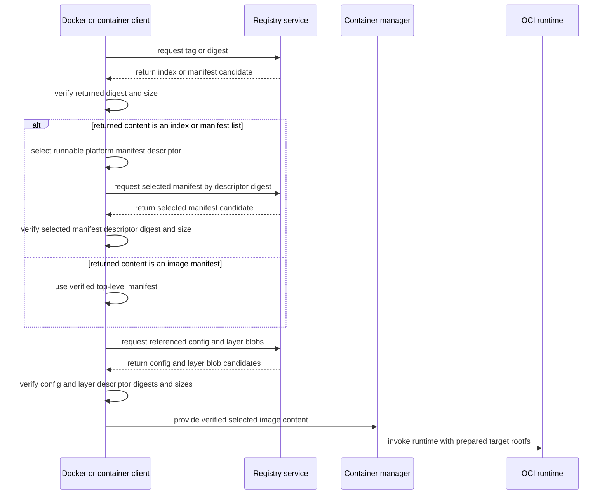

# 多平台构建：执行位置、目标产物与输出

多平台构建把同一源码解析成多个 platform 的镜像结果，再用一个顶层引用组织它们。`docker buildx build --platform=...` 只声明目标，不会自动修复错误的编译命令：目标平台必须与最终二进制和基础镜像同时匹配。开始前应先掌握 [Dockerfile](/docker-oci/build/dockerfile) 的 stage 边界和[镜像模型](/docker-oci/concepts/image-model)中的 index/manifest 关系。

## platform 由哪些字段组成

容器镜像 platform 至少通常包含 operating system 与 architecture，例如 `linux/amd64`、`linux/arm64`；某些架构还需要 variant，例如 `linux/arm/v7`。Docker 的 `--platform` 接受一个或多个这类目标，builder 必须为每个目标解析基础镜像并产生结果。

BuildKit 自动提供一组 platform `ARG`：

- `BUILDPLATFORM`：执行本次构建工作的 builder node 平台。
- `BUILDOS`、`BUILDARCH`、`BUILDVARIANT`：`BUILDPLATFORM` 的拆分值。
- `TARGETPLATFORM`：当前输出目标平台。
- `TARGETOS`、`TARGETARCH`、`TARGETVARIANT`：`TARGETPLATFORM` 的拆分值。

准确地说，BUILDPLATFORM 表示执行构建的 builder node 平台，不等同于任意“当前 stage 实际执行平台”。stage 的基础镜像与用户空间平台由 `FROM --platform` 决定；省略该 flag 时，`FROM` 默认使用构建请求的目标平台。只有 `FROM --platform=$BUILDPLATFORM` 才把该 stage 的基础镜像和用户空间固定到构建平台，使其中的 `RUN` 通常可以原生执行；若 stage 用户空间与 node 架构不同，执行其中的程序仍需要可用的模拟机制。

这些自动参数在全局作用域可供 `FROM --platform=...` 使用；要在 stage 的 `RUN` 中读取，仍需在该 stage 重新声明相应 `ARG`。它们是 Dockerfile frontend/BuildKit 提供的构建变量，不是 OCI image config 强制环境变量，也不会自动进入最终容器环境。

## 让验证 stage 原生执行

`demo-api` 只有 `server.mjs`，使用 Node 内置 `node:http`，没有 npm 依赖或本地编译二进制。可以让语法检查在 `BUILDPLATFORM` 原生执行，让最终基础镜像按 `TARGETPLATFORM` 选择：

```dockerfile
# syntax=docker/dockerfile:1
ARG NODE_IMAGE=node:24.11.1-alpine3.22

FROM --platform=$BUILDPLATFORM ${NODE_IMAGE} AS verify
ARG TARGETPLATFORM
WORKDIR /src
COPY server.mjs .
RUN printf 'checking source for %s\n' "$TARGETPLATFORM" \
    && node --check server.mjs \
    && mkdir /out \
    && cp server.mjs /out/server.mjs

FROM --platform=$TARGETPLATFORM ${NODE_IMAGE}
ENV NODE_ENV=production PORT=3000
WORKDIR /app
COPY --from=verify --chown=node:node /out/server.mjs ./server.mjs
USER node
EXPOSE 3000
ENTRYPOINT ["node"]
CMD ["server.mjs"]
```

这里跨 stage 复制的是平台无关的 JavaScript 源文件，目标 Node 可执行文件来自与 `TARGETPLATFORM` 匹配的最终基础镜像。因此没有发生应用 cross-compilation。若项目以后加入 native addon、Go/Rust/C/C++ 二进制或从构建 stage 复制可执行文件，构建命令必须显式使用 `TARGETOS`/`TARGETARCH` 或工具链等价参数，并验证文件格式、依赖和实际目标环境；只设置 `FROM --platform` 不会改写编译器默认目标。

`node:24.11.1-alpine3.22` 的 tag 可变，而且每个平台 descriptor 可以在不同时间更新。生产环境应评审多平台基础镜像的每个目标，并可将 tag 替换为批准的顶层 digest；固定 index digest 后，仍需确认它包含预期 platform descriptor。

## 一个 tag 如何选择平台

一个多平台 tag 通常指向 OCI index。对可运行平台 image manifest，descriptor 通常声明 `platform`，并以 digest 指向该平台的 manifest；但 descriptor 的 `platform` 是可选字段，不能断言 index 中每个条目都有它。Docker media type 的 manifest list 可以承担相同角色，所以实际类型应以 Registry 返回的 `mediaType` 为准。

Buildx 输出还可能在顶层 index 附带 provenance/attestation 辅助 manifest。Docker 当前的 attestation storage 会把这类 descriptor 标为 `vnd.docker.reference.type=attestation-manifest`，并可显示 `unknown/unknown`，防止 runtime 把它当成可运行镜像。检查平台集合时应区分带真实 `os`/`architecture` 的可运行 image descriptor 与这些辅助 descriptor；`unknown/unknown` 不是第三个应用目标平台。



图中 index、manifest、config 和 layer 只作为服务返回或客户端传递的数据，不会发起请求。Registry 返回 candidate，不负责替客户端证明内容可信；客户端根据请求 digest、响应 metadata 或上游 descriptor 校验 digest 和 size，只有验证后才选择或交给 container manager。客户端按请求平台从可运行 descriptor 中选择一个 manifest 后，通常只拉取该 manifest 需要的内容；没有匹配项时应失败。QEMU 等执行能力不能让 Registry 中缺失的平台 manifest 自动出现，也不改变 OCI index 的选择规则。规范字段见 [OCI Image Index Specification](https://github.com/opencontainers/image-spec/blob/main/image-index.md)，Buildx 辅助 manifest 的当前表示见 Docker 官方 [Attestation storage](https://docs.docker.com/build/metadata/attestations/attestation-storage/)。

## 三种执行策略

QEMU 模拟、原生多节点和交叉编译是三种不同策略，可以按 stage 混用，但必须明确哪一项保证了什么：

| 策略 | 构建 stage 如何执行 | 优点 | 边界与验证 |
| --- | --- | --- | --- |
| QEMU emulation | builder 通过 bundled emulator 或 host binfmt 执行另一架构程序 | Dockerfile 改动少，适合快速覆盖 | 可用方式取决于运行形态；计算密集步骤更慢，仍要测试目标镜像 |
| native multi-node | builder 为不同 platform 调度到对应原生节点 | 执行快，能运行真实目标工具链和测试 | 要管理节点版本、凭据、网络和一致的构建输入 |
| cross-compilation | 在 `BUILDPLATFORM` 工具链中生成 `TARGETPLATFORM` 产物 | 避免大量模拟，适合原生支持交叉编译的语言 | 构建脚本必须显式设置目标，且目标系统库、ABI 与最终基础镜像要匹配 |

先用 `docker buildx inspect --bootstrap` 检查 builder capability，确认 `Platforms` 是否包含目标，并用一个最小构建验证 foreign-architecture `RUN`；不要仅凭主机安装方式推断模拟能力。不同运行形态的默认条件不同：

- **Docker Desktop：** Desktop VM 通常预配置 bundled QEMU，常见目标默认可用于构建和运行，但仍以当前 builder inspect 与实际构建为准。
- **Docker Engine + buildx / 独立 builder：** Docker 官方文档说明，standalone Engine 使用 official BuildKit release 时通常已经 bundled QEMU user-mode emulator，多数情况无需手动安装。自定义 driver、固定旧版本或替换 BuildKit 镜像后必须重新检查 capability。
- **直接运行 upstream BuildKit：** 能否透明模拟取决于实际分发物与 worker。官方 release 可能带 `buildkit-qemu-*` helper；third-party BuildKit package 可能不带，或者没有放进 BuildKit 可发现的路径，不能从“使用 BuildKit”这一名称推断可用。
- **host binfmt：** 只有已经选择 QEMU 策略，并且目标平台未报告、foreign `RUN` 失败或所用分发物没有可用 bundled emulator 时，才评估按官方步骤在 Linux host 注册静态 QEMU。该动作通常需要 privileged 主机权限并改变全局 `binfmt_misc` 状态，应先获得基础设施授权、记录原状态和回滚方案；不要在普通 CI job 中直接修改。

这些条件以 Docker 官方 [Multi-platform builds](https://docs.docker.com/build/building/multi-platform/) 当前说明为准。builder 报告目标 platform 也只说明调度/模拟入口可用，不证明应用产物正确。

### 原生多节点 builder

以下命令序列的前置条件是：已经分别创建并验证名为 `amd64-node` 与 `arm64-node` 的 Docker contexts，它们连接受控的原生 Linux Engine；当前用户获准在两节点构建，且节点能读取同一 Registry。命令只组合现有 contexts：

```bash
docker buildx create --name demo-api-native amd64-node
docker buildx create --name demo-api-native --append arm64-node
docker buildx inspect demo-api-native --bootstrap
```

成功证据是 inspect 列出两个 node，状态可用，并在 `Platforms` 中分别报告所需原生平台。context 名称不证明 CPU 架构，必须以 inspect 和节点资产记录交叉确认。实验完成且没有其他任务使用该 builder 后清理：

```bash
docker buildx rm demo-api-native
```

这只删除 builder 定义及其专属资源，不删除两个 Docker contexts 或 Registry 镜像；共享 builder 不应由单个任务清理。

### cross-compilation 的验收边界

cross-compilation 不是把 `TARGETPLATFORM` 写进日志。编译 stage 应在 `BUILDPLATFORM` 上运行，将 `TARGETOS`、`TARGETARCH` 和必要 variant 映射到编译器真实参数；最终 stage 用 `FROM --platform=$TARGETPLATFORM`，只复制对应产物。至少应检查产物文件格式/架构、动态链接器与系统库兼容性，并在目标原生节点或受批准的模拟环境运行测试。

本页的 JavaScript 示例没有独立应用二进制，因此 `node --check` 只验证源码语法；最终 Node runtime 是否为目标架构由基础镜像选择决定。不要把主机上的 `node_modules` 直接复制进多平台镜像：依赖树可能包含 native addon，必须按目标平台安装或构建并验证。

## build、load、push 是三件事

BuildKit 完成构建后，结果首先存在 builder 的结果/cache 边界。是否进入本地 Docker image store、写成文件或发布到 Registry，由 exporter 决定：

| 输出方式 | 结果位置 | 多平台边界 |
| --- | --- | --- |
| 不指定显式输出 | builder cache | 对 `docker-container` driver，结果可能只留在 cache，不能直接 `docker run` |
| `--load` | 当前 Docker Engine 的本地 image store | 通常使用 Docker exporter 加载单平台结果 |
| `--push` | Registry | 多目标构建可发布顶层 index/manifest list 与各平台内容 |
| `--output type=oci,dest=...` | 本地 OCI layout tar | 可以保留多平台 OCI 内容，但不会自动出现在 `docker image ls` |

`--load` 通常只能把单平台结果载入本地 image store。使用 containerd image store 的 Docker 配置或不同 exporter 时能力可能不同，应以当前 driver、store 和版本的官方文档及实际 inspect 为准；不要把某台 Docker Desktop 的行为概括为所有 Engine 的 OCI 要求。

`--push` 是发布行为，不是“让构建更正确”。它需要 Registry 写权限，并可能使 tag 对其他消费者可见。一个多平台构建成功推送后，仍要检查顶层类型、每个平台 descriptor 和运行验证；构建、加载与推送分别回答“是否产生结果”“本地能否消费”“远端是否发布”。

## 单平台加载并运行

前置条件是当前目录包含本页 Dockerfile 和 `server.mjs`，Docker CLI 连接本机 Linux Engine，Buildx builder 支持 Engine 报告的平台，主机端口 `8080` 空闲。先取 Engine 平台，再只加载这个平台：

```bash
DEMO_API_PLATFORM="$(docker version --format '{{.Server.Os}}/{{.Server.Arch}}')"
docker buildx build --platform "$DEMO_API_PLATFORM" --load --tag demo-api:dev .
docker image inspect demo-api:dev --format 'platform={{.Os}}/{{.Architecture}} id={{.Id}}'
docker run --detach --name demo-api --publish 127.0.0.1:8080:3000 demo-api:dev
curl --fail http://localhost:8080/healthz
```

成功证据是 inspect 的平台与 `DEMO_API_PLATFORM` 一致，容器保持运行，`/healthz` 返回 `ok`。这验证了单个平台的本地运行路径，不代表另一个平台也正确。确认资源是本次实验创建后清理：

```bash
docker rm --force demo-api
docker image rm demo-api:dev
```

## 多平台推送与检查

前置条件是当前目录可构建，Docker 主机已经配置可执行 `linux/amd64` 与 `linux/arm64` 的原生节点或受批准 QEMU，并且已经登录一个批准的 Registry。把 `registry.example.com/team` 替换为真实受控仓库；此操作会发布远端内容：

```bash
docker buildx create --name demo-api-multi --driver docker-container --use
docker buildx inspect --bootstrap
docker buildx build \
  --platform linux/amd64,linux/arm64 \
  --tag registry.example.com/team/demo-api:dev \
  --push .
docker buildx imagetools inspect registry.example.com/team/demo-api:dev
```

成功证据是新 builder 的 inspect 输出同时包含 `linux/amd64` 与 `linux/arm64`，build 完成两个目标并推送，imagetools 输出顶层 index/manifest list digest，且平台清单同时包含这两个平台。还应分别在原生或批准的模拟环境访问 `127.0.0.1:8080:3000` 与 `/healthz`；仅 inspect 元数据不能验证应用二进制。

构建完成且没有其他任务使用该 builder 后清理本地 builder：

```bash
docker buildx rm demo-api-multi
```

远端 `demo-api:dev` 及其 blobs 不会随 builder 删除。应通过 Registry 的批准删除/保留策略清理本次 tag，先确认没有部署或其他 tag 引用内容；不要用本地 `docker image rm` 假装删除了远端发布。

## 导出多平台 OCI 归档

需要审查多平台内容但暂不发布时，可以导出 OCI layout。前置条件仍是 builder 支持两个目标，当前目录可写且不存在需要保留的 `demo-api.oci.tar`，并且安装了带内置 `node:fs` 与 `node:crypto` 的 Node.js 20+ 以及 `tar`。以下校验脚本不依赖 npm 包：它递归验证每个 descriptor 的 size/digest、继续检查 manifest 的 config/layers，并单独统计可运行平台。只有 index 与 manifest descriptor 的内容按 JSON 解析；config 和 layer 在这个流程中只校验原始 bytes，二进制 layer 绝不会传给 `JSON.parse`。

```bash
set -eu
export DEMO_API_OCI_DIR="$(mktemp -d)"
trap 'rm -r -- "$DEMO_API_OCI_DIR"; rm -f -- demo-api.oci.tar' EXIT

docker buildx build \
  --platform linux/amd64,linux/arm64 \
  --output type=oci,dest=demo-api.oci.tar .
tar -xf demo-api.oci.tar -C "$DEMO_API_OCI_DIR"

node --input-type=module <<'NODE'
import { createHash } from 'node:crypto'
import { readFile } from 'node:fs/promises'
import { join } from 'node:path'

const root = process.env.DEMO_API_OCI_DIR
const runnablePlatforms = []

async function verifyDescriptor(descriptor) {
  const [algorithm, encoded] = descriptor.digest.split(':', 2)
  const bytes = await readFile(join(root, 'blobs', algorithm, encoded))
  if (bytes.length !== descriptor.size) {
    throw new Error(`size mismatch for ${descriptor.digest}`)
  }
  const actual = `${algorithm}:${createHash(algorithm).update(bytes).digest('hex')}`
  if (actual !== descriptor.digest) {
    throw new Error(`digest mismatch for ${descriptor.digest}`)
  }
  return bytes
}

async function readJsonDescriptor(descriptor) {
  const bytes = await verifyDescriptor(descriptor)
  return JSON.parse(bytes.toString('utf8'))
}

async function walkIndex(index) {
  for (const descriptor of index.manifests) {
    const document = await readJsonDescriptor(descriptor)
    if (descriptor.mediaType.endsWith('.image.index.v1+json')) {
      await walkIndex(document)
      continue
    }

    if (!descriptor.mediaType.endsWith('.image.manifest.v1+json')) continue
    await verifyDescriptor(document.config)
    for (const layer of document.layers) await verifyDescriptor(layer)

    const referenceType = descriptor.annotations?.['vnd.docker.reference.type']
    const platform = descriptor.platform
    if (referenceType !== 'attestation-manifest'
      && platform?.os
      && platform?.architecture
      && platform.os !== 'unknown'
      && platform.architecture !== 'unknown') {
      runnablePlatforms.push(`${platform.os}/${platform.architecture}`)
    }
  }
}

const index = JSON.parse(await readFile(join(root, 'index.json'), 'utf8'))
await walkIndex(index)
const actual = [...new Set(runnablePlatforms)].sort()
const expected = ['linux/amd64', 'linux/arm64']
if (JSON.stringify(actual) !== JSON.stringify(expected)) {
  throw new Error(`unexpected runnable platforms: ${actual.join(', ')}`)
}
console.log(`verified runnable platforms: ${actual.join(', ')}`)
NODE

rm -r -- "$DEMO_API_OCI_DIR"
rm -- demo-api.oci.tar
trap - EXIT
```

成功证据是构建与脚本都返回零状态，并输出 `verified runnable platforms: linux/amd64, linux/arm64`。这比 `tar -tf` 只看到 `oci-layout`、`index.json` 与 `blobs/` 的外壳更强：脚本实际读取并验证 descriptor 内容链，同时排除了 attestation manifest。最后三条命令清理临时目录和归档；若中途失败，`trap` 也会清理这两个明确路径。这个流程验证 OCI 结构与两个目标，不会把归档载入本地 image store，也不会运行其中应用，运行期验证仍需另做。

## 缓存与多平台

平台变量、不同 `FROM` manifest、编译参数和产物会让 cache key 分化。平台无关的源码 context 或某些中间结果可能共享，但不能依赖不同架构必然复用相同 layer。远端 `cache-to`/`cache-from` 应把平台与信任域纳入命名和访问控制；详细安全边界见 [BuildKit 缓存](/docker-oci/build/buildkit-cache)。

## 常见误区

- **“写了两个 `--platform` 就得到两个正确二进制。”** build script 可能忽略 `TARGETARCH`，或把主机产物复制到所有目标；必须在 build stage 和目标环境验证。
- **“QEMU 会把 amd64 二进制转换成 arm64。”** QEMU 在另一架构语义下模拟执行，不会替应用重编译产物。
- **“一个多平台 tag 下载时会解包所有平台。”** 客户端通常从 index 选择一个匹配 manifest，再取得该平台内容。
- **“`--load` 和 `--push` 只是同一结果的两个名字。”** 前者面向本地 store 且通常是单平台，后者发布 Registry 内容并可形成多平台入口。
- **“推送成功就证明所有目标可运行。”** Registry 接受内容只证明发布路径完成，不验证 ABI、动态依赖、启动信号或 `/healthz`。

Docker 当前支持的 strategy、driver 与 exporter 组合以官方 [Multi-platform builds](https://docs.docker.com/build/building/multi-platform/) 和 [Exporters](https://docs.docker.com/build/exporters/) 为准。构建后需要理解 index、manifest 与 layer 的精确关系时，回到[镜像模型](/docker-oci/concepts/image-model)。
