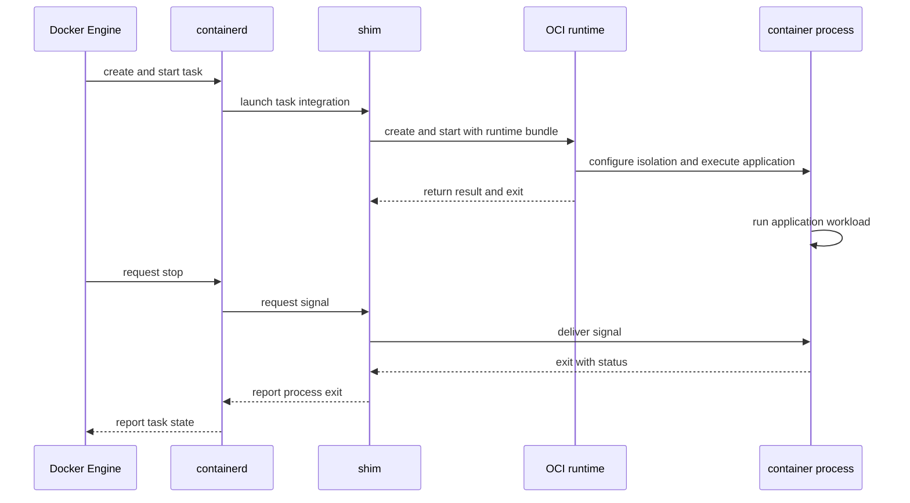

# Docker 容器模型

容器首先是受隔离和约束的主机进程。Docker 还为这个进程维护镜像快照、container metadata、writable layer、mounts、网络配置和生命周期状态，但这些数据对象都不会自己执行应用代码。

## 一个容器包含哪些部分

把 `docker run` 产生的结果拆成六部分，可以避免把“容器”误当成一个封闭小虚拟机：

| 部分 | 作用 | 生命周期边界 |
| --- | --- | --- |
| 镜像 snapshot | 提供只读 root filesystem 基线 | 可被多个容器共享，删除容器不等于删除镜像 |
| container metadata | 保存名称、镜像引用、进程配置、mount 和网络设置 | 容器停止后仍存在，删除容器时移除 |
| writable layer | 记录该容器相对镜像的文件系统变化 | 属于容器，删除容器时移除 |
| mounts | 把 Volume、bind mount 或 tmpfs 接到容器路径 | 数据寿命取决于 mount 类型，不等于 writable layer |
| network namespace | 给运行进程独立的接口、地址、路由与端口视图 | 通常随运行期创建和释放，Docker 保留重建所需配置 |
| host process | 在内核调度下执行应用指令 | start 时创建，stop 或退出后不再存在 |

容器名称和 container ID 标识 Engine 管理的运行时对象，不是进程 PID。一个 stopped 容器仍有 metadata 和 writable layer，但没有正在执行的容器主进程；再次 `start` 会基于保留状态创建新的进程。

## 从请求到进程生命周期

生命周期图只把能发起动作或执行代码的组件画成参与者。镜像、container metadata 和 writable layer 是这些 actor 读取或修改的被动对象，因此不把它们画成会发送消息的参与者。



这是典型的 Docker Engine、containerd、shim、runtime 和 process 关系，不是所有平台的固定进程拓扑。Docker Desktop 的 Linux process 位于 VM 中，其他 OCI runtime 也可以替换 runc。进一步的委托边界见 [Docker 架构](/docker-oci/concepts/docker-architecture)。

## 镜像快照与可写层

镜像层保持只读，容器增加自己的可写层。storage driver 或 containerd snapshotter 把有序镜像层准备成 lower snapshot，再叠加容器专属 upper 层，向容器进程呈现一个合并后的 root filesystem。具体实现可能是 overlayfs、btrfs、zfs 或其他后端，磁盘目录和复制粒度并不统一。

copy-on-write 描述可见语义：进程读取未修改路径时可以复用只读镜像内容；首次修改相应内容时，存储后端在可写层记录私有变化。删除文件通常记录遮蔽下层对象的标记，而不是修改原始 layer。不同 driver 可能复制整文件、块或使用原生 snapshot，不能从 copy-on-write 这个名称推断固定性能成本。

`docker commit` 可以根据容器变化生成新镜像内容，但不会“回写”原镜像，也不应替代可审查的 Dockerfile 构建。运行期日志、数据库和上传文件若需要独立于容器生存，应放到明确的 Volume 或外部服务，而不是依赖 writable layer。

## metadata 与进程不是同一对象

container metadata 记录创建时使用的 image ID、`Entrypoint`/`Cmd` 合成结果、环境变量、用户、资源设置、mounts、网络附件和当前 State。`docker container inspect` 返回这类 Engine 视图。它描述如何创建和管理进程，但自身不是 Linux process。

start 时，低层 runtime 根据准备好的配置创建容器初始进程。这个进程在自己的 PID namespace 中常看到自己为 PID 1，在 daemon 所在 Linux 主机上却有另一个 host PID。PID 1 还承担信号处理和孤儿进程回收的特殊责任，所以应用应正确转发信号并回收子进程。详见[进程生命周期](/docker-oci/runtime/process-lifecycle)。

进程退出后，容器进入 `exited` 状态，exit code 和时间仍保存在 metadata 中。`docker start` 启动的是新进程，不会复活已退出的 PID，也不会把进程内存恢复到退出前状态。

## namespaces 改变可见范围

Linux namespaces 为一组进程提供不同的系统资源视图。namespace 改变进程能看到什么，cgroup 约束或统计资源。两者解决的问题不同，不能笼统地都称为“资源隔离”。

- mount namespace 给进程独立的挂载视图，使合并 root filesystem、Volume 和 bind mount 出现在指定路径。
- PID namespace 改变进程可见的 PID 集合和编号；它不让进程脱离主机内核调度。
- network namespace 提供接口、路由、端口和防火墙状态的独立视图；端口发布把主机流量转发到这个视图，不是镜像的属性。
- UTS、IPC、user、cgroup namespace 等可进一步隔离主机名、IPC、用户 ID 或 cgroup 视图，实际启用方式取决于平台与运行参数。

namespace 是内核边界而不是虚拟机边界。容器共享主机内核，错误配置的 capability、特权模式、敏感 bind mount 或 runtime 漏洞仍可能突破预期边界。Linux namespaces 的系统接口可参考 [namespaces(7)](https://man7.org/linux/man-pages/man7/namespaces.7.html)。

## cgroups 约束与统计资源

cgroups 把进程组织到控制组中，供内核统计 CPU、内存、I/O 和 PID 等资源，并在配置时施加限制。`docker stats` 读取的指标来自这类运行时统计，但字段和计算方式会受 cgroup v1/v2、操作系统及 Docker 版本影响。

没有显式设置 `--memory` 或 CPU 限额，不表示容器获得独占资源；它通常只是与主机其他进程竞争。反过来，设置内存限制也不等于预留同等物理内存。资源限制、调度优先级和应用容量规划需要分别验证。内核接口细节见 [Control Group v2](https://docs.kernel.org/admin-guide/cgroup-v2.html)。

## 挂载与数据寿命

mount 会在容器的 mount namespace 中覆盖目标路径。从进程视角，路径仍在 root filesystem 树上；从存储生命周期看，内容可能来自完全不同的位置：

| 类型 | 数据所在边界 | 删除容器后的默认结果 |
| --- | --- | --- |
| writable layer | Docker 管理的容器专属层 | 随容器删除 |
| named Volume | Docker 管理、具有独立名称的 Volume | 保留，等待显式删除 |
| anonymous Volume | Docker 管理、无用户指定名称的 Volume | 通常保留；`docker rm -v` 或 `--rm` 可按规则清理 |
| bind mount | daemon 主机上的指定路径 | 主机文件继续存在 |
| tmpfs | 内存中的临时挂载 | 卸载或容器停止后丢失 |

删除容器会删除它的可写层，但不会自动删除命名 Volume。因为 mount 覆盖容器路径，写入 Volume 或 bind mount 的文件通常不会出现在 `docker diff` 的 writable layer 差异中。不要通过删除容器来假设业务数据已清除，也不要用 `docker rm -v` 期待它删除 named Volume。存储选择和备份边界见[存储与挂载](/docker-oci/runtime/storage)。

## 停止、删除与镜像的边界

`docker stop` 先向容器主进程发送配置的停止信号，等待超时后才强制终止。停止后 metadata、writable layer、日志配置和 mount 定义仍在，因此可以 inspect、查看 diff 或重新 start。此时没有持续运行的应用进程，运行期 namespace 和 cgroup 资源也可能已被释放并在下次启动重建。

`docker rm` 删除 stopped 容器的 metadata 和 writable layer。对 running 容器使用 `docker rm --force` 会先强制结束进程，这会缩短应用正常清理数据的机会。容器删除不会自动删除创建它的镜像；反过来，有容器引用镜像时 Engine 通常也会阻止删除相关本地镜像内容。

命名 Volume 和 bind-mounted host data 具有独立寿命。删除它们是另一项有数据损失风险的操作，应先确认所有消费者和备份，而不是把它们混进常规容器替换流程。

## 用命令观察运行对象

下面的实验需要当前 Docker context 指向允许创建 Linux 容器的 Engine。它创建一个命名 Volume，同时分别写入 writable layer 和 Volume：

```bash
docker volume create container-model-data
docker run --detach --name container-model-demo --memory 128m \
  --mount type=volume,src=container-model-data,dst=/data \
  alpine:3.22 sh -c 'mkdir -p /work; echo changed >/work/state; echo persistent >/data/state; exec sleep 300'
docker container inspect container-model-demo --format 'status={{.State.Status}} image={{.Image}} host-pid={{.State.Pid}}'
docker container inspect container-model-demo --format 'mounts={{json .Mounts}} networks={{json .NetworkSettings.Networks}}'
docker top container-model-demo
docker diff container-model-demo
docker stats --no-stream container-model-demo
```

`docker container inspect` 展示 metadata 和 daemon 主机 PID，`docker top` 展示实际进程，`docker diff` 应包含 `/work` 的可写层变化，而 `/data/state` 位于 Volume 中，`docker stats --no-stream` 给出一次 cgroup 相关资源快照。远程 context 下，host PID、mount source 和 network 信息都属于远端 daemon 主机。

接着停止并删除容器，验证 stopped 和 deleted 的差别，以及命名 Volume 的独立寿命：

```bash
docker stop container-model-demo
docker container inspect container-model-demo --format 'status={{.State.Status}} pid={{.State.Pid}}'
docker diff container-model-demo
docker rm container-model-demo
docker volume inspect container-model-data
docker run --rm --mount type=volume,src=container-model-data,dst=/data alpine:3.22 cat /data/state
docker volume rm container-model-data
```

停止后 inspect 应显示 `exited` 且没有运行中的 host PID，diff 仍可读；删除后容器本身不可再 inspect，但 Volume 仍存在，临时验证容器应输出 `persistent`。最后一条是本实验的 Volume 数据清理步骤，只有在确认该 Volume 就是示例资源时才执行。

如果 `alpine:3.22` 也是此次实验才拉取的，并且已确认没有其他本地容器或引用需要它，可以选择清理镜像 tag：

```bash
docker image rm alpine:3.22
```

镜像清理是可选步骤。不要为了完成实验清理而删除原本已存在或仍被其他工作使用的本地镜像。

## 常见误区

- **“容器是一个轻量虚拟机。”** 容器进程共享主机内核，隔离主要来自 namespaces、cgroups、权限和挂载组合。
- **“停止容器会删除它。”** stop 只结束运行进程，metadata 和 writable layer 仍保留；rm 才删除容器对象。
- **“写进容器的内容都在镜像里。”** 运行期变化进入 writable layer 或 mounts，不会改变原镜像。
- **“删除容器也会删除所有数据。”** named Volume 与 bind mount 独立生存；删除前必须分别确认。
- **“PID 1 就是主机 PID 1。”** PID namespace 会改变可见编号，主机和容器看到的 PID 可能不同。
- **“Kubernetes Pod 只是换名字的 Docker 容器。”** kubelet 通过 CRI 管理 Pod sandbox 和容器，Pod 还定义共享网络、存储和调度边界。参见[工作负载](/kubernetes/concepts/workloads)与[集群和节点](/kubernetes/concepts/cluster-nodes)。

## 下一步

回看[镜像模型](/docker-oci/concepts/image-model)可以定位只读输入，阅读[进程生命周期](/docker-oci/runtime/process-lifecycle)、[网络与端口](/docker-oci/runtime/networking)和[存储与挂载](/docker-oci/runtime/storage)可以分别深入 process、network namespace 与 mounts。需要从可运行示例重新观察这些差异时，返回[从源码到第一个容器](/docker-oci/guide/source-to-container)或 [Docker / OCI 总览](/docker-oci/)。
