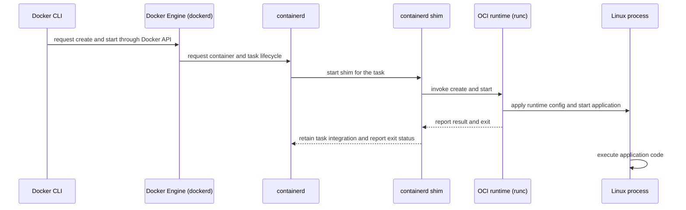
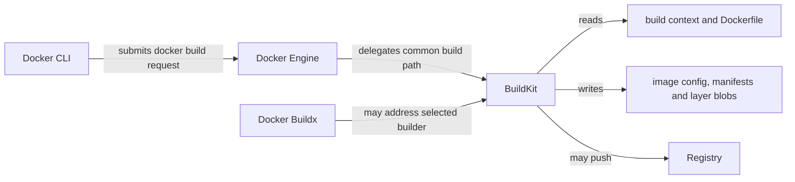

# Docker 架构与职责边界

Docker 的命令行体验隐藏了多层委托关系。对应用开发者最重要的边界是：谁接收请求，谁构建内容，谁管理生命周期，谁只在创建进程时短暂运行，以及哪些对象只是数据。

## 从命令到进程的调用链

下面以典型 Linux Docker Engine 安装为例。Docker Desktop 会把这些组件封装在虚拟机和产品进程中，其他版本也可能改变组件的打包方式，但调用职责仍可用这条链理解。



Docker CLI 是客户端，不直接创建 Linux 进程。Docker Engine 通过 containerd 管理容器生命周期。containerd 通常为任务使用 shim，shim 再调用所配置的 OCI runtime；因此不能把路径简化成 Engine 永远直接调用 `runc`。runc 按 OCI Runtime Specification 创建容器进程后退出。它不是在容器整个运行期驻留的监督进程，shim 才保留与 containerd 的低层任务集成，并收集退出状态等信息。

图中的 image、runtime bundle 与 container metadata 都是被读取的数据，没有任何一个会主动“启动自己”。实际执行应用代码的是最后创建的 Linux process。

## Docker CLI 与 context

Docker CLI 把 `docker build`、`docker pull`、`docker run` 等用户意图转换成 Docker API 请求。Docker context 是一组有名字的连接配置，至少描述 CLI 应连接哪个 Engine endpoint，也可以包含 TLS 材料和编排端点。context 可以指向本机 Unix socket，也可以指向经过授权的远程 daemon。

因此，“命令在我的终端执行”不等于“容器在我的电脑运行”。当 context 指向远程 Engine 时，build context 会跨连接发送，bind mount 路径属于 daemon 主机，发布端口也出现在 daemon 主机。先观察选择结果，再解释网络和文件路径：

```bash
docker context show
docker context ls
docker context inspect "$(docker context show)"
```

`DOCKER_CONTEXT`、`DOCKER_HOST` 和命令行连接选项可能覆盖默认选择。不要仅凭 context 名称判断连接目标，应检查 inspect 输出，并把远程 Docker API 当作主机级高权限接口保护。

## Docker Engine 与 dockerd

Docker Engine 是提供 Docker API 和容器产品能力的服务端，`dockerd` 是典型 Linux 安装中的 daemon 进程。它负责认证 API 请求，维护 Docker 层的镜像、容器、网络和 Volume 元数据，并协调下游组件。CLI 与 Engine 是客户端和服务端关系，即使两者安装在同一台机器上也不是一个进程。

Engine 是协调者，不应被描述为亲自完成每个底层步骤。Docker Engine 把构建工作委托给 BuildKit；创建和启动容器时则把低层生命周期操作交给 containerd。Docker Desktop 可能隐藏 daemon 所在的 Linux VM，rootless mode 也会改变权限与 socket 位置，所以宿主进程树和路径要以当前安装为准。

Docker 的 [Engine API 文档](https://docs.docker.com/reference/api/engine/)定义客户端可调用的产品接口。它与 OCI Runtime Specification、Registry 的 Distribution API 不是同一个 API。

## BuildKit 只负责构建路径

构建与运行是两条不同路径。BuildKit 解析 Dockerfile 前端产生的构建图，读取 build context，执行构建步骤，复用或导出缓存，并生成镜像内容；它不负责让应用容器长期运行。



不同 builder driver 会让 BuildKit 在 Engine 内、独立容器或远端节点运行，所以“由 Engine 委托”描述的是常见 `docker build` 路径，不是所有 Buildx 拓扑的物理部署承诺。继续阅读 [BuildKit 缓存](/docker-oci/build/buildkit-cache)时，应把缓存记录和最终镜像内容也视为被 builder 读写的数据。

## containerd、shim 与 runc

containerd 提供镜像传输、snapshot 和容器 task 生命周期等低层能力。Docker Engine 是它的上游调用者之一；Kubernetes 节点也常通过 CRI 插件使用 containerd，但不会因此经过 Docker CLI 或 Docker Engine。

典型 containerd Runtime v2 路径中，每个运行中的容器 task 有相应的 shim。shim 把 daemon 生命周期与容器进程解耦，持有标准输入输出连接并向 containerd 报告进程退出。具体进程数量和组织方式会随 runtime、containerd 版本及平台变化，不要把“一容器一 shim”当作跨实现规范。

`runc` 是常见的低层 OCI runtime。它读取 runtime bundle 中的 `config.json` 和 root filesystem，按 [OCI Runtime Specification](https://github.com/opencontainers/runtime-spec)配置 namespaces、cgroups、mounts 与进程，然后返回调用方并退出。也可以配置其他符合相应接口的 runtime，因此 containerd 不等于 runc，runc 也不负责镜像构建或 Registry 传输。

## Registry 是远端内容服务

Registry 通过名称和引用暴露镜像内容。Engine、BuildKit 或其他客户端使用 [OCI Distribution Specification](https://github.com/opencontainers/distribution-spec)所定义的 Distribution API 拉取和推送 manifest、index、config 与 layer blob。认证、授权、保留策略、扫描和复制通常由具体 Registry 产品补充。

Registry 是被请求的远端内容服务，不会运行镜像中的应用。`docker pull` 把内容取到 Engine 或 builder 可用的内容存储；`docker run` 随后才沿运行路径创建进程。tag 解析和 blob 下载也可能经过缓存或镜像代理，所以抓包看到的主机不一定只有用户输入的 Registry 域名。

## 如何观察每一层

下面的前四条命令不会创建容器。它们分别观察 CLI/Engine 版本、当前 context、daemon 信息和 BuildKit builder：

```bash
docker version
docker context show
docker info
docker buildx ls
```

`docker version` 应有 Client 和 Server 两部分；缺少 Server 通常表示当前连接不能到达 Engine。`docker info` 和后续容器命令观察的是 context 指向的 daemon，不一定是 CLI 所在主机。

需要一条实际运行路径时，可以创建短期容器并从 Docker 层观察它。首次执行可能从 Registry 拉取镜像：

```bash
docker run --detach --name architecture-demo alpine:3.22 sleep 300
docker container inspect architecture-demo --format 'status={{.State.Status}} pid={{.State.Pid}}'
docker top architecture-demo
docker rm --force architecture-demo
```

`inspect` 的 PID 是 daemon 主机上的进程标识；在 Docker Desktop 中它位于 Linux VM，不是桌面宿主操作系统的 PID。`docker top` 请求 daemon 查看容器进程。最后一条会停止并删除示例容器，但不会自动删除刚拉取的镜像；如确认不再使用，可另行执行 `docker image rm alpine:3.22`。

更底层的 `systemctl status docker containerd`、`ps` 或日志命令只适用于你有权限访问的 Linux Engine 主机。远程 context 和 Docker Desktop 环境不能从本地 shell 直接据此判断 daemon 内部状态。

## 常见误区

- **“CLI、Engine 和 runtime 是同一个程序。”** CLI 发 API 请求，dockerd 协调产品能力，containerd 管理低层 task，runc 短暂创建进程。
- **“runc 一直守护容器。”** runc 完成 OCI 创建或启动操作后退出；长期集成由 shim 等组件维持，应用进程独立执行。
- **“BuildKit 也负责 `docker run`。”** BuildKit 生成构建输出；运行路径由 Engine、containerd、shim 和 runtime 协调。
- **“Registry 会启动上传的镜像。”** Registry 通过 Distribution API 存储和传输内容，不执行其中的程序。
- **“Kubernetes 节点一定运行 Docker Engine。”** 现代 Kubernetes 通常由 kubelet 通过 CRI 连接 container runtime。参见[集群与节点](/kubernetes/concepts/cluster-nodes)，并用 [Docker / OCI 总览](/docker-oci/)校准两条调用链。

接下来用[镜像模型](/docker-oci/concepts/image-model)理解这些组件传输的数据，再用[容器模型](/docker-oci/concepts/container-model)理解进程、可写层与挂载的生命周期。要亲自走通整条路径，返回[从源码到第一个容器](/docker-oci/guide/source-to-container)。
