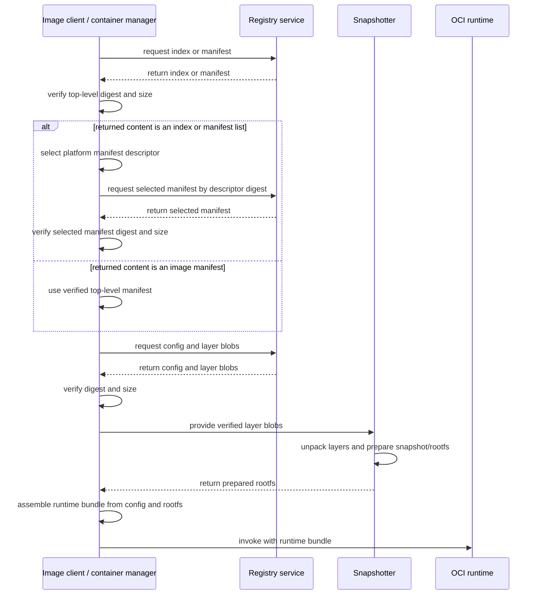

# Docker 镜像模型

镜像不是压缩后的虚拟机磁盘，也不是一个会运行的对象。它是一张由 descriptor 连接的内容图：名称先解析到 manifest 或 index，manifest 再引用 config 和有序 layer。低层 runtime 不能直接使用这张远端内容图；镜像客户端或容器管理器必须先解析引用、校验并获取内容，再让 snapshotter 解包 layer 和准备 root filesystem。

## 从名称走到内容图

下面把内容图的结构关系放进实际检索路径。index、manifest、config 和 layer 只作为消息中的数据传递，不会主动请求下一个对象：



如果顶层对象是 index 或 manifest list，客户端必须先按 platform 选择一个 manifest descriptor，再用其中的 digest 从 Registry 获取并校验子 manifest。只有得到已验证的具体 image manifest，客户端才能沿它的 descriptors 请求 config 和 layer blobs；顶层对象本身就是 image manifest 时则不需要这次子 manifest 往返。

这张图描述职责顺序，不承诺每个实现都使用独立进程。Image client / container manager 可以由 Docker Engine、containerd 或其他实现承担，snapshotter 也可能嵌入其存储路径。OCI runtime 不直接解析 Registry 引用，也不直接拉取或解包镜像 layer。准备 snapshot/rootfs 和 runtime bundle 后，容器管理器才调用 OCI runtime；runtime 消费的是 runtime bundle 中的配置和 root filesystem，而不是 OCI image manifest。

## descriptor 是引用的共同形状

OCI descriptor 用一小段元数据指向另一个内容对象。三个核心字段是：

| 字段 | 含义 | 校验边界 |
| --- | --- | --- |
| `mediaType` | 目标对象的格式和用途，例如 OCI image manifest 或 gzip layer | 告诉消费者如何解释字节，不代表内容可信 |
| `digest` | 对目标原始字节计算的内容标识，常见算法为 `sha256` | 下载后重算可发现内容损坏或替换 |
| `size` | 目标内容的字节数 | 可在读取前后检查长度，并限制异常响应 |

descriptor 还可能带 `platform`、`annotations` 或内嵌 `data` 等字段，具体可用字段取决于它所在的规范位置。`digest` 保证“这些字节是否一致”，不自动证明发布者身份、漏洞状态或允许部署；签名、证明和准入策略属于更高层的信任边界。

以下是有意缩短的代表性 manifest 形状：

```json
{
  "schemaVersion": 2,
  "mediaType": "application/vnd.oci.image.manifest.v1+json",
  "config": { "mediaType": "application/vnd.oci.image.config.v1+json", "digest": "sha256:<config>", "size": 1234 },
  "layers": [
    { "mediaType": "application/vnd.oci.image.layer.v1.tar+gzip", "digest": "sha256:<layer>", "size": 5678 }
  ]
}
```

这里的 `sha256:<config>` 和 `sha256:<layer>` 是解释字段关系的占位记法，不是合法、可运行的 Registry 标识，也不能用于 `docker pull`。真实 digest 在冒号后是算法要求长度的十六进制值，真实 `size` 也必须与目标 blob 完全一致。

## manifest 连接配置与文件系统层

manifest 引用 config 和 layer descriptors。config blob 保存架构、操作系统、默认进程配置、环境变量、工作目录、history，以及 `rootfs.diff_ids`；它不包含 layer 的压缩字节。manifest 的 `layers` 数组按应用顺序引用文件系统变更集，每个 layer blob 通常是一个压缩 tar 流。

layer 表达相对于前一状态的增删改，包括 whiteout 语义，而不是一份完整根文件系统。按顺序应用所有 layer 才得到镜像的 root filesystem 视图。多个镜像可以引用相同 digest 的 blob，因此内容存储可以安全去重；没有引用和保留策略时，垃圾回收才可能删除 blob。

完整字段与约束以 [OCI Image Manifest](https://github.com/opencontainers/image-spec/blob/main/manifest.md)和 [Image Configuration](https://github.com/opencontainers/image-spec/blob/main/config.md)为准。Docker 还可消费兼容的 Docker media types，所以实际远端对象的 `mediaType` 不一定都以 `application/vnd.oci` 开头。

## index 先按平台选择 manifest

OCI index 按 platform 引用一个或多个 manifest。每个子 manifest descriptor 可以声明 `os`、`architecture`、`variant` 等 platform 信息。拉取多平台引用时，客户端先获取顶层 index，再根据目标平台选择一个 manifest，最后获取它的 config 和 layers。

平台选择发生在获取容器文件系统之前。`linux/amd64` 与 `linux/arm64` 通常有不同 config 和至少部分不同 layer digest，但也可能共享与架构无关的 layer。没有匹配项时客户端应报错，不能假装另一架构的字节适用于当前主机；显式仿真属于另外配置的执行能力。

Docker Registry 中也常见 Docker manifest list，它承担相同的多平台入口角色，但使用 Docker media type。命令输出应以实际 `mediaType` 为准，不要仅凭产品名称断定对象格式。

## 内容寻址与可变名称

tag 是可变引用，digest 是内容寻址标识。Registry 管理员或发布流水线可以让同一个 `repository:tag` 在不同时间指向不同顶层内容；相同算法下，已知 digest 则固定对应一组确定字节。修改 manifest 的任何字节都会产生新 manifest digest，修改 config 或 layer 后还必须更新上游 descriptor，最终改变整条引用链。

`repository@sha256:...` 通常固定顶层 manifest 或 index。生产部署使用 digest 可以消除 tag 漂移，但仍需保留 Registry 可用性、平台选择和信任策略。digest 不是“永远存在”的承诺，Registry 删除或垃圾回收内容后，固定引用仍可能无法拉取。

Docker 的本地 image ID、远端 `RepoDigests` 与用户输入的 tag 是不同观察面。不要假定列表中所有 `sha256:` 都指向同一种对象；先看命令字段和对象上下文。

## 压缩 digest 与 DiffID

压缩 layer digest 与解压后的 DiffID 不是同一个值。这个结论以 layer descriptor 的 `mediaType` 表示 gzip、zstd 等压缩格式为前提：descriptor 的 `digest` 对 Registry 传输的压缩 blob 字节计算，config 中 `rootfs.diff_ids` 的 DiffID 则对解压后的 layer tar 字节流计算。两者校验的是两个不同阶段：传输内容与未压缩变更集。

media-type 边界不能省略。未压缩 mediaType 的 descriptor 如果使用与 DiffID 相同的算法，会因为散列同一份未压缩 tar 字节而得到与 DiffID 相同的值。例如 `application/vnd.oci.image.layer.v1.tar` 表示未压缩 layer，此时不能机械套用“descriptor digest 一定不同于 DiffID”。

改变压缩级别或 gzip 元数据，可能让压缩 digest 改变，而未压缩 tar 字节相同、DiffID 不变。反过来，文件内容、tar header 或条目顺序变化通常会改变 DiffID。DiffID 也不是对最终合并目录逐文件计算的哈希，不能拿普通目录校验和替代。

manifest 中 layer descriptors 的顺序应与 config 中 `rootfs.diff_ids` 的顺序对应。内容存储可用压缩 digest 标识下载 blob，snapshotter 或 storage driver 则根据解压后的层准备容器文件系统；具体磁盘布局不由 OCI Image Specification 统一规定。

## history 与文件系统层不是一一对应

config 的 `history` 记录构建历史条目，例如创建时间、命令和注释。某些 Dockerfile 指令只改变 config 元数据而不产生文件系统差异，这类条目可标记 `empty_layer: true`。因此 history 条目数量可以多于 manifest 的 layer 数量，也不能用 history 文本可靠重建原始 Dockerfile。

真正的文件系统层关系由 manifest `layers` 和 config `rootfs.diff_ids` 表达。构建历史可能被压缩、改写或省略，且经常包含构建工具生成的字符串；不要把它当作审计日志，也不要在构建命令或层中写入秘密。

## 用 Docker 观察本地与远端对象

以下命令需要可连接的 Docker Engine、Registry 网络，以及提供 `docker buildx` 的较新 Docker 安装。先拉取当前平台镜像，再分别观察本地配置、远端多平台入口和原始 JSON：

```bash
docker pull alpine:3.22
docker image inspect alpine:3.22 --format 'id={{.Id}} repoDigests={{json .RepoDigests}}'
docker image inspect alpine:3.22 --format 'platform={{.Os}}/{{.Architecture}} diffIDs={{json .RootFS.Layers}}'
docker buildx imagetools inspect docker.io/library/alpine:3.22
docker buildx imagetools inspect --raw docker.io/library/alpine:3.22
```

`docker image inspect` 观察 Engine 的本地镜像表示，`.RootFS.Layers` 通常显示 DiffID；`docker buildx imagetools inspect` 直接检查 Registry 引用，适合观察 index/manifest list 的平台 descriptors。`--raw` 结果可能是 OCI 或 Docker media type，也可能因 tag 后续移动而变化。需要固定一次观察时，先记录输出的真实 digest，再以 `name@digest` 重试。

这些命令不会创建容器。若此次仅为练习并确认没有其他容器依赖该 tag，可清理本地引用：

```bash
docker image rm alpine:3.22
```

删除本地引用不会删除 Registry 内容，也不保证立即回收所有共享 blob。

## 常见误区

- **“一个 tag 就是一份不可变镜像。”** tag 可以移动；需要固定内容时记录并验证 digest。
- **“manifest 包含所有 layer 字节。”** manifest 只包含 descriptors，blob 通过这些 digest 单独寻址和下载。
- **“多平台镜像把所有架构层都解压到本机。”** 客户端通常先从 index 选择目标 manifest，再拉取所需内容。
- **“所有 `sha256:` 都能互换。”** manifest digest、config digest、压缩 layer digest 和 DiffID 对不同字节计算，语境不能省略。
- **“一条 build history 就必然对应一个 layer。”** config-only 指令可产生 `empty_layer` history，不增加文件系统层。

## 下一步

先回到 [Docker 架构](/docker-oci/concepts/docker-architecture)确认谁生成、传输和消费这些对象，再读[容器模型](/docker-oci/concepts/container-model)理解只读 layer 如何变成可运行的文件系统视图。要从自己的构建结果观察这些字段，完成[从源码到第一个容器](/docker-oci/guide/source-to-container)；OCI 格式边界可继续进入 [OCI 规范关系](/docker-oci/oci/specifications)。
