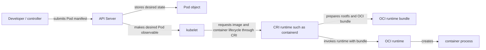

# 从容器镜像到 Kubernetes Pod

Kubernetes 不是把 `docker run` 参数逐项翻译成 Pod。开发者提交 PodSpec，kubelet 通过 Container Runtime Interface（CRI）请求节点的容器 runtime 解析镜像、创建 sandbox 和容器；containerd 是一种常见的 CRI runtime 实现。镜像提供 image config 默认值，PodSpec 则表达集群中的期望配置与策略。

## 从镜像配置到 PodSpec

| Image/Docker source | Kubernetes field or behavior | Boundary |
| --- | --- | --- |
| image reference | `containers[].image` | kubelet asks CRI runtime to resolve and pull |
| image `Entrypoint` | `containers[].command` | Pod field overrides when present |
| image `Cmd` | `containers[].args` | Pod field overrides when present |
| image `Env` | `env` / `envFrom` | Pod values add or override runtime environment |
| image `User` | `securityContext.runAsUser` | policy/runtime validation may override or reject |
| `EXPOSE` | `containerPort` / Service | no automatic conversion |
| `HEALTHCHECK` | startup/liveness/readiness probes | no automatic conversion |
| `VOLUME` | Pod Volume and `volumeMounts` | no automatic storage provisioning |

PodSpec 的 command 覆盖镜像 Entrypoint，PodSpec 的 args 覆盖镜像 Cmd。它们是 Kubernetes API 字段名，不是要在容器内执行的 shell 字符串；数组元素会组成最终 argv，且创建 Pod 后不能就地修改。只提供 `args` 时保留镜像 Entrypoint；只提供 `command` 时不会自动拼接镜像 Cmd，所需参数应显式写入 `args`。因此要检查实际 image config，不要靠 Dockerfile 文本猜测。官方行为见 Kubernetes [Define a Command and Arguments for a Container](https://kubernetes.io/docs/tasks/inject-data-application/define-command-argument-container/)。

| PodSpec `command` | PodSpec `args` | final argv source |
| --- | --- | --- |
| omitted | omitted | image Entrypoint + image Cmd |
| omitted | present | image Entrypoint + PodSpec args |
| present | omitted | PodSpec command only; image Cmd is dropped |
| present | present | PodSpec command + PodSpec args |

换句话说，args-only retains image Entrypoint，而 command-only drops image Cmd。这是 Kubernetes 对镜像默认 argv 的覆盖语义，不是 shell 拼接规则。

`env` 和 `envFrom` 把 Pod 配置加入运行环境，同名键可覆盖镜像 `Env` 默认值。`securityContext.runAsUser` 可以显式覆盖 image `User`，而 Pod Security 或其他 admission policy 也可因 UID、root 身份或其他属性拒绝 Pod。这是 API 与策略边界，不是 OCI 强制 Dockerfile 中必须使用某个 UID。

## 不会自动迁移的 Dockerfile 元数据

假设连续示例的镜像由下面 Dockerfile 生成：

```dockerfile
# syntax=docker/dockerfile:1
FROM node:24.11.1-alpine3.22
WORKDIR /app
COPY --chown=node:node server.mjs .
ENV PORT=3000
USER node
EXPOSE 3000
VOLUME ["/app/data"]
HEALTHCHECK --interval=10s --timeout=2s --retries=3 CMD wget -qO- http://127.0.0.1:3000/healthz || exit 1
ENTRYPOINT ["node", "server.mjs"]
CMD ["--mode=http"]
```

`demo-api:dev` 是本地教学 tag，仍然可变。生产 Pod 应使用审批后的 `repository@sha256:...` 固定顶层 manifest 或 index，并保留平台选择、Registry 可用性与信任策略；digest 不会自动表示镜像已通过安全审批。

EXPOSE 不会自动创建 Service 或 containerPort。`containerPort` 主要是 Pod 的结构化端口声明，不会像 `docker run --publish` 一样自动建立主机端口映射；Service 是另一个 API 对象，通过 selector 选择 Pod。Dockerfile HEALTHCHECK 不会自动转换为 Kubernetes probe，应根据启动、存活和就绪语义分别声明。Dockerfile VOLUME 不会自动创建 Kubernetes Volume，也不会预置 PVC 或持久性；Pod 必须明确声明 `volumes` 和 `volumeMounts`。

## 一份显式的 Pod 与 Service

下面的 Pod 把刚才的默认值与集群策略都写出来。`command` 和 `args` 演示覆盖关系；`emptyDir` 只在该 Pod 生命周期内保留数据，不是持久存储。

```yaml
apiVersion: v1
kind: Pod
metadata:
  name: demo-api
  labels:
    app: demo-api
spec:
  containers:
    - name: api
      image: demo-api:dev
      imagePullPolicy: IfNotPresent
      command: ["node", "server.mjs"]
      args: ["--mode=http"]
      env:
        - name: PORT
          value: "3000"
      ports:
        - name: http
          containerPort: 3000
      startupProbe:
        httpGet:
          path: /healthz
          port: http
        failureThreshold: 30
        periodSeconds: 2
      readinessProbe:
        httpGet:
          path: /healthz
          port: http
        periodSeconds: 5
      livenessProbe:
        httpGet:
          path: /healthz
          port: http
        periodSeconds: 10
      resources:
        requests:
          cpu: 50m
          memory: 64Mi
        limits:
          memory: 128Mi
      securityContext:
        runAsUser: 1000
        runAsNonRoot: true
        allowPrivilegeEscalation: false
      volumeMounts:
        - name: data
          mountPath: /app/data
  volumes:
    - name: data
      emptyDir: {}
---
apiVersion: v1
kind: Service
metadata:
  name: demo-api
spec:
  selector:
    app: demo-api
  ports:
    - name: http
      port: 80
      targetPort: http
```

这份 YAML 是声明式配置，不是已经运行的 Pod 或 Service。在真实集群提交前，需要先让节点能够解析 `demo-api:dev`，或把镜像推送到受信 Registry 并替换为经批准的 digest。`runAsUser: 1000` 也必须与实际镜像文件所有权和集群策略一起验证，不能因为官方 Node 镜像常用 `node` 用户就把 UID 当成 OCI 固定值。

## 在测试集群中验证

前置条件：有一个可用的测试集群，已安装 `kubectl` 和 `curl`，有权创建 Pod 与 Service，主机端口 `18080` 未被占用，且当前目录没有 `demo-api-pod.yaml`。先把上一节的 YAML 原样落盘为 `demo-api-pod.template.yaml`，再在当前 shell 中把 `DEMO_API_IMAGE` 设为节点可拉取、组织已批准的 `registry/repository@sha256:digest`。不要把占位 digest 直接执行。

本地 `demo-api:dev` 不会自动出现在集群节点上。`kind load docker-image`、`minikube image load` 或特定容器 runtime 的 import 流程都是本地集群实现选择，不具备跨集群通用性。本流程使用已批准 digest，并先显示 context 与 API 端点；读者必须确认 kubectl context 确实指向允许测试的集群，否则应在 `kubectl apply` 前停止。

```bash
set -euo pipefail
: "${DEMO_API_IMAGE:?set DEMO_API_IMAGE to an approved registry/repository@sha256:digest}"
[[ "$DEMO_API_IMAGE" =~ @sha256:[a-f0-9]{64}$ ]] || { echo 'DEMO_API_IMAGE must use an approved SHA-256 digest' >&2; exit 2; }
test -f demo-api-pod.template.yaml
demo_api_namespace="demo-api-$(date +%s)-$$"
demo_api_run_dir=$(mktemp -d "${TMPDIR:-/tmp}/demo-api-handoff.XXXXXX")
demo_api_manifest="$demo_api_run_dir/demo-api-pod.yaml"
demo_api_port_forward_log="$demo_api_run_dir/port-forward.log"
demo_api_healthz="$demo_api_run_dir/healthz.txt"
demo_api_port_forward_pid=''
demo_api_namespace_created=0

record_cleanup_failure() {
  local status="$1"
  if [[ "$status" -ne 0 && "$demo_api_cleanup_status" -eq 0 ]]; then
    demo_api_cleanup_status="$status"
  fi
}

cleanup() {
  local original_status=$?
  local demo_api_cleanup_status=0
  local status=0
  trap - EXIT INT TERM
  set +e
  if [[ -n "$demo_api_port_forward_pid" ]]; then
    if kill -0 "$demo_api_port_forward_pid" 2>/dev/null; then
      kill "$demo_api_port_forward_pid"
      status=$?
      record_cleanup_failure "$status"
      wait "$demo_api_port_forward_pid"
    else
      if wait "$demo_api_port_forward_pid"; then status=1; else status=$?; fi
      record_cleanup_failure "$status"
    fi
  fi
  if [[ "$demo_api_namespace_created" -eq 1 ]]; then
    kubectl delete -n "$demo_api_namespace" --ignore-not-found -f "$demo_api_manifest" --wait=true --timeout=120s
    status=$?
    record_cleanup_failure "$status"
    kubectl delete namespace "$demo_api_namespace" --wait=true --timeout=120s
    status=$?
    record_cleanup_failure "$status"
  fi
  rm -r "$demo_api_run_dir"
  status=$?
  record_cleanup_failure "$status"

  if [[ "$original_status" -ne 0 ]]; then exit "$original_status"; fi
  exit "$demo_api_cleanup_status"
}
trap cleanup EXIT
trap 'exit 130' INT
trap 'exit 143' TERM

kubectl config current-context
kubectl cluster-info
if kubectl create namespace "$demo_api_namespace"; then
  demo_api_namespace_created=1
else
  status=$?
  exit "$status"
fi

sed "s|image: demo-api:dev|image: ${DEMO_API_IMAGE}|" demo-api-pod.template.yaml > "$demo_api_manifest"
kubectl apply -n "$demo_api_namespace" -f "$demo_api_manifest"
kubectl wait -n "$demo_api_namespace" --for=condition=Ready pod/demo-api --timeout=120s
kubectl get -n "$demo_api_namespace" pod/demo-api -o wide
kubectl get -n "$demo_api_namespace" service/demo-api

kubectl port-forward -n "$demo_api_namespace" service/demo-api 18080:80 >"$demo_api_port_forward_log" 2>&1 &
demo_api_port_forward_pid=$!

require_port_forward_alive() {
  local status=0
  if kill -0 "$demo_api_port_forward_pid" 2>/dev/null; then return 0; fi
  if wait "$demo_api_port_forward_pid"; then status=1; else status=$?; fi
  cat "$demo_api_port_forward_log" >&2
  return "$status"
}

demo_api_forwarding_ready=0
for attempt in {1..30}; do
  if require_port_forward_alive; then :; else status=$?; exit "$status"; fi
  if grep -Fq 'Forwarding from 127.0.0.1:18080' "$demo_api_port_forward_log"; then
    demo_api_forwarding_ready=1
    break
  fi
  if [[ "$attempt" -eq 30 ]]; then
    cat "$demo_api_port_forward_log" >&2
    exit 1
  fi
  sleep 1
done
test "$demo_api_forwarding_ready" -eq 1
if require_port_forward_alive; then :; else status=$?; exit "$status"; fi
curl --fail --silent --show-error --output "$demo_api_healthz" http://127.0.0.1:18080/healthz
if require_port_forward_alive; then :; else status=$?; exit "$status"; fi
test "$(cat "$demo_api_healthz")" = "ok"
```

namespace 名包含 timestamp 和 shell PID，是本次唯一 namespace；只有 `kubectl create namespace` 成功后，脚本才会在其中 apply、wait、get、port-forward 和 delete。因此它不会接管 default namespace 中同名的 Pod 或 Service。`kubectl wait` 返回零状态表示 Pod 已满足 Ready condition，不代表永久健康。

受控的后台 port-forward 将 Service 映射到本机 `127.0.0.1:18080`。脚本把日志写入本次 `mktemp` 目录，每轮先用 `kill -0` 确认 PID 存活，再等待 `Forwarding from 127.0.0.1:18080` 证据；curl 前后也都重新检查 PID。进程提前退出时，`wait` 的真实非零状态会传递给整个脚本，而不会因本机其他端点恰好返回 `ok` 而被掩盖。

EXIT trap 先记住原始失败码，然后只停止本次记录的 port-forward PID，显式以 `-n "$demo_api_namespace"` 删除本次 manifest，再用 `--wait=true` 删除 namespace，最后删除本次唯一临时目录。原始操作失败时保留原始状态；原始操作全部成功时，成功路径的 cleanup 失败仍保持非零退出。脚本不删除作为读者输入的 `demo-api-pod.template.yaml`；如果它仅为本次练习创建，读者可在确认无需保留后手动删除。本页不声称该流程已在项目 CI 或任何特定集群执行。

## kubelet、CRI 与 OCI runtime 的责任链



Developer 或 controller 向 API Server 提交对象，API Server 保存期望状态，节点上的 kubelet 观察到已调度的 Pod 后调用 CRI。CRI runtime 解析可变 tag 或固定 digest、拉取与校验镜像内容、准备 rootfs，并把合成后的 OCI bundle 交给低层 OCI runtime。具体调用可由 containerd CRI plugin、shim 和 runtime 组合完成，这是实现细节，不是 PodSpec 要求某个特定产品。

Pod object 是被 actor 创建、存储和观察的被动数据，不会自己调用 kubelet、CRI 或 OCI runtime。同样，image config 和 bundle 也不会主动启动进程。Kubernetes 官方 [Container Runtime Interface](https://kubernetes.io/docs/concepts/architecture/cri/) 定义 kubelet 与 runtime 的接线；OCI [Runtime Specification](https://github.com/opencontainers/runtime-spec/blob/main/spec.md) 则描述 bundle 之后的低层生命周期。CRI 不是 OCI Runtime Specification 的别名。

OCI runtime 只消费准备好的 bundle，不负责 CRI 镜像拉取或 Pod sandbox；kubelet 也不直接把 PodSpec 作为 OCI `config.json` 交给低层 runtime。

## 迁移时的判断顺序

1. 先用 `docker image inspect demo-api:dev` 或 Registry 元数据确认真实 image config，不从 Dockerfile 历史推测最终值。
2. 明确 `command`/`args`、environment 和 `securityContext` 是否保留镜像默认值还是有意覆盖。
3. 根据应用语义单独设计 startup、readiness 和 liveness probe，不复制 HEALTHCHECK 后就默认三者等价。
4. 根据访问路径设计 Service 和网络策略，根据数据生命周期选择 `emptyDir`、PVC 或其他 Volume，并为 scheduler 与 kubelet 声明 requests/limits。
5. 在目标集群的 admission、runtime、平台和 Registry 环境中验证；本页的 YAML 不是已在 CI 或任何集群执行成功的声明。

## 对应的 Kubernetes 主题

- [工作负载](/kubernetes/concepts/workloads)：Pod、Deployment、Job 等 controller 如何表达期望副本与更新。
- [健康检查与生命周期](/kubernetes/operations/health-lifecycle)：startup、readiness、liveness probe 与终止流程。
- [网络与流量](/kubernetes/concepts/networking)：Pod IP、Service、EndpointSlice 和入口边界。
- [配置与存储](/kubernetes/concepts/config-storage)：ConfigMap、Secret、Volume、PVC 和 CSI。
- [调度与资源](/kubernetes/concepts/scheduling-resources)：requests、limits、QoS 和放置。

需要回到镜像端时，阅读 [Dockerfile 语义](/docker-oci/build/dockerfile)、[镜像模型](/docker-oci/concepts/image-model) 和 [OCI 规范关系](/docker-oci/oci/specifications)，分别核对构建默认值、内容寻址与 runtime bundle 的边界。
