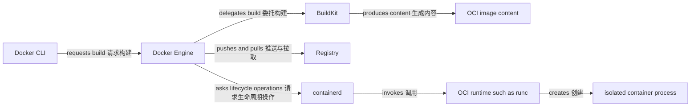

# Docker / OCI 总览

这个模块面向应用开发者：先把源码、构建、镜像、分发和容器进程之间的关系串起来，再进入 Dockerfile、运行时和 OCI 细节。Docker 提供了一套交互和实现，OCI 则定义了其中若干关键接口的开放规范；两者并不是同一个产品。

## 从源码到容器进程



Docker CLI 向 Docker Engine 发出请求；它是客户端，不是在本机直接创建容器进程的执行者。构建时，Docker Engine 把任务交给 BuildKit，BuildKit 读取构建上下文并生成镜像内容。运行时，containerd 管理容器生命周期并调用 OCI runtime，例如 runc；运行时再依据配置创建隔离的容器进程。

这张图的箭头表示请求、读取、生成、推拉、调用和创建。镜像、manifest 和 container 都不会主动执行这些动作：镜像与 manifest 是内容寻址的数据对象，container 在 Docker 语境中是运行时管理的元数据与资源集合；真正执行应用代码的是容器中的进程。

## 六个参与者，不是一体化黑盒

| 参与者 | 主要职责 | 关键边界 |
| --- | --- | --- |
| Docker CLI | 把 `build`、`pull`、`run` 等意图发送给 Engine | CLI 连接的可能是本机，也可能是远程 context |
| Docker Engine | 提供 Docker API，协调镜像、网络、存储和容器操作 | 它会委托构建和低层容器生命周期工作 |
| BuildKit | 解析构建定义、读取 build context、执行构建并管理缓存 | 它产生镜像内容，不负责长期运行应用进程 |
| Registry | 通过名称、tag 和 digest 提供镜像内容的分发端点 | Registry 存储和传输内容，不会启动镜像 |
| containerd | 管理镜像与容器的低层生命周期 | Docker Engine 是上游调用者；本模块不深入 containerd 内部机制 |
| OCI runtime（如 runc） | 按 OCI Runtime Specification 消费 runtime bundle 并创建容器进程 | runc 不负责 Dockerfile 构建或 Registry 分发 |

这些是职责关系，不是对所有安装方式的进程拓扑承诺。Docker Desktop、Docker Engine 版本和运行平台可能改变组件的打包方式，但不会把这些职责混成一个数据对象。

## 镜像与容器不是同一个对象

镜像（image）是创建容器所需的只读内容和默认配置，包括文件系统层、环境变量、工作目录与入口等。容器（container）是根据镜像创建的运行时对象，有自己的 container ID、可写层、网络设置、挂载和进程状态。删除容器不会自动删除它的镜像，同一镜像也可以创建多个容器。

`demo-api:dev` 中的 `dev` 是 tag，是便于人类操作、可以指向新内容的名字。digest（例如 `sha256:...`）是由内容计算的不可变标识；需要精确复现或部署批准时，应记录并使用已验证的 digest，而不要把可变 tag 当作不变身份。

## OCI 规定什么，Docker 实现什么

Open Container Initiative（OCI）定义规范，不提供一个等同于 Docker Engine 的完整开发者产品。OCI Image Specification 定义 manifest、config 和 layer 等镜像对象；Image Layout 定义如何在文件系统上布置这些内容；Distribution Specification 定义与 Registry 交换内容的 HTTP API；Runtime Specification 定义 runtime bundle 和容器运行时行为。

Docker 在这些规范之上提供 CLI、Engine API、Dockerfile 构建体验、网络、Volume 和 Compose 等功能。注意：“Docker 镜像可以表示为 OCI 内容”并不意味着 OCI 规范了 `docker build` 的所有用户体验，也不意味着所有 OCI runtime 都实现 Docker API。

## 一个最短验证路径

需要已安装 Docker CLI，并且当前 Docker context 能连接到一个正在运行的 Docker Engine。先执行：

```bash
docker version
docker info
docker context show
```

`docker version` 应同时显示 Client 和 Server 部分，`docker info` 应返回 Engine 信息，`docker context show` 则告诉你 CLI 当前连接的 context。如果只有 Client 信息或出现 daemon 连接错误，先修复 Engine 状态、socket 权限或 context，再继续[从源码到第一个容器](/docker-oci/guide/source-to-container)。

## 常见误区

- **“Docker CLI 就是容器运行时”。** CLI 发出 API 请求；Engine、containerd 和 OCI runtime 继续完成各自负责的工作。
- **“镜像是一个正在运行的容器”。** 镜像是被读取的内容和配置；容器进程需要另外创建。
- **“tag 能唯一锁定内容”。** tag 可被移动，digest 才是内容寻址标识。
- **“OCI 定义了整个 Docker 产品”。** OCI 只定义镜像、分发和运行时等可互操作边界，Docker 还提供大量产品层功能。

## 阅读路径

先完成[从源码到第一个容器](/docker-oci/guide/source-to-container)，建立可运行的基线；再用 [Docker 架构](/docker-oci/concepts/docker-architecture)、[镜像模型](/docker-oci/concepts/image-model) 和[容器模型](/docker-oci/concepts/container-model)分开参与者与数据对象。

构建路径依次是 [Dockerfile](/docker-oci/build/dockerfile)、[BuildKit 缓存](/docker-oci/build/buildkit-cache) 和[多平台构建](/docker-oci/build/multi-platform-builds)。运行路径依次是[进程生命周期](/docker-oci/runtime/process-lifecycle)、[网络与端口](/docker-oci/runtime/networking)、[存储与挂载](/docker-oci/runtime/storage) 和 [Compose](/docker-oci/runtime/compose)。

最后阅读 [OCI 规范关系](/docker-oci/oci/specifications)、[安全边界](/docker-oci/operations/security)、[故障排查](/docker-oci/operations/troubleshooting) 和[命令速查](/docker-oci/reference/command-map)。当镜像要交给集群时，用[从容器到 Kubernetes](/docker-oci/guide/container-to-kubernetes)对照镜像配置和 PodSpec 的职责。
