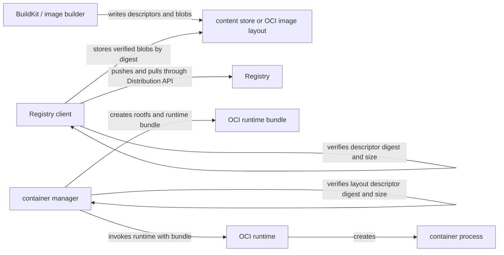

# OCI 规范如何协作

Open Container Initiative（OCI）用几份独立规范连接镜像内容、本地布局、Registry 传输与容器执行。它们共享 descriptor 和内容寻址思路，却不是一个从 `docker build` 到进程的单一 API。先阅读[镜像模型](/docker-oci/concepts/image-model)，会更容易识别本页各个边界。



图中 builder、Registry client、container manager 和 OCI runtime 是动作发起者。content store、OCI image layout 与 bundle 是被写入或消费的数据，不会自己构建、推送或启动进程。Registry client 或 Image Layout 消费者负责校验每个 descriptor 的 digest 和 size，Registry、descriptor 或 content store 不会替消费者完成这一信任决策。实现可以把多个 actor 放在同一进程内，但责任顺序不因此改变。

## OCI Image Specification：镜像内容图

OCI Image Specification 定义可互操作的 image manifest、image index、image configuration 和 filesystem layer。Image Specification 定义镜像内容对象和 descriptor 关系：descriptor 用 `mediaType`、`digest` 和 `size` 指向另一组字节，消费者获得字节后负责校验。

下面是教学用的缩短 manifest；`sha256:<...>` 是关系占位符，不是可拉取的 digest：

```json
{
  "schemaVersion": 2,
  "mediaType": "application/vnd.oci.image.manifest.v1+json",
  "config": {
    "mediaType": "application/vnd.oci.image.config.v1+json",
    "digest": "sha256:<config-bytes>",
    "size": 742
  },
  "layers": [
    {
      "mediaType": "application/vnd.oci.image.layer.v1.tar+gzip",
      "digest": "sha256:<compressed-layer-bytes>",
      "size": 18342
    }
  ]
}
```

manifest 和 config 只是数据对象；它们不解压 layer，也不执行 `Entrypoint`。镜像内的 tag 也不属于这个内容图：tag 是 Registry 上可变的名称映射，digest 才对特定内容字节寻址。完整约束见 OCI 官方 [Image Specification](https://github.com/opencontainers/image-spec/blob/main/spec.md)。

## Image Layout：本地目录交换格式

Image Layout 定义这些内容如何放在本地目录中。根目录包含 `oci-layout` 和 `index.json`，被 descriptor 引用的字节通常放在 `blobs/<algorithm>/<encoded>`。它是可移植的目录表示，不要把它与 containerd、Docker Engine 或 Registry 的内部 content store 磁盘布局混为一谈；后者是实现选择。

```text
demo-api-oci-layout/
├── oci-layout
├── index.json
└── blobs/
    └── sha256/
        ├── <manifest digest encoded part>
        ├── <config digest encoded part>
        └── <layer digest encoded part>
```

`index.json` 不保证它引用的 blob 完整或可信。读取者仍需检查 descriptor 的 size 和 digest，再按 media type 解释内容。规范原文见 OCI 官方 [Image Layout](https://github.com/opencontainers/image-spec/blob/main/image-layout.md)。

## Distribution Specification：Registry 传输协议

Distribution Specification 定义客户端如何通过 Registry API 传输内容。客户端通过 HTTP API 获取或上传 manifest 和 blob，处理认证 challenge、状态码与分块上传。Registry 返回内容候选字节，客户端应根据请求 digest 或上游 descriptor 校验；HTTP 200 不是内容信任证明。

该规范不规定 Registry 运营者的保留期、垃圾回收、租户治理或发布审批。一个 `demo-api:dev` tag 可以被重新指向；从响应记录的 manifest digest 才能固定那次内容。规范原文见 OCI 官方 [Distribution Specification](https://github.com/opencontainers/distribution-spec/blob/main/spec.md)。

## Runtime Specification：bundle 到容器进程

Runtime Specification 定义 runtime 接收 bundle 后如何创建容器。OCI runtime bundle 至少由根目录中的 `config.json` 和一个 root filesystem 组成。`config.json` 描述进程参数、environment、mounts、namespaces 和资源等运行配置；rootfs 是 container manager 根据已验证镜像内容准备好的文件系统视图。

OCI runtime 消费 bundle，但它不必理解 image manifest、Registry tag 或 Distribution API。从 image config 和平台策略合成 `config.json`、准备 rootfs 与选择 runtime，都是 container manager 的职责。规范原文见 OCI 官方 [Runtime Specification](https://github.com/opencontainers/runtime-spec/blob/main/spec.md)、[Filesystem Bundle](https://github.com/opencontainers/runtime-spec/blob/main/bundle.md) 和 [Runtime and Lifecycle](https://github.com/opencontainers/runtime-spec/blob/main/runtime.md)。

## 四份规范的组合边界

一条常见实现路径是：builder 产生符合 Image Specification 的 descriptor 与 blob，导出者可按 Image Layout 写入目录，Registry client 按 Distribution Specification 上传或拉取，container manager 校验、解包并生成 bundle，最后 OCI runtime 按 Runtime Specification 创建容器进程。

这个组合故意不定义以下事项：

- Docker CLI 的命令和用户体验，属于 Docker 产品接口。
- BuildKit cache key、cache mount 和导出策略，属于 builder 实现。
- Kubernetes Container Runtime Interface（CRI），是 kubelet 与高层容器 runtime 的接口，不是 OCI 规范。
- Registry 治理、授权模型、保留期与可用性目标，由运营者决定。
- 镜像签名、发布者身份、漏洞门槛与准入决策，属于 image trust policy。digest 完整性不等于信任。

因此，不要从“符合 OCI”推导某个产品必须使用特定 CLI、cache、CRI 实现或安全策略。

## 导出并校验本地 Image Layout

前置条件：当前目录已按[从源码到第一个容器](/docker-oci/guide/source-to-container)准备 `Dockerfile`、`server.mjs` 和 `.dockerignore`；本地明确安装了 Docker CLI、可连接的 BuildKit builder、Node.js 20+ 和 `tar`；目录中不存在 `demo-api.oci.tar` 或 `demo-api-oci-layout`。以下是需要读者在自己环境显式执行的本地证据流程，不表示本项目 CI 曾运行 Docker daemon：

```bash
set -euo pipefail
docker buildx build --platform linux/amd64 --tag demo-api:dev --output type=oci,dest=demo-api.oci.tar .
mkdir demo-api-oci-layout
tar -xf demo-api.oci.tar -C demo-api-oci-layout
test -f demo-api-oci-layout/oci-layout
test -f demo-api-oci-layout/index.json
DEMO_API_OCI_DIR=demo-api-oci-layout node --input-type=module <<'NODE'
import { createHash } from 'node:crypto'
import { readFileSync } from 'node:fs'
import { join } from 'node:path'

const root = process.env.DEMO_API_OCI_DIR
if (!root) throw new Error('DEMO_API_OCI_DIR is required')

const imageIndexMediaType = 'application/vnd.oci.image.index.v1+json'
const imageManifestMediaType = 'application/vnd.oci.image.manifest.v1+json'
const counts = { configs: 0, layers: 0, manifests: 0 }
const runnablePlatforms = new Set()

function parseJson(bytes, role) {
  try {
    return JSON.parse(Buffer.isBuffer(bytes) ? bytes.toString('utf8') : bytes)
  } catch {
    throw new Error(`invalid JSON: ${role}`)
  }
}

function readJsonFile(name) {
  try {
    return parseJson(readFileSync(join(root, name)), name)
  } catch (error) {
    if (error instanceof Error && error.message.startsWith('invalid JSON:')) throw error
    throw new Error(`missing file: ${name}`)
  }
}

function verifyBlob(descriptor, role) {
  if (!descriptor || typeof descriptor !== 'object') throw new Error(`invalid descriptor: ${role}`)
  if (!Number.isSafeInteger(descriptor.size) || descriptor.size < 0) {
    throw new Error(`invalid descriptor size: ${role}`)
  }
  const separator = typeof descriptor.digest === 'string'
    ? descriptor.digest.indexOf(':')
    : -1
  if (separator < 1) throw new Error(`invalid descriptor digest: ${role}`)
  const algorithm = descriptor.digest.slice(0, separator)
  const encoded = descriptor.digest.slice(separator + 1)
  if (!/^[a-z0-9_+.-]+$/.test(algorithm) || !/^[a-f0-9]+$/.test(encoded)) {
    throw new Error(`invalid descriptor digest: ${descriptor.digest}`)
  }

  let bytes
  try {
    bytes = readFileSync(join(root, 'blobs', algorithm, encoded))
  } catch {
    throw new Error(`missing blob: ${descriptor.digest} (${role})`)
  }
  if (bytes.length !== descriptor.size) {
    throw new Error(`size mismatch: ${descriptor.digest} (${role})`)
  }
  const actual = `${algorithm}:${createHash(algorithm).update(bytes).digest('hex')}`
  if (actual !== descriptor.digest) {
    throw new Error(`digest mismatch: ${descriptor.digest} (${role})`)
  }
  return bytes
}

function verifyManifest(descriptor, bytes, role) {
  const manifest = parseJson(bytes, role)
  if (manifest.schemaVersion !== 2) throw new Error(`unsupported schemaVersion: ${role}`)
  if (!manifest.config || !Array.isArray(manifest.layers)) {
    throw new Error(`invalid image manifest: ${role}`)
  }

  const configBytes = verifyBlob(manifest.config, `${role} config`)
  parseJson(configBytes, `${role} config`)
  counts.configs += 1
  for (const [position, layer] of manifest.layers.entries()) {
    verifyBlob(layer, `${role} layer[${position}]`)
    counts.layers += 1
  }
  counts.manifests += 1

  const platform = descriptor.platform
  const referenceType = descriptor.annotations?.['vnd.docker.reference.type']
  if (
    platform?.os
    && platform?.architecture
    && platform.os !== 'unknown'
    && platform.architecture !== 'unknown'
    && referenceType !== 'attestation-manifest'
  ) {
    runnablePlatforms.add(`${platform.os}/${platform.architecture}`)
  }
}

function verifyIndex(index, role) {
  if (index.schemaVersion !== 2 || !Array.isArray(index.manifests)) {
    throw new Error(`invalid image index: ${role}`)
  }
  for (const [position, descriptor] of index.manifests.entries()) {
    const descriptorRole = `${role} manifests[${position}]`
    const bytes = verifyBlob(descriptor, descriptorRole)
    if (descriptor.mediaType === imageManifestMediaType) {
      verifyManifest(descriptor, bytes, descriptorRole)
    } else if (descriptor.mediaType === imageIndexMediaType) {
      verifyIndex(parseJson(bytes, descriptorRole), descriptorRole)
    } else {
      throw new Error(`unsupported top-level mediaType: ${descriptor.mediaType}`)
    }
  }
}

const layoutMetadata = readJsonFile('oci-layout')
if (layoutMetadata.imageLayoutVersion !== '1.0.0') {
  throw new Error(`unsupported imageLayoutVersion: ${layoutMetadata.imageLayoutVersion}`)
}
verifyIndex(readJsonFile('index.json'), 'index.json')
console.log(
  `verified recursive OCI layout: manifests=${counts.manifests} configs=${counts.configs} layers=${counts.layers}`,
)
console.log(
  `verified runnable platforms: ${[...runnablePlatforms].sort().join(', ') || 'none declared'}`,
)
NODE
rm -r demo-api-oci-layout
rm demo-api.oci.tar
```

build 成功时会生成 OCI archive，两条 `test` 以零状态确认布局入口。验证器首先解析 `oci-layout` 并要求当前 `imageLayoutVersion` 为 `1.0.0`，再从 `index.json` 递归跟随 index/manifest descriptor，对每个 manifest、config 和 layer blob 重算 size 与 digest。index、manifest 和 config 作为 JSON 解析；layer 一律只按原始 bytes 校验，因此 gzip binary layer 不会被误当成 JSON。用 image manifest 表示的 attestation 辅助对象仍会校验 config 与所有 layer，但 `unknown/unknown` 或标记为 attestation 的 descriptor 不计入 runnable platform。

`verified recursive OCI layout: manifests=M configs=C layers=L` 是完整递归范围的成功证据，第二行列出 descriptor 明确声明的可运行平台。单平台 export 可以没有 descriptor `platform`，此时显示 `none declared` 不影响内容完整性校验，但不能把它当成平台匹配证明。

`set -euo pipefail` 保证任一步或 verifier 失败时整个流程保持非零退出，且不会继续执行末尾清理，便于保留 archive 和 layout 诊断。调查完成后，手动执行 `rm -r demo-api-oci-layout` 和 `rm demo-api.oci.tar`。这两条命令只针对本流程创建的明确相对路径。

## 继续阅读

要看 descriptor、manifest、config 和 layer 的内容关系，回到[镜像模型](/docker-oci/concepts/image-model)；要看 builder 如何产生多平台布局，阅读[多平台构建](/docker-oci/build/multi-platform-builds)；要理解 bundle 交给 runtime 后的进程边界，阅读[容器进程生命周期](/docker-oci/runtime/process-lifecycle)。
