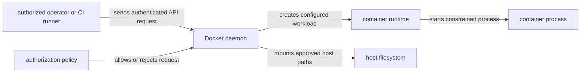

# Docker 安全边界

Docker 安全不是某一个开关，而是一组从主机控制面、构建输入、镜像身份到运行时权限的边界。先明确攻击者能接触哪一层，再选择控制；不要把 `USER`、rootless、只读文件系统或镜像 digest 单独当作完整隔离。

## Docker daemon 与主机控制面

能够访问 Docker daemon socket 的主体通常可以取得主机级高权限。即使调用者不直接使用 `--privileged`，创建带主机 bind mount、设备或高权限 capability 的容器，也可能读写宿主机。Docker socket 不是普通应用 API，不应直接挂进业务容器，也不应因使用了 TLS 就默认调用者权限受限。



远程 daemon 应使用受控网络、双向身份验证和最小授权；本地 socket 应依靠主机账户与组权限保护。`docker` 组通常不是低权限便利组。审计时同时检查谁能调用 daemon、daemon 能访问哪些主机资源，以及 API authorization plugin 或上层平台是否真正限制了操作。

rootless Docker 把 daemon 与容器放入非 root 用户的 user namespace，降低 daemon 或 runtime 缺陷直接获得主机 root 的风险，但有明确代价：低端口、某些网络驱动、cgroup 委派、存储驱动和设备访问可能受限或行为不同。镜像中的 USER 与 rootless Docker 解决的是不同边界：前者选择容器进程身份，后者改变 daemon/runtime 相对主机的身份。两者可以同时使用，不能互相替代。

## 构建输入与 secret

build context 中的文件可能被 `COPY` 固化进 layer；即使后续 `RUN rm`，旧 layer 仍可包含内容。先用 `.dockerignore` 缩小上下文，再用 BuildKit secret mount 让构建步骤临时读取凭据。

```dockerfile
# syntax=docker/dockerfile:1
FROM node:24.11.1-alpine3.22
WORKDIR /app
RUN --mount=type=secret,id=npmrc,target=/home/node/.npmrc,uid=1000 \
    test -s /home/node/.npmrc
COPY --chown=node:node server.mjs .
USER node
ENTRYPOINT ["node", "server.mjs"]
```

`secret mount` 不会成为该层的文件系统输出，但命令仍可能主动把它复制到 layer、日志或远程 cache。构建 secret、运行时 secret 和镜像签名不是同一种控制：构建 secret 只解决构建期输入，运行时 secret 向进程提供凭据，签名/attestation 用于验证发布者和供应链声明。三者都不能替代凭据轮换和最小权限。

## 镜像身份与信任

tag 是可变名称；部署时优先记录和批准 `repository@sha256:...`。digest 能证明拿到的字节与所引用内容一致，却不证明镜像无漏洞、发布者可信或构建过程合规。签名、provenance、SBOM、漏洞策略与 Registry 准入需要在 digest 完整性之上单独建立。

基础镜像 `node:24.11.1-alpine3.22` 仍是可变 tag。构建时使用 `--pull` 获取当时最新映射，生产流程再根据组织策略把审核结果固定为 digest，并保留更新机制；永久固定旧 digest 而不更新同样会累积漏洞。

## 运行用户、capabilities 与 seccomp

Linux 容器共享主机 kernel。非 root `USER` 可以缩小进程在容器内的默认权限，但 UID 映射、文件 ownership、bind mount 和 capabilities 仍决定真实能力。默认先删除不需要的 capabilities，再按证据添加；避免直接使用 `--privileged`。

`seccomp` 限制系统调用，`no-new-privileges` 阻止进程通过 `setuid`/file capabilities 获取新权限。它们和 AppArmor、SELinux、user namespace、cgroup 分别控制不同维度，不是相互替代品。

前置条件：本地 Linux Docker Engine 或 Docker Desktop 已运行，`demo-api:dev` 已按[从源码到容器](/docker-oci/guide/source-to-container)构建，并且名称 `demo-api-secure` 未被占用。下面先创建，再检查实际配置和健康证据，最后只删除本流程的容器：

```bash
docker run --detach --name demo-api-secure \
  --init \
  --read-only \
  --tmpfs /tmp:rw,noexec,nosuid,size=16m \
  --cap-drop ALL \
  --security-opt no-new-privileges=true \
  --memory 128m \
  --cpus 0.50 \
  --publish 127.0.0.1:8080:3000 \
  demo-api:dev
docker container inspect demo-api-secure --format '{{json .HostConfig.ReadonlyRootfs}} {{json .HostConfig.CapDrop}} {{json .HostConfig.SecurityOpt}}'
docker top demo-api-secure -eo pid,user,args
curl --fail --silent --show-error http://127.0.0.1:8080/healthz
docker rm --force demo-api-secure
```

inspect 应显示 `true`、`["ALL"]` 和 `no-new-privileges`，`docker top` 用于核对实际用户，curl 应返回 `ok`。若应用必须写 `/app/data`，应额外提供明确的 Volume 或 tmpfs，而不是取消整个根文件系统的只读限制。

## 文件系统与网络暴露

只读根文件系统仍需要显式提供可写目录，例如 `/tmp`、缓存或持久数据路径。named volume、bind mount 和 tmpfs 的生命周期与信任不同：bind mount 直接暴露主机路径；Volume 仍需要 UID/GID、备份和清理策略；tmpfs 适合短期数据，但是否可能进入 swap 取决于主机配置。

端口默认只发布到真正需要的地址。开发机使用 `127.0.0.1:8080:3000` 可避免直接监听所有接口，但不能代替应用认证、主机防火墙或集群 NetworkPolicy。容器网络隔离也不代表出站访问已受限。

## 凭据与验证清单

- Docker socket 只对受控 operator/runner 开放，不挂入普通业务容器。
- build context 不含私钥、token 或环境文件；secret 通过受控 mount 注入且不会被命令复制。
- 镜像使用批准的 digest，并单独验证签名、provenance、SBOM 和漏洞策略。
- 运行进程使用明确的非 root UID/GID，文件 ownership 与挂载目标经过验证。
- capabilities、seccomp、`no-new-privileges`、只读根文件系统和资源限制按应用需要组合。
- 发布端口、bind mount、设备与主机 namespace 都经过逐项审批。
- 清理前先识别容器、Volume、cache 和凭据各自的数据生命周期。

官方参考：Docker [Engine security]、[Rootless mode]、[Seccomp security profiles] 与 [Build secrets] 分别描述 daemon 主机边界、rootless 前提、默认 seccomp 行为和构建期 secret mount。产品默认值会随版本和平台变化，实际部署仍应检查当前 Engine 配置。

[Engine security]: https://docs.docker.com/engine/security/
[Rootless mode]: https://docs.docker.com/engine/security/rootless/
[Seccomp security profiles]: https://docs.docker.com/engine/security/seccomp/
[Build secrets]: https://docs.docker.com/build/building/secrets/

继续阅读：[Dockerfile 语义](/docker-oci/build/dockerfile)、[BuildKit 缓存](/docker-oci/build/buildkit-cache)、[容器生命周期](/docker-oci/runtime/process-lifecycle)和[存储](/docker-oci/runtime/storage)。
