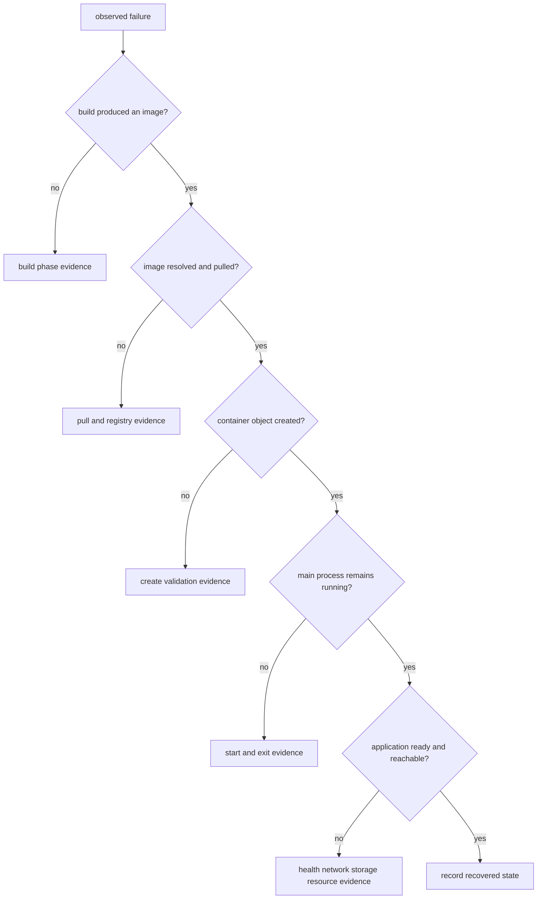

# Docker 故障排查

排障先收集状态，不要先删除容器、重建所有 cache 或执行 `system prune`。先判断失败发生在 build、pull、create、start 还是运行阶段，再在对应边界取证；同一个“访问失败”可能来自应用监听、容器网络、端口发布或主机防火墙。

## 先定位失败阶段



流程节点代表判断状态，不会主动执行命令。操作者根据上一条证据选择下一步，并保留失败对象以便 inspect；不要让清理动作销毁唯一线索。

## 建立时间线与对象快照

前置条件：Docker CLI 能连接目标 Engine，先用 `docker context show` 确认不是错误环境。将 `<container>` 替换为已确认的容器名或 ID；命令均为只读取证，最后不自动删除任何对象。

```bash
docker context show
docker version
docker info
docker events --since 30m --until 0s
docker container inspect <container>
docker logs --timestamps --tail 200 <container>
docker top <container> -eo pid,user,args
docker stats --no-stream <container>
docker system df --verbose
```

`docker events` 给出 daemon 观察到的 create/start/die/oom 时间线；`docker inspect` 给出配置与状态；logs 只包含进程写到 stdout/stderr 的内容；top/stats 分别观察进程和资源。任何一项都不是完整真相，应按时间和对象 ID 关联。

## Build 失败

| 证据 | 下一条命令 | 如何缩小范围 |
| --- | --- | --- |
| Dockerfile 解析或某一步失败 | `docker buildx build --progress=plain --no-cache-filter <stage> .` | 显示实际 stage 与失败命令；只绕过指定 stage cache |
| `COPY` 找不到文件 | `docker buildx build --progress=plain .`，并检查 `.dockerignore` | 区分路径不在 context、被 ignore 与大小写问题 |
| cache 与预期不符 | `docker buildx du --verbose` | 找到 builder 中的 cache record；不要先 prune |
| 基础镜像疑似过期 | `docker buildx build --pull --progress=plain .` | `--pull` 刷新基础镜像；`--no-cache` 不等于 pull |

若 secret 相关步骤失败，先确认 `--secret id=...` 是否提供，再检查构建命令读取的 target；不要把 secret 值写进日志来“证明存在”。

## Pull 与 Registry 失败

| 证据 | 下一条命令 | 如何缩小范围 |
| --- | --- | --- |
| 名称或平台不匹配 | `docker buildx imagetools inspect <reference>` | 查看 index 中的平台 descriptor 与 digest |
| 认证失败 | `docker pull <reference>` 并检查 challenge/状态码 | 区分无凭据、无 repository 权限和 token scope |
| digest 不匹配 | 保留 daemon/Registry 错误并停止消费 | 内容完整性失败，不应靠重试跳过 |
| tag 指向变化 | 比较已记录 digest 与 `docker image inspect <reference>` | tag 可变；确认是否为预期发布 |

代理、DNS、证书和 Registry 服务端错误属于不同边界。先确认 Docker daemon 所在主机的网络路径，而不只是 CLI 主机的 `curl`。

## Create 与 start 失败

| 证据 | 下一条命令 | 如何缩小范围 |
| --- | --- | --- |
| create 前参数校验失败 | `docker container inspect <container>`（若对象存在） | 判断对象是否已创建以及最终 HostConfig |
| 端口已占用 | `docker ps --filter publish=8080` 与主机监听工具 | 区分 Docker 映射冲突和非 Docker 主机进程 |
| mount 拒绝或路径不存在 | `docker container inspect <container> --format '{{json .Mounts}}'` | 核对 source、destination、类型与只读属性 |
| executable/architecture 错误 | `docker image inspect <image>` 与平台元数据 | 区分 Entrypoint 路径、权限、shebang 和平台 |

create 成功不表示 start 成功；start 成功也不表示主进程持续运行。

## 立即退出与信号

容器的主进程退出后容器停止。使用下面的状态字段区分正常退出、信号退出、OOM 和启动错误：

```bash
docker container inspect demo-api --format 'status={{.State.Status}} exit={{.State.ExitCode}} oom={{.State.OOMKilled}} error={{json .State.Error}} started={{.State.StartedAt}} finished={{.State.FinishedAt}}'
docker logs --timestamps --tail 200 demo-api
docker events --since 10m --filter container=demo-api
```

本项目连续示例未注册 `SIGTERM` handler，正常 `docker stop` 后在 Unix 上常见 exit code 143；exit code 0 需要应用主动处理信号并完成关闭。`OOMKilled=true` 是强信号，但还应结合 memory limit、主机日志和 `docker stats` 判断。

## running、health 与 ready

容器是 running 不代表应用已经 ready。主进程可以存在，但仍未监听、依赖未就绪或 healthcheck 失败。

1. `docker container inspect demo-api --format '{{json .State.Health}}'` 查看 health 历史和输出。
2. `docker logs --timestamps demo-api` 查看应用启动阶段。
3. `docker exec demo-api wget -qO- http://127.0.0.1:3000/healthz` 验证容器内回环路径。
4. `curl --fail http://127.0.0.1:8080/healthz` 验证本地主机发布路径。

第 3 步成功而第 4 步失败，说明应用进程大概率可用，应转向端口发布、主机监听或防火墙；两者都失败则先检查应用监听和日志。

## 网络分层

网络问题先区分监听地址、容器网络、端口发布和外部防火墙。

| 层 | 证据命令 | 输出解释 |
| --- | --- | --- |
| 应用监听 | `docker exec demo-api wget -qO- http://127.0.0.1:3000/healthz` | 失败先查进程、监听地址和端口 |
| 容器 DNS/同网通信 | `docker network inspect <network>` | 核对双方 endpoint 与别名；默认 bridge 不承诺同样的名称解析体验 |
| 发布映射 | `docker port demo-api 3000` | 核对主机地址、主机端口与容器端口 |
| 本地主机访问 | `curl http://127.0.0.1:8080/healthz` | 只证明 CLI 主机路径；远程 context 应在 daemon 主机验证 |
| 外部访问 | 主机防火墙/云安全规则证据 | 只绑定 `127.0.0.1` 时外部本就不可达 |

容器中的 `127.0.0.1` 是容器自身，不是 Docker host 或另一个容器。

## 存储与权限

删除容器不能解决 Volume 中已有的数据或权限问题。先用 `docker volume inspect <volume>` 找到实际挂载，再用与镜像相符的只读诊断容器检查 numeric UID/GID；不要未经确认直接递归 `chown`。

| 症状 | 证据 | 下一步 |
| --- | --- | --- |
| permission denied | `docker exec <container> id` 与 `ls -ln <path>` | 比较进程 UID/GID 与文件 ownership |
| 新 Volume 出现旧文件 | inspect + 首次挂载记录 | 判断是否发生 volume copy-up；必要时评估 `volume-nocopy` |
| bind mount 空或路径错误 | inspect 的 Source/Destination | 在 daemon 主机核对路径；Docker Desktop 还需检查文件共享 |
| 数据内容异常 | 应用一致性检查与 Volume 备份 | live DB 的直接 tar 不是 application-consistent backup |

## 资源、OOM 与磁盘

`docker stats --no-stream` 对比实时使用量和限制；inspect 查看 `Memory`、`NanoCpus`、restart count 与 `OOMKilled`。主机内存压力、kernel OOM 和容器 limit 都可能终止进程，需结合 daemon 与系统日志。

磁盘不足先执行 `docker system df --verbose`，确定空间属于 image、container writable layer、local volume 还是 build cache。`docker system prune`、`docker builder prune` 和 `docker volume rm` 都会删除数据或加速缓存；只有在列出目标、确认无引用并理解恢复成本后才执行。

## 收尾记录

修复后记录：失败阶段、对象 ID/digest、关键时间、原始错误、最终变更和验证命令。若创建了临时容器或 network，先 `docker ps -a`、`docker network inspect` 确认目标，再精确删除；Volume 默认保留，除非已完成备份与生命周期审批。

命令字段与筛选行为以 Docker 官方 [`docker inspect`](https://docs.docker.com/reference/cli/docker/inspect/)、[`docker events`](https://docs.docker.com/reference/cli/docker/system/events/)、[`docker logs`](https://docs.docker.com/reference/cli/docker/container/logs/) 和 [`docker system df`](https://docs.docker.com/reference/cli/docker/system/df/) 参考为准。排障结论仍需结合当前 Engine 版本、主机系统和应用证据。

进一步阅读：[架构边界](/docker-oci/concepts/docker-architecture)、[进程生命周期](/docker-oci/runtime/process-lifecycle)、[网络](/docker-oci/runtime/networking)、[存储](/docker-oci/runtime/storage)和[命令速查](/docker-oci/reference/command-map)。
