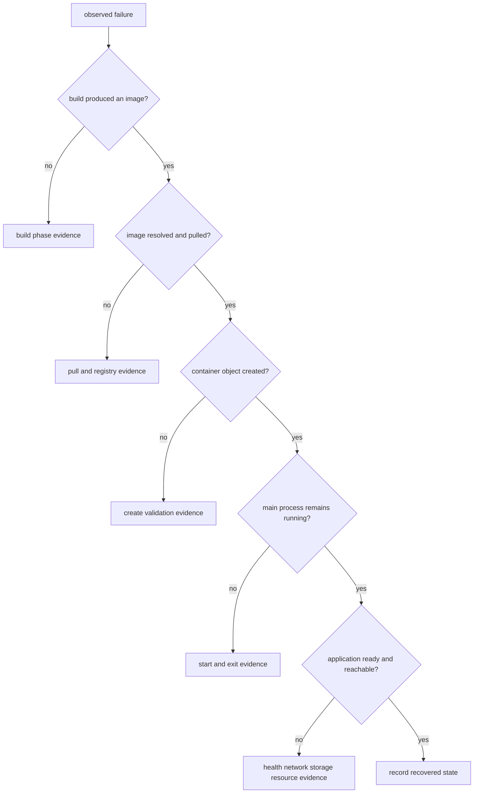

# Docker 故障排查

排障先收集状态，不要先删除容器、重建所有 cache 或执行 `system prune`。先判断失败发生在 build、pull、create、start 还是运行阶段，再在对应边界取证；同一个“访问失败”可能来自应用监听、容器网络、端口发布或主机防火墙。

## 先定位失败阶段



流程节点代表判断状态，不会主动执行命令。操作者根据上一条证据选择下一步，并保留失败对象以便 inspect；不要让清理动作销毁唯一线索。

## 建立时间线与对象快照

前置条件：Docker CLI 能连接目标 Engine，先用 `docker context show` 确认不是错误环境。将 `<container>` 替换为已确认的容器名或 ID；命令均为只读取证，最后不自动删除任何对象。

```bash
docker context show
docker version
docker info
docker events --since 30m --until 0s
docker container inspect <container>
docker logs --timestamps --tail 200 <container>
docker top <container> -eo pid,user,args
docker stats --no-stream <container>
docker system df --verbose
```

`docker events` 给出 daemon 观察到的 create/start/die/oom 时间线；`docker inspect` 给出配置与状态；logs 只包含进程写到 stdout/stderr 的内容；top/stats 分别观察进程和资源。任何一项都不是完整真相，应按时间和对象 ID 关联。

## Build 失败

前置条件：已安装可用的 Docker Buildx plugin；`--check` 不受支持时先核对并更新 Buildx 版本，不要把未知选项误判成 Dockerfile 错误。

| 证据 | 下一条命令 | 如何缩小范围 |
| --- | --- | --- |
| Dockerfile 解析或静态检查失败 | `docker buildx build --check .` | 不执行 build stages，先暴露 Dockerfile/build check 的错误与警告 |
| 首次复现某一步失败 | `docker buildx build --progress=plain .` | 执行一次 build 并展开 stage、指令与原始错误，先保留未经 cache 调整的基线 |
| `COPY` 找不到文件 | `docker buildx build --progress=plain .`，并检查 `.dockerignore` | 区分路径不在 context、被 ignore 与大小写问题 |
| 已知 named stage 疑似命中坏 cache | `docker buildx build --progress=plain --no-cache-filter <named-stage> .` | 只对已知 named stage 绕过 cache；该命令仍执行 build，可能重复下载、发布或其他 external side effects |
| cache 与预期不符 | `docker buildx du --verbose` | 找到 builder 中的 cache record；不要先 prune |
| 基础镜像疑似过期 | `docker buildx build --pull --progress=plain .` | `--pull` 刷新基础镜像；`--no-cache` 不等于 pull |

若 secret 相关步骤失败，先确认 `--secret id=...` 是否提供，再检查构建命令读取的 target；不要把 secret 值写进日志来“证明存在”。

## Pull 与 Registry 失败

| 证据 | 下一条命令 | 如何缩小范围 |
| --- | --- | --- |
| Registry digest、platform 或认证状态未知 | `docker buildx imagetools inspect <reference>` | 只读查询 Registry index；descriptor 给出远端 digest/platform，认证错误区分 credential、repository permission 和 token scope |
| digest 不匹配或 tag 疑似移动 | `docker image inspect <reference> --format '&#123;&#123;json .RepoDigests&#125;&#125;'` | RepoDigests 仅代表本地对象；与远端 `imagetools inspect` 的 descriptor digest 比较，区分本地旧对象、tag 移动和完整性错误 |
| 必须复现 pull 错误 | `docker pull <reference>` | 该命令会改变本地 image/tag 状态，不是只读取证；先记录原 digest，再用错误中的网络、证书、认证或 digest 结果缩小范围 |

代理、DNS、证书和 Registry 服务端错误属于不同边界。先确认 Docker daemon 所在主机的网络路径，而不只是 CLI 主机的 `curl`。

## Create 与 start 失败

| 证据 | 下一条命令 | 如何缩小范围 |
| --- | --- | --- |
| create 前参数校验失败 | `docker container inspect <container>`（若对象存在） | 判断对象是否已创建以及最终 HostConfig |
| 端口已占用 | `docker ps --filter publish=8080` 与主机监听工具 | 区分 Docker 映射冲突和非 Docker 主机进程 |
| mount 拒绝或路径不存在 | `docker container inspect <container> --format '&#123;&#123;json .Mounts&#125;&#125;'` | 核对 source、destination、类型与只读属性 |
| executable/architecture 错误 | `docker image inspect <image>` 与平台元数据 | 区分 Entrypoint 路径、权限、shebang 和平台 |

create 成功不表示 start 成功；start 成功也不表示主进程持续运行。

## 立即退出与信号

容器的主进程退出后容器停止。保留 stopped container，再按状态、输出和事件时序逐层取证：

| 证据 | 下一条命令 | 如何缩小范围 |
| --- | --- | --- |
| 容器已经 stopped | `docker container inspect demo-api --format 'status=&#123;&#123;.State.Status&#125;&#125; exit=&#123;&#123;.State.ExitCode&#125;&#125; oom=&#123;&#123;.State.OOMKilled&#125;&#125; error=&#123;&#123;json .State.Error&#125;&#125; started=&#123;&#123;.State.StartedAt&#125;&#125; finished=&#123;&#123;.State.FinishedAt&#125;&#125;'` | exit、OOMKilled、runtime error 与时间戳区分正常退出、信号、OOM 和启动错误 |
| 主进程可能输出错误 | `docker logs --timestamps --tail 200 demo-api` | 关联退出前 stdout/stderr；无日志不等于进程未失败 |
| 退出原因与操作时序不明 | `docker events --since 10m --until 0s --filter container=demo-api` | create/start/die/oom/kill 事件顺序区分进程自行退出、资源终止与外部操作 |

本项目连续示例未注册 `SIGTERM` handler，正常 `docker stop` 后在 Unix 上常见 exit code 143；exit code 0 需要应用主动处理信号并完成关闭。`OOMKilled=true` 是强信号，但还应结合 memory limit、主机日志和 `docker stats` 判断。

## running、health 与 ready

容器是 running 不代表应用已经 ready。主进程可以存在，但仍未监听、依赖未就绪或 healthcheck 失败。

| 证据 | 下一条命令 | 如何缩小范围 |
| --- | --- | --- |
| health 状态不是 healthy | `docker container inspect demo-api --format '&#123;&#123;json .State.Health&#125;&#125;'` | status、failing streak 与探针输出区分 starting、unhealthy 和未配置 healthcheck |
| 应用仍在启动或报错 | `docker logs --timestamps --tail 200 demo-api` | 启动日志缩小到应用配置、依赖或监听失败 |
| 容器内回环访问失败 | `docker exec demo-api wget -qO- http://127.0.0.1:3000/healthz` | 失败指向进程、监听地址或容器端口；成功说明应用路径可用 |
| 容器内成功但主机访问失败 | `curl --fail http://127.0.0.1:8080/healthz` | 失败转向端口发布、主机监听和防火墙；成功证明本地主机发布路径 |

容器内回环请求成功而本地主机请求失败，说明应用进程大概率可用，应转向端口发布、主机监听或防火墙；两者都失败则先检查应用监听和日志。

## 网络分层

网络问题先区分监听地址、容器网络、端口发布和外部防火墙。

| 证据 | 下一条命令 | 如何缩小范围 |
| --- | --- | --- |
| 应用监听未知 | `docker exec demo-api wget -qO- http://127.0.0.1:3000/healthz` | 失败先查进程、监听地址和端口 |
| 容器 DNS 或同网通信失败 | `docker network inspect <network>` | 核对双方 endpoint 与别名；默认 bridge 不承诺同样的名称解析体验 |
| 发布映射未知 | `docker port demo-api 3000` | 核对主机地址、主机端口与容器端口 |
| 本地主机访问失败 | `curl --fail http://127.0.0.1:8080/healthz` | 只验证 CLI 所在主机路径；远程 context 需在 daemon 主机取证 |
| 外部客户端访问失败 | `curl --fail http://<daemon-host>:8080/healthz` | 本地主机成功而外部失败时，转向监听地址、主机防火墙和云安全规则 |

容器中的 `127.0.0.1` 是容器自身，不是 Docker host 或另一个容器。

## 存储与权限

删除容器不能解决 Volume 中已有的数据或权限问题。先用 `docker volume inspect <volume>` 找到实际挂载，再用与镜像相符的只读诊断容器检查 numeric UID/GID；不要未经确认直接递归 `chown`。

| 证据 | 下一条命令 | 如何缩小范围 |
| --- | --- | --- |
| permission denied | `docker exec <container> sh -c 'id; ls -lnd <path>'` | 比较进程 UID/GID 与目标 numeric ownership 和 mode |
| 新 Volume 出现旧文件 | `docker container inspect <container> --format '&#123;&#123;json .Mounts&#125;&#125;'` | 确认实际 Volume source/destination，再核对首次挂载是否发生 copy-up |
| bind mount 空或路径错误 | `docker container inspect <container> --format '&#123;&#123;json .Mounts&#125;&#125;'` | 在 daemon 主机核对 Source/Destination；Docker Desktop 还需检查文件共享 |
| 数据内容异常 | `docker exec <container> <application-check-command>` | 应用一致性检查区分逻辑损坏与挂载错误；live DB 的直接 tar 不是 application-consistent backup |

## 资源与 OOM

主机内存压力、kernel OOM 和容器 memory limit 都可能终止进程；先关联容器状态、限制与 daemon 事件，再按平台检查主机日志。

| 证据 | 下一条命令 | 如何缩小范围 |
| --- | --- | --- |
| 进程疑似被 OOM 终止 | `docker container inspect <container> --format 'oom=&#123;&#123;.State.OOMKilled&#125;&#125; exit=&#123;&#123;.State.ExitCode&#125;&#125; memory=&#123;&#123;.HostConfig.Memory&#125;&#125;'` | `OOMKilled=true` 标记 OOM 相关退出，Memory 只显示配置 limit；这些字段不能区分 container limit 与 host-wide memory pressure |
| 实时资源接近限制 | `docker stats --no-stream <container>` | 结果只是当前单次 snapshot，不能证明退出前趋势；需要重复采样或历史 telemetry 才能判断是否持续逼近 limit |
| 容器反复重启 | `docker container inspect <container> --format 'restarts=&#123;&#123;.RestartCount&#125;&#125; policy=&#123;&#123;json .HostConfig.RestartPolicy&#125;&#125;'` | restart count 与 policy 区分单次失败和被策略持续拉起 |
| daemon 记录 OOM 事件 | `docker events --since 30m --until 0s --filter container=<container> --filter event=oom` | 有事件可关联容器 OOM 时间；无事件时继续检查主机 kernel 与平台日志 |
| OOM 来源仍不明 | 在 Linux daemon host 运行 `journalctl --kernel --since '-30 min' --grep 'out of memory'` | 用时间戳、进程和 cgroup 记录判断 container limit 或 host-wide pressure；Docker Desktop 与托管环境改查对应 platform telemetry |

## 磁盘占用

磁盘不足先确定空间属于哪类 Docker 对象，再决定是否需要删除。prune 和 rm 都可能销毁数据或构建 cache，不能作为第一条取证命令。

| 证据 | 下一条命令 | 如何缩小范围 |
| --- | --- | --- |
| 对象类型占用未知 | `docker system df --verbose` | 把空间归到 image、container writable layer、local Volume 或 build cache |
| build cache 占用高 | `docker buildx du --verbose` | 按 cache record、last used 和 reclaimable 状态识别候选；不要先 prune |
| 容器 writable layer 占用高 | `docker container ls --all --size` | 将 writable size 关联到具体容器，避免误删 Volume |
| local Volume 占用高 | `docker volume inspect <volume>` | 核对名称、mountpoint、labels 与引用边界，再按应用语义备份和清理 |

## 收尾记录

修复后记录：失败阶段、对象 ID/digest、关键时间、原始错误、最终变更和验证命令。若创建了临时容器或 network，先 `docker ps -a`、`docker network inspect` 确认目标，再精确删除；Volume 默认保留，除非已完成备份与生命周期审批。

命令字段与筛选行为以 Docker 官方 [`docker inspect`](https://docs.docker.com/reference/cli/docker/inspect/)、[`docker events`](https://docs.docker.com/reference/cli/docker/system/events/)、[`docker logs`](https://docs.docker.com/reference/cli/docker/container/logs/) 和 [`docker system df`](https://docs.docker.com/reference/cli/docker/system/df/) 参考为准。排障结论仍需结合当前 Engine 版本、主机系统和应用证据。

进一步阅读：[架构边界](/docker-oci/concepts/docker-architecture)、[进程生命周期](/docker-oci/runtime/process-lifecycle)、[网络](/docker-oci/runtime/networking)、[存储](/docker-oci/runtime/storage)和[命令速查](/docker-oci/reference/command-map)。
