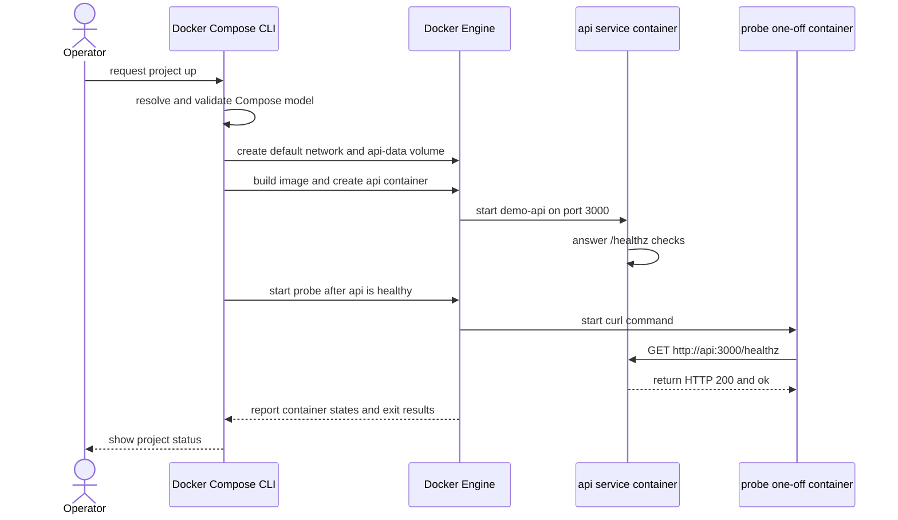

# Compose 运行工作流

Docker Compose 读取声明式应用模型，并通过 Docker Engine 创建网络、Volume 和容器。Compose service 是容器配置模板，不是正在运行的容器；同一个 service 可以没有容器、运行一个容器，也可以通过 scale 运行多个容器。

## 一个连续的 Compose 模型

在[从源码到第一个容器](/docker-oci/guide/source-to-container)创建的 `demo-api` 目录中添加下面文件。它沿用内置 `node:http` 应用、`demo-api:dev` 构建输入、容器端口 `3000` 和 `/healthz` 路径。

```yaml title="compose.yaml"
services:
  api:
    build: .
    ports:
      - "127.0.0.1:8080:3000"
    environment:
      PORT: "3000"
    healthcheck:
      test: ["CMD", "wget", "-qO-", "http://127.0.0.1:3000/healthz"]
      interval: 5s
      timeout: 2s
      retries: 12
    volumes:
      - api-data:/app/data
  probe:
    image: curlimages/curl:8.11.1
    depends_on:
      api:
        condition: service_healthy
    command: ["http://api:3000/healthz"]

volumes:
  api-data:
```

`api` 的 `build: .` 使用当前目录作为 build context，Dockerfile 仍应以 `node:24.11.1-alpine3.22` 为基础，并生成本地 project 构建镜像。基础镜像和 `curlimages/curl:8.11.1` 都使用版本化 tag，但 tag 可变；生产输入必须换成组织批准并验证的 digest，更新 digest 时重新审查来源和平台。

## project、service 与容器数量

Compose 把一次应用部署组织为 project。project 名默认来自目录名，也可以用顶层 `name`、`-p` 或 `COMPOSE_PROJECT_NAME` 指定，优先级按 Compose 官方规则解析。Engine 对象通常带 `com.docker.compose.project` 和 `com.docker.compose.service` label；默认生成的容器、网络和 Volume 名也包含 project 前缀。不要编写依赖自动生成容器名的脚本，应该按 service 操作，例如 `docker compose logs api`。



`services.api` 是模板；Compose 默认创建一个 `api` 容器，`--scale api=N` 才请求多个实例。本例固定发布 `127.0.0.1:8080:3000`，因此不能直接扩到多个 api 容器：它们会争用同一个 host port。扩容前应移除固定 host 发布，让网络内负载均衡入口访问 service，或为实例设计互不冲突的发布端口。top-level `volumes.api-data` 声明 project 资源，service 下的 `volumes` 再把它挂到 `/app/data`。删除或重建 api 容器不会自动删除该 named Volume；多个写入者共享同一数据路径前，还必须确认应用的并发存储语义。

## default network 与依赖边界

未显式声明 `networks` 时，Compose 为 project 创建一个 default network，并把两个 service 都连接进去。网络内 DNS 以 service 名解析，所以 probe 使用 `http://api:3000/healthz`；它不经过主机发布端口。主机客户端则使用 `127.0.0.1:8080`，主机 DNS 不会自动解析 `api`。网络原理见[网络与端口](/docker-oci/runtime/networking)。

depends_on 的启动顺序不等于应用已经可用。短语法只表达启动先后；这里的长语法 `condition: service_healthy` 要求 Compose 在启动依赖者前等待 api 的 healthcheck 成功。service_healthy 依赖被依赖服务的 healthcheck；如果 api 没有 healthcheck，便没有这项 readiness 证据。

这个条件只约束 Compose 的启动顺序，不建立永久运行时耦合：api 之后变为 unhealthy 时，Compose 不会自动重建已经启动的 probe；probe 完成 curl 后正常退出也不表示 api 必须退出。`HEALTHCHECK` 本身也不会自动修复服务，详见[进程生命周期](/docker-oci/runtime/process-lifecycle)。

## 插值与容器 environment

Compose interpolation 在模型发送给 Engine 之前发生，例如 `${API_PORT:-3000}` 会由 shell、`.env` 和 Compose 的变量来源解析。`environment` 则设置容器进程看到的环境变量；本例把字符串 `PORT: "3000"` 传给 Node.js。两者不是同一时刻，也不是同一个 namespace。

先运行 `docker compose config` 查看合并、插值和规范化后的模型，再启动资源。不要用 config 输出公开秘密：插值后的敏感值可能出现在终端或日志，秘密应使用适合部署平台的 secret 机制并限制读取者。

## 验证、观察与清理

前置条件：当前目录就是完整的 `demo-api` 源码目录，包含上面的 `compose.yaml`、指南中的 `server.mjs`、Dockerfile 和 `.dockerignore`，并且没有设置 `COMPOSE_PROJECT_NAME`，因此本流程的默认 project 名为 `demo-api`；Docker CLI 带 Compose v2 插件并连接可构建 Linux 镜像的 Engine；Registry 网络可用，主机 `8080` 空闲，当前 project 没有同名运行资源。以下把等待范围限定为长运行的 api，再用一次性 probe 验证 service DNS 和健康路径，避免把已正常退出的 probe 误判成应持续 running 的服务。

```bash
docker compose config
docker compose up --build --wait api
docker compose run --rm probe
docker compose ps --all
docker compose logs api
docker compose exec api wget -qO- http://127.0.0.1:3000/healthz
curl --fail http://127.0.0.1:8080/healthz
docker compose down
docker volume ls --filter label=com.docker.compose.project=demo-api \
  --filter label=com.docker.compose.volume=api-data
docker compose down --volumes
docker volume ls --filter label=com.docker.compose.project=demo-api \
  --filter label=com.docker.compose.volume=api-data
```

`docker compose config` 应返回零状态并显示解析后的 `services`、`environment`、`depends_on` 和 `volumes`。`docker compose up --build --wait api` 构建并等待 api 变为 healthy；`docker compose run --rm probe` 应输出 `ok` 并以 0 退出。`ps --all` 显示 api 为 running/healthy，日志包含 `demo-api listening on 3000`，容器内 wget 与主机 curl 都返回 `ok`。

`docker compose logs api` 用于读取 service 日志，`docker compose exec api ...` 在现有 api 容器中执行诊断；若 service 有多个实例，应显式选择实例或使用适合聚合的命令，不能假设只有一个容器。

`docker compose down` 删除该 project 的 service 容器和默认网络，但默认保留声明的 named Volume，因此第一条 volume list 仍应看到带 project label 的 `api-data`。docker compose down --volumes 会额外删除声明的命名 Volume；第二条 list 应不再显示它。`--volumes` 是有数据损失风险的附加清理，只有确认该 project 数据不再需要或已有可恢复备份时才执行。外部声明的网络或 Volume 不由普通 `down` 当作 project 内部资源删除。

## 常见误区

- **“service 就是一个固定容器。”** service 是模板，容器实例数量和 ID 会随 scale、recreate 与 project 改变。
- **“depends_on 保证依赖永远健康。”** 它只影响创建顺序；`service_healthy` 的初始判断来自 healthcheck。
- **“`environment` 会替换 Compose 文件里的所有 `${...}`。”** interpolation 在容器创建前解析模型，container environment 是解析后的运行配置。
- **“`down` 会清掉所有数据。”** 默认保留 named Volume；只有显式 `--volumes` 才扩大清理范围。
- **“版本 tag 是不可变供应链输入。”** tag 可以被重新指向，生产应使用经批准的 digest 并保留更新流程。

Compose 的模型定义以 [Compose Specification](https://compose-spec.io/) 为准，命令行为见 Docker 官方 [How Compose works](https://docs.docker.com/compose/intro/compose-application-model/)、[`docker compose up`](https://docs.docker.com/reference/cli/docker/compose/up/) 与 [`docker compose down`](https://docs.docker.com/reference/cli/docker/compose/down/)。需要复查数据寿命时返回[存储与挂载](/docker-oci/runtime/storage)。
