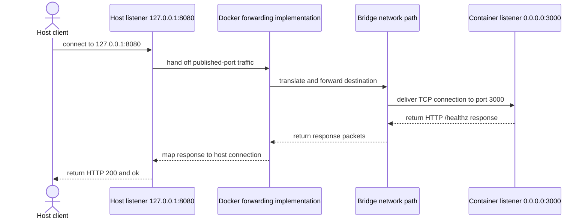

# 容器网络与端口

Docker 为 Linux 容器配置 network namespace、接口、路由和 DNS，再按所选 network driver 连接主机或其他容器。镜像中的端口声明、容器里的监听地址、Docker 网络和主机发布端口是四个不同边界。

## 端口发布的数据路径

发布端口是在主机地址和容器端口之间建立转发。`--publish 127.0.0.1:8080:3000` 表示客户端连接 daemon 主机的 `127.0.0.1:8080`，Docker 的平台实现再经 NAT、防火墙规则或 userland proxy 等机制，把流量交给容器网络中的 `3000` listener。具体采用哪种转发机制是实现行为，不是 OCI Runtime Specification 固定的数据路径。



`EXPOSE 3000` 只写入镜像配置，供人和工具发现预期端口；EXPOSE 不会发布主机端口。`-P` 可以按 exposed port 自动选择主机端口，但生产配置更适合明确写出地址和端口。省略主机 IP 的 `-p 8080:3000` 在 Docker 默认配置中通常绑定所有主机地址，暴露范围比 `127.0.0.1:8080:3000` 大；推荐先绑定回环地址，再按真实访问需求和防火墙策略扩大。

应用必须在容器网络接口可达的地址监听。`demo-api` 使用 `0.0.0.0:3000`；容器中的 127.0.0.1 指向容器自己的网络命名空间，因此仅监听 `127.0.0.1:3000` 时，主机发布路径通常无法到达它。主机的 `127.0.0.1` 与容器的 `127.0.0.1` 不是同一个 loopback interface。

## bridge、host 与 none

| 模式 | namespace 与连通性 | 名称解析和发布端口 | 边界 |
| --- | --- | --- | --- |
| 默认 `bridge` | Docker 创建的默认 bridge，容器有独立网络栈 | 默认不提供现代的按容器名自动发现；可发布端口 | 适合简单兼容场景，不推荐依赖 legacy link |
| user-defined bridge | 容器连接用户创建的 bridge，可动态连接或断开 | 同一 user-defined bridge 中的容器可以按名称解析；仍可发布到主机 | 单主机应用组合的推荐默认选择 |
| `host` | 容器共享 daemon 主机的网络 namespace | 无独立容器 IP，`-p` 被忽略 | Linux Engine 可用；Docker Desktop 支持范围和开关取决于版本 |
| `none` | 只有 loopback，不连接外部网络 | 没有外部 DNS/路由，发布端口无可达 listener | 完全离线的特殊工作负载 |

Docker 的默认行为是：未指定 `--network` 的 Linux 容器连接默认 bridge。user-defined bridge 的隔离规则、embedded DNS 和可连接性由 Docker Engine 提供，不是 OCI 对所有 runtime 的要求。`host` 会移除一层网络隔离，端口冲突直接发生在主机；`none` 也不等于进程没有任何 IPC、mount 或其他权限。

## 容器 DNS 与主机 DNS

同一 user-defined bridge 上的 `probe` 可以解析 service/container 名 `demo-api-net`。Docker 的 embedded DNS 接收容器查询并解析网络内名称，对外部名称再根据 daemon 主机配置转发。容器的 `/etc/resolv.conf` 是 Engine 生成的运行时视图，不应在镜像构建时硬编码为某台主机的 resolver。

反方向并不成立：daemon 主机的普通 DNS 不会因为创建容器就自动解析 `demo-api-net`。主机客户端应访问已发布的 `127.0.0.1:8080`，或使用组织实际管理的 DNS、负载均衡器和路由。容器 DNS、host DNS 与 Docker Desktop 提供的特殊名称（如 `host.docker.internal`）解决不同方向的问题，不要混用。

## 观察名称解析和端口发布

前置条件：已经构建 `demo-api:dev`，当前 Docker context 指向可创建 Linux 容器和网络的 Engine，主机端口 `8080` 空闲，并且示例名称尚未被占用。探测镜像 `curlimages/curl:8.11.1` 使用明确版本但 tag 仍可变；不可变生产输入必须锁定组织批准的 digest。

```bash
docker network create demo-api-net
docker run --detach --name demo-api-net --network demo-api-net \
  --publish 127.0.0.1:8080:3000 demo-api:dev
docker run --detach --name demo-api-probe --network demo-api-net \
  --entrypoint sh curlimages/curl:8.11.1 -c 'sleep 300'
docker network inspect demo-api-net --format '{{json .Containers}}'
docker port demo-api-net 3000
curl --fail http://127.0.0.1:8080/healthz
docker exec demo-api-probe curl --fail http://demo-api-net:3000/healthz
docker exec demo-api-probe cat /etc/resolv.conf
docker rm --force demo-api-probe demo-api-net
docker network rm demo-api-net
docker network ls --filter name=^demo-api-net$
```

成功证据是 network inspect 同时列出两个容器，`docker port` 显示 `127.0.0.1:8080`，主机 curl 和容器内 curl 都返回 `ok`，而 `resolv.conf` 展示 Engine 提供的 resolver 视图。最后三条删除容器、网络并确认过滤列表为空；如果网络删除提示仍有 active endpoints，先用 `docker network inspect demo-api-net` 找到未清理的连接，不要删除无关容器。

若主机 curl 失败而容器内 curl 成功，检查 port publishing、主机绑定和防火墙；若两者都失败，检查 `docker logs demo-api-net` 和应用是否监听 `0.0.0.0:3000`；若只有名称失败，用 `docker network inspect` 确认两个容器确实在同一 user-defined bridge，并从探测容器检查 DNS 配置。

## 常见误区

- **“EXPOSE 等于开放端口。”** 它只是镜像 metadata；是否发布、绑定哪个 host 地址由运行配置决定。
- **“localhost 总是我的电脑。”** 对容器进程而言，localhost 是该容器的 network namespace；对远程 Docker context，发布地址还属于远程 daemon 主机。
- **“容器名会进入公司 DNS。”** Docker 的网络内 DNS 只服务相应容器网络；主机和外部客户端不会自动获得记录。
- **“host 网络性能更高，所以默认使用。”** 它改变隔离、可移植性和端口冲突模型；应基于测量与平台支持选择。
- **“none 网络保证完全隔离。”** 它只处理网络连接；capabilities、mounts、进程权限和 daemon 边界仍需单独限制。

Docker 的驱动和 DNS 默认值见 [Networking overview](https://docs.docker.com/engine/network/) 与 [Bridge network driver](https://docs.docker.com/engine/network/drivers/bridge/)，端口暴露范围见 [Publishing and exposing ports](https://docs.docker.com/get-started/docker-concepts/running-containers/publishing-ports/)。继续阅读[存储与挂载](/docker-oci/runtime/storage)，或回到[从源码到第一个容器](/docker-oci/guide/source-to-container)复查应用监听地址。
