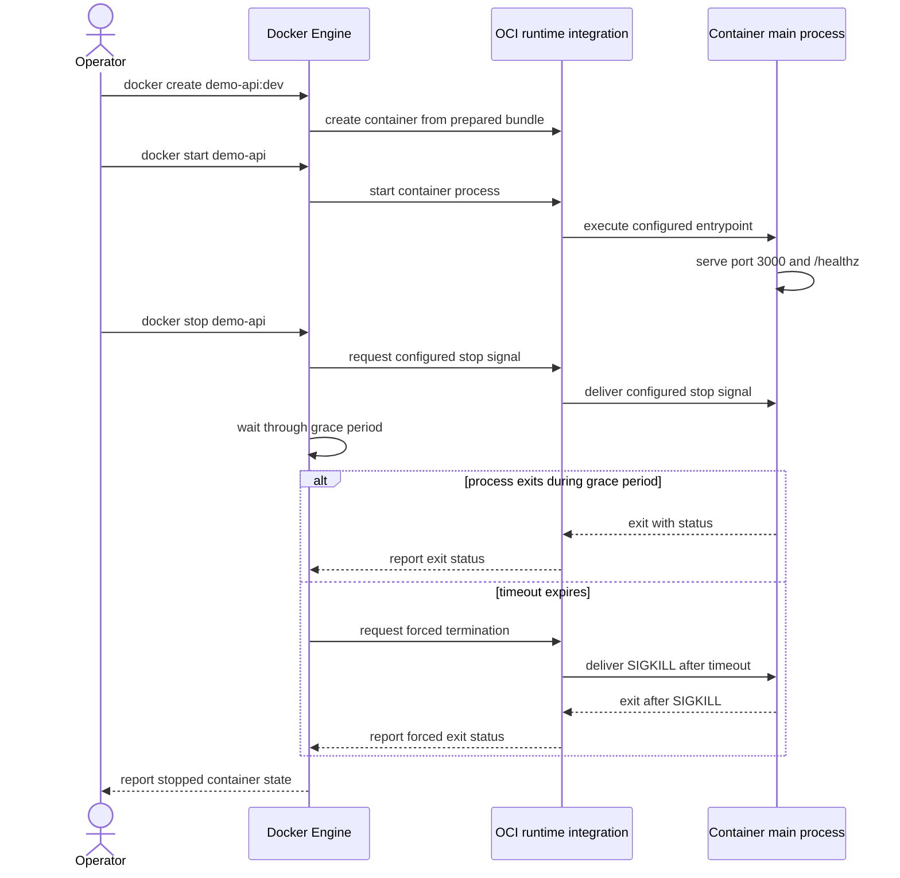

# 容器进程生命周期

Docker container 是围绕一个主进程管理的运行时对象。容器的主进程退出，容器就进入 stopped 状态；Docker CLI 通常把这个非运行状态显示为 `Exited`，并在 metadata 中保留 exit code、退出时间和是否发生 OOM 等证据。容器对象仍然存在，不等于原进程还能恢复。

## 从 create 到 stopped

下面的顺序可以简写为 `create -> start -> running -> stop signal -> grace period -> stopped`：



OCI Runtime Specification 定义 `create`、`start`、`kill`、`delete` 等低层操作和状态约束，但没有规定 Docker CLI、`HEALTHCHECK`、restart policy 或 Compose 的产品行为。Docker Engine 负责这些上层策略，并通过 containerd、shim 和 OCI runtime 的具体集成管理进程；实现拓扑可能因平台和 runtime 改变。容器模型的完整边界见[容器模型](/docker-oci/concepts/container-model)。

`docker create` 保存配置并准备容器，不启动应用；`docker start` 创建新的运行进程。进程退出后再次 `docker start` 会创建另一个进程，不会复活原 PID，也不会恢复原来的 memory。`docker pause` 则是冻结现有进程，不属于 stop/start 的替代品。

## PID 1、exec form 与信号

容器初始进程在自己的 PID namespace 中通常是 PID 1。Linux 对 PID 1 的默认信号处理有特殊规则，它还应回收孤儿子进程。应用若会派生子进程，应明确处理终止信号和回收；不能只因为进程在容器里就假定这些问题消失。

Dockerfile 的 exec form，例如 `ENTRYPOINT ["node", "server.mjs"]`，直接执行应用。shell form 可能让 shell 成为 PID 1；如果 shell 没有 `exec` 应用或正确转发信号，应用可能收不到预期的 `SIGTERM`。对无法自行回收子进程的应用，可在 `docker run` 使用 `--init`，让一个小型 init 位于 PID 1 并转发信号、回收子进程；它不会替应用改变信号退出状态，也不会让 exit code 自动变成 0。

对 Node.js 24 的 Unix 进程，本例应用没有安装 `SIGTERM` handler；Node 的默认信号行为终止进程，因此正常收到该信号时通常观察到 exit code `143`，即 `128 + 15`。只有应用主动处理 `SIGTERM`，停止接收新请求，等待 `server.close` 完成并正常退出，才应预期 exit code 0。canonical `server.mjs` 为了保持最小示例没有加入该 handler，所以本页只解释这个差异，不改写源码。

镜像可以用 Dockerfile `STOPSIGNAL` 设置停止信号，运行时也可用 `--stop-signal` 覆盖。Docker 默认通常使用 `SIGTERM`。docker stop 先发送停止信号，超时后再强制终止；Linux 容器超时后会收到 `SIGKILL`。`--stop-timeout` 配置容器的停止等待秒数，`docker stop --timeout` 可以为一次操作覆盖等待时间。建议让等待时间覆盖应用停止接收请求、完成在途工作和刷新持久状态所需的实测上界。

## 进程状态不等于健康状态

`HEALTHCHECK` 在主进程运行期间周期性执行探测，并把结果记为 `starting`、`healthy` 或 `unhealthy`。HEALTHCHECK 结果不会阻止主进程退出，也不会自动修复应用。反过来，主进程仍在 running 只说明 PID 尚未退出，不证明 `/healthz` 能成功响应。

Docker Engine 本身不会仅因状态变成 `unhealthy` 就重启普通容器。上层编排器可以读取健康状态并采取自己的动作，但那是另一个策略边界。健康命令应快速、有明确超时，并检查服务真正依赖的最小路径；本例检查 `http://127.0.0.1:3000/healthz`，这里的回环地址位于容器自己的网络命名空间。

## restart policy 与人工停止

Docker 的 restart policy 决定容器退出后 Engine 是否尝试再启动它：

| policy | Docker 行为边界 | 适用判断 |
| --- | --- | --- |
| `no` | 默认，不自动重启 | 调试或由外部系统管理 |
| `on-failure[:max-retries]` | 仅非零 exit code 时重启，可限制次数；不会因 daemon restart 恢复 | 可由退出码表达瞬时失败的任务 |
| `always` | 退出后重启；人工 stop 后保持停止，直到手工 start 或 daemon restart 时恢复 | 需要持续运行且接受该语义 |
| `unless-stopped` | 类似 `always`，但 daemon restart 后仍保持人工停止 | 希望人工停止跨 daemon restart 保留 |

统一的 manual-stop 规则是：人工执行 `docker stop` 后，Docker 会忽略 restart policy，至少直到手工 `docker start`；`always` 还会在 daemon restart 后恢复，而 `unless-stopped` 在 daemon restart 后保持人工停止。`on-failure` 不会因 daemon restart 恢复，而且人工 stop 是管理动作，不会触发它所要求的非零失败重启。

restart policy 不是进程监督器、健康修复或数据恢复方案。快速崩溃循环会反复产生日志和负载；应先读取 exit code、错误日志和资源证据。不要把 `--restart always` 当作掩盖启动失败的默认补丁。

## CPU、memory 与 OOM 证据

未设置限制时，Docker 默认不会给容器独占 CPU 或 memory，它会与 daemon 主机上的其他工作竞争。`--cpus 0.50` 是 CPU 可用量限制，`--memory 128m` 是内存硬限制；这些是 Docker/cgroup 配置，不是 OCI 为所有实现规定的固定 CLI。限制不等于预留，也不能代替容量测试。

超过 memory 限制时，内核可能进行 OOM kill。Engine inspect 中的 `.State.OOMKilled`、exit code、daemon/kernel 日志和应用日志应一起判断；`137` 常与 `SIGKILL` 一致，但单独看到 137 不能证明一定是 OOM，因为人工 `docker kill` 也可能产生相同信号结果。不要通过关闭主机 OOM 机制来“修复”内存泄漏。

## 可复制的观察流程

前置条件：已按[从源码到第一个容器](/docker-oci/guide/source-to-container)构建 `demo-api:dev`，当前 context 必须是 local Docker Engine 或 Docker Desktop context，主机 `8080` 未被占用，并且没有名为 `demo-api-lifecycle` 的容器；remote context 下必须在 daemon 主机验证 curl，或改用可路由的 daemon host 地址，不能把 CLI 主机的 loopback 当成 daemon loopback。这个版本 tag 便于练习但仍可变；生产输入应使用经批准的 digest。

```bash
docker run --detach --name demo-api-lifecycle \
  --init --stop-timeout 10 --restart on-failure:3 \
  --memory 128m --cpus 0.50 \
  --health-cmd 'wget -qO- http://127.0.0.1:3000/healthz >/dev/null' \
  --health-interval 5s --health-timeout 2s --health-retries 3 \
  --publish 127.0.0.1:8080:3000 demo-api:dev
lifecycle_health_attempt=0
while [ "$lifecycle_health_attempt" -lt 30 ] && \
  [ "$(docker container inspect demo-api-lifecycle --format '{{.State.Health.Status}}')" != healthy ]; do
  lifecycle_health_attempt=$((lifecycle_health_attempt + 1))
  sleep 1
done
docker container inspect demo-api-lifecycle \
  --format 'status={{.State.Status}} pid={{.State.Pid}} health={{.State.Health.Status}} memory={{.HostConfig.Memory}} nano-cpus={{.HostConfig.NanoCpus}}'
docker logs demo-api-lifecycle
curl --fail http://127.0.0.1:8080/healthz
docker stop demo-api-lifecycle
docker container inspect demo-api-lifecycle \
  --format 'status={{.State.Status}} exit={{.State.ExitCode}} oom={{.State.OOMKilled}} error={{json .State.Error}}'
docker rm demo-api-lifecycle
docker container ls --all --filter name=^/demo-api-lifecycle$
```

成功证据依次是：inspect 显示 `running`、非零 PID、最终为 `healthy`，日志显示 listener，`curl` 返回 `ok`；停止后显示 `exited`，这个未安装 SIGTERM handler 的 Node.js 24 示例通常为 exit code 143 且 `oom=false`，不能把它误写成 0；删除后的最后一条列表为空。最后两条是本流程的清理与清理验证。若启动或停止不符合预期，先保留 stopped 容器，用 `docker logs demo-api-lifecycle` 和 inspect 取证，再执行删除；不要先强制删除证据。

## 常见误区与边界

- **“unhealthy 会自动重启。”** 默认不会；health 与 restart policy 是分开的状态和策略。
- **“收到 stop 就一定是 SIGTERM。”** `STOPSIGNAL` 或运行参数可以改变信号，超时后还可能收到 `SIGKILL`。
- **“容器还在就表示应用还在。”** stopped 容器 metadata 仍在，但主进程已经退出。
- **“加大 memory 就解决 OOM。”** 这可能只推迟失败；应结合工作集、泄漏、并发和限制证据定位原因。
- **“OCI 要求 Docker 采用这些 restart policy。”** OCI runtime 只规定低层生命周期接口；policy 名称和 Engine 行为属于 Docker。

Docker 的停止、重启和资源默认值见 [Stop container](https://docs.docker.com/reference/cli/docker/container/stop/)、[Start containers automatically](https://docs.docker.com/engine/containers/start-containers-automatically/) 与 [Resource constraints](https://docs.docker.com/engine/containers/resource_constraints/)。低层状态和操作以 [OCI Runtime Specification](https://github.com/opencontainers/runtime-spec/blob/main/runtime.md) 为准。接下来可阅读[网络与端口](/docker-oci/runtime/networking)或[存储与挂载](/docker-oci/runtime/storage)。
