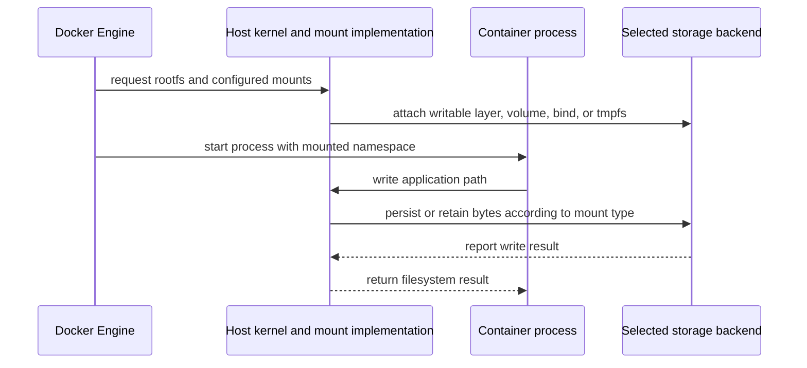

# 容器存储与挂载

容器进程看到的是一棵统一目录树，但路径背后可能是镜像只读层、容器 writable layer、Docker 管理的 Volume、daemon 主机目录或内存文件系统。选择存储前，先确定数据需要活多久、由谁备份、在哪台主机落盘，以及进程以哪个 UID/GID 访问。

## 写入路径由谁承载



Engine、kernel、应用进程和 storage backend 是执行动作的参与者；路径、mount 配置和数据只是被传递或写入的对象。OCI Runtime Specification 描述 runtime mount 配置，但 Docker 的 `volume` 对象、CLI、copy 规则与 Docker Desktop 文件共享属于 Docker 产品和实现行为。

## 选择表

| 类型 | 数据位置与寿命 | 适合场景 | 关键风险 |
| --- | --- | --- | --- |
| writable layer | storage driver 管理的容器专属层；容器可写层随容器删除 | 临时缓存、可丢弃中间结果 | 与容器耦合，copy-up 可能带来写放大，不应存业务持久数据 |
| named volume | Docker 管理的位置；named volume 的生命周期独立于单个容器 | 数据库目录、应用状态、跨容器替换保留的数据 | 仍位于某个 daemon，必须另行备份、授权和清理 |
| bind mount | daemon 主机的明确路径；bind mount 直接暴露主机路径 | 本地源码、需要由主机工具管理的配置或输出 | 宿主路径耦合、越权修改、远程 context 路径误判 |
| tmpfs | Linux 主机内存中的临时挂载；tmpfs 数据只保存在主机内存中 | 短期临时文件 | 停止/重建即丢失，也会消耗主机 memory；内存页可能进入 swap file |

named volume 是 Docker 对存储对象的命名与生命周期管理，不代表自动复制、加密、快照或跨主机可用。driver 可以提供不同后端，但能力必须按该 driver 的官方契约验证。匿名 Volume 也独立于 writable layer，只是没有用户指定名称，容易在频繁重建后遗留。

上表的“只保存在主机内存中”描述 tmpfs 没有可跨容器停止保留的持久化存储后端，不表示字节在物理上绝不会落盘。Docker 官方文档明确提示，主机启用 swap 时 tmpfs 页可能写入文件系统上的 swap file；机密数据场景还要评估主机 swap、休眠、转储和访问控制，不能只加 `--tmpfs` 就宣称永不落盘。

## copy-up、遮蔽与 volume-nocopy

进程第一次修改镜像层已有文件时，overlay 类实现可能先把文件 copy-up 到 writable layer，再记录修改；具体复制粒度和性能由 storage driver 或 snapshotter 决定，不是 OCI 固定算法。

把空 named volume 挂到镜像中已有内容的目录时，Docker 默认会把该目录现有内容复制进 Volume。`volume-nocopy` 可禁用这次填充，例如 `--mount type=volume,src=data,dst=/app/data,volume-nocopy`。这是创建/挂载时的初始化语义，不是持续同步。bind mount 或非空 Volume 覆盖目标目录后，镜像原内容只是被 mount 遮蔽，并未从镜像删除。

## UID、GID 与主机边界

Linux 文件权限最终比较数值 UID 和 GID，而不是用户名字符串。同一个 `node` 名称在镜像与主机上可能对应不同数值；named volume 中已有文件的 owner 也不会因为新镜像更换用户名而自动迁移。推荐在镜像和部署配置中保持已知的非 root UID/GID，并在应用启动前以受控迁移步骤调整数据权限，不要常态化使用 `chmod 777`。

pathname、inode、mount view、剩余 blocks 与 inode 的主机证据见 [Linux 文件系统与 mount](/linux/concepts/filesystems-and-mounts)。

bind mount 的 source 路径属于 Docker daemon 主机。远程 Docker context 下，CLI 当前目录不是远端主机目录；把本地路径传给远端 daemon 通常会找不到或挂到意外位置。Docker Desktop 的 daemon 位于 Linux VM，Desktop 负责把获准的 macOS/Windows 路径共享进 VM；文件共享设置、大小写、事件通知、owner 映射和 I/O 性能可能与原生 Linux 不同。不要把本机 bind mount 的测试结果直接当作生产 Linux 的性能或权限保证。

## bind propagation 的权限边界

Docker 的 bind propagation 默认为 `rprivate`：原 source 与容器内 replica 之间不会传播后续创建的 submount。传播选项只适用于 bind mount，不能给 named volume 或 tmpfs 配置这一语义。

`rshared` 递归地允许 original mount 与 replica 之间双向传播 submount；`rslave` 递归地只允许从 original mount 向 replica 单向传播，容器内新增 submount 不回传主机。还有非递归的 `shared`、`slave` 与 `private` 变体，但应用通常不需要主动改变默认值。

在 Linux host 上，source mount 自身和父级必须先具备兼容的 mount propagation 配置，Docker 参数才可能产生预期结果；这还扩大了容器影响宿主 mount 视图的边界。Docker Desktop 不支持 bind mount 传播，因此不能把 Linux 上的 `rshared`/`rslave` 行为移植到 Desktop。除非工作负载明确需要在 namespace 间传播动态 submount，并且已审查宿主配置与写权限，否则不要授予不必要的传播权限。

## 检查、备份、恢复与清理

下面流程只演示 named volume 的文件级离线备份。前置条件：已构建 `demo-api:dev`，当前 Docker context 指向本机可用的 Linux Engine；当前目录可创建新的 `demo-api-volume-backup` 目录；示例容器、Volume 和目录名称均未占用。`alpine:3.22` tag 可变，受控环境应改用经批准的 digest。直接对 live DB 数据目录运行 tar 不是 application-consistent backup。生产数据库必须先使用数据库原生的快照/导出、复制或停写协议获得一致状态，再备份对应输出或静止数据。

```bash
mkdir demo-api-volume-backup
docker volume create demo-api-data
demo_api_uid=$(docker run --rm --entrypoint id demo-api:dev -u)
demo_api_gid=$(docker run --rm --entrypoint id demo-api:dev -g)
docker run --rm --user 0 \
  --mount type=volume,src=demo-api-data,dst=/data \
  --entrypoint sh demo-api:dev -c "chown $demo_api_uid:$demo_api_gid /data"
docker run --detach --name demo-api-storage \
  --mount type=volume,src=demo-api-data,dst=/app/data demo-api:dev
docker exec demo-api-storage node -e \
  "require('node:fs').writeFileSync('/app/data/state.txt', 'demo-api:3000 /healthz\\n')"
docker container inspect demo-api-storage --format 'mounts={{json .Mounts}}'
docker exec demo-api-storage sh -c 'id; ls -ln /app/data; cat /app/data/state.txt'
docker stop demo-api-storage
docker run --rm \
  --mount type=volume,src=demo-api-data,dst=/source,readonly \
  --mount "type=bind,src=$(pwd)/demo-api-volume-backup,dst=/backup" \
  alpine:3.22 tar -C /source -cf /backup/api-data.tar .
docker volume create demo-api-data-restored
docker run --rm \
  --mount type=volume,src=demo-api-data-restored,dst=/restore \
  --mount "type=bind,src=$(pwd)/demo-api-volume-backup,dst=/backup,readonly" \
  alpine:3.22 tar -C /restore -xf /backup/api-data.tar
docker run --rm \
  --mount type=volume,src=demo-api-data-restored,dst=/app/data,readonly \
  --entrypoint node demo-api:dev -e \
  "process.stdout.write(require('node:fs').readFileSync('/app/data/state.txt'))"
docker rm demo-api-storage
docker volume rm demo-api-data demo-api-data-restored
rm demo-api-volume-backup/api-data.tar
rmdir demo-api-volume-backup
docker volume ls --filter name=demo-api-data
```

成功证据是 inspect 显示 `Type` 为 `volume` 且 destination 为 `/app/data`，从镜像读取的 `demo_api_uid`/`demo_api_gid` 与容器内 `id`、`ls -ln` 的数值 owner 一致，原 Volume 和恢复 Volume 都输出 `demo-api:3000 /healthz`。备份前 `docker stop` 只停止这个示例写入者；真实共享 Volume 必须确认所有写入者都已 quiesce。最后五条删除 stopped 容器、两个示例 Volume 和备份目录，并用列表确认没有同名 Volume；执行 Volume 删除前必须核对名称和消费者，因为该动作会删除数据且不能靠重建容器恢复。

## 常见误区

- **“Volume 就是备份。”** Volume 只把寿命从单个容器分离；daemon 磁盘损坏或误删仍会丢数据。
- **“bind mount 在我的 CLI 机器上。”** source 总是由 daemon 解析；远程 context 尤其容易误判。
- **“用户名相同就有相同权限。”** kernel 比较 UID/GID 数值，镜像升级前要检查 owner 兼容性。
- **“只读 mount 保证应用一致。”** `readonly` 只约束该挂载消费者；其他进程可能仍在写后端。
- **“tmpfs 不占资源且绝不会落盘。”** 它没有持久化后端，但仍消耗主机内存，内存页也可能进入 host swap，并受平台实现限制。

Docker 的存储行为见 [Storage overview](https://docs.docker.com/engine/storage/)、[Volumes](https://docs.docker.com/engine/storage/volumes/)、[Bind mounts](https://docs.docker.com/engine/storage/bind-mounts/) 和 [tmpfs mounts](https://docs.docker.com/engine/storage/tmpfs/)。Kubernetes 如何把 PVC 解析为 Pod mount 见[配置与存储](/kubernetes/concepts/config-storage)。下一步可用 [Compose](/docker-oci/runtime/compose)把 Volume、网络和健康依赖组合成一个 project。
