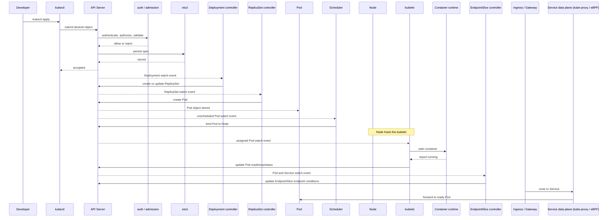

# 发布与调谐之旅

一次 `Deployment` 发布会穿过 API Server、控制器、调度器和节点代理。过程是异步的：命令提交的是期望状态，随后每个组件更新自己的 `status`，直到观察到的状态逐步收敛。



## 阶段一：提交对象

把清单保存为 `web.yaml`，指定命名空间后提交：

```bash
NS=demo
kubectl create namespace "$NS" --dry-run=client -o yaml | kubectl apply -f -
kubectl apply --namespace "$NS" -f web.yaml
```

API Server 先完成认证、鉴权、准入和 schema 校验，再把对象的 `spec` 写入 etcd。成功响应只表示对象已接受，并不表示 Pod 已运行。拒绝通常发生在这里，先检查命令输出和准入策略事件。

## 阶段二：控制器创建工作负载

Deployment controller 观察到新的 `spec` 后创建或更新 ReplicaSet；ReplicaSet 再创建 Pod。Deployment、ReplicaSet 和 Pod 的 `status` 会分别记录条件、期望副本和当前阶段。控制器可能重试多次，观察到短暂的中间状态是正常的。

```bash
kubectl -n "$NS" get deployment,replicaset,pod
kubectl -n "$NS" describe deployment web
```

## 阶段三：调度到节点

Scheduler 根据 Pod 的资源 `requests`、亲和性、污点容忍等约束选择 Node，并把绑定结果写回 API Server。没有合适节点时，Pod 会保持 `Pending`，Deployment 的可用副本不会增加。

```bash
kubectl -n "$NS" get pod -o wide
kubectl -n "$NS" describe pod -l app=web
```

## 阶段四：节点启动容器

kubelet 监听分配到本节点的 Pod，调用容器运行时拉取镜像、创建 sandbox、启动容器，并持续把状态汇报给 API Server。镜像拉取失败、挂载失败或探针配置错误会在 Pod Events 中留下原因。

```bash
kubectl -n "$NS" logs deployment/web --all-containers=true
kubectl -n "$NS" describe pod -l app=web
```

## 阶段五：就绪后接入流量

容器进程运行不代表可以接收请求。readinessProbe 成功后，kubelet 将 Pod 的 Ready 条件写回 API Server；EndpointSlice controller 通过 API Server 发布 endpoint 记录及其 ready 条件。readiness 决定 endpoint 是否具备接收流量的资格，而不是简单决定记录何时生成。Ingress 或 Gateway 把请求交给 Service 数据面（例如 kube-proxy 或 eBPF），数据面再转发到符合条件的 Ready Pod。

```bash
kubectl -n "$NS" get pod,endpointslice,service
kubectl -n "$NS" describe service web
```

## 阶段六：确认发布收敛

用 rollout status 等待 Deployment 的观察状态达到期望状态。该命令会等待而不是替你修复问题；超时后回到失败检查点查看 Events、日志和条件。

```bash
kubectl -n "$NS" rollout status deployment/web --timeout=120s
kubectl -n "$NS" get deployment web -o yaml
```

## 失败检查点

- API Server 拒绝：检查凭据、RBAC、准入 webhook 和清单 schema。
- ReplicaSet 副本不足：检查 Deployment 条件、配额和 Pod 事件。
- Pod 一直 Pending：检查资源请求、节点污点、亲和性和调度事件。
- 容器反复重启：检查镜像、启动命令、环境变量以及 `kubectl logs` 输出。
- Pod 不 Ready：检查 readinessProbe 路径、端口和依赖服务。
- Service 没有 endpoint：核对 selector 与 Pod labels，并确认 Pod 已 Ready。

需要按症状逐层定位时，继续阅读[故障排查](/operations/troubleshooting)。该页面会补充事件、条件和回滚的系统化检查清单。
