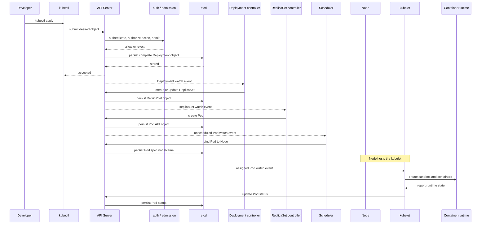
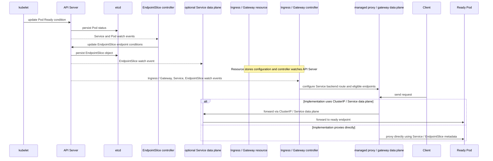

# 发布与调谐之旅

一次 `Deployment` 发布会穿过 API Server、控制器、调度器和节点代理。过程是异步的：`kubectl apply` 提交期望状态后，不同控制循环通过 API Server 观察对象并写回各自负责的字段，直到观察状态逐步收敛。API Server 持久化完整的 API 对象（包括 metadata、spec 和 status），而不是只保存 spec；资源类型不支持的字段不会凭空出现。

## 控制平面与节点



workload controller 创建 Pod API 对象；kubelet 和容器运行时创建容器。Pod 对象不是主动参与者：控制器、Scheduler 和 kubelet 都通过 API Server 的 watch 与写入推进流程，API Server 再把当前对象状态持久化到 etcd。

## 就绪与请求路径



EndpointSlice controller 的输入是 Service 和 Pod 事件，输出是经 API Server 持久化的 EndpointSlice endpoint 记录与条件。Ingress / Gateway 是配置资源；controller 观察它们并配置代理或网关数据面。代理面向 Service backend 路由，实现可以经由 ClusterIP / kube-proxy / eBPF，也可以直接消费 Service / EndpointSlice 元数据并代理到 endpoint；两条路径都只选择符合就绪条件的 endpoint。

## 阶段一：提交对象

把清单保存为 `web.yaml`。首页的多文档 YAML 已包含 `demo` Namespace，因此可直接提交，并用变量保持后续命令一致：

```bash
NS=demo
kubectl apply -f web.yaml
```

API Server 先认证请求身份，再鉴权该身份请求执行的动作，随后完成准入和 schema 校验。接受后，它把完整的当前 API 对象持久化到 etcd。成功响应只表示对象已接受，并不表示 Pod 已运行；拒绝通常发生在这里，先检查命令输出和准入策略事件。

## 阶段二：控制器创建工作负载

Deployment controller 观察到 Deployment 后创建或更新 ReplicaSet API 对象；ReplicaSet controller 再创建 Pod API 对象。`spec.replicas` 表示期望副本数，`status.replicas` 表示观察到的副本数，`status.readyReplicas` 则表示已就绪副本数。控制器可能重试多次，短暂不一致是异步调谐的正常中间状态。

```bash
kubectl -n "$NS" get deployment,replicaset,pod
kubectl -n "$NS" describe deployment web
```

## 阶段三：调度到节点

Scheduler 根据 Pod 的资源 `requests`、亲和性、污点容忍等约束选择 Node，并通过 API Server 绑定 Pod；结果表现为 `Pod.spec.nodeName`。没有合适节点时，Pod 会保持 `Pending`，Deployment 的可用副本不会增加。

```bash
kubectl -n "$NS" get pod -o wide
kubectl -n "$NS" describe pod -l app=web
```

## 阶段四：节点创建容器

kubelet 观察通过 `spec.nodeName` 分配到本节点的 Pod API 对象，调用容器运行时拉取镜像、创建 sandbox 和容器，并把 `Pod.status` 汇报给 API Server。镜像拉取失败、挂载失败或探针配置错误会在 Pod Events 中留下原因。

```bash
kubectl logs deployment/web --all-pods=true --all-containers=true --prefix=true --namespace "$NS"
kubectl -n "$NS" describe pod -l app=web
```

该命令会读取 Deployment 选择的所有 Pod；当前 `kubectl logs` 的 `--all-pods` 负责选择全部副本，`--prefix` 为每行增加 Pod 和容器前缀，避免多副本日志混在一起。

## 阶段五：就绪后接入流量

容器进程运行不代表可以接收请求。readinessProbe 的结果由 kubelet 写入 Pod Ready 条件；EndpointSlice controller 根据 Service selector、Pod labels 和 Ready 条件更新 EndpointSlice。endpoint 记录可以在 Pod 未就绪时已经存在，ready 条件决定代理或可选的 Service 数据面是否将其视为合格后端。

Ingress 或 Gateway 对象只声明主机名、路径和 Service backend 等配置。对应 controller 观察这些资源并配置代理或网关数据面。具体实现可能把请求发送到 ClusterIP 并经过 kube-proxy 或 eBPF 数据面，也可能消费 Service 和 EndpointSlice 元数据后直接代理到符合条件的 endpoint；不能假设所有实现都经过同一条 Service 数据面路径。

```bash
kubectl -n "$NS" get pod,endpointslice,service
kubectl -n "$NS" describe service web
```

## 阶段六：确认发布收敛

用 rollout status 等待 Deployment 的观察状态达到期望状态。该命令会等待而不是替你修复问题；超时后回到失败检查点查看 Events、日志和条件。

```bash
kubectl -n "$NS" rollout status deployment/web --timeout=120s
kubectl -n "$NS" get deployment web -o yaml
```

## 失败检查点

- API Server 拒绝：检查凭据、RBAC、准入 webhook 和清单 schema。
- ReplicaSet 副本不足：检查 Deployment 条件、配额和 Pod 事件。
- Pod 一直 Pending：检查资源请求、节点污点、亲和性和调度事件。
- 容器反复重启：检查镜像、启动命令、环境变量以及 `kubectl logs` 输出。
- Pod 不 Ready：检查 readinessProbe 路径、端口和依赖服务。
- Service 没有 endpoint：核对 selector 与 Pod labels，并检查 EndpointSlice 的 ready 条件。

需要按症状逐层定位时，继续阅读[故障排查](/operations/troubleshooting)。该页面会补充事件、条件和回滚的系统化检查清单。
