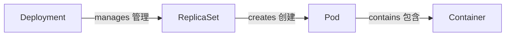
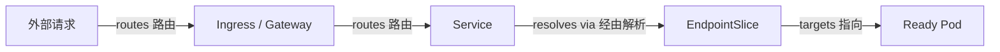
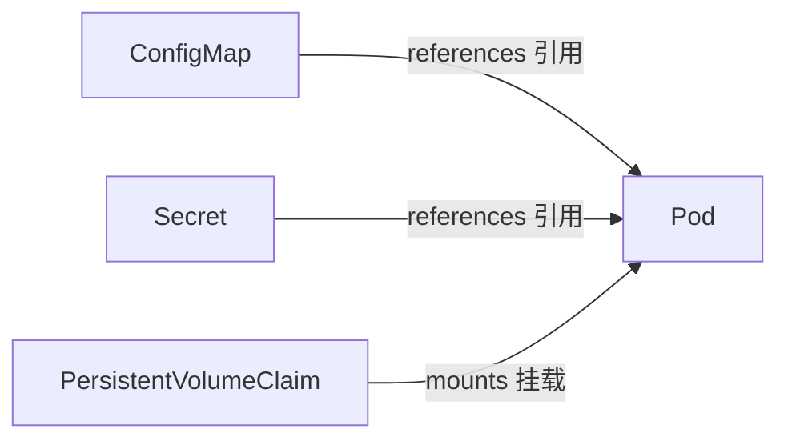
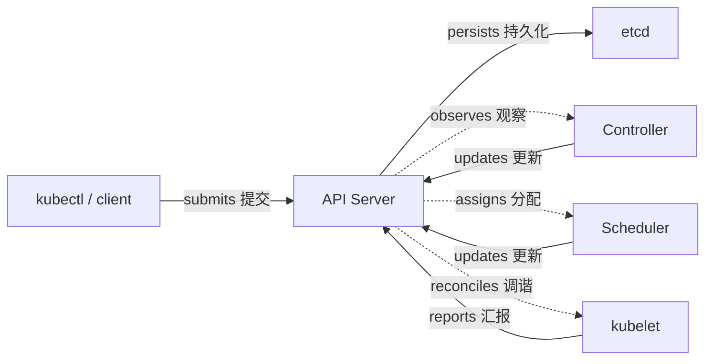

# Kubernetes 概念总览

这本手册面向应用开发者：你不必先成为集群管理员，先建立对象之间的关系，再把它们映射到日常发布、联网、配置和排障工作即可。

## Kubernetes 是什么

一句话：Kubernetes 让你声明系统的**期望状态**，由控制器持续观察**实际状态**并通过调谐（reconciliation）把两者拉回一致。它不是一台可以执行命令的远程 Shell：`kubectl` 只是向 API Server 提交对象，之后的变化由多个控制器异步完成。

## 对象的共同骨架

几乎所有 Kubernetes API 对象都遵循同一套骨架：

| 字段 | 作用 | 你通常会写什么 |
| --- | --- | --- |
| `apiVersion` | 选择 API 组和版本 | `apps/v1`、`v1` |
| `kind` | 声明对象类型 | `Deployment`、`Service` |
| `metadata` | 身份与组织信息 | `name`、`namespace`、`labels`、`annotations` |
| `spec` | 期望状态 | 副本数、镜像、端口、选择器、资源请求 |
| `status` | 控制器写入的实际状态 | 可用副本、条件、分配到的节点 |

```yaml
apiVersion: apps/v1
kind: Deployment
metadata:
  name: web
spec:
  replicas: 2
  selector:
    matchLabels:
      app: web
  template:
    metadata:
      labels:
        app: web
    spec:
      containers:
        - name: web
          image: example/web:1.0
```

`spec` 是你想要什么，`status` 是系统目前做到什么；查看两者的差异通常比猜测后台命令更有效。

## 四条关键关系

### 工作负载关系



### 请求路径关系



### 配置与存储关系



### 控制平面关系



这些关系可以压缩成一张动词表：

| 起点 | 动词 | 终点 | 含义 |
| --- | --- | --- | --- |
| Deployment | manages | ReplicaSet | 管理发布版本和副本期望 |
| ReplicaSet | creates | Pod | 创建并维持指定数量的 Pod |
| Service | selects | Pod | 以标签选择可达后端，由 EndpointSlice 记录 endpoint |
| Ingress / Gateway | routes | Service | 按主机名或路径转发请求 |
| ConfigMap / Secret | references | Pod | 提供环境变量或文件配置 |
| PVC | mounts | Pod | 把声明的存储挂载到容器 |
| API Server | authorizes | client | 认证、鉴权并接受对象写入 |

## 一个可运行的最小例子

下面的 `Deployment` 和 `Service` 使用同一个 `app: web` 标签；探针、资源请求和限制让调度与流量分发都有明确依据。

```yaml
apiVersion: apps/v1
kind: Deployment
metadata:
  name: web
  namespace: demo
spec:
  replicas: 2
  selector:
    matchLabels:
      app: web
  template:
    metadata:
      labels:
        app: web
    spec:
      containers:
        - name: web
          image: nginx:1.27
          ports:
            - name: http
              containerPort: 80
          resources:
            requests:
              cpu: 100m
              memory: 128Mi
            limits:
              cpu: 500m
              memory: 256Mi
          readinessProbe:
            httpGet:
              path: /
              port: http
            initialDelaySeconds: 3
            periodSeconds: 5
---
apiVersion: v1
kind: Service
metadata:
  name: web
  namespace: demo
spec:
  selector:
    app: web
  ports:
    - name: http
      port: 80
      targetPort: http
```

> 示例镜像监听的端口、探针路径和实际应用必须一致；这里的 `targetPort: http` 通过端口名指向容器端口，避免重复硬编码。

## 常见误解

- **Pod 不是稳定服务器。** Pod 可能被重新调度、替换，地址和本地文件都不应作为长期身份。
- **Service 不运行容器。** Service 只提供虚拟 IP、DNS 和后端选择；容器由 Pod 的工作负载对象创建。
- **Secret 默认不等于加密。** Secret 主要是 API 对象和访问控制语义，etcd 是否加密要看集群的静态加密配置。
- **Namespace 不是硬安全边界。** 它提供命名和资源组织；真正的隔离还需要 RBAC、NetworkPolicy、准入策略和节点/集群边界。

## 阅读路径

先看[发布与调谐之旅](./guide/deployment-flow)，再按问题进入后续章节：[资源模型](/concepts/resource-model)、[节点与集群](/concepts/cluster-nodes)、[工作负载](/concepts/workloads)、[网络](/concepts/networking)、[配置与存储](/concepts/config-storage)、[安全](/concepts/security)、[调度与资源](/concepts/scheduling-resources)、[健康与生命周期](/operations/health-lifecycle)、[发布与伸缩](/operations/release-scaling)、[故障排查](/operations/troubleshooting)，以及最后的[概念关系速查](/reference/concept-map)。
