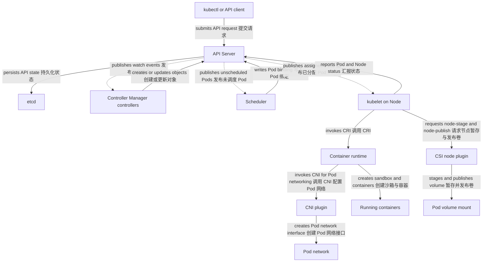

# 集群与节点

一句话：Kubernetes Cluster 由保存并调谐 API 状态的 control plane 与实际运行 Pod 的 Node 组成，两侧组件通过 API Server 协作。

它解决的是“谁决定期望状态、谁在机器上执行、故障发生在哪一层”的问题。上一章介绍 API 对象，本章把 API resource/configuration 与 controller、data plane、container runtime actor 分开。

## 控制平面组件

| 组件 | 主要责任 | 不应误解为 |
| --- | --- | --- |
| API Server | API 入口，认证、鉴权、准入、校验、存取与 watch | 亲自创建容器的执行器 |
| etcd | 保存集群 API 状态的一致性键值存储 | 应用数据库或节点本地缓存 |
| Controller Manager | 运行多种 controller，以控制循环创建或更新 API 对象 | 单一的万能控制器 |
| Scheduler | 为未绑定 Pod 选择 Node，并通过 API 写入绑定结果 | 在节点上启动进程的 agent |

在常见架构里，control-plane 组件经 API Server 读写集群状态，etcd 不直接服务普通 controller 或 Node。托管发行版可能隐藏组件、拆分进程或采用等价实现，但这些 API 责任仍然成立。

## 节点组件与插件接口

Node 是可调度计算资源的 API 表示和故障边界；机器上的 kubelet 注册或维护 Node 状态，观察分配给本节点的 Pod，并通过 CRI（Container Runtime Interface）请求 container runtime 创建 Pod sandbox 与 containers。建立 sandbox 时，CRI runtime 通常调用 CNI 插件配置 Pod 网络；具体实现也可能把 CNI 调用封装在 runtime 的网络集成层。容器运行时负责镜像和容器生命周期，不负责决定副本数。

CNI（Container Network Interface）插件通常建立 Pod 网络、分配 Pod IP，并可能实现 NetworkPolicy。存储走另一条边界：kubelet 的 volume manager 调用 CSI（Container Storage Interface）node plugin 执行 `NodeStageVolume`、`NodePublishVolume` 等节点侧操作，CSI controller plugin 则可参与供应和 attach。CNI 与 CSI 都是接口生态，但不是 kubelet 合并调用的一组插件，也不代表所有集群使用同一实现。

`kube-proxy` 是常见的 Service data plane agent：它根据 Service 与 EndpointSlice 信息配置节点转发规则，但实现可使用 iptables、IPVS 或其他机制。有些集群以 eBPF 或其他数据面替代 kube-proxy，所以“Service 流量一定经过 kube-proxy 进程”并不成立。

## 从提交到容器



图中的 Pod、Node 等是 API objects；Controller Manager、Scheduler、kubelet、runtime 与插件是运行中的 actors。图采用常见的 `kubelet -> CRI runtime -> CNI` 网络调用链；runtime 可以在内部委派或封装具体网络实现，但这不同于 kubelet 直接调用 CSI node plugin 的 volume 操作。Controller 创建 Pod API 对象，kubelet/runtime 才创建 containers，二者不能合并成一句“Deployment 启动容器”。

## 故障域怎么读

Node 故障可能让该节点上的 Pod 和本地临时数据不可用；工作负载 controller 会在 API 条件满足后尝试补足副本，但恢复时间受节点心跳、驱逐策略、调度容量和存储约束影响。机架、可用区与区域是更大的 failure domain，通常通过 topology labels、反亲和或 topology spread 分散副本。

Control plane 高可用与 workload 高可用是不同问题：API Server 或 etcd 暂时不可用会阻塞新写入和调谐，但已运行的容器不一定立即停止；单个 Node 存活也不代表应用有多副本。云厂商和发行版对 control plane 拓扑、kube-proxy 与插件实现各不相同，应查集群文档而非假设固定进程布局。

## 查看集群与节点

```bash
kubectl cluster-info
kubectl get nodes -o wide
# 选择要检查的节点；也可以把变量改为一个明确的节点名。
NODE_NAME=$(kubectl get nodes -o jsonpath='{.items[0].metadata.name}')
kubectl describe node "$NODE_NAME"
kubectl get pods -A -o wide
kubectl get --raw='/readyz?verbose'
```

`kubectl get componentstatuses` 不是可靠的现代通用健康检查。对自管集群，应结合 API Server 的 `readyz`、组件自身健康端点和平台监控；对托管集群，遵循供应商暴露的健康信号。

::: warning 常见误区
Node 的 `Ready=True` 表示 kubelet 报告的节点健康条件满足，并不保证每个 Pod、网络路径、存储后端或应用都健康。排障时继续检查 Pod conditions、events、Service endpoints 与应用探针。
:::

## 继续阅读

前置：[资源对象与元数据](/kubernetes/concepts/resource-model)。下一篇：[工作负载](/kubernetes/concepts/workloads)，比较各类 controller 如何创建和维护 Pod。容器运行链路的 Docker、containerd 与 OCI runtime 边界见 [Docker 架构与边界](/docker-oci/concepts/docker-architecture)。
