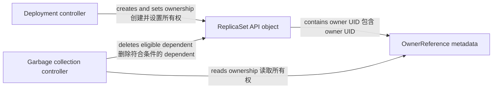
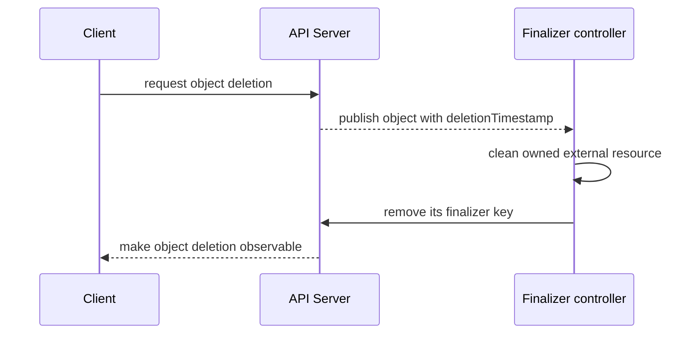

# 资源对象与元数据

一句话：Kubernetes API 资源是通过 API Server 访问和持久化、带类型和身份的结构化对象，客户端与控制器通过读写这些对象协作，而不是彼此直接下命令；API Server 是访问层，持久化后端通常是 etcd。

它解决的是“期望状态如何被可靠表达、识别和并发更新”的问题。后续章节中的 Pod、Service 和 Role 都遵循这套对象模型，但每种资源拥有自己的字段和控制器语义。

## 共同信封与资源内容

提交顶层对象时，`apiVersion`、`kind` 和 `metadata` 构成必需信封：前两者确定 API 组、版本和类型，后者保存对象身份。`spec` 与 `status` 是否存在、具体含义是什么，都取决于资源类型；例如 Deployment 同时有两者，而 ConfigMap 和 Secret 没有 `spec`/`status`。

| 字段 | 谁主要写入 | 含义 |
| --- | --- | --- |
| `apiVersion` | 清单作者 | API 组与版本，例如 `apps/v1` |
| `kind` | 清单作者 | 资源类型，例如 `Deployment` |
| `metadata` | 客户端和 API Server | 名称、作用域、标签及服务端身份字段 |
| `spec` | 用户或控制器 | 资源相关的期望配置，不是所有资源都有 |
| `status` | 控制器、kubelet 等 actor | 资源相关的观察结果，不是所有资源都有 |

下面的清单不会伪造服务端字段，也不手写 `status`，可安全地交给 API Server 补充 UID、resourceVersion 等信息：

```yaml
apiVersion: apps/v1
kind: Deployment
metadata:
  name: web
  namespace: demo
  labels:
    app.kubernetes.io/name: web
  annotations:
    example.com/owner-team: storefront
spec:
  replicas: 2
  selector:
    matchLabels:
      app.kubernetes.io/name: web
  template:
    metadata:
      labels:
        app.kubernetes.io/name: web
    spec:
      containers:
        - name: web
          image: nginx:1.27
```

先创建命名空间，再提交和查看服务端返回的完整对象：

```bash
kubectl create namespace demo
kubectl apply -f deployment.yaml
kubectl -n demo get deployment web -o yaml
```

## 名称、UID 与作用域

`metadata.name` 是人使用的稳定名称，在同一资源类型和作用域内必须唯一；删除后可以再次使用。`metadata.uid` 由 API Server 为对象的这一次生命分配，重建同名对象会得到不同 UID，因此控制器和 OwnerReference 用 UID 区分“同名但不是同一个对象”。

Namespace 是命名空间作用域资源的隔离边界。Pod、Deployment 和 ConfigMap 等位于某个 Namespace；Node、Namespace、PersistentVolume 等是集群作用域。Namespace 不是所有资源的通用父对象，也不是强安全边界，授权和网络隔离仍需单独配置。

```bash
kubectl api-resources --namespaced=true
kubectl api-resources --namespaced=false
kubectl -n demo get deployment web -o jsonpath='{.metadata.name}{"\t"}{.metadata.uid}{"\n"}'
```

## Labels、selectors 与 annotations

Labels 是用于分组和匹配的短键值。Service selector、Deployment selector 与部分查询使用 labels，但 selector 能力和匹配语义由具体资源定义，并非任意字段都可选择。Annotations 保存不用于选择的工具或业务元数据，例如变更原因、外部系统 ID；不要把大文件或秘密放进 annotations。

Deployment 的 selector 必须匹配 Pod 模板 labels，而且创建后通常不可变。selector 太宽会把不属于该工作负载的对象纳入管理；太窄则可能导致 Service 没有可用 endpoint。

```bash
kubectl -n demo get pods -l app.kubernetes.io/name=web --show-labels
kubectl -n demo annotate deployment web example.com/change-ticket=INC-42
```

## 所有权与垃圾回收

`metadata.ownerReferences` 记录 dependent 指向 owner 的关系。工作负载控制器通常自动写入它：Deployment 拥有 ReplicaSet，ReplicaSet 拥有 Pod；garbage collection controller 根据 owner UID 和删除传播策略清理 dependent。不要把 OwnerReference 当通用跨命名空间引用：命名空间作用域 dependent 不能指向其他 Namespace 的 owner，作用域组合也受 API 规则限制。



OwnerReference 是 API 元数据，不会自己删除任何内容；真正执行清理的是 garbage collection controller。前台、后台和 orphan 等传播行为也会影响删除顺序。

## Finalizer 与两阶段删除

Finalizer 是字符串键列表，表示删除对象前仍有清理责任。当删除请求到达时，只要 finalizers 尚未清空，API Server 会设置不可回退的 `metadata.deletionTimestamp`，对象进入 terminating 状态；负责该键的 controller 完成外部清理后移除自己的 finalizer，对象才能真正消失。



常见误区是看到对象长期 `Terminating` 就强行清空 finalizers。这样可能留下云负载均衡器、磁盘或其他外部资源；应先确认负责的 controller 是否运行、清理是否成功，再决定人工介入。

## 版本、观察进度与并发

| 元数据/字段 | 回答的问题 | 注意点 |
| --- | --- | --- |
| `metadata.generation` | 期望配置演进到第几代 | 哪些修改会递增由资源策略决定 |
| `status.observedGeneration` | controller 的 status 观察到哪一代 | 只有定义该字段的资源才有；小于 generation 表示仍可能在处理 |
| `metadata.resourceVersion` | 这份对象版本用于 watch 与乐观并发 | 是不透明字符串，不应解析为时间戳或跨对象全局顺序 |

客户端更新时带回读取到的 resourceVersion，可让 API Server 发现并发冲突。`kubectl apply`、server-side apply 与 patch 还有各自的字段所有权语义；遇到 `409 Conflict` 应重新读取并基于最新对象重试，而不是猜一个更大的版本号。

## 继续阅读

前置：[概念总览](/kubernetes/) 与 [发布与调谐之旅](/kubernetes/guide/deployment-flow)。下一篇：[集群与节点](/kubernetes/concepts/cluster-nodes)，了解哪些运行中 actor 会观察并修改这些 API 对象。
