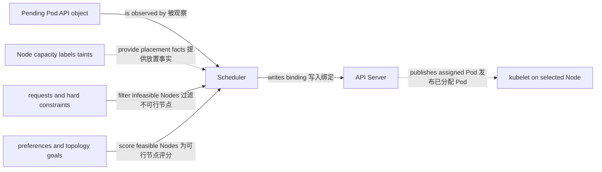

# 调度与资源

一句话：Scheduler 先过滤不能运行 Pod 的 Node，再为可行 Node 评分，并依据 requests 与放置约束写入 Pod 绑定；kubelet/runtime 随后执行 limits 和节点资源管理。

它解决的是“Pod 放到哪里、为其预留多少容量、拥塞或维护时谁受影响”的问题。Scheduler 是控制平面 actor，调度字段、PriorityClass 和 PDB 是 API configuration；它们不直接创建 containers，也不能消除物理故障。

## requests、limits 与 QoS

CPU/memory `requests` 是调度和节点资源分配的重要输入。Scheduler 通常比较 Pod requests 与 Node allocatable、已调度 Pod requests，而不是依据应用此刻的实时用量“塞满空闲机器”。CPU limit 常通过 throttling 执行；超过 memory limit 可能触发 OOM kill，具体细节受运行时与操作系统影响。

| QoS class | 典型条件 | 资源压力下的意义 |
| --- | --- | --- |
| Guaranteed | 每个 container 的 CPU/memory request 与 limit 都设置且相等 | 通常具有更强的节点驱逐保护，但不是绝不终止 |
| Burstable | 至少一个 request/limit 已设置但不满足 Guaranteed | 按 requests、使用量等信号参与资源回收与驱逐 |
| BestEffort | 未设置 CPU/memory requests 和 limits | 资源压力时更容易被驱逐 |

QoS 是由 Pod spec 派生的分类，不是 Scheduler 的 scoring 分数，也不替代 PriorityClass。

## filtering 与 scoring

Scheduler 的 filtering 排除不满足硬约束的 Node，例如资源不足、nodeSelector/required affinity 不匹配、不可容忍 taint 或 volume topology 不兼容；scoring 在剩余 Node 中比较软偏好、资源分布、topology 等因素。插件和权重可配置，所以不要假设所有集群使用同一评分公式。



## 放置工具的区别

| 工具 | 强制或偏好 | 关系与 caveat |
| --- | --- | --- |
| `nodeSelector` | 硬条件 | Pod 只去具备全部指定 labels 的 Node |
| node affinity | required 或 preferred | 比 nodeSelector 表达力更强，基于 Node labels |
| pod affinity | required 或 preferred | 倾向与匹配 Pods 位于同一 topology domain；规模大时成本较高 |
| pod anti-affinity | required 或 preferred | 分散匹配 Pods，但硬规则可能令 Pod Pending |
| taints / tolerations | taint 排斥，toleration 允许 | toleration 只让 Pod 有资格留下/进入，不保证一定调度到该 Node |
| topology spread | maxSkew、domain 与不满足策略 | 在 zone/Node 等 topology 间控制分布，依赖可靠 labels |

Taint effects 常见有 `NoSchedule`、`PreferNoSchedule` 和 `NoExecute`。`NoExecute` 还可能驱逐不容忍的已运行 Pod；tolerationSeconds 等语义应按 effect 配置。Node labels 若用于隔离敏感 workload，应使用 kubelet 无法任意修改的受保护 label 前缀或准入控制。

## Priority、preemption 与 PDB

PriorityClass 给 Pod priority。高优先级 Pod 无可行空间时，Scheduler 可能 preemption 较低优先级 Pods 以形成候选位置，但这不是立即成功保证：终止有宽限期，其他约束仍可能不满足，集群策略也可关闭抢占。不要用高 priority 代替合理 requests 和容量规划。

PodDisruptionBudget（PDB）通过 `minAvailable` 或 `maxUnavailable` 限制 Eviction API 等 voluntary disruptions 在同一时刻可使多少匹配 Pods 不可用。它不防止节点断电、内核故障或直接删除 Pod，也不保证应用本身健康；某些 workload controller 发起的更新并不受 PDB 约束。PDB selector 必须准确，且预算过严会阻塞节点排空等维护。

## 综合示例

下面让副本按 zone 尽量均匀分布，声明可调度容量，并允许但不强求进入带 `workload=batch` taint 的 Node。

```yaml
apiVersion: apps/v1
kind: Deployment
metadata:
  name: worker
  namespace: demo
spec:
  replicas: 3
  selector:
    matchLabels:
      app: worker
  template:
    metadata:
      labels:
        app: worker
    spec:
      topologySpreadConstraints:
        - maxSkew: 1
          topologyKey: topology.kubernetes.io/zone
          whenUnsatisfiable: ScheduleAnyway
          labelSelector:
            matchLabels:
              app: worker
      tolerations:
        - key: workload
          operator: Equal
          value: batch
          effect: NoSchedule
      containers:
        - name: worker
          image: example/worker:1.0
          resources:
            requests:
              cpu: 250m
              memory: 256Mi
            limits:
              cpu: 1
              memory: 512Mi
---
apiVersion: policy/v1
kind: PodDisruptionBudget
metadata:
  name: worker
  namespace: demo
spec:
  minAvailable: 2
  selector:
    matchLabels:
      app: worker
```

```bash
kubectl -n demo get pod -l app=worker -o wide
# 选择一个 Pending Pod；若输出为空，先用上一行确认实际状态。
PENDING_POD=$(kubectl -n demo get pods --field-selector=status.phase=Pending -o jsonpath='{.items[0].metadata.name}')
if [ -n "$PENDING_POD" ]; then
  kubectl -n demo describe pod "$PENDING_POD"
else
  echo "demo namespace has no Pending Pod"
fi
kubectl get nodes -L topology.kubernetes.io/zone
kubectl -n demo get pdb worker
```

::: warning 常见误区
“requests 低一点更容易调度”可能导致过量承诺和节点压力；“limits 越紧越安全”可能造成 CPU throttling 或 OOM。应以负载测量、峰值行为和 SLO 调整，并持续观察 throttling、working set、OOM 与 Pending events。
:::

## 继续阅读

前置：[身份与安全](/kubernetes/concepts/security)。下一篇：[健康检查与生命周期](/kubernetes/operations/health-lifecycle)，把调度成功继续推进到应用就绪与安全终止。
