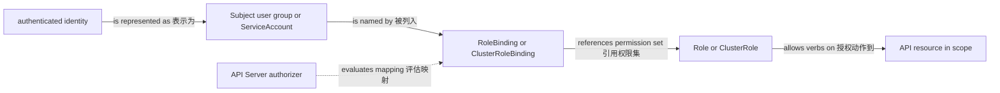

# 身份与安全

一句话：Kubernetes 安全把经过认证的 identity 映射为 Subject，用 RBAC 限制 API 动作，再以 SecurityContext、Pod Security Standards、Secret 管理和 NetworkPolicy 分层限制工作负载能力。

它解决的是“谁能修改哪些 API resources、Pod 以什么权限运行、敏感值和网络面如何收敛风险”的问题。RBAC policy objects 只授权 API Server 请求，不会直接改变 Linux 权限或网络数据面。

## 身份、Subject 与 ServiceAccount

API Server 先 authentication，再 authorization，最后经过 admission。认证可能来自客户端证书、OIDC、webhook 或其他集群配置；用户名和 group 字符串由认证器产生。RBAC 中的 Subject 可以是 User、Group 或 ServiceAccount，但 Kubernetes API 不保存通用 User 对象。

ServiceAccount 是命名空间作用域的 workload identity API resource。Pod 可在 `spec.serviceAccountName` 引用它，并通常获得投射的短期 token；外部认证、token audience、自动挂载和云工作负载身份取决于集群配置。不要让所有应用共享 `default` ServiceAccount，也不要因为创建了 ServiceAccount 就认为它自动拥有权限。

## RBAC 的作用域与关系

| 对象 | 作用域 | 关系 |
| --- | --- | --- |
| Role | Namespace | 声明该 Namespace 内资源动作 |
| ClusterRole | Cluster | 声明集群资源动作，也可作为可复用命名空间权限模板 |
| RoleBinding | Namespace | 在本 Namespace 把 Subject 绑定到 Role，或把 ClusterRole 权限限制性授予本 Namespace |
| ClusterRoleBinding | Cluster | 在整个集群范围把 Subject 绑定到 ClusterRole |

RBAC 是 additive allow：多个 binding 的权限取并集，没有通用 deny rule。least privilege 的关键是缩小 verbs、apiGroups、resources、resourceNames 与 binding 范围；避免为方便授予 `cluster-admin`、通配符资源或不必要的 Secret 读取权限。



Role/ClusterRole 与 Binding 都是配置 objects；真正评估请求的是 API Server authorizer。RoleBinding 引用 ClusterRole 时并不会复制或缩小 role rules，而是由 binding 的 Namespace 限定这次授予可作用的命名空间资源。

## 最小权限示例

下面只允许 `demo` Namespace 的 `config-reader` ServiceAccount 读取 ConfigMap，不允许读取 Secret 或写入对象。

```yaml
apiVersion: v1
kind: ServiceAccount
metadata:
  name: config-reader
  namespace: demo
---
apiVersion: rbac.authorization.k8s.io/v1
kind: Role
metadata:
  name: read-configmaps
  namespace: demo
rules:
  - apiGroups: [""]
    resources: ["configmaps"]
    verbs: ["get", "list", "watch"]
---
apiVersion: rbac.authorization.k8s.io/v1
kind: RoleBinding
metadata:
  name: config-reader
  namespace: demo
subjects:
  - kind: ServiceAccount
    name: config-reader
    namespace: demo
roleRef:
  apiGroup: rbac.authorization.k8s.io
  kind: Role
  name: read-configmaps
```

```bash
kubectl auth can-i get configmaps --as=system:serviceaccount:demo:config-reader -n demo
kubectl auth can-i get secrets --as=system:serviceaccount:demo:config-reader -n demo
kubectl auth can-i --list --as=system:serviceaccount:demo:config-reader -n demo
```

`kubectl auth can-i` 是有用的检查，但准入策略、外部 authorizer 和 impersonation 权限仍可能影响实际结果；生产排查还应查看 API audit 信息（若平台提供）。

## Pod runtime 权限

SecurityContext 是 Pod/container spec 中的 runtime 安全配置，例如 UID/GID、Linux capabilities、只读根文件系统、seccomp 和 privilege escalation。它不是 controller，也不会自动赋予应用访问 Kubernetes API 的 RBAC 权限。

```yaml
apiVersion: v1
kind: Pod
metadata:
  name: hardened-web
  namespace: demo
spec:
  serviceAccountName: config-reader
  securityContext:
    runAsNonRoot: true
    seccompProfile:
      type: RuntimeDefault
  containers:
    - name: web
      image: nginxinc/nginx-unprivileged:1.27-alpine
      ports:
        - name: http
          containerPort: 8080
      securityContext:
        allowPrivilegeEscalation: false
        capabilities:
          drop: ["ALL"]
```

镜像必须能以非 root 和被移除 capabilities 正常运行；安全字段不是可以不验证就粘贴的装饰。Pod Security Standards 定义 Privileged、Baseline、Restricted 三档控制基线，常由 Pod Security Admission 按 Namespace labels 执行；它检查 Pod 配置，不是运行期入侵检测。

## 分层而非单点

Secret 的 base64 不是加密，应通过 RBAC、静态加密、轮换、审计和外部密钥管理降低暴露。NetworkPolicy 在 CNI 支持下限制 Pod 的 L3/L4 流量，但不认证 HTTP 用户，也不替代 TLS 或 RBAC。SecurityContext 缩小容器权限，却不能阻止已获授权的 API token 被滥用。

常见误区是把某一层配置成“安全”就视为完成。更可靠的最小闭环是：专用 ServiceAccount + least privilege RBAC + Restricted 风格 SecurityContext/PSS + 有效 Secret 管理 + 默认拒绝后按需放行的 NetworkPolicy，并结合镜像、节点和平台控制。

## 继续阅读

前置：[配置与存储](/kubernetes/concepts/config-storage)。下一篇：[调度与资源](/kubernetes/concepts/scheduling-resources)，理解安全约束之外的放置、容量与中断边界。SecurityContext 对应的主机 service account、capabilities、`NoNewPrivileges`、systemd sandbox 与共享 kernel 边界见 [Linux 应用安全边界](/linux/operations/security-boundaries)。
