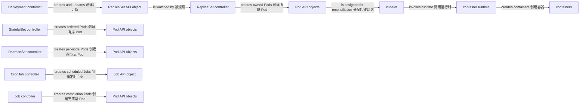

# 工作负载

一句话：Kubernetes workload resource 用不同的身份、更新和完成语义描述一组 Pod，controller 再把这些期望转化为 Pod API objects。

它解决的是应用副本、自愈、滚动发布、稳定身份、逐节点运行和批处理完成的问题。Pod 是最小可调度 API 单元；container 才是 runtime 实际创建的进程隔离环境。

## 选择哪种资源

| 资源 | Pod 身份与 ownership | 更新策略 | 存储预期 | 典型用途 |
| --- | --- | --- | --- | --- |
| Pod | 自身有 UID；直接创建时无 workload owner | 无上层滚动更新 | 可用临时或引用持久卷 | 调试、一次性验证；通常不直接托管长期服务 |
| ReplicaSet | ReplicaSet controller 拥有同质 Pod | 主要维持副本，不提供完整发布编排 | 各副本通常可替换 | Deployment 的下层实现，少直接创建 |
| Deployment | Deployment 拥有 ReplicaSet，后者拥有 Pod | RollingUpdate 或 Recreate | 适合可替换副本；持久卷需单独设计 | 无状态服务与常规长期进程 |
| StatefulSet | controller 直接拥有有序、稳定名称的 Pod | RollingUpdate 或 OnDelete | 常配 `volumeClaimTemplates`，每个序号独立 claim | 数据库、需要稳定网络/存储身份的成员 |
| DaemonSet | controller 在符合条件的 Node 上拥有 Pod | RollingUpdate 或 OnDelete | 常用节点本地目录或无持久状态 | 日志、监控、网络等每节点 agent |
| Job | Job controller 拥有运行至完成的 Pod | 以 completion、parallelism 和重试为主 | 任务期间可挂载卷 | 迁移、导入、有限批处理 |
| CronJob | CronJob controller 创建 Job，Job 再拥有 Pod | 由 schedule 和 concurrencyPolicy 控制 | 继承 Job 模板设计 | 周期任务，不是精确一次调度器 |

“稳定 Pod 名称”不等于容器永不重启，也不等于数据自动复制；StatefulSet 只提供身份和编排基础，应用仍需实现成员管理、备份和复制。

## Ownership 与执行边界



图中 controllers 通过 API Server 创建 API objects；为了突出 ownership 省略了 API Server 中介。kubelet 观察分配到本节点的 Pod spec，container runtime 经 CRI 创建 containers。Pod 或 ReplicaSet 资源本身不是主动 actor。

## 最小 Deployment

Deployment 适合无状态 HTTP 服务。selector 必须与 template labels 匹配；镜像应使用可追踪版本或 digest，示例 tag 仅为演示。

```yaml
apiVersion: apps/v1
kind: Deployment
metadata:
  name: web
  namespace: demo
spec:
  replicas: 3
  strategy:
    type: RollingUpdate
  selector:
    matchLabels:
      app: web
  template:
    metadata:
      labels:
        app: web
    spec:
      containers:
        - name: web
          image: nginx:1.27
          ports:
            - name: http
              containerPort: 80
```

```bash
kubectl -n demo apply -f deployment.yaml
kubectl -n demo rollout status deployment/web
kubectl -n demo get deployment,replicaset,pod --show-labels
```

ReplicaSet 一般由 Deployment 管理。手动修改其 Pod 或副本可能很快被上层 controller 调谐回去；应改 Deployment，而不是把生成的 ReplicaSet 当主要发布入口。

## 有状态、逐节点与批处理

StatefulSet 通常配合 headless Service 提供稳定 DNS 身份，并可用 `volumeClaimTemplates` 为每个 ordinal 创建 PVC。缩容或删除 StatefulSet 默认不会等同于删除所有相关持久卷，数据生命周期必须显式规划。

DaemonSet 的“每节点一个”实际是每个**符合 selector、affinity 与 taint 条件的 Node**一个；控制平面节点或特殊节点可能因 taint 不运行。Job 的成功由完成条件定义，Pod 失败后可能重试，因此任务应尽量幂等。CronJob 的调度可能因并发策略、控制平面停顿或截止时间出现跳过或重复启动，业务不能假设 exactly-once。

```yaml
apiVersion: batch/v1
kind: CronJob
metadata:
  name: report
  namespace: demo
spec:
  schedule: "15 * * * *"
  concurrencyPolicy: Forbid
  jobTemplate:
    spec:
      template:
        spec:
          restartPolicy: Never
          containers:
            - name: report
              image: example/report:1.0
```

::: warning 常见误区
`restartPolicy` 控制同一 Pod 内 container 的重启策略；Deployment/ReplicaSet 的 controller 则在 Pod 消失时创建替代 Pod。两种“自愈”发生在不同层次，不能用 `restartPolicy: Never` 让 Deployment 停止维持副本。
:::

## 继续阅读

前置：[集群与节点](/kubernetes/concepts/cluster-nodes)。下一篇：[网络与流量](/kubernetes/concepts/networking)，把 Pod 接入稳定的服务发现与请求路径。镜像配置与 PodSpec `command`、`args` 的覆盖关系见 [从容器到 Kubernetes](/docker-oci/guide/container-to-kubernetes)。
