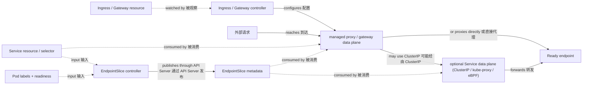
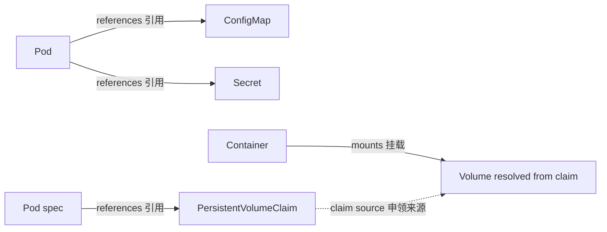
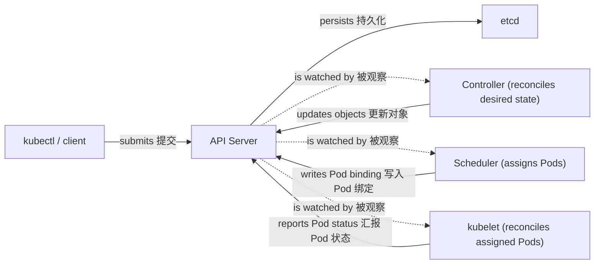

# Kubernetes 概念总览

这本手册面向应用开发者：你不必先成为集群管理员，先建立对象之间的关系，再把它们映射到日常发布、联网、配置和排障工作即可。

## Kubernetes 是什么

一句话：Kubernetes 让你声明系统的**期望状态**，由控制器持续观察**实际状态**并通过调谐（reconciliation）把两者拉回一致。它不是一台可以执行命令的远程 Shell：`kubectl` 只是向 API Server 提交对象，之后的变化由多个控制器异步完成。

## 对象的共同骨架

对提交给 API Server 的顶层资源清单来说，apiVersion、kind 和 metadata 是顶层对象的必需信封字段。spec 和 status 取决于资源类型；ConfigMap 和 Secret 没有 spec/status。

| 字段 | 适用范围 | 作用与示例 |
| --- | --- | --- |
| `apiVersion` | 顶层对象必需 | 选择 API 组和版本，如 `apps/v1`、`v1` |
| `kind` | 顶层对象必需 | 声明对象类型，如 `Deployment`、`Service` |
| `metadata` | 顶层对象必需 | 提供 `name`、`namespace`、`labels`、`annotations` 等身份信息 |
| `spec` | 取决于资源类型 | 用户声明的期望状态，如副本数、容器、端口和调度约束 |
| `status` | 取决于资源类型 | 控制器或 kubelet 写入的观察状态，通常通过 status 子资源更新 |

```yaml
apiVersion: apps/v1
kind: Deployment
metadata:
  name: web
spec:
  replicas: 2
  selector:
    matchLabels:
      app: web
  template:
    metadata:
      labels:
        app: web
    spec:
      containers:
        - name: web
          image: example/web:1.0
```

用户声明 spec，通常不写 status。`Pod.status.phase`、`Pod.status.conditions` 描述 Pod 的观察状态，`Deployment.status.readyReplicas` 表示已就绪副本数；调度器分配的节点则写在期望配置 `Pod.spec.nodeName`，不是 status。查看 spec 与 status 的差异通常比猜测后台命令更有效。

## 四条关键关系

### 工作负载关系

```mermaid
flowchart LR
  D["Deployment controller"] -->|creates / updates 创建或更新| R["ReplicaSet API object"]
  R -.->|watched by 被观察| RC["ReplicaSet controller"]
  RC -->|creates 创建| P["Pod API object"]
  P -.->|watched on assigned node 分配后被观察| K["kubelet"]
  K -->|invokes 调用| CR["Container runtime"]
  CR -->|creates 创建| C["Container"]
```



Deployment controller 创建或更新 ReplicaSet API 对象，ReplicaSet controller 创建 Pod API 对象；kubelet 和容器运行时创建容器。Pod 对象只是容器应如何运行的 API 记录，不会自己启动进程。

### 请求路径关系



Ingress / Gateway 是配置资源；controller 观察它们并配置代理或网关数据面，资源自身不承载请求。代理面向一个 Service backend 路由，但实现可以经由 ClusterIP / kube-proxy / eBPF，也可以直接消费 Service / EndpointSlice 元数据并代理到 endpoint。EndpointSlice 是控制平面 endpoint 元数据，不负责转发请求；EndpointSlice controller 以 Service selector、Pod labels 和 readiness 为输入，通过 API Server 发布 endpoint 记录和条件。

### 配置与存储关系



### 控制平面关系



这些关系可以压缩成一张动词表：

| 起点 | 动词 | 终点 | 含义 |
| --- | --- | --- | --- |
| Deployment controller | manages | ReplicaSet | 管理发布版本和副本期望 |
| ReplicaSet controller | creates | Pod API object | 通过 API Server 创建并维持指定数量的 Pod 对象 |
| kubelet / container runtime | creates | Container | 在已分配节点上创建容器 |
| Service | selects | Pod | 以标签选择可达后端，由 EndpointSlice 记录 endpoint |
| Ingress / Gateway controller | configures | proxy / gateway data plane | 把路由配置转换为实际代理行为 |
| proxy / gateway data plane | routes | Service backend | 可经 ClusterIP 数据面，也可直接代理到 endpoint |
| Pod | references | ConfigMap / Secret | 通过环境变量或文件引用配置 |
| Pod spec | references | PVC | 通过 `persistentVolumeClaim.claimName` 声明卷来源 |
| Container | mounts | volume resolved from claim | 通过 `volumeMounts` 挂载由 claim 解析出的卷 |
| API Server | authorizes | requested action | 为已认证身份检查请求的动作是否允许 |

## 一个可运行的最小例子

下面的 `Deployment` 和 `Service` 使用同一个 `app: web` 标签；探针、资源请求和限制让调度与流量分发都有明确依据。

```yaml
apiVersion: v1
kind: Namespace
metadata:
  name: demo
---
apiVersion: apps/v1
kind: Deployment
metadata:
  name: web
  namespace: demo
spec:
  replicas: 2
  selector:
    matchLabels:
      app: web
  template:
    metadata:
      labels:
        app: web
    spec:
      containers:
        - name: web
          image: nginx:1.27
          ports:
            - name: http
              containerPort: 80
          resources:
            requests:
              cpu: 100m
              memory: 128Mi
            limits:
              cpu: 500m
              memory: 256Mi
          readinessProbe:
            httpGet:
              path: /
              port: http
            initialDelaySeconds: 3
            periodSeconds: 5
---
apiVersion: v1
kind: Service
metadata:
  name: web
  namespace: demo
spec:
  selector:
    app: web
  ports:
    - name: http
      port: 80
      targetPort: http
```

> 示例镜像监听的端口、探针路径和实际应用必须一致；这里的 `targetPort: http` 通过端口名指向容器端口，避免重复硬编码。

## 常见误解

- **Pod 不是稳定服务器。** Pod 可能被重新调度、替换，地址和本地文件都不应作为长期身份。
- **Service 不运行容器。** Service 只提供虚拟 IP、DNS 和后端选择；workload controller 创建 Pod API 对象，kubelet 和容器运行时创建容器。
- **Secret 默认不等于加密。** Secret 主要是 API 对象和访问控制语义，etcd 是否加密要看集群的静态加密配置。
- **Namespace 不是硬安全边界。** 它提供命名和资源组织；真正的隔离还需要 RBAC、NetworkPolicy、准入策略和节点/集群边界。

## 阅读路径

先看[发布与调谐之旅](./guide/deployment-flow)，再按问题进入后续章节：[资源模型](/kubernetes/concepts/resource-model)、[节点与集群](/kubernetes/concepts/cluster-nodes)、[工作负载](/kubernetes/concepts/workloads)、[网络](/kubernetes/concepts/networking)、[配置与存储](/kubernetes/concepts/config-storage)、[安全](/kubernetes/concepts/security)、[调度与资源](/kubernetes/concepts/scheduling-resources)、[健康与生命周期](/kubernetes/operations/health-lifecycle)、[发布与伸缩](/kubernetes/operations/release-scaling)、[故障排查](/kubernetes/operations/troubleshooting)，以及最后的[概念关系速查](/kubernetes/reference/concept-map)。
