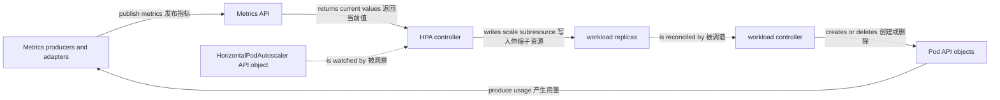

# 发布与扩缩容

一句话：Deployment controller 管发布，HPA controller 调 workload 副本，VPA 组件建议或改 Pod resources，Cluster Autoscaler 调 Node 容量；它们读取不同信号、修改不同对象，不能当成一个“自动扩容器”。

## RollingUpdate 如何替换副本

Deployment 是 API object，Deployment controller 是主动 actor。修改 Pod template 后，controller 创建新的 ReplicaSet 并在新旧 ReplicaSet 之间调整副本；ReplicaSet controller 再创建或删除 Pod API objects。Deployment 本身不会启动 container。

RollingUpdate 的两个预算相对期望副本数计算：

| 字段 | 限制 | 百分比取整 | 影响 |
| --- | --- | --- | --- |
| `maxUnavailable` | 更新期间相对期望副本最多允许多少 Pods 不 available | 向下取整 | controller 依据新旧 ReplicaSet 的 available replicas 决定何时缩旧副本 |
| `maxSurge` | 活动更新预算中最多允许多少非 terminating Pods 超出期望副本 | 向上取整 | 越大越快，但需要更多临时资源；不是所有 Pod 对象的硬上限 |

两者不能同时为 0；默认各为 25%。available 不是“Pod 对象存在”，而是 Ready 并持续满足 `minReadySeconds`。例如期望 4 副本、`maxUnavailable: 1`、`maxSurge: 1` 时，controller 的活动预算允许最多 5 个非 terminating Pods，并在缩减旧 ReplicaSet 时以至少 3 个 available 为门槛。terminating Pods 不计入 available replicas；它们进入终止后也不再占新旧 ReplicaSet 的活动副本/surge 预算，但在 grace period 内 Pod 对象和进程仍可能存在，所以实际 Pod 总数可能暂时超过 5。调度容量、镜像拉取、readiness、长宽限期或 quota 仍可能令 rollout 停滞。

```bash
kubectl -n demo set image deployment/web web=example/web:1.5.0
kubectl -n demo rollout status deployment/web --timeout=5m
kubectl -n demo rollout history deployment/web
kubectl -n demo rollout history deployment/web --revision=2
kubectl -n demo rollout undo deployment/web --to-revision=2
```

`rollout status` 等待 controller 报告进展；`history` 查看保留的 ReplicaSet revisions；`undo` 把 Pod template 回到指定 revision，随后仍是一次新的调谐。它不会回滚数据库、外部配置或已经发生的副作用。应同时检查 `Progressing`、`Available` conditions、events 和新旧 ReplicaSet。

## HPA 的 metrics 到 Pod 链路

HorizontalPodAutoscaler（HPA）是配置目标和策略的 API object；HPA controller 周期性读取 resource、custom 或 external metrics，计算期望副本，再更新目标 scalable workload 的 `scale subresource`。之后才由 workload controller 创建或删除 Pods。



关系必须按 `Metrics API -> HPA controller -> workload replicas -> workload controller -> Pod API objects` 理解。HPA 不直接创建 Pod，也不增加 Node。若扩出的 Pod 因容量不足 Pending，后续才可能触发 Cluster Autoscaler。

resource metrics 的 CPU 或 memory utilization 是“当前用量 / request”的比值，因此目标 containers 缺少相应 request 时，该指标可能无法用于计算。Metrics Server 通常只提供 CPU/memory resource metrics；业务 QPS、队列长度等需要 custom/external metrics adapter。缺失或尚未就绪的 Pod metrics、容差窗口、scale-up/scale-down behavior 与 stabilization window 都会影响实际动作，不应把一次采样直接换算为最终副本数。

```bash
kubectl -n demo get hpa
kubectl -n demo describe hpa web
kubectl -n demo get deployment web -o jsonpath='{.spec.replicas}{" desired / "}{.status.readyReplicas}{" ready\n"}'
kubectl top pods -n demo -l app=web --containers
kubectl get apiservice v1beta1.metrics.k8s.io
```

## VPA 调 requests，不是副本

VerticalPodAutoscaler（VPA）通常由集群额外安装的 CRD 与 recommender、updater、admission controller 等组件组成，不是每个 Kubernetes 集群都自带。recommender 从历史和当前用量给出 CPU/memory request recommendation；根据 update mode，其他组件可以只记录建议，或在 Pod 创建/替换时应用 requests。现有 Pod 是否能原地调整取决于安装版本、策略和集群能力，不能只凭 VPA 对象存在就假定已经生效。

HPA 与 VPA 若操作同一资源维度会相互影响：例如 HPA 以 CPU utilization 扩副本，而 VPA 又修改 CPU request 这个分母，两个循环可能互相追逐。常见做法是让 VPA 仅推荐，或让 HPA 使用与 VPA 不冲突的 custom/external metric；若确需组合，必须明确所有权、边界和稳定窗口。

```bash
kubectl api-resources | grep -i verticalpodautoscaler
kubectl -n demo get verticalpodautoscaler
kubectl -n demo describe verticalpodautoscaler web
```

## Cluster Autoscaler 调 Node capacity

Cluster Autoscaler 是集群附加 actor，通常连接云厂商或节点组 API。它观察由于资源和约束而不可调度的 Pods，模拟节点组扩容能否容纳它们，再增加 Node capacity；缩容时评估节点利用率以及 Pod 是否可安全迁移。它不修改 workload replicas，也不会因为 CPU 使用率高就直接添加节点。

扩容仍可能受节点组上限、配额、启动时间、taint、affinity、拓扑、PVC zone 或超大单 Pod request 阻塞。缩容还会受本地存储、不可驱逐 Pods、PDB 和系统策略限制。先确认 Pod 的 scheduler events，再判断是副本不足还是节点容量不足。

```bash
kubectl get nodes
kubectl -n demo get pods --field-selector=status.phase=Pending -o wide
kubectl -n demo get events --sort-by=.lastTimestamp
kubectl -n kube-system get deployments | grep -i autoscaler
```

## PDB 只约束部分 voluntary disruption

PodDisruptionBudget（PDB）是 API object。Eviction API 在节点排空等 voluntary disruption 中据 `minAvailable` 或 `maxUnavailable` 判断当前是否还能驱逐匹配 Pod。PDB 不会阻止节点断电、内核故障、进程崩溃、直接删除 Pod 等 involuntary 或绕过 Eviction API 的动作，也不提供额外副本。

PDB 不直接控制 Deployment rollout；Deployment controller 按 rollout strategy 创建和删除 Pods，滚动更新通常不通过 Eviction API。应分别配置 `maxUnavailable`/`maxSurge` 和 PDB，避免把维护预算误当发布预算。错误 selector 或过严预算还会让 drain 长期阻塞，但不能提升应用自身 readiness。

```bash
kubectl -n demo get pdb
kubectl -n demo describe pdb web
kubectl -n demo get pdb web -o jsonpath='{.status.currentHealthy}{" healthy / "}{.status.desiredHealthy}{" desired; "}{.status.disruptionsAllowed}{" disruptions allowed\n"}'
```

## 放在同一张控制回路图里

| 回路 | 读取 | 写入或调用 | 不负责 |
| --- | --- | --- | --- |
| Deployment controller | Deployment、ReplicaSet、Pod 状态 | ReplicaSet spec | 指标扩缩容、Node 容量 |
| HPA controller | HPA、Metrics API、scale status | target scale subresource | 直接创建 Pod 或 Node |
| VPA components | VPA policy、usage、Pod spec | recommendation；按模式影响 requests | workload 副本数 |
| Cluster Autoscaler | unschedulable Pods、Node groups | 节点组容量 | 应用 rollout 与 readiness |
| Eviction API + PDB | PDB、Pod health、disruption state | 允许或拒绝特定 eviction | 所有故障与 Deployment rollout |

::: warning 操作顺序
先确认健康与 requests，再定义发布预算；先确认 metrics pipeline，再开启 HPA；先观察 Pending 原因，再调整节点组。多个 controller 同时修改一个字段时，最后写入者会制造抖动，必须为每个字段指定单一所有者。
:::

## 继续阅读

前置：[健康检查与生命周期](/kubernetes/operations/health-lifecycle)。下一篇：[系统化排障](/kubernetes/operations/troubleshooting)，沿对象生成与真实流量路径定位发布失败。
