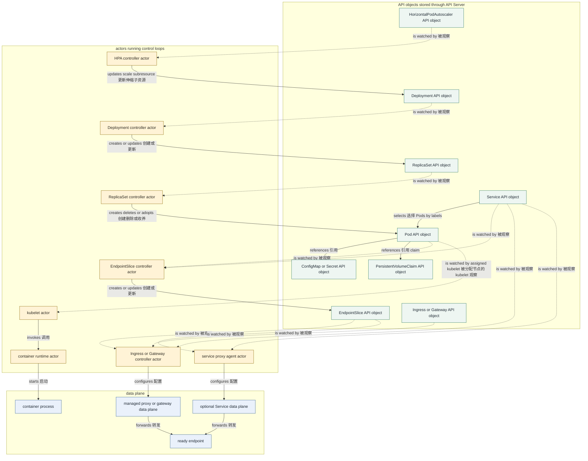

# 概念关系速查

一句话：先判断眼前的是 API object、主动 actor 还是 data plane，再问“谁观察它、谁写它、它选择或引用谁、生命周期由谁决定”。

Namespace 是大多数应用对象的隔离边界，但 Node、PersistentVolume、StorageClass、ClusterRole、ClusterRoleBinding 等是 cluster-scoped。namespaced 对象只能直接引用 API 允许范围内的对象；label selector 是动态集合关系，不等于 ownership。

## 主关系图



图中的写操作表示 actor 通过 API Server 管理 API object，不是一个资源对象主动调用另一个资源；ReplicaSet controller 对 Pods 的动作是 creates、deletes or adopts，通常不能原地更新 Pod spec。`selects` 是 label selector 计算出的动态集合，`references` 是 spec 中按名称或类型保存的引用。Service/EndpointSlice metadata 先被具体实现的 service proxy agent 或 Ingress/Gateway controller 观察，actor 再配置所管理的数据面；proxy/gateway 或可选 Service data plane 才 `forwards` 请求。图不限定 agent 是 kube-proxy、eBPF controller 还是其他实现。

## 对象关系表

| 对象 | 作用域 | 谁创建或管理它 | 选择或引用什么 | 生命周期 | 主要命令 |
| --- | --- | --- | --- | --- | --- |
| Pod | Namespace | 用户或 workload controller 创建；scheduler 绑定；kubelet 报状态 | 引用 ServiceAccount、ConfigMap、Secret、PVC；labels 被其他对象选择 | UID 对应一次 Pod；owner 可重建替代 Pod | `kubectl get pod`、`kubectl describe pod` |
| Deployment | Namespace | 用户创建；Deployment controller 管理 rollout | selector 选择自己的 Pod template labels；拥有 ReplicaSet | 独立存在；删除时通常级联所属 ReplicaSet/Pod | `kubectl rollout status deployment` |
| ReplicaSet | Namespace | 通常由 Deployment controller 创建；ReplicaSet controller 调副本 | selector 选择 Pods；常由 Deployment ownerReference 拥有 | 通常随 Deployment revision 保留或被回收 | `kubectl get replicaset` |
| StatefulSet | Namespace | 用户创建；StatefulSet controller 管理 | selector、Service name、Pod template、volumeClaimTemplates | Pod 身份稳定；PVC 保留行为需单独规划 | `kubectl rollout status statefulset` |
| DaemonSet | Namespace | 用户创建；DaemonSet controller 管理 | selector 与符合放置约束的 Nodes | 随合格 Node 集合变化创建/删除 Pod | `kubectl rollout status daemonset` |
| Job / CronJob | Namespace | 用户创建；各自 controller 创建 Pod 或 Job | Pod/Job template；ownerReferences 串联 | 完成后对象仍可保留，受 history/TTL 策略清理 | `kubectl get job,cronjob` |
| Service | Namespace | 用户创建；Service controller 可能管理外部负载均衡 | selector 动态选择同 Namespace Pods；ports 引用目标端口 | 独立于 Pods；ClusterIP 通常伴随对象 | `kubectl get service` |
| EndpointSlice | Namespace | selector Service 通常由 EndpointSlice controller 管理；selectorless Service 可由用户/外部 controller 管理 | 以 label 关联 Service；endpoints 引用地址和可选 targetRef | 后端或 Service 变化时被调谐；不要手改受管 slice | `kubectl get endpointslice` |
| Ingress | Namespace | 用户创建；Ingress controller 观察并写 status | 引用 IngressClass、Service 名称与端口、TLS Secret | 配置对象独立；删除后 controller 应撤销数据面配置 | `kubectl describe ingress` |
| Gateway / HTTPRoute | Namespace | 用户创建；Gateway controller 观察并写 conditions | Gateway 引用 GatewayClass；Route 用 parentRefs/backendRefs | Route 与 Gateway 独立，可分别附加或删除 | `kubectl get gateway,httproute` |
| NetworkPolicy | Namespace | 用户创建；支持它的 CNI/data plane 执行 | podSelector 选 Pods；规则可选 Namespace/Pod/IP/port | 独立策略；删除即撤销该策略贡献的允许规则 | `kubectl describe networkpolicy` |
| ConfigMap / Secret | Namespace | 用户、operator 或 controller 创建 | 被 Pod env、envFrom、volume 等按名称引用 | 独立对象；更新传播方式取决于消费方式 | `kubectl get configmap,secret` |
| PersistentVolumeClaim | Namespace | 用户或 StatefulSet controller 创建；storage controllers 绑定 | 引用 StorageClass；Pod volume 引用 claim 名称 | 独立于引用 Pod；删除后 PV 行为取决于 reclaim policy | `kubectl describe pvc` |
| PersistentVolume | Cluster | static admin 或 external-provisioner 创建；storage controllers 管理绑定 | claimRef 指向一个 PVC；引用 CSI/backend volume | 独立对象；Released 后按 Retain/Delete 等策略处理 | `kubectl get pv` |
| StorageClass | Cluster | 集群管理员创建；provisioner 消费 | 指定 provisioner、parameters、binding/reclaim policy | 独立配置；删除不等于删除既有 PV | `kubectl get storageclass` |
| ServiceAccount | Namespace | 用户或 Namespace 初始化创建；token controller/issuer 提供凭据机制 | Pod spec 按名称引用；RBAC binding 把权限授予它 | 独立身份；删除会使后续引用失效 | `kubectl get serviceaccount` |
| Role / ClusterRole | Namespace / Cluster | 用户或平台 controller 创建 | rules 引用 API groups/resources/verbs；ClusterRole 可聚合 | 独立权限集合，本身不授予任何主体 | `kubectl describe role`、`kubectl describe clusterrole` |
| RoleBinding / ClusterRoleBinding | Namespace / Cluster | 用户或平台 controller 创建 | subjects 引用用户、组、ServiceAccount；roleRef 引用 Role/ClusterRole | 独立授权关系；roleRef 不可变 | `kubectl auth can-i` |
| HorizontalPodAutoscaler | Namespace | 用户创建；HPA controller 更新 status 与目标 scale | scaleTargetRef 引用 scalable workload；metrics 引用指标源 | 独立对象；删除后停止自动写 replicas | `kubectl describe hpa` |
| VerticalPodAutoscaler | Namespace | 安装 VPA CRD 后由用户创建；VPA components 管理 recommendation | targetRef 引用 workload；policy 选择 containers/resources | 附加组件对象；删除后不自动还原已改 requests | `kubectl describe verticalpodautoscaler` |
| PodDisruptionBudget | Namespace | 用户创建；Eviction API 在 voluntary disruption 时读取 | selector 选择 Pods；定义 minAvailable 或 maxUnavailable | 独立预算；没有 controller ownership 关系 | `kubectl describe pdb` |
| Node | Cluster | kubelet 注册或平台创建；node controller 管状态 | Pod 通过 nodeName 绑定；labels/taints 被调度约束使用 | 对应一个注册节点身份，不由 workload 拥有 | `kubectl describe node` |

## 容易混淆的四种关系

| 关系 | 保存在哪里 | 示例 | 删除含义 |
| --- | --- | --- | --- |
| ownerReference | child metadata | ReplicaSet 拥有 Pod | owner 删除时 garbage collector 可级联 child |
| label selector | selector 所在对象 spec | Service 选择 Pods | 删除 selector 对象不等于删除被选 Pods |
| name reference | consumer spec | Pod 引用 PVC/Secret | 删除 consumer 通常不删除被引用对象 |
| controller watch | actor 的控制循环 | HPA controller 观察 HPA 与 metrics | actor 停止会令调谐停滞，对象仍可存在 |

scope 会限制引用方式：RoleBinding 只能在自身 Namespace 授权，但可 roleRef 一个 ClusterRole；ClusterRoleBinding 才是 cluster-wide。Service selector 与 NetworkPolicy podSelector 都只在策略对象所在 Namespace 内选择 Pods。PV 是 cluster-scoped，却通过 claimRef 绑定 namespaced PVC，这是 API 明确定义的跨 scope 关系，不应类推到任意对象。

## 从命令回到责任边界

```bash
NS=${NS:-demo}
kubectl api-resources --namespaced=true
kubectl api-resources --namespaced=false
kubectl -n "$NS" get deployment,replicaset,pod,service,endpointslice,hpa,pdb
kubectl -n "$NS" get pod -o custom-columns='NAME:.metadata.name,OWNER_KIND:.metadata.ownerReferences[0].kind,OWNER_NAME:.metadata.ownerReferences[0].name,NODE:.spec.nodeName'
kubectl -n "$NS" auth can-i --list
```

看到 status 不推进时，先找负责写该 status 或下游对象的 actor；看到流量失败时，再把 API configuration 与真正转发流量的 data plane 分开。资源“存在”只证明 API 保存了配置，不证明 controller 已观察、data plane 已应用或应用已经 Ready。

## 继续阅读

前置：[系统化排障](/kubernetes/operations/troubleshooting)。回到[概念总览](/kubernetes/)，或按表中的主要命令从具体对象重新进入对应章节。
