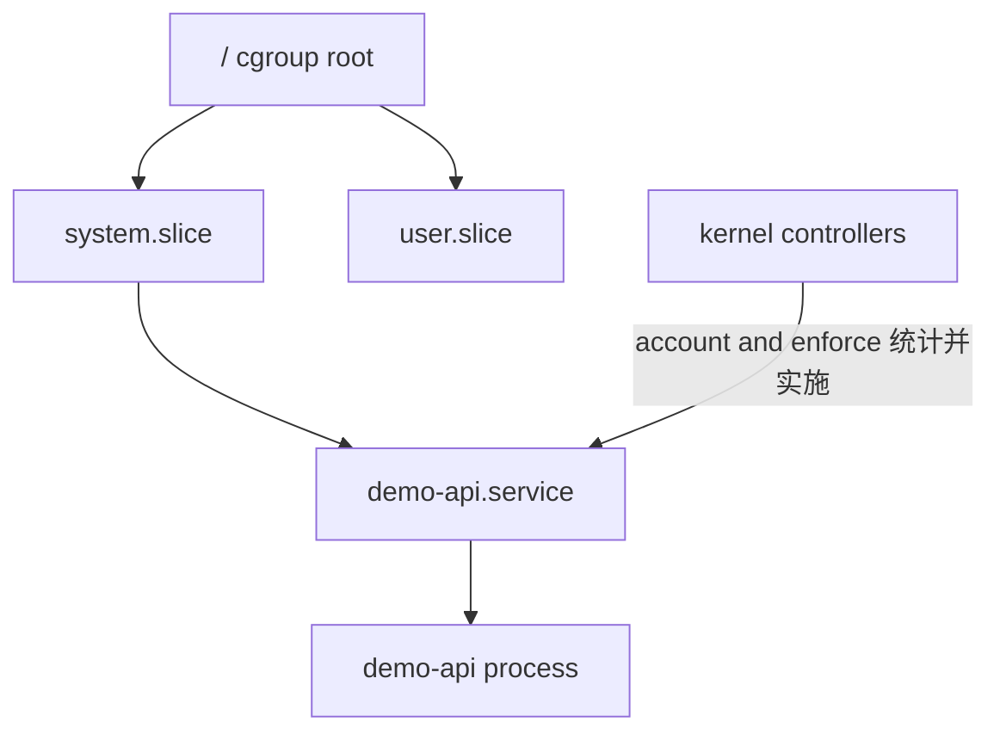

# cgroup v2 与资源

control group（cgroup）把进程组织成 hierarchy，并通过 controller 提供统计和控制接口。cgroup 组织进程并提供资源统计和控制接口；它不改变进程看到的 hostname、mount 或 network 视图。

Ubuntu 24.04 默认通常使用 unified cgroup v2。先确认文件系统类型，不符合时停止本页写配置步骤：

```bash
test "$(stat -fc '%T' /sys/fs/cgroup)" = cgroup2fs
cat /sys/fs/cgroup/cgroup.controllers
cat /proc/self/cgroup
```

`cgroup.controllers` 列出当前 cgroup 可向 children 提供的 controllers，不等于每个 controller 已在所有层级启用。

## hierarchy 与成员

cgroup v2 使用单一 hierarchy。进程属于其中一个 cgroup，线程模式等高级情形另有约束。父级决定哪些 controller 可委派给 child。



目录与文件由 cgroup filesystem 暴露；直接创建或修改 systemd 管理的 subtree 会与 service manager 冲突。

## systemd 管理边界

systemd 是 Ubuntu 主机上 cgroup hierarchy 的主要管理者。service、scope 和 slice unit 映射到 cgroup，对资源配置使用 unit directive 或 `systemd-run`，不要任意写 systemd-owned cgroup。

```bash
control_group=$(systemctl show --property ControlGroup --value demo-api.service)
case "$control_group" in
  /*) ;;
  *) printf 'invalid ControlGroup: %s\n' "$control_group" >&2; exit 1 ;;
esac

cgroup_path=$(realpath -m "/sys/fs/cgroup$control_group")
case "$cgroup_path" in
  /sys/fs/cgroup/*) ;;
  *) printf 'refusing path outside cgroup root\n' >&2; exit 1 ;;
esac
test -d "$cgroup_path"
printf 'cgroup_path=%s\n' "$cgroup_path"
```

路径校验避免把异常 `ControlGroup` 拼接成 cgroup root 外的读取目标。

## CPU 统计与限制

`cpu.stat` 提供累计 usage、user/system 时间，以及配置 quota 时的 throttling 证据：

```bash
cat "$cgroup_path/cpu.stat"
systemctl show demo-api.service \
  --property CPUAccounting,CPUUsageNSec,CPUQuotaPerSecUSec
```

CPUQuota 限制一段 period 内可用 CPU 时间，不等于固定占用某个物理 core。高 `nr_throttled` 需要结合请求延迟、host load 和 quota 判断。

## memory.high 与 memory.max

`memory.current` 是该 cgroup 当前 memory charge；`memory.events` 记录 high、max、oom、oom_kill 等累计事件。

```bash
cat "$cgroup_path/memory.current"
cat "$cgroup_path/memory.high"
cat "$cgroup_path/memory.max"
cat "$cgroup_path/memory.events"
```

memory.high 用于节流压力，memory.max 是硬上限。接近 high 不等于发生 OOM；`memory.events` 的增量、PSI、应用延迟和 kernel log 应一起判断。memory.max 达到上限后 kernel 会尝试 reclaim，无法满足时可能在 cgroup 内触发 OOM。

## PID 与 I/O

```bash
cat "$cgroup_path/pids.current"
cat "$cgroup_path/pids.max"
cat "$cgroup_path/io.stat"
```

`pids.current` 统计 tasks，不只是传统意义的进程数；达到 `pids.max` 可能让 fork/clone 失败。`io.stat` 按设备编号累计字节和操作，需映射 block device 才能解释，不应直接把最大数字称为“最慢磁盘”。

## PSI

Pressure Stall Information（PSI）描述 tasks 因等待 CPU、memory 或 I/O 资源而 stall 的时间比例。既可看系统级，也可看支持的 cgroup 级文件：

```bash
cat /proc/pressure/cpu
cat /proc/pressure/memory
cat /proc/pressure/io
for resource in cpu memory io; do
  test ! -r "$cgroup_path/$resource.pressure" || \
    cat "$cgroup_path/$resource.pressure"
done
```

`some` 与 `full` 代表不同程度的同时 stall。PSI 是 pressure 证据，不自动给出是哪段应用代码导致。

## cgroup namespace 不是资源限制

cgroup namespace 改变进程看到的 cgroup path root，便于容器呈现相对视图；cgroup namespace 不等于 cgroup resource limit。真正限制来自 hierarchy 中 controller 文件的配置。

```bash
readlink /proc/self/ns/cgroup
cat /proc/self/cgroup
systemctl show demo-api.service --property ControlGroup
```

namespace 标识不同而 limit 相同是可能的，标识相同但进程属于不同 cgroup 也可能发生。

## 通过 systemd 设置限制

使用已在 [systemd 服务](/linux/runtime/systemd-services)定义的 drop-in：

```bash
sudo systemctl set-property --runtime demo-api.service \
  CPUQuota=50% MemoryHigh=192M MemoryMax=256M TasksMax=64
systemctl show demo-api.service \
  --property CPUQuotaPerSecUSec,MemoryHigh,MemoryMax,TasksMax
```

`--runtime` 写入 `/run` 下的 transient 配置，reboot 后消失，仍会立即改变运行服务边界。执行前确认测试主机和变更授权。完成观察后精确恢复：

```bash
sudo systemctl revert demo-api.service
sudo systemctl daemon-reload
systemctl show demo-api.service \
  --property CPUQuotaPerSecUSec,MemoryHigh,MemoryMax,TasksMax
```

如果 unit 还有持久 drop-in，`revert` 的影响需要先用 `systemctl cat` 审查；不要在未知配置的生产 unit 上照搬。

## 与 Docker 和 Kubernetes 对应

Docker resource flags 最终由 daemon/runtime 配置 Linux cgroup；Kubernetes requests 影响调度，limits 和节点配置再映射到运行时/cgroup。它们不是 cgroup 文件的同义词，且 CPU request 通常不是硬上限。

Kubernetes 对应概念见[调度与资源](/kubernetes/concepts/scheduling-resources)，Docker 的基础关系见[容器模型](/docker-oci/concepts/container-model)。

## 边界与误区

- cgroup 统计有层级和累计语义；采样时要记录时间和 path。
- `memory.current` 不等于进程 RSS 简单求和。
- limit 能约束资源，不保证应用在约束内仍满足延迟目标。
- 不要为了演示在共享主机设置 host-wide 极低 limit 或触发 OOM。

参考 [cgroup v2 admin guide](https://docs.kernel.org/admin-guide/cgroup-v2.html)、[PSI documentation](https://docs.kernel.org/accounting/psi.html) 与 [systemd.resource-control](https://www.freedesktop.org/software/systemd/man/latest/systemd.resource-control.html)。下一步在[资源压力](/linux/runtime/resource-pressure)组合统计、limit 和症状。
