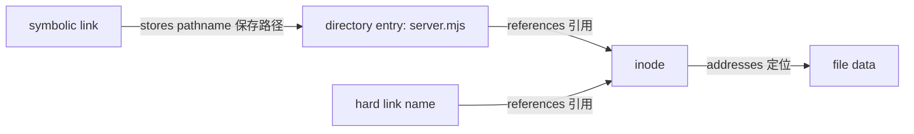

# 文件系统与 mount

应用使用 pathname（路径名）访问文件。kernel 通过 VFS 和具体文件系统逐级解析目录项，最终定位 inode 等文件对象；pathname 不是文件内容本身。

## 路径解析

pathname 经过逐级解析后定位文件对象。绝对路径从进程 root 开始，相对路径从 working directory 开始；每一级目录都需要合适的搜索权限。

```bash
pwd
namei -l /opt/demo-api/server.mjs
readlink -f /opt/demo-api/server.mjs
```

`readlink -f` 会规范化现有路径，但不能证明调用进程有读取最终内容的权限，也不能替代打开文件时的竞态安全设计。

## inode 与链接

目录项把名称关联到 inode。hard link 引用同一个 inode，因此删除一个名称不会在仍有其他 hard link 或打开引用时立即移除对象。symbolic link 保存另一个路径文本，可以跨文件系统，也可能悬空。



在临时目录做低风险观察：

```bash
lab_dir=$(mktemp -d --tmpdir inode-lab.XXXXXX)
printf 'demo\n' >"$lab_dir/original"
ln "$lab_dir/original" "$lab_dir/hard-link"
ln -s original "$lab_dir/symbolic-link"
stat --format='%i %h %F %n' "$lab_dir"/*
rm -- "$lab_dir/hard-link" "$lab_dir/symbolic-link" "$lab_dir/original"
rmdir -- "$lab_dir"
```

预期两个普通文件名 inode 相同且 link count 为 2，symlink 有自己的 inode。

## 文件系统与 VFS

VFS 为 ext4、XFS、tmpfs、procfs 等实现提供共同系统调用接口，但持久性、容量、权限扩展和错误语义可能不同。

```bash
findmnt --target /opt --output TARGET,SOURCE,FSTYPE,OPTIONS
stat -f --format='type=%T block_size=%S' /opt
findmnt --target /proc --output TARGET,SOURCE,FSTYPE,OPTIONS
```

procfs 和 sysfs 是 kernel 接口，不是普通持久磁盘。tmpfs 使用内存支持，仍可能计入 memory pressure。

## mount 与 mount view

mount 把一个文件系统附着到目录树中的挂载点（mount point）。进程实际看到哪些 mount 还取决于 mount namespace。

```bash
findmnt --target /opt/demo-api
awk '$5 == "/" || $5 == "/opt" { print }' /proc/self/mountinfo
readlink /proc/self/ns/mnt
```

这些命令只读。不要在共享测试主机上把临时文件系统 mount 到 `/etc`、`/usr`、`/var` 或应用真实路径；覆盖挂载会暂时隐藏原目录内容并影响其他进程。

## 空间与 inode

剩余字节和剩余 inode 是两种不同容量。大量小文件可能先耗尽 inode，单个大文件可能先耗尽 blocks。

```bash
df -h -- /opt/demo-api
df -i -- /opt/demo-api
du -x -h --max-depth=1 /var/lib/demo-api 2>/dev/null | sort -h
```

`df` 报告文件系统总体分配，`du` 汇总可遍历目录项，两者因已删除但仍打开的文件、权限、snapshot 或保留空间而不同。不要通过填满主机文件系统验证故障。

## demo-api 文件证据

```bash
stat --format='inode=%i links=%h uid=%u gid=%g mode=%a size=%s path=%n' \
  /opt/demo-api/server.mjs
namei -l /opt/demo-api/server.mjs
findmnt --target /opt/demo-api/server.mjs
```

这三类证据分别描述文件对象、路径每一级权限和所在 mount。任何一项都不能单独证明应用已成功读取文件；还要看进程身份与应用日志。

## 只读观察实验

比较当前 Shell 和 systemd 服务的 mount namespace 标识：

```bash
readlink /proc/self/ns/mnt
service_pid=$(systemctl show --property MainPID --value demo-api.service)
case "$service_pid" in
  ''|0|*[!0-9]*) printf 'demo-api.service has no running MainPID\n' >&2; exit 1 ;;
esac
readlink "/proc/$service_pid/ns/mnt"
```

标识相同说明此刻引用同一 namespace，不保证所有路径权限相同；身份、working directory 和 systemd sandboxing 仍会改变访问结果。

## 边界与误区

- 删除 pathname 不一定立即释放空间；进程仍打开 inode 时，数据可继续占用 blocks。
- bind mount 暴露主机路径，ownership 和 mount options 仍影响访问。
- filesystem cache 使用内存不等于内存泄漏，需结合可回收性和 pressure 判断。
- Docker writable layer、Volume 和 bind mount 的生命周期不同，参见[容器存储](/docker-oci/runtime/storage)。

参考 [path_resolution(7)](https://man7.org/linux/man-pages/man7/path_resolution.7.html)、[inode(7)](https://man7.org/linux/man-pages/man7/inode.7.html) 与 [mount_namespaces(7)](https://man7.org/linux/man-pages/man7/mount_namespaces.7.html)。后续用 [namespace](/linux/concepts/namespaces)解释 mount view，用[资源压力](/linux/runtime/resource-pressure)处理空间与 inode 证据。
