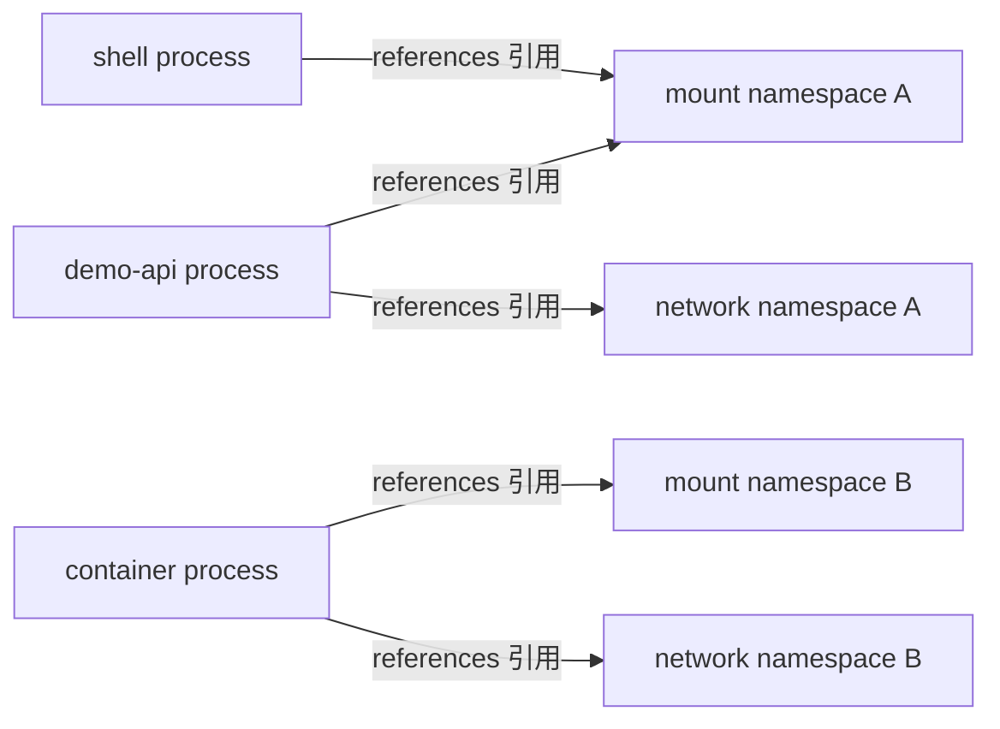

# Linux namespace

namespace 改变一组进程看到的资源视图。它可以让同一 kernel 上的进程看到不同 PID、mount、network 或 hostname 等视图，但 namespace 不是虚拟机，也不是完整安全边界。

## 八类资源视图

| namespace | 隔离或虚拟化的视图 | 常见观察接口 |
| --- | --- | --- |
| mount | mount table、root 和传播关系 | `/proc/<pid>/mountinfo`, `ns/mnt` |
| PID | 进程 ID 与父子视图 | `ns/pid`, `NSpid` |
| network | interface、route、socket、firewall 等网络栈对象 | `ns/net`, `ip`, `ss` |
| UTS | hostname 与 domain name | `ns/uts`, `hostname` |
| IPC | System V IPC 与 POSIX message queue | `ns/ipc`, `ipcs` |
| user | UID/GID 映射及 namespace capability | `uid_map`, `gid_map`, `ns/user` |
| cgroup | 进程看到的 cgroup root 视图 | `ns/cgroup`, `/proc/<pid>/cgroup` |
| time | boot/monotonic clock offset | `ns/time`, `timens_offsets` |

支持范围取决于 kernel 配置和版本。Ubuntu 24.04 通常提供这些接口，但容器策略可能隐藏或禁止部分操作。

## 进程如何关联 namespace

`/proc/<pid>/ns/*` 是指向 namespace 对象的 magic links。同一类型链接显示相同标识时，两个进程此刻引用同一对象。



namespace 对象不主动“隔离应用”；kernel 在相关系统调用中按调用进程所属 namespace 解析视图。

## 只读观察

查看当前 Shell 的 `/proc/self/ns` 和系统已知 namespace：

```bash
for namespace_path in /proc/self/ns/*; do
  printf '%s -> %s\n' \
    "$namespace_path" "$(readlink "$namespace_path")"
done
lsns --output NS,TYPE,PATH,NPROCS,PID,COMMAND | sed -n '1,30p'
```

`lsns` 是采样；进程退出或加入后统计会变化。普通用户看不到所有进程细节时，不应把缺失行解释为对象不存在。

## 比较 demo-api 与 Shell

先从 systemd 取得 MainPID，再逐类比较：

```bash
service_pid=$(systemctl show --property MainPID --value demo-api.service)
case "$service_pid" in
  ''|0|*[!0-9]*) printf 'demo-api.service has no MainPID\n' >&2; exit 1 ;;
esac

for namespace_name in mnt pid net uts ipc user cgroup time; do
  shell_ns=$(readlink "/proc/self/ns/$namespace_name")
  service_ns=$(readlink "/proc/$service_pid/ns/$namespace_name")
  printf '%-7s shell=%s service=%s\n' \
    "$namespace_name" "$shell_ns" "$service_ns"
done
```

标准主机 service 常与 Shell 共享多类 namespace；systemd sandboxing 可以为某些 unit 创建不同视图。标识相同不代表权限、cgroup 或 working directory 相同。

## PID namespace

进程在嵌套 PID namespace 中可能有多级 PID。`NSpid` 从外到内列出可见标识：

```bash
sed -n -E '/^(Pid|PPid|NSpid):/p' "/proc/$service_pid/status"
readlink "/proc/$service_pid/ns/pid"
```

容器内看到 PID 1 的进程，在 daemon 主机上通常还有另一个 PID。向哪个 PID 操作取决于观察者所在 namespace。

## user namespace 与 ownership

user namespace 能映射 namespace 内外的 UID/GID，并让进程只在该 namespace 管辖资源上拥有 capability。user namespace 中的 UID 映射不改变所有外部对象的 ownership。

```bash
cat /proc/self/uid_map
cat /proc/self/gid_map
readlink /proc/self/ns/user
```

文件系统是否支持 idmapped mount、文件来自哪个 superblock、外部 owner 和调用路径都会影响结果。不能因为 namespace 内显示 root 就假定拥有主机 root 权限，也不能假定所有 bind-mounted 文件都会自动改 owner。

## 可选的短时 unshare 实验

仅当组织允许 unprivileged user namespace、当前主机是专用测试环境时运行。它只创建短时 user 与 UTS namespace，不修改主机 hostname：

```bash
if unshare --user --map-root-user --uts true 2>/dev/null; then
  unshare --user --map-root-user --uts bash -c '
    set -eu
    hostname demo-api-lab
    printf "inside hostname=%s uid=%s\n" "$(hostname)" "$(id -u)"
    cat /proc/self/uid_map
  '
  printf 'outside hostname=%s uid=%s\n' "$(hostname)" "$(id -u)"
else
  printf 'unprivileged user namespaces are unavailable or denied; skipping\n'
fi
```

成功证据是 inside hostname 不同、inside UID 为 0、outside hostname 未变。namespace 内 UID 0 只在映射边界内有意义。

## nsenter 的高影响边界

`nsenter` 会让新命令进入目标进程的一种或多种 namespace。nsenter 会进入目标进程的 namespace，必须先验证目标身份，包括 PID、start time、可执行文件、unit 和操作者权限。

本文不提供直接进入生产进程 namespace 的执行步骤。错误目标或同时进入 mount/network/user namespace 可能读取敏感文件、改变网络状态或扩大权限。优先使用 `/proc`、`lsns`、`ss` 和 `ip` 的只读证据。

## 容器与安全边界

容器通常组合多类 namespace、cgroup、capability、seccomp、LSM 和 filesystem 视图。任何单项缺失或错误配置都可能扩大影响面。namespace 不过滤所有系统调用，也不提供独立 kernel；kernel 漏洞和共享资源仍属于边界。

Docker 对应关系见[容器模型](/docker-oci/concepts/container-model)，Kubernetes 权限模型见[身份与安全](/kubernetes/concepts/security)。

## 失败检查点

- `/proc/<pid>/ns` 消失：进程可能已退出或 PID 已复用，重新验证身份。
- `readlink` 权限拒绝：检查 ptrace 与 procfs mount policy，不要关闭安全限制。
- `unshare` 返回 EPERM：可能被 sysctl、LSM、seccomp 或容器策略禁止，按环境边界跳过。
- namespace 标识不同：只证明对象不同，不自动说明具体配置或根因。

参考 [namespaces(7)](https://man7.org/linux/man-pages/man7/namespaces.7.html)、[user_namespaces(7)](https://man7.org/linux/man-pages/man7/user_namespaces.7.html) 和 [Linux namespace documentation](https://docs.kernel.org/userspace-api/namespaces.html)。继续学习[cgroup 与资源](/linux/concepts/cgroups-and-resources)。
