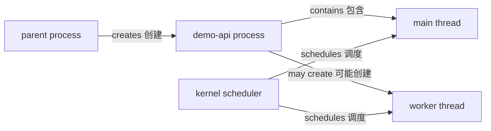

# 进程与 procfs

应用运行时，kernel 维护进程身份、地址空间、线程、调度状态、环境、文件描述符和凭据。`ps` 与 `/proc` 能观察其中一部分，但进程表是一个时间点的快照，不是完整执行历史。

## 进程身份

PID 是当前 PID namespace 中的整数标识，PPID 指向父进程。PID 不是全局永久 ID：进程退出后，kernel 可以把同一个数字分配给新进程。因此 PID 可以复用，单独保存 PID 不能永久证明进程身份。

更可靠的短期身份组合包括 PID、`/proc/<pid>/stat` 的 start time、可执行文件、命令行、所属用户和 cgroup。操作前应重新读取，而不是只相信旧 PID 文件。

```bash
demo_pid=$(cat /tmp/demo-api-host.example/demo-api.pid)
case "$demo_pid" in
  ''|*[!0-9]*) printf 'invalid PID\n' >&2; exit 1 ;;
esac
ps -o pid,ppid,user,lstart,stat,comm -p "$demo_pid"
readlink "/proc/$demo_pid/exe"
awk '{ print "start_time_ticks=" $22 }' "/proc/$demo_pid/stat"
```

示例路径必须替换为[主机运行 demo-api](/linux/guide/run-demo-api)实际打印的目录。不要对未核实身份的 PID 发信号。

## 父子关系与线程

Shell 启动命令时通常成为父进程；systemd 启动服务时，服务进程由 systemd 管理。一个 process 可以包含多个 thread，它们共享地址空间和打开文件等资源，但每个线程有自己的调度实体与 thread ID。



查看任务目录不会改变进程：

```bash
task_dir="/proc/$demo_pid/task"
test -d "$task_dir"
find "$task_dir" -mindepth 1 -maxdepth 1 -printf '%f\n' | sort -n
```

## 进程状态

`ps` 的 process state 常见首字母包括 `R`（running/runnable）、`S`（interruptible sleep）、`D`（uninterruptible sleep）、`T`（stopped）和 `Z`（zombie）。状态是采样瞬间，不应把一次 `S` 解读成故障。

Zombie 已退出但父进程尚未回收其 wait status；它不再执行应用代码，却仍占一个进程表项。持续增长的 zombie 数量通常需要检查父进程是否调用 `wait`。

```bash
ps -o pid,ppid,stat,wchan:24,comm -p "$demo_pid"
sed -n -E '/^(Name|State|Pid|PPid|Threads):/p' "/proc/$demo_pid/status"
```

## 环境与命令行

`/proc/<pid>/cmdline` 和 `/proc/<pid>/environ` 不是普通换行文本。`/proc/<pid>/environ 使用 NUL 分隔环境项`，`cmdline` 也以 NUL 分隔参数：

```bash
tr '\0' ' ' <"/proc/$demo_pid/cmdline"
printf '\n'
tr '\0' '\n' <"/proc/$demo_pid/environ" | sed -n '/^PORT=/p'
```

环境和命令行可能暴露 secret。只筛选排障所需键，不要把完整内容写入公共日志。进程启动后修改自身环境也未必反映为其他进程期望的配置来源。

## 文件描述符

文件描述符是进程表项中的整数引用，可能指向普通文件、目录、pipe、socket、设备或匿名 kernel 对象。数字只在该进程内有意义。

```bash
ls -l "/proc/$demo_pid/fd" | sed -n '1,20p'
cat "/proc/$demo_pid/limits" | sed -n '/open files/p'
```

读取 `/proc/<pid>/fd` 受权限和 ptrace 访问规则约束。看不到目标不等于进程没有打开文件；先检查观察者身份。

## procfs 观察

procfs 是 kernel 的伪文件系统接口。不同文件具有不同一致性和权限语义；连续读取可能跨越状态变化。

```bash
findmnt --target /proc
sed -n -E '/^(VmRSS|VmSize|Threads|FDSize):/p' "/proc/$demo_pid/status"
cat "/proc/$demo_pid/cgroup"
```

`VmRSS` 是近似常驻内存证据，不等于应用独占物理内存；共享页、缓存、采样时刻和 cgroup 统计需要一起解释。

## PID 复用

下面的只读函数在操作前核对 PID、可执行文件和 start time。它仍只适合同一 boot 内短期检查：

```bash
verify_process() {
  local pid=$1 expected_exe=$2 expected_start=$3
  test -r "/proc/$pid/stat" || return 1
  test "$(readlink "/proc/$pid/exe")" = "$expected_exe" || return 1
  test "$(awk '{ print $22 }' "/proc/$pid/stat")" = "$expected_start"
}

demo_start=$(awk '{ print $22 }' "/proc/$demo_pid/stat")
verify_process "$demo_pid" "$app_dir/node/bin/node" "$demo_start"
```

变量来自当前实验会话。跨 reboot 或长期身份应使用 systemd unit、容器 ID、审计记录等更稳定上下文，而非裸 PID。

## demo-api 检查

把进程、socket 和 HTTP 证据关联：

```bash
ps -o pid,ppid,user,stat,etimes,comm -p "$demo_pid"
ss -ltnp 'sport = :3000'
curl --fail --show-error http://127.0.0.1:3000/healthz
```

三项同时成立，才说明该时刻目标进程存在、端口监听且健康路径响应。它们仍不证明未来可用性或远程网络路径。

## 边界与误区

- `ps aux | grep name` 容易匹配 grep 自身或同名进程；优先使用已验证 PID 和结构化字段。
- `/proc` 数值是证据，不自动给出根因。
- `kill -0` 不发送信号，但也不能永久锁定进程身份。
- Docker Desktop 中看到的 Linux PID 位于 VM；容器 PID namespace 中的 PID 与主机 PID 可以不同。

参考 [proc(5)](https://man7.org/linux/man-pages/man5/proc.5.html)、[proc_pid_stat(5)](https://man7.org/linux/man-pages/man5/proc_pid_stat.5.html) 和 [Linux kernel task documentation](https://docs.kernel.org/)。下一步学习[用户、组与权限](/linux/concepts/users-groups-permissions)和[信号与退出状态](/linux/concepts/signals-and-exit-status)。
