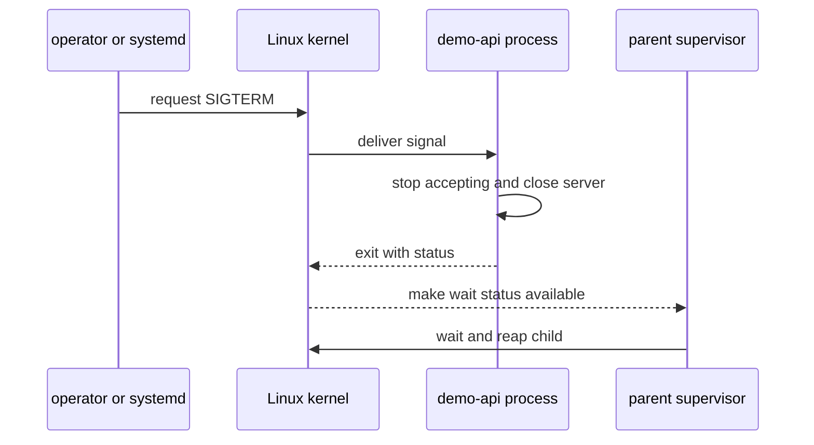

# 信号与退出状态

Signal 是 kernel 向进程或线程通知事件的机制。发送者、kernel、目标进程和监督者承担不同职责；信号送达不等于应用已经完成清理。

## 信号参与者



`kill` 命令只是请求 kernel 发送信号，不等于“杀死”必然发生。权限检查、signal disposition、mask 和进程状态会影响结果。

## disposition 与 mask

进程可以为多数信号安装 handler、采用默认动作或忽略；例如终端中断常产生 `SIGINT`。线程还能阻塞信号，等待后再处理。`SIGSTOP` 和 `SIGKILL` 是例外，SIGKILL 不能被捕获、阻塞或忽略。

```bash
kill -l TERM
kill -l INT
kill -l KILL
sed -n -E '/^(SigBlk|SigIgn|SigCgt):/p' "/proc/$demo_pid/status"
```

位图需要结合当前架构和信号编号解释，不能只凭非零值猜测具体 handler。

## 进程组

Shell pipeline 可以包含多个进程。process group 让终端和 Shell 对一组相关进程实施 job control。向单个 PID 发信号不等于处理整个进程组。

```bash
ps -o pid,ppid,pgid,sid,tpgid,stat,comm -p "$demo_pid"
```

负 PID 的 `kill` 语法可以指向进程组，影响范围更大。除非已经验证 PGID 中所有成员都属于当前实验，不要使用。

## Shell 退出状态

进程正常退出会提供退出状态（exit status）；Shell 通常只展示 0 到 255 范围，并用大于 128 的值表示信号相关终止。退出状态只保留有限范围的信息，不能携带完整根因。

```bash
bash -c 'exit 7'
status=$?
printf 'exit_status=%s\n' "$status"

bash -c 'kill -TERM $$'
signal_status=$?
printf 'signal_status=%s\n' "$signal_status"
```

具体 Shell 的编码展示需查其文档；保存 journal 和应用错误上下文比只记录一个数字更重要。

## demo-api graceful stop

先记录 PID、可执行文件和 start time，再发送 `SIGTERM`：

```bash
demo_exe=$(readlink "/proc/$demo_pid/exe")
demo_start=$(awk '{ print $22 }' "/proc/$demo_pid/stat")
test "$demo_exe" = "$app_dir/node/bin/node"

kill -TERM "$demo_pid"
deadline=$((SECONDS + 15))
while kill -0 "$demo_pid" 2>/dev/null; do
  if (( SECONDS >= deadline )); then
    printf 'timeout; preserve evidence before escalation\n' >&2
    exit 1
  fi
  sleep 1
done
wait "$demo_pid"
status=$?
printf 'start=%s exit=%s\n' "$demo_start" "$status"
```

graceful shutdown 必须有可验证的等待上界。上界应覆盖停止接收请求、完成在途工作和刷新状态的实测时间，而不是无限等待。

## systemd 与容器边界

systemd 用 `KillSignal=`、`TimeoutStopSec=`、`KillMode=` 等配置服务停止行为。Docker stop 与 Kubernetes 终止也会先请求优雅退出，再在超时后强制终止，但调用链、默认值和进程组/cgroup 范围不同。

主机进程不是容器 PID 1；容器中的 PID 1 对默认信号行为和 orphan reaping 有额外责任，参见 [Docker 进程生命周期](/docker-oci/runtime/process-lifecycle)。Kubernetes 的生命周期边界见[健康检查与生命周期](/kubernetes/operations/health-lifecycle)。

## 强制终止

`SIGKILL` 会阻止应用运行清理 handler，可能留下未刷新的数据、半完成事务或无法解释的现场。只有在已保存证据、确认目标身份、优雅停止超时且继续运行风险更高时，才由获授权操作者决定是否使用。

```bash
ps -o pid,ppid,pgid,stat,wchan:24,etimes,comm -p "$demo_pid"
cat "/proc/$demo_pid/stack" 2>/dev/null || true
ss -ltnp 'sport = :3000'
```

第二条通常需要额外权限；权限拒绝本身不代表 kernel stack 异常。本文不自动执行 `kill -9`。

## 失败检查点

| 症状 | 证据 | 判断边界 |
| --- | --- | --- |
| `kill` 返回权限错误 | 发送者和目标 UID、capability | 不要改用 root 绕过身份核对 |
| SIGTERM 后仍存在 | start time、state、wchan、日志、socket | 可能在清理、阻塞或 PID 已复用 |
| 退出状态非零 | wait status 与同一时间 journal | 数字不自动等于根因 |
| 子进程残留 | PID/PGID/cgroup 成员 | 单 PID 停止可能遗漏进程组或派生进程 |

Shell 的 `trap` 用于 Shell 自身收到信号时运行清理函数，不会自动覆盖所有子进程，也不能处理 SIGKILL。先学习 [Shell 实用基础](/linux/guide/shell-practical-basics)，再在 [systemd 服务](/linux/runtime/systemd-services)中配置监督边界。

参考 [signal(7)](https://man7.org/linux/man-pages/man7/signal.7.html)、[waitpid(2)](https://man7.org/linux/man-pages/man2/waitpid.2.html) 和 [systemd.kill](https://www.freedesktop.org/software/systemd/man/latest/systemd.kill.html)。
