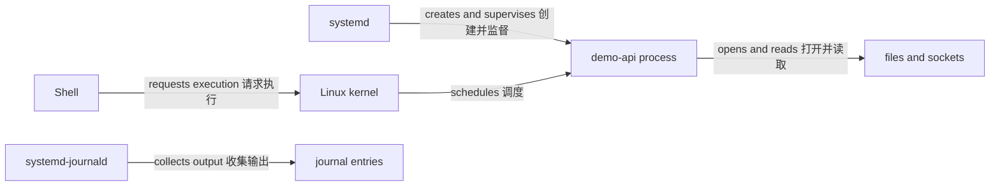

# Linux 应用运行基础

Linux 应用不是一个脱离操作系统的黑盒。从 Shell 输入命令，到 kernel 创建进程，再到 systemd 监督服务、journal 保存证据、namespace 改变资源视图、cgroup v2 统计和限制资源，每一步都有不同的参与者和接口。

本模块以 Ubuntu 24.04 LTS 为实验基线，复用 Docker / OCI 模块中的 `demo-api`。目标不是培养完整的主机管理员，而是让应用开发者能解释应用在主机上如何运行，并能把这些证据映射到 Docker 和 Kubernetes。

## 从命令到运行中的应用

交互式 Shell 先解析命令，然后由 Shell 请求 kernel 创建进程。kernel 负责进程、内存、文件描述符、socket 和调度等机制；它不会理解“Web 服务”或“健康检查”这样的应用概念。应用进程读取文件与环境变量、打开 socket，并通过系统调用请求 kernel 完成工作。

生产服务通常不由登录 Shell 长期维持。systemd 读取 unit 配置，systemd 创建服务进程并监督状态；`systemd-journald` 收集服务的标准输出、标准错误和相关元数据。unit、journal entry 和 cgroup 都是配置或 kernel/service manager 对象，不会主动执行应用代码。



## 九个参与者，不是一体化黑盒

| 参与者或对象 | 负责什么 | 不负责什么 |
| --- | --- | --- |
| Shell | 解析命令、展开参数、连接输入输出并等待进程 | 不直接调度 CPU |
| Linux kernel | 创建和调度进程，实施权限，提供文件、socket、namespace 与 cgroup 接口 | 不理解 systemd unit 的业务意图 |
| systemd | 读取 unit、创建服务进程、监督状态与重启策略 | 不修复应用配置错误 |
| 应用进程 | 执行 `demo-api` 代码并响应请求 | 不自动获得未授予的主机权限 |
| filesystem | 组织持久或临时文件对象 | 不主动读取自己 |
| socket | 表示通信端点及连接状态 | 监听记录不证明应用响应正确 |
| journal | 保存消息及 unit、PID、boot、时间等元数据 | 不是应用业务状态数据库 |
| namespace | 改变进程可见的资源视图 | 不是虚拟机或完整安全边界 |
| cgroup | 组织、统计并约束进程资源 | 不改变进程看到的文件或网络视图 |

因此要分别记住：namespace 改变进程可见的资源视图，cgroup 组织、统计并约束进程资源。两者经常一起用于容器，但解决的是不同问题。

## 主机进程与容器进程

容器中的应用最终仍是某台 Linux kernel 调度的进程。主机直接运行和容器运行的主要差异来自进程的身份、namespace 视图、cgroup 归属、文件系统视图和启动管理者，而不是应用突然变成另一种执行实体。

本模块先观察主机上的 `demo-api`，再链接到 [Linux namespace](/linux/concepts/namespaces)、[cgroup 与资源](/linux/concepts/cgroups-and-resources)和 [systemd 服务](/linux/runtime/systemd-services)。Docker 的对应模型见[容器模型](/docker-oci/concepts/container-model)，Kubernetes 的节点边界见[集群与节点](/kubernetes/concepts/cluster-nodes)。

## Ubuntu 24.04 实验边界

后续命令假定 Ubuntu 24.04 LTS 使用 systemd 和 unified cgroup v2 hierarchy。先做只读确认：

```bash
set -u
. /etc/os-release
printf 'distribution=%s version=%s\n' "$ID" "$VERSION_ID"
systemctl --version | sed -n '1p'
stat -fc '%T' /sys/fs/cgroup
uname -srmo
```

预期能看到 `ubuntu`、`24.04`、systemd 版本，以及 `/sys/fs/cgroup` 的 `cgroup2fs`。输出不一致时，不要照搬会写入 unit、账户或 cgroup 的实验；先查当前平台文档。

Docker Desktop 的 Linux 进程位于虚拟机中；WSL 的 systemd 和 kernel 功能取决于配置；普通容器常没有完整 systemd、主机 journal 或可写 cgroup。远程主机上的 PID、路径和 socket 也不属于本地 Shell 所在机器。这些环境并不是“坏了”，只是证据边界不同。

## 最短验证路径

以下命令只读取当前 Shell 和系统信息：

```bash
printf 'shell_pid=%s\n' "$$"
ps -o pid,ppid,user,stat,comm -p "$$"
readlink "/proc/$$/exe"
findmnt --target /
ss -ltn
```

成功证据是 `ps` 中存在当前 PID，`/proc/<pid>/exe` 能解析到 Shell 可执行文件，`findmnt` 能说明根路径所在 mount，`ss` 返回当前 network namespace 中的监听 socket。命令成功不代表已经理解根因；它们只是一个时间点的证据。

## 常见误区

- `/proc` 不是普通磁盘目录，它暴露 kernel 的运行时视图。
- `systemctl status` 的摘要并不包含完整历史；排障还需要 journal、时间范围和具体字段。
- 进程以非 root 身份运行能缩小权限，但不能单独构成完整隔离。
- `127.0.0.1` 上监听的服务不能直接从其他主机访问；监听 socket 也不证明 HTTP 路径健康。
- cgroup limit、主机整体资源不足和应用自身内存增长是不同问题，不能只看一个百分比下结论。

## 阅读路径

第一次学习从 [Shell 实用基础](/linux/guide/shell-practical-basics) 开始，再完成[在主机运行 demo-api](/linux/guide/run-demo-api)。之后按进程、身份权限、文件与 mount、信号、systemd、日志、namespace、cgroup、socket、资源压力和排障顺序阅读。

已有故障时可直接进入[系统化排障](/linux/operations/troubleshooting)或[命令与证据速查](/linux/reference/command-evidence-map)，但应回到对应概念页验证每条命令能证明什么、不能证明什么。

主要参考：[Linux kernel documentation](https://docs.kernel.org/)、[Linux man-pages](https://man7.org/linux/man-pages/)、[systemd manuals](https://www.freedesktop.org/software/systemd/man/latest/) 和 [Ubuntu Server documentation](https://documentation.ubuntu.com/server/)。
