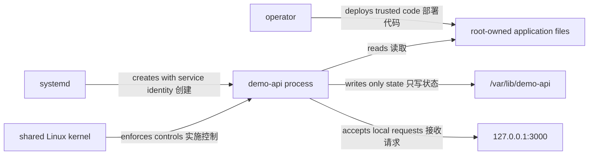

# Linux 应用安全边界

安全不是某一个 directive。进程身份、代码与状态文件、capabilities、system call policy、namespace、systemd sandbox、secret 输入、日志和共享 kernel 共同决定影响面。非 root 服务账户只缩小一个权限边界，不构成完整隔离。

## 威胁与信任关系



若应用可改写自身代码，远程漏洞可能持久化；若可读无关 secret，最小 UID 仍无济于事；若 socket 暴露过宽，文件权限也不能限制网络调用者。

## 服务账户与文件

service account（服务账户）使用固定数值 UID/GID，shell 为 `nologin`。代码与 Node.js 由 root 拥有、服务组只读，状态目录由服务账户写：

```bash
getent passwd demo-api
stat --format='%U %G %a %n' \
  /opt/demo-api /opt/demo-api/server.mjs /var/lib/demo-api
namei -l /opt/demo-api/server.mjs
sudo -u demo-api test -r /opt/demo-api/server.mjs
sudo -u demo-api test ! -w /opt/demo-api/server.mjs
sudo -u demo-api test -w /var/lib/demo-api
```

不要用 root 启动应用来绕过路径错误，也不要使用 `chmod 777`。修复应只授予实际需要的 read/write/traverse。

## capabilities 与 privilege gain

Linux capabilities 把传统 root 能力拆分。`demo-api` 绑定 3000，不需要 `CAP_NET_BIND_SERVICE`，通常也不需要其他 ambient capability。

```bash
systemctl show demo-api.service \
  --property CapabilityBoundingSet,AmbientCapabilities,NoNewPrivileges
getcap -r /opt/demo-api 2>/dev/null || true
```

NoNewPrivileges 阻止进程通过 execve 获得新的特权，例如 set-user-ID 或 file capabilities 带来的提升；它不会撤销进程已有权限，也不会限制文件读取或网络访问。

## systemd sandbox drop-in

先在专用 Ubuntu 24.04 测试主机确认应用只需读取 `/opt/demo-api`、写 `/var/lib/demo-api`、访问 loopback socket。systemd sandboxing directive 必须根据应用实际文件和 socket 需求验证，不能把高分报告当成正确性证明。

```ini title="/etc/systemd/system/demo-api.service.d/hardening.conf"
[Service]
NoNewPrivileges=yes
PrivateTmp=yes
ProtectSystem=strict
ProtectHome=yes
ReadWritePaths=/var/lib/demo-api
CapabilityBoundingSet=
AmbientCapabilities=
RestrictSUIDSGID=yes
LockPersonality=yes
```

安装、验证、重启和健康检查：

```bash
sudo install -d -o root -g root -m 0755 \
  /etc/systemd/system/demo-api.service.d
sudo install -o root -g root -m 0644 hardening.conf \
  /etc/systemd/system/demo-api.service.d/hardening.conf
sudo systemctl daemon-reload
sudo systemd-analyze verify demo-api.service
sudo systemctl restart demo-api.service
systemctl show demo-api.service \
  --property ActiveState,SubState,NoNewPrivileges,ProtectSystem,PrivateTmp
curl --fail --show-error http://127.0.0.1:3000/healthz
```

`PrivateTmp` 给服务不同的 `/tmp`/`/var/tmp` 视图；`ProtectSystem=strict` 把大部分主机文件系统设为只读，再由 `ReadWritePaths` 放行状态目录。应用新增写路径时应显式评审。

## 审计与回滚

`systemd-analyze security` 是基于已知 directive 的 heuristic，不是渗透测试、合规认证或应用正确性证明：

```bash
systemd-analyze security demo-api.service --no-pager
systemctl cat demo-api.service
```

如果服务失败，先保存 journal 和 unit 证据，再只移除本实验文件：

```bash
sudo systemctl stop demo-api.service
test -f /etc/systemd/system/demo-api.service.d/hardening.conf
sudo rm -- /etc/systemd/system/demo-api.service.d/hardening.conf
sudo rmdir --ignore-fail-on-non-empty \
  /etc/systemd/system/demo-api.service.d
sudo systemctl daemon-reload
sudo systemctl start demo-api.service
curl --fail --show-error http://127.0.0.1:3000/healthz
```

不要递归删除 drop-in 目录，那里可能有资源或组织策略配置。

## secret 输入

secret 不应出现在命令行参数、普通环境转储或日志中。unit 的 `Environment=` 也会出现在配置与诊断输出。systemd credential 可把 secret 以受控文件形式提供给服务：

```ini title="demo-api-credential.conf"
[Service]
LoadCredential=api-token:/etc/demo-api/api-token
```

应用从 `$CREDENTIALS_DIRECTORY/api-token` 读取，并禁止打印路径内容。`LoadCredential` 改善传递边界，但 source file 权限、备份、轮换和调用方认证仍需设计。不要为演示创建真实 credential。

## AppArmor 与 seccomp

Ubuntu 可用 AppArmor 约束 path-based 操作，systemd 也可配置 system call filtering。它们与 DAC、capabilities、namespace 解决不同问题。

```bash
aa-status 2>/dev/null | sed -n '1,60p' || true
systemctl show demo-api.service --property AppArmorProfile,SystemCallFilter
```

不应为让应用启动而禁用 AppArmor。先从 journal/kernel log 识别具体 denial，再修正应用需求或最小策略。过宽 allow 会静默扩大攻击面。

## 网络与 kernel 边界

`127.0.0.1` 缩小默认网络可达面，但同一 network namespace 中的其他本机进程仍可连接。调用者认证、反向代理和 host firewall 属于额外边界。

namespace、seccomp 和 AppArmor 都共享同一 Linux kernel；kernel 漏洞、错误 capability 或敏感 device 仍可能突破预期隔离。容器安全对应内容见 [Docker 安全边界](/docker-oci/operations/security) 和 [Kubernetes 身份与安全](/kubernetes/concepts/security)。

## 验证清单

- `demo-api` 以预期 UID/GID 运行，代码不可写，状态目录可写。
- capability bounding set 不包含无需求能力，`NoNewPrivileges=yes`。
- sandbox 生效后启动、健康、日志、停止和状态写入都验证。
- secret 来源、读取者、轮换、日志和 crash 边界明确。
- denial 通过 AppArmor/kernel evidence 处理，不关闭安全机制。
- drop-in 可以精确回滚，不影响其他配置。

参考 [systemd.exec](https://www.freedesktop.org/software/systemd/man/latest/systemd.exec.html)、[capabilities(7)](https://man7.org/linux/man-pages/man7/capabilities.7.html) 和 [Ubuntu AppArmor](https://documentation.ubuntu.com/server/how-to/security/apparmor/)。排障流程见[系统化排障](/linux/operations/troubleshooting)。
