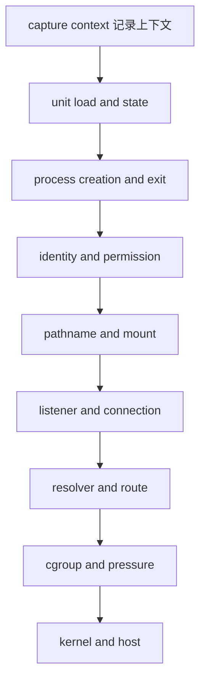

# Linux 系统化排障

排障目标是用最小影响的证据区分假设，而不是快速堆命令。先记录症状发生的时间、主机、unit 和请求标识，再按层次推进。不要在保存证据前重启服务、清空日志或删除状态目录。

## 固定调查顺序



每层先写“观察事实”，再写“它能排除什么”和“下一条区分检查”。

## 记录上下文

```bash
date --iso-8601=seconds
hostnamectl --static
uname -srmo
systemctl show demo-api.service \
  --property LoadState,ActiveState,SubState,MainPID,Result,ExecMainCode,ExecMainStatus,ControlGroup
```

同时保存用户看到的 URL、状态码、错误文本、request ID 和首次/最近发生时间。模糊的“刚才失败”无法与 journal 对齐。

## unit 是否加载

```bash
systemctl show demo-api.service \
  --property LoadState,FragmentPath,DropInPaths,UnitFileState
systemctl cat demo-api.service
```

`LoadState=not-found` 时先检查 unit 路径和是否执行 daemon-reload；不要反复 restart。`bad-setting` 时使用 `systemd-analyze verify` 定位配置。

## 进程创建与立即退出

进程未创建与进程创建后立即退出需要不同证据：

```bash
systemctl show demo-api.service \
  --property MainPID,ExecMainStartTimestamp,ExecMainExitTimestamp,ExecMainCode,ExecMainStatus,Result,NRestarts
journalctl --unit demo-api.service --since '-15 min' \
  --output short-iso-precise --no-pager
```

没有 start timestamp 重点检查 unit load、condition、dependency 和执行前错误；有 start/exit timestamp 则检查应用错误、signal、restart loop 和资源事件。

## 退出与信号

```bash
systemctl show demo-api.service \
  --property ExecMainCode,ExecMainStatus,Result,TimeoutStopUSec,KillSignal
journalctl --unit demo-api.service --since '-15 min' --no-pager
```

exit code 不是根因。把 code/status 与同一时间应用日志、operator action 和 kernel/cgroup event 关联。停止卡住时先采集 state、wchan、socket 和 stack 访问结果，不自动 `kill -9`。

## 身份与权限

权限拒绝必须同时检查进程身份、路径每一级权限和安全模块：

```bash
main_pid=$(systemctl show --property MainPID --value demo-api.service)
case "$main_pid" in
  ''|0|*[!0-9]*) printf 'service has no MainPID\n' >&2; exit 1 ;;
esac
sed -n -E '/^(Uid|Gid|Groups|Cap(Inh|Prm|Eff|Bnd|Amb)|NoNewPrivs):/p' "/proc/$main_pid/status"
namei -l /opt/demo-api/server.mjs
stat --format='%u:%g %a %n' /opt/demo-api/server.mjs /var/lib/demo-api
journalctl --dmesg --since '-15 min' --no-pager | \
  grep -Ei 'apparmor|denied|audit' || true
```

不要看到 EACCES 就扩大所有文件权限。区分 DAC mode/ACL、missing execute on directory、AppArmor denial、read-only mount 和 systemd sandbox。

## pathname 与 mount

```bash
namei -l /opt/demo-api/server.mjs
findmnt --target /opt/demo-api/server.mjs
findmnt --target /var/lib/demo-api
df -h -- /var/lib/demo-api
df -i -- /var/lib/demo-api
```

ENOENT 可能来自路径拼写、symlink、mount view 或 sandbox 隐藏；EROFS 指向 mount/sandbox 写边界；ENOSPC 还需区分 blocks 与 inode。

## listener 与连接

```bash
ss -ltnp 'sport = :3000'
curl --fail --show-error --connect-timeout 2 \
  http://127.0.0.1:3000/healthz
journalctl --unit demo-api.service --since '-5 min' --no-pager
```

无 listener 返回进程/bind 层；有 listener 但 HTTP 错误进入应用协议与日志。listener 在 loopback 不支持远端访问。

## resolver 与 route

```bash
getent ahosts localhost
grep -E '^hosts:' /etc/nsswitch.conf
readlink -f /etc/resolv.conf
ip route get 127.0.0.1
```

名称失败但 IP 成功才集中检查 NSS/resolver。route 存在不证明远端端口或中间策略正常。

## cgroup 与资源

```bash
control_group=$(systemctl show --property ControlGroup --value demo-api.service)
case "$control_group" in /*) ;; *) exit 1 ;; esac
cgroup_path=$(realpath -m "/sys/fs/cgroup$control_group")
case "$cgroup_path" in /sys/fs/cgroup/*) ;; *) exit 1 ;; esac

cat "$cgroup_path/cpu.stat"
cat "$cgroup_path/memory.events"
cat "$cgroup_path/pids.current"
cat "$cgroup_path/pids.max"
cat "$cgroup_path/memory.pressure"
```

比较计数增量与症状时间。memory.events 中 `oom_kill`、CPU throttling、PID limit 和 PSI 分别是不同证据。

## kernel 与 host

```bash
uptime
cat /proc/pressure/cpu
cat /proc/pressure/memory
cat /proc/pressure/io
journalctl --dmesg --since '-30 min' --no-pager
dmesg --ctime --level=err,warn 2>/dev/null | tail -n 80 || true
```

`dmesg` 权限拒绝不等于没有 kernel event。使用获授权的主机 telemetry，不要关闭 `dmesg_restrict`。host-wide pressure 也不证明 `demo-api` 是来源。

## 保存与变更

确认根因前，先导出限定证据并记录 checksum。变更一次只验证一个假设，记录旧值、命令、时间、结果与回滚。

```bash
evidence_dir=$(mktemp -d --tmpdir demo-api-incident.XXXXXX)
systemctl show demo-api.service >"$evidence_dir/systemd-show.txt"
journalctl --unit demo-api.service --since '-30 min' \
  --output export --no-pager >"$evidence_dir/journal.export"
sha256sum "$evidence_dir"/* >"$evidence_dir/SHA256SUMS"
chmod 0700 "$evidence_dir"
chmod 0600 "$evidence_dir"/*
printf 'evidence_dir=%s\n' "$evidence_dir"
```

证据可能含敏感数据，必须按事件流程访问和保留。

## 症状到下一步

| 症状 | 首要区分 | 对应页面 |
| --- | --- | --- |
| service start failed | 未创建还是立即退出 | [systemd 服务](/linux/runtime/systemd-services) |
| permission denied | identity、path、LSM、sandbox | [用户与权限](/linux/concepts/users-groups-permissions) |
| connection refused | listener、address、namespace | [socket 与名称解析](/linux/runtime/sockets-and-name-resolution) |
| process killed | signal、unit result、memory.events | [信号](/linux/concepts/signals-and-exit-status) |
| write failed | errno、mount、space、inode | [文件系统与 mount](/linux/concepts/filesystems-and-mounts) |
| latency high | usage、PSI、limits、downstream | [资源压力](/linux/runtime/resource-pressure) |

参考 [systemd troubleshooting interfaces](https://www.freedesktop.org/software/systemd/man/latest/systemctl.html)、[proc(5)](https://man7.org/linux/man-pages/man5/proc.5.html) 和 [Ubuntu observability](https://documentation.ubuntu.com/server/how-to/observability/)。快速查命令见[命令与证据速查](/linux/reference/command-evidence-map)。
