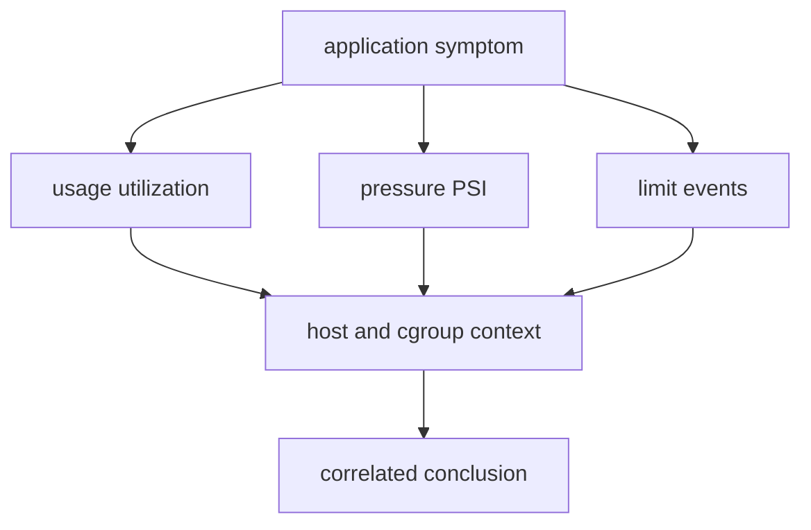

# 资源压力

高利用率、资源压力和资源上限是不同证据。CPU 接近 100% 可能代表有效工作；低利用率也可能伴随 I/O stall。limit 命中说明约束生效，不自动说明 limit 配置错误。

## 证据层次



记录同一时间窗口的应用延迟/错误、进程状态、cgroup path、usage、PSI、limit events 和 kernel log，才能收敛判断。

## CPU

```bash
date --iso-8601=seconds
uptime
ps -o pid,ppid,stat,pcpu,etimes,comm -p "$service_pid"
cat "$cgroup_path/cpu.stat"
cat /proc/pressure/cpu
```

load average 包含 runnable 和部分 uninterruptible tasks，不等于 CPU 百分比。`cpu.stat` 的 throttling 增长配合高延迟，才支持 quota 影响假设。

受控实验只对 `demo-api.service` 使用 runtime quota：

```bash
sudo systemctl set-property --runtime demo-api.service CPUQuota=25%
sleep 5
cat "$cgroup_path/cpu.stat"
sudo systemctl revert demo-api.service
```

执行前确认专用测试主机和变更授权；恢复后用 `systemctl show -p CPUQuotaPerSecUSec` 验证。

## memory

```bash
cat "$cgroup_path/memory.current"
cat "$cgroup_path/memory.high"
cat "$cgroup_path/memory.max"
cat "$cgroup_path/memory.events"
cat "$cgroup_path/memory.pressure"
```

memory.events 中的 oom_kill 计数比单次进程消失更接近限制证据，但它仍需与计数增量、unit result、kernel log 和同一 cgroup path 对齐。进程退出也可能来自应用错误或操作者信号。

不要故意把 `MemoryMax` 设到低于当前工作集触发 OOM。可使用 `MemoryHigh` 在批准的测试窗口观察 reclaim/节流，再立即恢复：

```bash
current_memory=$(cat "$cgroup_path/memory.current")
printf 'memory.current=%s\n' "$current_memory"
systemctl show demo-api.service --property MemoryHigh,MemoryMax
```

## I/O

```bash
cat "$cgroup_path/io.stat"
cat "$cgroup_path/io.pressure"
ps -o pid,stat,wchan:32,comm -p "$service_pid"
```

`io.stat` 是按设备累计 I/O，PSI 表示 stall；两者都需要时间差采样。`D` state 可能由多种不可中断等待造成，不能仅凭一次 wchan 宣称磁盘故障。

## PID 与 task 上限

```bash
cat "$cgroup_path/pids.current"
cat "$cgroup_path/pids.max"
systemctl show demo-api.service --property TasksCurrent,TasksMax
```

接近 `TasksMax` 时，新 thread/process 创建可能失败。不要运行 fork bomb 或循环创建进程验证；使用当前计数、应用错误和 limit event 即可。

## 磁盘空间与 inode

```bash
df -h -- /var/lib/demo-api
df -i -- /var/lib/demo-api
du -x -h --max-depth=1 /var/lib/demo-api 2>/dev/null | sort -h
```

剩余空间正常时仍可能耗尽 inode；反之 inode 充足也可能没有可分配 blocks。`df` 与 `du` 不一致还可能来自 deleted-open file、snapshot、权限或保留空间。

不能通过填满宿主文件系统来演示磁盘故障。若确需练习，应由基础设施团队提供有明确容量上限、无共享数据的 disposable filesystem；本文只做读取。

## PSI 采样

PSI 的 `avg10/avg60/avg300` 是不同窗口平均值，`total` 是累计 stall 微秒数。记录前后值而非只截图一次：

```bash
for resource in cpu memory io; do
  printf '%s before: ' "$resource"
  cat "$cgroup_path/$resource.pressure"
done
sleep 10
for resource in cpu memory io; do
  printf '%s after: ' "$resource"
  cat "$cgroup_path/$resource.pressure"
done
```

PSI 为零不保证应用健康；错误配置、下游错误和锁竞争可能不表现为 host pressure。

## 分层判断

| 症状 | 区分证据 | 不能直接下的结论 |
| --- | --- | --- |
| 延迟升高 | CPU throttling、PSI、I/O、下游时间 | “CPU 高就是根因” |
| 进程消失 | unit result、exit status、memory.events、kernel log | “一定 OOM” |
| 写文件失败 | errno、`df -h`、`df -i`、mount mode、权限 | “磁盘满” |
| 无法创建 worker | pids.current/max、应用 errno、memory | “线程库坏了” |
| host load 高 | runnable/D tasks、per-cgroup usage、PSI | “demo-api 占满主机” |

## 环境边界与清理

容器内 `/proc/pressure` 和 cgroup 文件可能经过 namespace 或挂载过滤；Docker Desktop 的 host pressure 属于 VM。托管 Kubernetes 节点可能不允许直接读 kernel log，需使用平台 telemetry。

任何 `systemctl set-property --runtime` 实验结束后：

```bash
sudo systemctl revert demo-api.service
sudo systemctl daemon-reload
systemctl show demo-api.service \
  --property CPUQuotaPerSecUSec,MemoryHigh,MemoryMax,TasksMax
curl --fail --show-error http://127.0.0.1:3000/healthz
```

参考 [PSI](https://docs.kernel.org/accounting/psi.html)、[cgroup v2](https://docs.kernel.org/admin-guide/cgroup-v2.html) 和 [systemd.resource-control](https://www.freedesktop.org/software/systemd/man/latest/systemd.resource-control.html)。结合[cgroup 与资源](/linux/concepts/cgroups-and-resources)和[系统化排障](/linux/operations/troubleshooting)使用这些证据。
