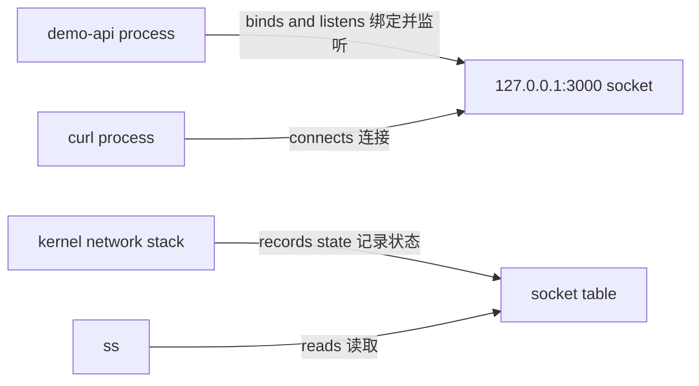

# Socket 与名称解析证据

应用“访问不通”至少可能发生在 bind 配置、监听 socket、连接、路由或名称解析层。监听 socket、连接、路由和名称解析是四个不同检查点，必须按证据逐层区分。

## 从应用 bind 开始

`demo-api` 明确调用 `server.listen(port, '127.0.0.1')`。127.0.0.1 只接受本机 loopback 路径上的连接，不会在主机其他 interface address 上监听。

```bash
grep -F "server.listen(port, '127.0.0.1'" /opt/demo-api/server.mjs
systemctl show demo-api.service --property Environment,MainPID
```

源码与环境只说明期望配置；进程可能未启动、bind 失败或实际运行另一份文件，因此下一步必须查看 kernel socket 表。

## 监听 socket

TCP server 成功 bind/listen 后，socket 处于 LISTEN：

```bash
ss -ltnp 'sport = :3000'
ss -ltn --options --processes 'sport = :3000'
```

预期 local address 是 `127.0.0.1:3000`，state 是 `LISTEN`。普通用户可能看不到其他 UID 进程名；需要时用获授权的 `sudo ss -ltnp`，而不是改变 procfs 安全设置。

监听行证明当前 network namespace 中存在 endpoint，不证明 `/healthz` 正确，也不证明远程 host 可达。



## 本机连接与应用响应

```bash
curl --fail --show-error --connect-timeout 2 \
  http://127.0.0.1:3000/healthz
curl --fail --show-error --connect-timeout 2 \
  http://127.0.0.1:3000/
ss -tn 'sport = :3000 or dport = :3000'
```

`curl` 连接拒绝通常表示目标 namespace/address/port 没有 listener；超时可能涉及 route、filter 或负载；HTTP 非 2xx 说明传输已到应用或代理层，需保留响应与 journal。

## 路由选择

kernel 根据目标地址、policy rule 和 route table 选择出口。loopback 目标应走 `lo`：

```bash
ip route get 127.0.0.1
ip -brief address show lo
ip rule show
```

对远端地址使用 `ip route get <address>` 只说明本机当前选择，不证明下一跳、远端 listener 或中间安全策略正常。本文不深入 nftables、CNI 或跨主机拓扑，这些属于后续网络与 DNS 模块。

## Name Service Switch 与 resolver

应用按名称访问时，glibc 等用户空间组件会根据 `/etc/nsswitch.conf` 选择 files、DNS、systemd-resolved 等来源。getent ahosts 使用系统配置的 Name Service Switch 路径，比只调用特定 DNS 工具更接近许多应用的主机解析行为。

```bash
grep -E '^hosts:' /etc/nsswitch.conf
getent ahosts localhost
readlink -f /etc/resolv.conf
sed -n '1,80p' /etc/resolv.conf
resolvectl status 2>/dev/null | sed -n '1,120p' || true
```

`/etc/resolv.conf` 可能是 systemd-resolved stub 的 symlink。不要直接覆盖它来“修 DNS”；先确认管理者和 per-link 配置。

## 名称、地址与端口不是同一证据

```bash
resolved_address=$(getent ahostsv4 localhost | awk 'NR == 1 { print $1 }')
test -n "$resolved_address"
printf 'resolved=%s\n' "$resolved_address"
ip route get "$resolved_address"
curl --fail --show-error "http://$resolved_address:3000/healthz"
```

DNS 返回地址不证明目标端口正在监听。反过来，直接 IP 成功但名称失败，才把调查重点放到 NSS、resolver、search domain 或返回地址族。

## network namespace 边界

`ss`、`ip route` 和 loopback 都属于调用进程所在 network namespace。容器内的 `127.0.0.1` 指向容器自己的 loopback，不是宿主 `demo-api`。

```bash
readlink /proc/self/ns/net
service_pid=$(systemctl show --property MainPID --value demo-api.service)
case "$service_pid" in
  ''|0|*[!0-9]*) printf 'service has no MainPID\n' >&2; exit 1 ;;
esac
readlink "/proc/$service_pid/ns/net"
```

标识不同意味着必须在正确 namespace 取得 socket 与 route 证据。不要未经身份验证直接 `nsenter --net` 进入生产进程。

## 失败检查点

| 证据 | 结论范围 | 下一步 |
| --- | --- | --- |
| 无 LISTEN | 当前 namespace/port 未监听 | 查 unit、进程、journal 与 bind 错误 |
| LISTEN 但连接拒绝 | 目标 address/namespace 可能不同 | 核对 local address 与调用者 namespace |
| TCP 成功、HTTP 失败 | 已到应用/代理协议层 | 保存响应、request ID 与应用日志 |
| 名称失败、IP 成功 | NSS/resolver 路径有差异 | 查 `hosts:`、resolved 状态与返回地址族 |
| route 存在、连接超时 | route 不证明端到端可达 | 进入网络策略与远端证据边界 |

Docker 端口转发的对应模型见[容器网络](/docker-oci/runtime/networking)，Linux namespace 见[namespace](/linux/concepts/namespaces)。参考 [socket(7)](https://man7.org/linux/man-pages/man7/socket.7.html)、[ip-route(8)](https://man7.org/linux/man-pages/man8/ip-route.8.html) 和 [Ubuntu networking](https://documentation.ubuntu.com/server/explanation/networking/)。
