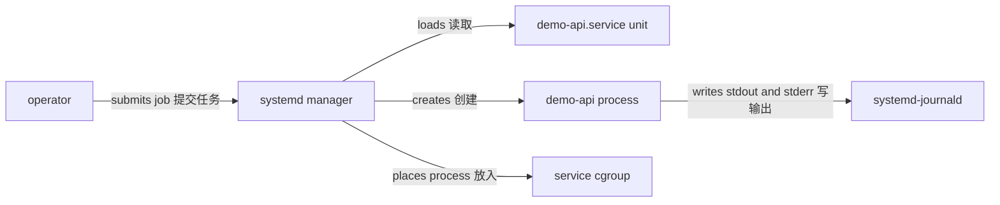

# 用 systemd 管理 demo-api

交互式 Shell 适合实验，不适合长期监督服务。Ubuntu 24.04 LTS 使用 systemd 作为 system and service manager。systemd 读取 unit 配置并创建服务进程，同时维护状态、依赖、停止超时、重启策略和 cgroup 归属。

## unit 模型

unit 描述 systemd 管理的对象；service unit 描述进程如何创建和监督。unit 文件是配置，不会主动执行。systemd manager 解析配置后，按依赖与 job 状态调用 kernel 创建进程。



`systemctl start` 请求启动 job；命令成功表示 systemd 完成了该 job 的当前判断，不永久保证应用健康。

## 安装应用与 unit

前置条件：已按[用户、组与权限](/linux/concepts/users-groups-permissions)创建 `demo-api` 系统账户，已从[主机运行 demo-api](/linux/guide/run-demo-api)取得校验过的 Node.js 目录和 `server.mjs`，当前操作者获准使用 `sudo`。

先验证账户属性，再部署 root-owned 应用文件：

```bash
passwd_entry=$(getent passwd demo-api)
case "$passwd_entry" in
  *:/var/lib/demo-api:/usr/sbin/nologin) ;;
  *) printf 'demo-api account does not match the exercise contract\n' >&2; exit 1 ;;
esac

sudo install -d -o root -g demo-api -m 0750 /opt/demo-api
sudo install -d -o root -g demo-api -m 0750 /opt/demo-api/node
sudo cp -a -- "$app_dir/node/." /opt/demo-api/node/
sudo chown -R root:demo-api /opt/demo-api/node
sudo chmod -R u=rwX,g=rX,o= /opt/demo-api/node
sudo install -o root -g demo-api -m 0640 \
  "$app_dir/server.mjs" /opt/demo-api/server.mjs
```

主 unit 内容如下：

```ini title="/etc/systemd/system/demo-api.service"
[Unit]
Description=Demo API for Linux runtime exercises
After=network.target

[Service]
Type=exec
User=demo-api
Group=demo-api
WorkingDirectory=/opt/demo-api
Environment=PORT=3000
ExecStart=/opt/demo-api/node/bin/node /opt/demo-api/server.mjs
Restart=on-failure
RestartSec=2s
TimeoutStopSec=15s
KillSignal=SIGTERM
StateDirectory=demo-api
NoNewPrivileges=yes

[Install]
WantedBy=multi-user.target
```

用精确权限安装，而不是从不可信路径软链接：

```bash
sudo install -o root -g root -m 0644 \
  demo-api.service /etc/systemd/system/demo-api.service
sudo systemd-analyze verify /etc/systemd/system/demo-api.service
```

`systemd-analyze verify` 检查语法和部分引用，不运行应用，也不证明权限和 HTTP 行为正确。

## 重新加载并启动

daemon-reload 重新加载 unit 文件，不会自动重启服务。先 reload，再启动并读取结构化字段：

```bash
sudo systemctl daemon-reload
sudo systemctl start demo-api.service

systemctl show demo-api.service \
  --property LoadState,ActiveState,SubState,MainPID,User,Group,ExecMainStartTimestamp,ControlGroup
curl --fail --show-error http://127.0.0.1:3000/healthz
ss -ltnp 'sport = :3000'
```

成功证据是 `LoadState=loaded`、`ActiveState=active`、非零 MainPID、健康路径返回 `ok`，以及 loopback listener。`systemctl status` 适合摘要，但脚本应使用 `show` 的稳定 property，而不是解析彩色状态文本。

## 状态与依赖

`After=network.target` 只表达 ordering：如果两个 unit 都参与同一 transaction，`demo-api` 的 start job 排在 target 之后。它不保证 DNS、默认路由或远端依赖已经可用，也不会自动拉入一个未被需要的 unit。

```bash
systemctl list-dependencies demo-api.service
systemctl show demo-api.service --property After,Wants,Requires
```

真正的外部依赖就绪需要应用级重试、健康证据或明确的依赖协议，不能用更多 ordering 猜测替代。

## 重启策略

`Restart=on-failure` 会在非零退出、异常信号或超时等失败结果后按 systemd 规则重启。正常停止通常不会触发它。Restart=on-failure 不会修复持续存在的配置错误；反复失败只会制造 restart loop 并消耗日志和资源。

```bash
systemctl show demo-api.service \
  --property Restart,RestartUSec,NRestarts,Result,ExecMainCode,ExecMainStatus
journalctl --unit demo-api.service --since '-5 min' --no-pager
```

观察 `NRestarts` 与时间范围，区分一次 transient failure 和持续错误。不要在生产中通过无限缩短 `RestartSec` 隐藏故障。

## 停止与超时

默认 `KillMode=control-group` 会让 systemd 面向 unit cgroup 管理相关进程；`KillSignal=SIGTERM` 先请求优雅退出，`TimeoutStopSec=15s` 给应用明确上界。

```bash
main_pid=$(systemctl show --property MainPID --value demo-api.service)
case "$main_pid" in
  ''|0|*[!0-9]*) printf 'service has no MainPID\n' >&2; exit 1 ;;
esac

sudo systemctl stop demo-api.service
systemctl show demo-api.service \
  --property ActiveState,SubState,Result,ExecMainCode,ExecMainStatus
journalctl --unit demo-api.service --since '-2 min' --no-pager
```

停止后应为 inactive，日志包含应用处理 `SIGTERM` 的证据。超时后 systemd 可能按配置升级强制终止；在改大超时前先理解应用实际清理路径。

## drop-in override

对本机变更使用 drop-in，不复制整份 unit。drop-in override 比复制完整 vendor unit 更容易审计差异，也避免上游更新时静默丢失新配置。

```ini title="/etc/systemd/system/demo-api.service.d/resources.conf"
[Service]
CPUQuota=50%
MemoryHigh=192M
MemoryMax=256M
TasksMax=64
```

```bash
sudo install -d -o root -g root -m 0755 \
  /etc/systemd/system/demo-api.service.d
sudo install -o root -g root -m 0644 resources.conf \
  /etc/systemd/system/demo-api.service.d/resources.conf
sudo systemctl daemon-reload
systemctl cat demo-api.service
systemctl show demo-api.service \
  --property CPUQuotaPerSecUSec,MemoryHigh,MemoryMax,TasksMax
```

这里先只验证配置；实际资源证据见[cgroup 与资源](/linux/concepts/cgroups-and-resources)。配置变更不会自动作用于已运行进程的所有执行上下文；按变更窗口和验证策略决定 restart。

## 回滚

先停止服务，移除本实验 drop-in，再 reload 和重新验证：

```bash
sudo systemctl stop demo-api.service
sudo rm -- /etc/systemd/system/demo-api.service.d/resources.conf
sudo rmdir --ignore-fail-on-non-empty \
  /etc/systemd/system/demo-api.service.d
sudo systemctl daemon-reload
systemctl cat demo-api.service
```

`rmdir` 只删除空目录，不会移除其他管理员创建的 drop-in。不要用递归删除覆盖未知配置。

## 精确清理

仅当 unit 路径和账户仍符合实验契约时清理：

```bash
sudo systemctl disable --now demo-api.service 2>/dev/null || \
  sudo systemctl stop demo-api.service

unit_fragment=$(systemctl show --property FragmentPath --value demo-api.service)
test "$unit_fragment" = /etc/systemd/system/demo-api.service
sudo rm -- /etc/systemd/system/demo-api.service
sudo systemctl daemon-reload
sudo systemctl reset-failed demo-api.service

passwd_entry=$(getent passwd demo-api)
case "$passwd_entry" in
  *:/var/lib/demo-api:/usr/sbin/nologin) ;;
  *) printf 'refusing account cleanup: attributes differ\n' >&2; exit 1 ;;
esac

sudo rm -r -- /opt/demo-api
sudo test ! -d /var/lib/demo-api || \
  printf 'inspect /var/lib/demo-api before removing state\n' >&2
```

不自动删除状态目录或账户，因为内容可能需要保留。确认状态完全属于实验后，获授权操作者可分别删除明确目录，再运行 `sudo userdel demo-api`；不要使用宽泛 home 删除选项。

## 失败证据

| 现象 | 只读检查 | 判断边界 |
| --- | --- | --- |
| unit 未加载 | `systemctl show -p LoadState,FragmentPath` | 检查路径和 reload，不要反复 start |
| `203/EXEC` | `journalctl -u`、`namei -l ExecStart` | 可执行文件缺失、权限或 sandbox 均可能导致 |
| `200/CHDIR` | `namei -l WorkingDirectory` | 路径或遍历权限错误 |
| restart loop | `NRestarts`、`Result`、时间范围 journal | restart policy 不是修复 |
| stop timeout | MainPID、state、wchan、日志 | 保存证据后再决定升级处置 |

参考 [systemd.service](https://www.freedesktop.org/software/systemd/man/latest/systemd.service.html)、[systemd.unit](https://www.freedesktop.org/software/systemd/man/latest/systemd.unit.html) 和 [Ubuntu service operations](https://documentation.ubuntu.com/server/how-to/software/)。继续阅读[日志与 journal](/linux/runtime/logs-and-journal)和[cgroup 与资源](/linux/concepts/cgroups-and-resources)。
