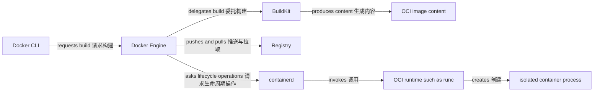
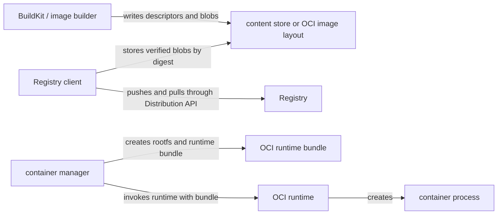

# Docker / OCI Module Implementation Plan

> **For agentic workers:** REQUIRED SUB-SKILL: Use superpowers:subagent-driven-development (recommended) or superpowers:executing-plans to implement this plan task-by-task. Steps use checkbox (`- [ ]`) syntax for tracking.

**Goal:** Build and publish a complete application-developer-focused Docker / OCI documentation module, using one continuous runnable example and accurate boundaries between Docker, OCI, Containerd, Registry, and Kubernetes.

**Architecture:** Seventeen focused Markdown pages live under `docs/docker-oci/` and share one dependency-free Node.js HTTP example. Content contracts grow before each page batch, while route, sidebar, homepage, cross-link, and production-build integration land only after every page is complete so no partial module is exposed.

**Tech Stack:** VitePress 1.6, Markdown, Mermaid 11, Dockerfile and shell examples, Compose YAML, Vitest 4, MarkdownIt, `yaml`, Vue 3 homepage data.

---

## File Structure

**Create content:**

- `docs/docker-oci/index.md`: module mental model and reading paths.
- `docs/docker-oci/guide/source-to-container.md`: runnable source-to-image-to-container journey.
- `docs/docker-oci/guide/container-to-kubernetes.md`: Docker image configuration to PodSpec/CRI mapping.
- `docs/docker-oci/concepts/docker-architecture.md`: Docker CLI, Engine, BuildKit, containerd, runc, and Registry actors.
- `docs/docker-oci/concepts/image-model.md`: OCI descriptors, manifests, indexes, configs, and layers.
- `docs/docker-oci/concepts/container-model.md`: image, writable layer, process, isolation, and lifecycle.
- `docs/docker-oci/build/dockerfile.md`: Dockerfile and build-context semantics.
- `docs/docker-oci/build/buildkit-cache.md`: BuildKit cache inputs, mounts, invalidation, and export.
- `docs/docker-oci/build/multi-platform-builds.md`: OCI index and multi-platform build strategies.
- `docs/docker-oci/runtime/process-lifecycle.md`: PID 1, signals, exit, health, restart, and resources.
- `docs/docker-oci/runtime/networking.md`: bridge, DNS, port publication, and connectivity boundaries.
- `docs/docker-oci/runtime/storage.md`: writable layers, volumes, bind mounts, and tmpfs.
- `docs/docker-oci/runtime/compose.md`: local multi-container application workflow.
- `docs/docker-oci/oci/specifications.md`: relationship between the four OCI specifications.
- `docs/docker-oci/operations/security.md`: host, build, image, and container security boundaries.
- `docs/docker-oci/operations/troubleshooting.md`: layered build/pull/start/network/storage diagnosis.
- `docs/docker-oci/reference/command-map.md`: goal-oriented command and evidence reference.

**Create tests:**

- `tests/docker-oci-content.test.ts`: page-specific terms, relations, examples, and boundary contracts.
- `tests/docker-oci-examples.test.ts`: Compose syntax and continuous-example consistency.
- `tests/docker-oci-routing.test.ts`: exact route inventory, absolute links, and sidebar scope.
- `tests/support/docker-oci-routes.ts`: canonical Docker / OCI route manifest.

**Modify integration:**

- `docs/.vitepress/config.mts`: add the `/docker-oci/` sidebar after all pages exist.
- `docs/.vitepress/theme/home-content.ts`: mark Docker / OCI available at `/docker-oci/`.
- `docs/kubernetes/concepts/cluster-nodes.md`: link runtime architecture back to Docker / OCI.
- `docs/kubernetes/concepts/workloads.md`: link image/command semantics back to Docker / OCI.
- `docs/kubernetes/concepts/config-storage.md`: link container mount semantics back to Docker / OCI.
- `docs/kubernetes/operations/health-lifecycle.md`: link PID 1 and signal behavior back to Docker / OCI.
- `tests/cloud-native-home.test.ts`: expect two available topics and 22 planned topics.
- `tests/content.test.ts`: include Docker / OCI pages in the global link contract.
- `tests/build-output.test.ts`: require exact Docker / OCI production output.

## Authoring Rules Used By Every Task

- Use Chinese prose, retain official English terms on first use, and keep identifiers/commands in their original form.
- Use root-absolute internal links such as `/docker-oci/concepts/image-model`; never link a future planned module.
- Use actor-to-actor Mermaid edges. Data objects such as image manifests, descriptors, layers, and containers remain passive endpoints.
- Distinguish Docker defaults, OCI requirements, implementation behavior, and recommendations explicitly.
- Use official primary sources: `docs.docker.com`, `github.com/opencontainers/*`, `compose-spec.io`, and `kubernetes.io/docs`.
- Use the same application name `demo-api`, port `3000`, health path `/healthz`, and image name `demo-api:dev` throughout.
- The example application uses `node:24.11.1-alpine3.22`; explain that a mutable version tag must be reviewed and can be replaced with an approved digest for immutable production inputs.
- Every command sequence states prerequisites, observable success evidence, and cleanup. Do not claim Docker commands run in CI when the test suite only parses content.

### Task 1: Module Overview And Runnable Entry

**Files:**
- Create: `tests/docker-oci-content.test.ts`
- Create: `docs/docker-oci/index.md`
- Create: `docs/docker-oci/guide/source-to-container.md`

- [ ] **Step 1: Write the failing content contract**

Create `tests/docker-oci-content.test.ts` with the reusable contract harness and the first two pages:

```ts
import { existsSync, readFileSync } from 'node:fs'
import { resolve } from 'node:path'
import { describe, expect, it } from 'vitest'

import { markdownFences } from './support/markdown'

interface PageContract {
  fences: string[]
  phrases: string[]
  terms: string[]
}

const root = resolve(import.meta.dirname, '..')

const pageContracts: Record<string, PageContract> = {
  'docs/docker-oci/index.md': {
    fences: ['mermaid', 'bash'],
    phrases: [
      'Docker CLI 向 Docker Engine 发出请求',
      'BuildKit 读取构建上下文并生成镜像内容',
      'containerd 管理容器生命周期并调用 OCI runtime',
      '镜像、manifest 和 container 都不会主动执行这些动作',
    ],
    terms: ['Docker Engine', 'BuildKit', 'containerd', 'runc', 'Registry', 'OCI', 'digest'],
  },
  'docs/docker-oci/guide/source-to-container.md': {
    fences: ['js', 'dockerfile', 'bash'],
    phrases: [
      "const port = Number(process.env.PORT ?? 3000)",
      "request.url === '/healthz'",
      'docker build --pull --tag demo-api:dev .',
      'docker run --detach --name demo-api --publish 127.0.0.1:8080:3000 demo-api:dev',
      'docker rm --force demo-api',
    ],
    terms: ['build context', '.dockerignore', 'image ID', 'container ID', 'localhost:8080'],
  },
}

function readRequiredPage(file: string): string {
  const absoluteFile = resolve(root, file)
  expect(existsSync(absoluteFile), `${file} must exist`).toBe(true)
  return existsSync(absoluteFile) ? readFileSync(absoluteFile, 'utf8') : ''
}

describe('Docker / OCI content contracts', () => {
  it.each(Object.entries(pageContracts))('%s teaches its required model', (file, contract) => {
    const source = readRequiredPage(file)

    for (const term of contract.terms) {
      expect(source, `${file} is missing ${term}`).toContain(term)
    }
    for (const phrase of contract.phrases) {
      expect(source, `${file} is missing ${phrase}`).toContain(phrase)
    }

    const languages = markdownFences(source, file).map((fence) => fence.language)
    for (const language of contract.fences) {
      expect(languages, `${file} is missing a ${language} fence`).toContain(language)
    }
    expect(source).toMatch(/(?:误区|注意|不要|并不|不能|边界)/)
    expect(source).toMatch(/\]\(\/docker-oci\//)
  })
})
```

- [ ] **Step 2: Run the test and verify RED**

Run:

```bash
npm test -- --run tests/docker-oci-content.test.ts
```

Expected: FAIL because `docs/docker-oci/index.md` and `docs/docker-oci/guide/source-to-container.md` do not exist.

- [ ] **Step 3: Write the module overview**

Create `docs/docker-oci/index.md` with these H2 sections in order:

```markdown
# Docker / OCI 总览

## 从源码到容器进程
## 六个参与者，不是一体化黑盒
## 镜像与容器不是同一个对象
## OCI 规定什么，Docker 实现什么
## 一个最短验证路径
## 常见误区
## 阅读路径
```

Include a Mermaid flowchart with explicit edges equivalent to:



Explain that `IMG` and the container metadata are passive data, introduce tag versus digest, link every planned page within this module, and include the short `docker version`, `docker info`, and `docker context show` prerequisite check.

- [ ] **Step 4: Write the continuous runnable example**

Create `docs/docker-oci/guide/source-to-container.md` with these H2 sections:

```markdown
# 从源码到第一个容器

## 前置条件
## 创建示例应用
## 定义构建上下文
## 构建并检查镜像
## 创建并访问容器
## 观察镜像与容器的区别
## 停止和清理
## 失败检查点
## 下一步
```

Use this application as the canonical source:

```js
import { createServer } from 'node:http'

const port = Number(process.env.PORT ?? 3000)

const server = createServer((request, response) => {
  if (request.url === '/healthz') {
    response.writeHead(200, { 'content-type': 'text/plain' })
    response.end('ok\n')
    return
  }

  response.writeHead(200, { 'content-type': 'application/json' })
  response.end(JSON.stringify({ service: 'demo-api', pid: process.pid }) + '\n')
})

server.listen(port, '0.0.0.0', () => {
  console.log(`demo-api listening on ${port}`)
})
```

Use this initial Dockerfile and `.dockerignore`:

```dockerfile
# syntax=docker/dockerfile:1
FROM node:24.11.1-alpine3.22
WORKDIR /app
COPY --chown=node:node server.mjs .
USER node
EXPOSE 3000
ENTRYPOINT ["node", "server.mjs"]
```

```text
.git
node_modules
npm-debug.log
```

Show `docker image inspect`, `docker container inspect`, `curl http://localhost:8080/`, `curl http://localhost:8080/healthz`, logs, stop, and force-remove commands. State that `EXPOSE` records metadata and does not publish a host port.

- [ ] **Step 5: Run the focused tests and verify GREEN**

Run:

```bash
npm test -- --run tests/docker-oci-content.test.ts tests/content-mermaid.test.ts
```

Expected: both test files PASS and Mermaid parses the new overview diagram.

- [ ] **Step 6: Commit the runnable module entry**

```bash
git add tests/docker-oci-content.test.ts docs/docker-oci/index.md docs/docker-oci/guide/source-to-container.md
git commit -m "docs: introduce Docker OCI module"
```

### Task 2: Docker, Image, And Container Models

**Files:**
- Modify: `tests/docker-oci-content.test.ts`
- Create: `docs/docker-oci/concepts/docker-architecture.md`
- Create: `docs/docker-oci/concepts/image-model.md`
- Create: `docs/docker-oci/concepts/container-model.md`

- [ ] **Step 1: Extend the contract before writing pages**

Add these entries to `pageContracts`:

```ts
'docs/docker-oci/concepts/docker-architecture.md': {
  fences: ['mermaid', 'bash'],
  phrases: [
    'Docker CLI 是客户端，不直接创建 Linux 进程',
    'Docker Engine 把构建工作委托给 BuildKit',
    'Docker Engine 通过 containerd 管理容器生命周期',
    'runc 按 OCI Runtime Specification 创建容器进程后退出',
  ],
  terms: ['Docker context', 'dockerd', 'BuildKit', 'containerd', 'shim', 'runc', 'Distribution API'],
},
'docs/docker-oci/concepts/image-model.md': {
  fences: ['mermaid', 'bash', 'json'],
  phrases: [
    'tag 是可变引用，digest 是内容寻址标识',
    'manifest 引用 config 和 layer descriptors',
    'OCI index 按 platform 引用一个或多个 manifest',
    '压缩 layer digest 与解压后的 DiffID 不是同一个值',
  ],
  terms: ['descriptor', 'mediaType', 'digest', 'size', 'manifest', 'index', 'config', 'layer', 'DiffID'],
},
'docs/docker-oci/concepts/container-model.md': {
  fences: ['mermaid', 'bash'],
  phrases: [
    '容器首先是受隔离和约束的主机进程',
    '镜像层保持只读，容器增加自己的可写层',
    '删除容器会删除它的可写层，但不会自动删除命名 Volume',
    'namespace 改变进程能看到什么，cgroup 约束或统计资源',
  ],
  terms: ['namespaces', 'cgroups', 'mount namespace', 'PID namespace', 'writable layer', 'copy-on-write'],
},
```

- [ ] **Step 2: Run and verify RED**

Run `npm test -- --run tests/docker-oci-content.test.ts`.

Expected: FAIL for the three missing concept pages.

- [ ] **Step 3: Write `docker-architecture.md`**

Use this section order:

```markdown
# Docker 架构与职责边界
## 从命令到进程的调用链
## Docker CLI 与 context
## Docker Engine 与 dockerd
## BuildKit 只负责构建路径
## containerd、shim 与 runc
## Registry 是远端内容服务
## 如何观察每一层
## 常见误区
```

Include one sequence diagram from CLI request through Engine/containerd/runc to the process, and a separate build path through BuildKit. Do not imply Docker Engine always talks directly to `runc`, or that `runc` remains the long-running container supervisor.

- [ ] **Step 4: Write `image-model.md`**

Cover descriptor fields, manifest/index/config/layer relationships, content-addressed storage, tag mutability, platform selection, compressed digest versus DiffID, history versus filesystem layers, and commands using `docker image inspect` and `docker buildx imagetools inspect`.

Include a representative JSON structure with valid shape rather than a fake full digest:

```json
{
  "schemaVersion": 2,
  "mediaType": "application/vnd.oci.image.manifest.v1+json",
  "config": { "mediaType": "application/vnd.oci.image.config.v1+json", "digest": "sha256:<config>", "size": 1234 },
  "layers": [
    { "mediaType": "application/vnd.oci.image.layer.v1.tar+gzip", "digest": "sha256:<layer>", "size": 5678 }
  ]
}
```

Label angle-bracket digest values as explanatory notation, not runnable registry identifiers.

- [ ] **Step 5: Write `container-model.md`**

Explain the image snapshot, container metadata, writable layer, mounts, network namespace, and the actual process as separate things. Include a lifecycle diagram whose actors are Engine/containerd/runtime/process and use `docker container inspect`, `docker top`, `docker diff`, and `docker stats` as evidence commands.

- [ ] **Step 6: Run tests and commit**

Run:

```bash
npm test -- --run tests/docker-oci-content.test.ts tests/content-mermaid.test.ts
```

Expected: PASS.

Commit:

```bash
git add tests/docker-oci-content.test.ts docs/docker-oci/concepts
git commit -m "docs: explain Docker image and container models"
```

### Task 3: Dockerfile, BuildKit Cache, And Multi-Platform Builds

**Files:**
- Modify: `tests/docker-oci-content.test.ts`
- Create: `docs/docker-oci/build/dockerfile.md`
- Create: `docs/docker-oci/build/buildkit-cache.md`
- Create: `docs/docker-oci/build/multi-platform-builds.md`

- [ ] **Step 1: Add failing build-page contracts**

Add:

```ts
'docs/docker-oci/build/dockerfile.md': {
  fences: ['dockerfile', 'bash'],
  phrases: [
    '构建只能读取 build context 中的文件',
    'exec form 不经过 shell 展开参数',
    'ENTRYPOINT 定义可执行入口，CMD 提供默认参数',
    '秘密不能通过 ARG、ENV 或 COPY 固化进镜像',
  ],
  terms: ['FROM', 'WORKDIR', 'COPY', 'RUN', 'USER', 'ARG', 'ENV', 'ENTRYPOINT', 'CMD', 'multi-stage'],
},
'docs/docker-oci/build/buildkit-cache.md': {
  fences: ['dockerfile', 'bash', 'mermaid'],
  phrases: [
    '缓存键不仅由 Dockerfile 指令文本决定',
    'secret mount 的内容不会进入镜像层',
    'cache mount 的目录内容不会成为当前层的文件系统输出',
    '`--no-cache` 不等于重新拉取基础镜像',
  ],
  terms: ['cache key', 'bind mount', 'cache mount', 'secret mount', '--no-cache', '--pull', 'cache-to', 'cache-from'],
},
'docs/docker-oci/build/multi-platform-builds.md': {
  fences: ['dockerfile', 'bash', 'mermaid'],
  phrases: [
    '一个多平台 tag 通常指向 OCI index',
    'QEMU 模拟、原生多节点和交叉编译是三种不同策略',
    '`--load` 通常只能把单平台结果载入本地 image store',
    '目标平台必须与最终二进制和基础镜像同时匹配',
  ],
  terms: ['BUILDPLATFORM', 'TARGETPLATFORM', '--platform', 'QEMU', 'cross-compilation', 'OCI index', '--push'],
},
```

- [ ] **Step 2: Run and verify RED**

Run `npm test -- --run tests/docker-oci-content.test.ts`.

Expected: FAIL for the three missing build pages.

- [ ] **Step 3: Write the Dockerfile chapter**

Use sections for build context/`.dockerignore`, instruction categories, shell versus exec, `ARG` versus `ENV`, `ENTRYPOINT`/`CMD`, multi-stage builds, user/ownership, secrets, and a review checklist. Evolve the canonical example without adding npm dependencies.

Show this override table exactly:

```markdown
| Image config | `docker run` input | Final behavior |
| --- | --- | --- |
| ENTRYPOINT only | arguments | arguments append to ENTRYPOINT |
| CMD only | arguments | arguments replace CMD |
| ENTRYPOINT + CMD | no arguments | ENTRYPOINT runs with CMD defaults |
| ENTRYPOINT + CMD | arguments | ENTRYPOINT runs with replacement arguments |
| either | `--entrypoint` | executable entry is replaced explicitly |
```

- [ ] **Step 4: Write the cache chapter**

Show a relationship diagram from Dockerfile operation + referenced file metadata/content + mount options + build arguments to a cache key, then distinguish regular layer output from bind/cache/secret mounts. Include `docker buildx du`, `docker builder prune`, `--no-cache`, `--pull`, and remote cache import/export with explicit security caveats.

- [ ] **Step 5: Write the multi-platform chapter**

Explain `BUILDPLATFORM`/`TARGETPLATFORM`, OCI index selection, native nodes, QEMU, cross-compilation, output modes, and the difference between building, loading, and pushing. Do not claim `docker buildx build --platform=...` guarantees the application binary is correct without validating the build stage.

- [ ] **Step 6: Verify and commit**

Run:

```bash
npm test -- --run tests/docker-oci-content.test.ts tests/content-mermaid.test.ts
```

Expected: PASS.

Commit:

```bash
git add tests/docker-oci-content.test.ts docs/docker-oci/build
git commit -m "docs: cover Docker image builds"
```

### Task 4: Runtime Lifecycle, Networking, Storage, And Compose

**Files:**
- Modify: `tests/docker-oci-content.test.ts`
- Create: `tests/docker-oci-examples.test.ts`
- Create: `docs/docker-oci/runtime/process-lifecycle.md`
- Create: `docs/docker-oci/runtime/networking.md`
- Create: `docs/docker-oci/runtime/storage.md`
- Create: `docs/docker-oci/runtime/compose.md`

- [ ] **Step 1: Add runtime content contracts**

Add four entries:

```ts
'docs/docker-oci/runtime/process-lifecycle.md': {
  fences: ['mermaid', 'bash'],
  phrases: [
    '容器的主进程退出，容器就进入 stopped 状态',
    'shell form 可能让 shell 成为 PID 1',
    'docker stop 先发送停止信号，超时后再强制终止',
    'HEALTHCHECK 结果不会阻止主进程退出，也不会自动修复应用',
  ],
  terms: ['PID 1', 'SIGTERM', 'SIGKILL', 'STOPSIGNAL', 'exit code', 'HEALTHCHECK', 'restart policy', 'memory'],
},
'docs/docker-oci/runtime/networking.md': {
  fences: ['mermaid', 'bash'],
  phrases: [
    '发布端口是在主机地址和容器端口之间建立转发',
    'EXPOSE 不会发布主机端口',
    '同一 user-defined bridge 中的容器可以按名称解析',
    '容器中的 127.0.0.1 指向容器自己的网络命名空间',
  ],
  terms: ['bridge', 'user-defined bridge', 'port publishing', '127.0.0.1:8080:3000', 'DNS', 'host', 'none'],
},
'docs/docker-oci/runtime/storage.md': {
  fences: ['mermaid', 'bash'],
  phrases: [
    '容器可写层随容器删除',
    'named volume 的生命周期独立于单个容器',
    'bind mount 直接暴露主机路径',
    'tmpfs 数据只保存在主机内存中',
  ],
  terms: ['writable layer', 'named volume', 'bind mount', 'tmpfs', 'UID', 'GID', 'copy-up', 'volume-nocopy'],
},
'docs/docker-oci/runtime/compose.md': {
  fences: ['yaml', 'bash', 'mermaid'],
  phrases: [
    'Compose service 是容器配置模板，不是正在运行的容器',
    'depends_on 的启动顺序不等于应用已经可用',
    'service_healthy 依赖被依赖服务的 healthcheck',
    'docker compose down --volumes 会额外删除声明的命名 Volume',
  ],
  terms: ['project', 'services', 'default network', 'healthcheck', 'depends_on', 'environment', 'volumes', 'docker compose config'],
},
```

- [ ] **Step 2: Add a failing structured Compose test**

Create `tests/docker-oci-examples.test.ts`:

```ts
import { readFileSync } from 'node:fs'
import { resolve } from 'node:path'
import { describe, expect, it } from 'vitest'
import { parseDocument } from 'yaml'

import { markdownFences } from './support/markdown'

const root = resolve(import.meta.dirname, '..')

describe('Docker / OCI continuous examples', () => {
  it('keeps the Compose example syntactically valid and bound to loopback', () => {
    const file = 'docs/docker-oci/runtime/compose.md'
    const source = readFileSync(resolve(root, file), 'utf8')
    const composeFence = markdownFences(source, file).find(
      (fence) => fence.language === 'yaml' && fence.info.includes('title="compose.yaml"'),
    )

    expect(composeFence).toBeDefined()
    const document = parseDocument(composeFence?.content ?? '')
    expect(document.errors).toEqual([])
    const compose = document.toJS() as {
      services: Record<string, Record<string, unknown>>
      volumes: Record<string, unknown>
    }

    expect(Object.keys(compose.services)).toEqual(['api', 'probe'])
    expect(compose.services.api).toMatchObject({
      build: '.',
      ports: ['127.0.0.1:8080:3000'],
    })
    expect(compose.services.probe).toMatchObject({
      depends_on: { api: { condition: 'service_healthy' } },
    })
    expect(compose.volumes).toHaveProperty('api-data')
  })

  it('uses one application identity across source, lifecycle, and Compose pages', () => {
    for (const file of [
      'docs/docker-oci/guide/source-to-container.md',
      'docs/docker-oci/runtime/process-lifecycle.md',
      'docs/docker-oci/runtime/compose.md',
    ]) {
      const source = readFileSync(resolve(root, file), 'utf8')
      expect(source, `${file} must use demo-api`).toContain('demo-api')
      expect(source, `${file} must use port 3000`).toContain('3000')
      expect(source, `${file} must use /healthz`).toContain('/healthz')
    }
  })
})
```

- [ ] **Step 3: Run and verify RED**

Run:

```bash
npm test -- --run tests/docker-oci-content.test.ts tests/docker-oci-examples.test.ts
```

Expected: FAIL because the four runtime pages are missing.

- [ ] **Step 4: Write lifecycle, networking, and storage pages**

For `process-lifecycle.md`, use the sequence `create -> start -> running -> stop signal -> grace period -> stopped`, distinguish process state from health state, and show `--init`, `--stop-timeout`, restart policies, CPU/memory limits, OOM evidence, and cleanup.

For `networking.md`, diagram host listener/NAT or proxy/bridge/container listener, use `--publish 127.0.0.1:8080:3000`, compare default bridge/user-defined bridge/host/none, and separate container DNS from host DNS.

For `storage.md`, use a decision table for writable layer/named volume/bind/tmpfs, explain UID/GID and Docker Desktop host-sharing caveats, and show inspect/backup/restore/cleanup commands without presenting tar of a live database as an application-consistent backup.

- [ ] **Step 5: Write the Compose page with the parseable example**

Use this exact primary Compose fence:

```yaml title="compose.yaml"
services:
  api:
    build: .
    ports:
      - "127.0.0.1:8080:3000"
    environment:
      PORT: "3000"
    healthcheck:
      test: ["CMD", "wget", "-qO-", "http://127.0.0.1:3000/healthz"]
      interval: 5s
      timeout: 2s
      retries: 12
    volumes:
      - api-data:/app/data
  probe:
    image: curlimages/curl:8.11.1
    depends_on:
      api:
        condition: service_healthy
    command: ["http://api:3000/healthz"]

volumes:
  api-data:
```

Explain project naming, service-to-container cardinality, the default network, interpolation versus container environment, `docker compose config`, `up --build --wait`, `ps`, `logs`, `exec`, `down`, and `down --volumes`. State that the curl image tag is versioned but still mutable unless pinned by approved digest.

- [ ] **Step 6: Verify and commit**

Run:

```bash
npm test -- --run tests/docker-oci-content.test.ts tests/docker-oci-examples.test.ts tests/content-mermaid.test.ts
```

Expected: PASS.

Commit:

```bash
git add tests/docker-oci-content.test.ts tests/docker-oci-examples.test.ts docs/docker-oci/runtime
git commit -m "docs: explain Docker runtime workflows"
```

### Task 5: OCI Specifications And Kubernetes Handoff

**Files:**
- Modify: `tests/docker-oci-content.test.ts`
- Create: `docs/docker-oci/oci/specifications.md`
- Create: `docs/docker-oci/guide/container-to-kubernetes.md`

- [ ] **Step 1: Add specification and handoff contracts**

Add:

```ts
'docs/docker-oci/oci/specifications.md': {
  fences: ['mermaid', 'json', 'bash'],
  phrases: [
    'Image Specification 定义镜像内容对象和 descriptor 关系',
    'Image Layout 定义这些内容如何放在本地目录中',
    'Distribution Specification 定义客户端如何通过 Registry API 传输内容',
    'Runtime Specification 定义 runtime 接收 bundle 后如何创建容器',
  ],
  terms: ['OCI Image Specification', 'Image Layout', 'Distribution Specification', 'Runtime Specification', 'descriptor', 'content store', 'bundle', 'config.json'],
},
'docs/docker-oci/guide/container-to-kubernetes.md': {
  fences: ['yaml', 'dockerfile', 'mermaid'],
  phrases: [
    'PodSpec 的 command 覆盖镜像 Entrypoint',
    'PodSpec 的 args 覆盖镜像 Cmd',
    'EXPOSE 不会自动创建 Service 或 containerPort',
    'Dockerfile HEALTHCHECK 不会自动转换为 Kubernetes probe',
    'Dockerfile VOLUME 不会自动创建 Kubernetes Volume',
  ],
  terms: ['image config', 'Entrypoint', 'Cmd', 'PodSpec', 'command', 'args', 'CRI', 'kubelet', 'containerd', 'securityContext'],
},
```

- [ ] **Step 2: Run and verify RED**

Run `npm test -- --run tests/docker-oci-content.test.ts`.

Expected: FAIL for the two missing pages.

- [ ] **Step 3: Write the OCI specification relationship page**

Use four separate specification sections and one end-to-end diagram:



Explain that the four specs compose but do not define Docker CLI UX, BuildKit cache policy, Kubernetes CRI, Registry governance, or image trust policy.

- [ ] **Step 4: Write the Kubernetes handoff page**

Include a mapping table with these rows:

```markdown
| Image/Docker source | Kubernetes field or behavior | Boundary |
| --- | --- | --- |
| image reference | `containers[].image` | kubelet asks CRI runtime to resolve and pull |
| image `Entrypoint` | `containers[].command` | Pod field overrides when present |
| image `Cmd` | `containers[].args` | Pod field overrides when present |
| image `Env` | `env` / `envFrom` | Pod values add or override runtime environment |
| image `User` | `securityContext.runAsUser` | policy/runtime validation may override or reject |
| `EXPOSE` | `containerPort` / Service | no automatic conversion |
| `HEALTHCHECK` | startup/liveness/readiness probes | no automatic conversion |
| `VOLUME` | Pod Volume and `volumeMounts` | no automatic storage provisioning |
```

Diagram developer -> API Server -> kubelet -> CRI runtime -> OCI runtime -> process. Keep the Pod object passive, and link to the existing Kubernetes workload, lifecycle, networking, storage, and resource pages.

- [ ] **Step 5: Verify and commit**

Run:

```bash
npm test -- --run tests/docker-oci-content.test.ts tests/content-mermaid.test.ts
```

Expected: PASS.

Commit:

```bash
git add tests/docker-oci-content.test.ts docs/docker-oci/oci docs/docker-oci/guide/container-to-kubernetes.md
git commit -m "docs: connect OCI images to Kubernetes"
```

### Task 6: Security, Troubleshooting, And Command Reference

**Files:**
- Modify: `tests/docker-oci-content.test.ts`
- Create: `docs/docker-oci/operations/security.md`
- Create: `docs/docker-oci/operations/troubleshooting.md`
- Create: `docs/docker-oci/reference/command-map.md`

- [ ] **Step 1: Add operations contracts**

Add:

```ts
'docs/docker-oci/operations/security.md': {
  fences: ['bash', 'dockerfile', 'mermaid'],
  phrases: [
    '能够访问 Docker daemon socket 的主体通常可以取得主机级高权限',
    '镜像中的 USER 与 rootless Docker 解决的是不同边界',
    '只读根文件系统仍需要显式提供可写目录',
    '构建 secret、运行时 secret 和镜像签名不是同一种控制',
  ],
  terms: ['Docker socket', 'rootless', 'USER', 'capabilities', 'seccomp', 'no-new-privileges', 'read-only', 'secret mount', 'digest'],
},
'docs/docker-oci/operations/troubleshooting.md': {
  fences: ['mermaid', 'bash'],
  phrases: [
    '先判断失败发生在 build、pull、create、start 还是运行阶段',
    '容器是 running 不代表应用已经 ready',
    '网络问题先区分监听地址、容器网络、端口发布和外部防火墙',
    '删除容器不能解决 Volume 中已有的数据或权限问题',
  ],
  terms: ['docker events', 'docker inspect', 'docker logs', 'docker top', 'docker stats', 'docker system df', 'OOMKilled', 'exit code'],
},
'docs/docker-oci/reference/command-map.md': {
  fences: ['bash'],
  phrases: [
    '| 目标 | 首要证据 | 命令 |',
    '命令速查不能替代对应概念页的边界说明',
    '清理命令执行前先检查目标和数据生命周期',
  ],
  terms: ['docker version', 'docker info', 'docker image inspect', 'docker container inspect', 'docker network inspect', 'docker volume inspect', 'docker buildx du', 'docker system df'],
},
```

- [ ] **Step 2: Run and verify RED**

Run `npm test -- --run tests/docker-oci-content.test.ts`.

Expected: FAIL for the three missing operations/reference pages.

- [ ] **Step 3: Write the security page**

Organize by trust boundaries: daemon access, build inputs, image identity, runtime user/capabilities/seccomp, filesystem/network exposure, credentials, and verification checklist. Include explicit trade-offs for rootless networking/storage and avoid presenting any single flag as complete isolation.

- [ ] **Step 4: Write the troubleshooting page**

Start with a phase decision tree, then give separate evidence tables for build, pull, create/start, immediate exit, health, network, storage/permissions, resource/OOM, and disk usage. Every branch must identify the next command and how its output narrows the cause.

- [ ] **Step 5: Write the command map**

Create goal-oriented tables for environment, image, build cache, container process, network, storage, and cleanup. Mark destructive commands (`prune`, `rm`, `down --volumes`) with scope and recovery implications.

- [ ] **Step 6: Verify and commit**

Run:

```bash
npm test -- --run tests/docker-oci-content.test.ts tests/content-mermaid.test.ts
```

Expected: PASS with all 17 content contracts.

Commit:

```bash
git add tests/docker-oci-content.test.ts docs/docker-oci/operations docs/docker-oci/reference
git commit -m "docs: add Docker security and troubleshooting"
```

### Task 7: Route Inventory, Sidebar, Homepage, And Cross-Links

**Files:**
- Create: `tests/support/docker-oci-routes.ts`
- Create: `tests/docker-oci-routing.test.ts`
- Modify: `tests/content.test.ts`
- Modify: `tests/cloud-native-home.test.ts`
- Modify: `tests/build-output.test.ts`
- Modify: `docs/.vitepress/config.mts`
- Modify: `docs/.vitepress/theme/home-content.ts`
- Modify: `docs/kubernetes/concepts/cluster-nodes.md`
- Modify: `docs/kubernetes/concepts/workloads.md`
- Modify: `docs/kubernetes/concepts/config-storage.md`
- Modify: `docs/kubernetes/operations/health-lifecycle.md`

- [ ] **Step 1: Define the canonical route manifest**

Create `tests/support/docker-oci-routes.ts`:

```ts
export const dockerOciRouteManifest = [
  'index',
  'guide/source-to-container',
  'guide/container-to-kubernetes',
  'concepts/docker-architecture',
  'concepts/image-model',
  'concepts/container-model',
  'build/dockerfile',
  'build/buildkit-cache',
  'build/multi-platform-builds',
  'runtime/process-lifecycle',
  'runtime/networking',
  'runtime/storage',
  'runtime/compose',
  'oci/specifications',
  'operations/security',
  'operations/troubleshooting',
  'reference/command-map',
] as const
```

- [ ] **Step 2: Write failing route and integration tests**

Create `tests/docker-oci-routing.test.ts` to assert:

```ts
import { existsSync, readFileSync, readdirSync } from 'node:fs'
import { resolve } from 'node:path'
import MarkdownIt from 'markdown-it'
import { describe, expect, it } from 'vitest'

import { dockerOciRouteManifest } from './support/docker-oci-routes'

const root = resolve(import.meta.dirname, '..')
const docsRoot = resolve(root, 'docs')
const markdownParser = new MarkdownIt()
const dockerOciFiles = dockerOciRouteManifest.map(
  (route) => `docs/docker-oci/${route}.md`,
)

function relativeDocumentDestinations(source: string): string[] {
  return markdownParser.parse(source, {}).flatMap((token) => token.children ?? [])
    .filter((token) => token.type === 'link_open')
    .map((token) => token.attrGet('href') ?? '')
    .filter((destination) => {
      const pathname = destination.split(/[?#]/, 1)[0]
      return destination !== '' && !destination.startsWith('/') &&
        !destination.startsWith('#') &&
        !/^[a-z][a-z\d+.-]*:/i.test(destination) &&
        !/\.(?:avif|gif|ico|jpe?g|pdf|png|svg|webp)$/i.test(pathname)
    })
}

describe('Docker / OCI routing', () => {
  it('contains exactly the planned Markdown route inventory', () => {
    const routes = readdirSync(resolve(docsRoot, 'docker-oci'), {
      encoding: 'utf8', recursive: true,
    }).filter((file) => file.endsWith('.md')).map((file) => file.replace(/\.md$/, '')).sort()

    expect(routes).toEqual([...dockerOciRouteManifest].sort())
  })

  it.each(dockerOciRouteManifest)('publishes /docker-oci/%s from a source page', (route) => {
    expect(existsSync(resolve(docsRoot, 'docker-oci', `${route}.md`))).toBe(true)
  })

  it.each(dockerOciFiles)('uses root-absolute document links in %s', (file) => {
    const source = readFileSync(resolve(root, file), 'utf8')
    expect(relativeDocumentDestinations(source)).toEqual([])
  })

  it('scopes a complete sidebar to /docker-oci/', () => {
    const config = readFileSync(resolve(docsRoot, '.vitepress/config.mts'), 'utf8')
    const sidebar = config.slice(config.indexOf("'/docker-oci/': ["), config.indexOf("'/kubernetes/': ["))

    expect(sidebar).toContain("link: '/docker-oci/'")
    for (const route of dockerOciRouteManifest.slice(1)) {
      expect(sidebar).toContain(`link: '/docker-oci/${route}'`)
    }
  })

  it('keeps Docker / OCI and Kubernetes links bidirectional', () => {
    const links = [
      ['docs/docker-oci/concepts/docker-architecture.md', '/kubernetes/concepts/cluster-nodes'],
      ['docs/kubernetes/concepts/cluster-nodes.md', '/docker-oci/concepts/docker-architecture'],
      ['docs/docker-oci/guide/container-to-kubernetes.md', '/kubernetes/concepts/workloads'],
      ['docs/kubernetes/concepts/workloads.md', '/docker-oci/guide/container-to-kubernetes'],
      ['docs/docker-oci/runtime/storage.md', '/kubernetes/concepts/config-storage'],
      ['docs/kubernetes/concepts/config-storage.md', '/docker-oci/runtime/storage'],
      ['docs/docker-oci/runtime/process-lifecycle.md', '/kubernetes/operations/health-lifecycle'],
      ['docs/kubernetes/operations/health-lifecycle.md', '/docker-oci/runtime/process-lifecycle'],
    ] as const

    for (const [file, destination] of links) {
      expect(readFileSync(resolve(root, file), 'utf8'), `${file} must link ${destination}`)
        .toContain(`](${destination})`)
    }
  })
})
```

Update `tests/cloud-native-home.test.ts` before production data:

```ts
expect(topics.filter((topic) => topic.status === 'available')).toEqual([
  expect.objectContaining({ title: 'Docker / OCI', href: '/docker-oci/', icon: 'container' }),
  expect.objectContaining({ title: 'Kubernetes', href: '/kubernetes/', icon: 'ship-wheel' }),
])
expect(topics.filter((topic) => topic.status === 'planned')).toHaveLength(22)
```

Change rendered counts to `2 个已完成`, available row count to 2, and planned row count to 22. Select rows by their text rather than `wrapper.get('[data-status="available"]')` because two available links now exist.

Use this rendered-row structure:

```ts
expect(wrapper.text()).toContain('2 个已完成')
const available = wrapper.findAll('[data-topic][data-status="available"]')
expect(available).toHaveLength(2)

const dockerOci = available.find((topic) => topic.text().includes('Docker / OCI'))
const kubernetes = available.find((topic) => topic.text().includes('Kubernetes'))
expect(dockerOci?.element.tagName).toBe('A')
expect(dockerOci?.attributes('href')).toBe('/project/docker-oci/')
expect(kubernetes?.attributes('href')).toBe('/project/kubernetes/')

const planned = wrapper.findAll('[data-topic][data-status="planned"]')
expect(planned).toHaveLength(22)
for (const topic of planned) {
  expect(topic.element.tagName).toBe('DIV')
  expect(topic.attributes('tabindex')).toBeUndefined()
}
```

Update `tests/build-output.test.ts` to import `dockerOciRouteManifest`, replace `builtKubernetesRoutes` with this generic helper, and add the Docker assertions:

```ts
function builtTopicRoutes(topic: string): string[] {
  return readdirSync(resolve(dist, topic), {
    encoding: 'utf8',
    recursive: true,
  })
    .filter((file) => file.endsWith('.html'))
    .map((file) => file.replace(/\.html$/, ''))
    .sort()
}

it('publishes exactly the Kubernetes and Docker / OCI HTML inventories', () => {
  expect(builtTopicRoutes('kubernetes')).toEqual([...kubernetesRouteManifest].sort())
  expect(builtTopicRoutes('docker-oci')).toEqual([...dockerOciRouteManifest].sort())
})

it('publishes the Docker / OCI homepage entry and module home', () => {
  const home = readFileSync(resolve(dist, 'index.html'), 'utf8')
  const dockerOciHome = readFileSync(resolve(dist, 'docker-oci/index.html'), 'utf8')

  expect(home).toContain('href="/docker-oci/"')
  expect(home).toContain('Docker / OCI')
  expect(dockerOciHome).toContain('Docker / OCI 总览')
})
```

Run:

```bash
npm test -- --run tests/docker-oci-routing.test.ts tests/cloud-native-home.test.ts tests/build-output.test.ts
```

Expected: routing fails because the sidebar is absent; homepage tests fail because Docker / OCI is still planned; build-output fails because the homepage has no Docker link.

- [ ] **Step 3: Add the complete Docker / OCI sidebar**

Insert `'/docker-oci/'` before `'/kubernetes/'` in `themeConfig.sidebar` with groups and links in this exact order:

```ts
'/docker-oci/': [
  { text: '开始', items: [
    { text: 'Docker / OCI 总览', link: '/docker-oci/' },
    { text: '从源码到容器', link: '/docker-oci/guide/source-to-container' },
    { text: '从容器到 Kubernetes', link: '/docker-oci/guide/container-to-kubernetes' },
  ] },
  { text: '核心模型', items: [
    { text: 'Docker 架构与边界', link: '/docker-oci/concepts/docker-architecture' },
    { text: '镜像模型', link: '/docker-oci/concepts/image-model' },
    { text: '容器模型', link: '/docker-oci/concepts/container-model' },
  ] },
  { text: '构建', items: [
    { text: 'Dockerfile', link: '/docker-oci/build/dockerfile' },
    { text: 'BuildKit 缓存', link: '/docker-oci/build/buildkit-cache' },
    { text: '多平台构建', link: '/docker-oci/build/multi-platform-builds' },
  ] },
  { text: '运行', items: [
    { text: '进程与生命周期', link: '/docker-oci/runtime/process-lifecycle' },
    { text: '容器网络', link: '/docker-oci/runtime/networking' },
    { text: '容器存储', link: '/docker-oci/runtime/storage' },
    { text: 'Compose', link: '/docker-oci/runtime/compose' },
  ] },
  { text: 'OCI', items: [
    { text: 'OCI 规范关系', link: '/docker-oci/oci/specifications' },
  ] },
  { text: '运行实践', items: [
    { text: '安全边界', link: '/docker-oci/operations/security' },
    { text: '系统化排障', link: '/docker-oci/operations/troubleshooting' },
  ] },
  { text: '速查', items: [
    { text: '命令与证据速查', link: '/docker-oci/reference/command-map' },
  ] },
],
```

- [ ] **Step 4: Open the homepage topic only after the sidebar is complete**

Change only the Docker / OCI entry:

```ts
{
  title: 'Docker / OCI',
  status: 'available',
  href: '/docker-oci/',
  icon: 'container',
},
```

Keep all other planned topics unchanged and keep Kubernetes as the recommended start.

- [ ] **Step 5: Add bidirectional Kubernetes links and global link coverage**

Add concise “延伸阅读” links at the relevant existing paragraphs:

- `cluster-nodes.md` -> `/docker-oci/concepts/docker-architecture`
- `workloads.md` -> `/docker-oci/guide/container-to-kubernetes`
- `config-storage.md` -> `/docker-oci/runtime/storage`
- `health-lifecycle.md` -> `/docker-oci/runtime/process-lifecycle`

Ensure Docker pages already link back to the corresponding Kubernetes pages.

Modify `tests/content.test.ts` to import the Docker manifest and append:

```ts
const dockerOciContentFiles = dockerOciRouteManifest.map(
  (route) => `docs/docker-oci/${route}.md`,
)
```

Use `for (const file of [...contentFiles, ...dockerOciContentFiles])` in the global Markdown link test so every Docker / OCI root-absolute link resolves.

- [ ] **Step 6: Run integration and full content tests**

Run:

```bash
npm test -- --run tests/docker-oci-routing.test.ts tests/docker-oci-content.test.ts tests/docker-oci-examples.test.ts tests/cloud-native-home.test.ts tests/content.test.ts tests/content-mermaid.test.ts tests/build-output.test.ts
```

Expected: PASS, including one production build containing exactly 17 Docker / OCI pages.

- [ ] **Step 7: Commit the completed module integration**

```bash
git add docs/.vitepress/config.mts docs/.vitepress/theme/home-content.ts docs/kubernetes tests/support/docker-oci-routes.ts tests/docker-oci-routing.test.ts tests/cloud-native-home.test.ts tests/content.test.ts tests/build-output.test.ts
git commit -m "feat: publish Docker OCI documentation"
```

### Task 8: Full Verification And Visual QA

**Files:**
- Verify all files from Tasks 1-7
- Modify only files needed to correct a verified failure

- [ ] **Step 1: Run all automated quality gates**

Run each command independently:

```bash
npm test
npm run typecheck
npm run build
git diff --check
```

Expected: all 18+ test files pass, typecheck exits 0, VitePress build completes, and `git diff --check` prints nothing. Do not reuse earlier task output as final evidence.

- [ ] **Step 2: Start or reuse the local development server**

Run:

```bash
npm run dev -- --host 127.0.0.1
```

If port 5173 is occupied by the existing workspace server, reuse it after confirming it serves this repository; otherwise use Vite's selected alternate port. Keep the process running for user review.

- [ ] **Step 3: Verify desktop behavior with the in-app browser**

Load the `browser:control-in-app-browser` skill before browser actions. At a desktop viewport, verify:

- Homepage reports `2 个已完成`.
- Docker / OCI and Kubernetes are links; the other 22 topics are not focusable links.
- `/docker-oci/` renders the complete module sidebar and sidebar resize handle.
- Every sidebar group opens the expected route without 404s.
- Favicon link is present and points to `logo.png` through the effective base.
- Mermaid diagrams render nonblank and code blocks do not overlap navigation.

- [ ] **Step 4: Verify mobile behavior**

At 390 x 844, verify homepage and representative pages:

- `/docker-oci/`
- `/docker-oci/guide/source-to-container`
- `/docker-oci/concepts/image-model`
- `/docker-oci/runtime/compose`
- `/docker-oci/operations/troubleshooting`

Confirm no horizontal page overflow, long commands remain locally scrollable, mobile navigation exposes the Docker / OCI sidebar, appearance controls do not overlap, and diagrams can open/close their viewer.

- [ ] **Step 5: Inspect the final diff and commit any verification fixes**

Run:

```bash
git status --short
git diff --check
git diff --stat
```

If visual or automated verification required edits, rerun the affected focused test plus all four commands from Step 1, then commit only those fixes:

```bash
git add docs/docker-oci tests/docker-oci-content.test.ts tests/docker-oci-examples.test.ts tests/docker-oci-routing.test.ts tests/support/docker-oci-routes.ts
git add docs/.vitepress/config.mts docs/.vitepress/theme/home-content.ts docs/kubernetes tests/cloud-native-home.test.ts tests/content.test.ts tests/build-output.test.ts
git diff --cached --check
git commit -m "fix: polish Docker OCI documentation"
```

Run only the `git add` line for the task-owned files that actually changed, inspect `git diff --cached`, and do not stage unrelated files. If no fixes were needed, do not create an empty commit. A visual fix outside the listed task-owned files requires updating this plan before editing it.

## Final Acceptance Checklist

- [ ] All 17 Docker / OCI Markdown pages exist and contain no placeholders.
- [ ] The continuous `demo-api` example uses consistent names, port, health path, and cleanup semantics.
- [ ] Docker/OCI/containerd/Registry/Kubernetes actor boundaries match the approved specification.
- [ ] Compose YAML parses and Mermaid diagrams render.
- [ ] Internal links, sidebar, homepage status, and production route inventory pass automated tests.
- [ ] Kubernetes cross-links are bidirectional and no planned-topic dead links exist.
- [ ] Full Vitest, typecheck, build, and diff checks pass with fresh output.
- [ ] Desktop and 390 x 844 mobile visual checks pass.
- [ ] The local dev server remains available for user review.
