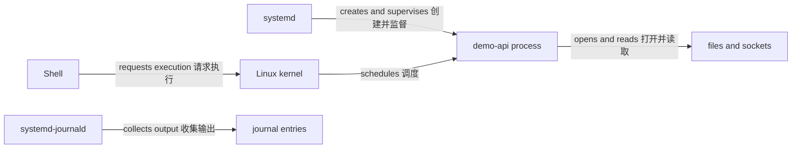

# Linux Runtime Foundations Module Implementation Plan

> **For agentic workers:** REQUIRED SUB-SKILL: Use superpowers:subagent-driven-development (recommended) or superpowers:executing-plans to implement this plan task-by-task. Steps use checkbox (`- [ ]`) syntax for tracking.

**Goal:** Build and publish a 16-page, Ubuntu 24.04-based Linux runtime foundations module for application developers, using one host-run `demo-api` to connect Shell, processes, systemd, files, sockets, namespaces, cgroup v2, security, and troubleshooting.

**Architecture:** The module grows behind content contracts in six page batches. A canonical route manifest, Bash fence validation, systemd unit parsing, sidebar, homepage entry, production inventory, and cross-module links land only after every page exists, so the site never exposes a partial Linux module.

**Tech Stack:** VitePress 1.6, Markdown, Mermaid 11, Bash, systemd unit files, Node.js `child_process`, MarkdownIt, Vitest 4, Vue 3

---

## File Structure

**Create content:**

- `docs/linux/index.md`: Linux runtime actor model and reading paths.
- `docs/linux/guide/shell-practical-basics.md`: paths, quoting, variables, pipelines, redirection, status, traps, and strict-mode boundaries.
- `docs/linux/guide/run-demo-api.md`: verified Node.js installation and direct host execution of `demo-api`.
- `docs/linux/concepts/processes-and-procfs.md`: process identity, state, environment, descriptors, and `/proc` evidence.
- `docs/linux/concepts/users-groups-permissions.md`: UID/GID, groups, modes, umask, ACL, capabilities, and service account.
- `docs/linux/concepts/filesystems-and-mounts.md`: pathname, inode, links, filesystems, mounts, space, and inode exhaustion.
- `docs/linux/concepts/signals-and-exit-status.md`: signals, process groups, wait status, graceful shutdown, and forced termination.
- `docs/linux/concepts/namespaces.md`: Linux namespace resource views and isolation limits.
- `docs/linux/concepts/cgroups-and-resources.md`: cgroup v2 hierarchy, controllers, accounting, limits, delegation, and PSI.
- `docs/linux/runtime/systemd-services.md`: `demo-api.service`, lifecycle, restart, timeout, drop-ins, and resource controls.
- `docs/linux/runtime/logs-and-journal.md`: stdout/stderr, journal metadata, kernel logs, filtering, and retention boundary.
- `docs/linux/runtime/sockets-and-name-resolution.md`: listener, connection, route, and resolver evidence.
- `docs/linux/runtime/resource-pressure.md`: controlled CPU, memory, I/O, PID, disk-space, and inode diagnosis.
- `docs/linux/operations/security-boundaries.md`: service identity, files, capabilities, systemd sandboxing, credentials, and shared-kernel boundary.
- `docs/linux/operations/troubleshooting.md`: evidence-first layered diagnosis.
- `docs/linux/reference/command-evidence-map.md`: symptom-to-command-to-evidence reference.

**Create tests:**

- `tests/linux-content.test.ts`: per-page terminology, relation, fence, safety, and source contracts.
- `tests/linux-examples.test.ts`: Bash syntax, continuous-example identity, and systemd unit consistency.
- `tests/linux-routing.test.ts`: exact route inventory, root-absolute links, sidebar scope, and bidirectional links.
- `tests/support/linux-routes.ts`: canonical Linux route manifest.

**Modify integration:**

- `docs/.vitepress/config.mts`: add the `/linux/` sidebar after all pages exist.
- `docs/.vitepress/theme/home-content.ts`: mark Linux available at `/linux/` only in Task 7.
- `docs/docker-oci/concepts/container-model.md`: link namespace and cgroup models to Linux.
- `docs/docker-oci/runtime/process-lifecycle.md`: link signals and PID behavior to Linux.
- `docs/docker-oci/runtime/storage.md`: link mount and UID/GID behavior to Linux.
- `docs/docker-oci/runtime/networking.md`: link socket and namespace evidence to Linux.
- `docs/kubernetes/concepts/cluster-nodes.md`: link node process and cgroup evidence to Linux.
- `docs/kubernetes/concepts/security.md`: link UID/GID, capabilities, and namespace boundaries to Linux.
- `docs/kubernetes/concepts/scheduling-resources.md`: link cgroup v2 and pressure evidence to Linux.
- `docs/kubernetes/operations/health-lifecycle.md`: link signal and exit behavior to Linux.
- `docs/kubernetes/operations/troubleshooting.md`: link host evidence to Linux troubleshooting.
- `tests/cloud-native-home.test.ts`: expect three available and 21 planned topics.
- `tests/content.test.ts`: continue validating all public Linux links through the global link contract.
- `tests/build-output.test.ts`: require the exact Linux production inventory and homepage entry.

## Authoring Rules Used By Every Task

- Write Chinese prose and retain official interface names, paths, directives, signals, and commands in their original form.
- Use Ubuntu 24.04 LTS as the runnable baseline. State when Docker Desktop, WSL, containers, remote hosts, or other distributions differ.
- Distinguish POSIX/Shell behavior, Linux kernel interfaces, systemd behavior, Ubuntu defaults, and recommendations explicitly.
- Reuse `demo-api`, port `3000`, path `/healthz`, service account `demo-api`, unit `demo-api.service`, application root `/opt/demo-api`, and state root `/var/lib/demo-api` throughout.
- Use root-absolute internal links. Do not link unfinished Containerd, network/DNS, storage, or backup pages.
- Every command sequence states prerequisites, needed privilege, observable evidence, and exact cleanup.
- Do not recommend `chmod 777`, disabling AppArmor/firewalls, clearing the journal, routine `kill -9`, opaque remote install scripts, fork bombs, host-wide OOM, or filling a filesystem.
- Primary sources are Linux kernel documentation, man7.org Linux man-pages, freedesktop.org systemd manuals, and Ubuntu official documentation.

### Task 1: Module Overview, Shell Foundation, And Host-Run Demo

**Files:**
- Create: `tests/linux-content.test.ts`
- Create: `tests/linux-examples.test.ts`
- Create: `docs/linux/index.md`
- Create: `docs/linux/guide/shell-practical-basics.md`
- Create: `docs/linux/guide/run-demo-api.md`

- [ ] **Step 1: Write the failing content contract**

Create `tests/linux-content.test.ts` with this harness and first contracts:

```ts
import { existsSync, readFileSync } from 'node:fs'
import { resolve } from 'node:path'
import { describe, expect, it } from 'vitest'

import { markdownFences } from './support/markdown'

interface PageContract {
  fences: string[]
  phrases: string[]
  terms: string[]
}

const root = resolve(import.meta.dirname, '..')

const pageContracts: Record<string, PageContract> = {
  'docs/linux/index.md': {
    fences: ['mermaid', 'bash'],
    phrases: [
      'Shell 请求 kernel 创建进程',
      'systemd 创建服务进程并监督状态',
      'namespace 改变进程可见的资源视图',
      'cgroup 组织、统计并约束进程资源',
    ],
    terms: ['Ubuntu 24.04 LTS', 'kernel', 'systemd', '/proc', 'journal', 'namespace', 'cgroup v2'],
  },
  'docs/linux/guide/shell-practical-basics.md': {
    fences: ['bash'],
    phrases: [
      '引用决定字符何时保持原义、何时发生展开',
      'pipeline 的默认退出状态通常来自最后一个命令',
      'set -e 不能代替显式错误处理',
      'trap 只清理本脚本创建且已经验证身份的资源',
    ],
    terms: ['working directory', 'PATH', 'stdout', 'stderr', '$?', 'pipefail', 'mktemp'],
  },
  'docs/linux/guide/run-demo-api.md': {
    fences: ['js', 'bash'],
    phrases: [
      "const port = Number(process.env.PORT ?? 3000)",
      "request.url === '/healthz'",
      "server.listen(port, '127.0.0.1'",
      'kill -TERM "$demo_pid"',
    ],
    terms: ['Ubuntu 24.04 LTS', 'SHA256', 'demo-api', '127.0.0.1:3000', '/proc', 'ss -ltnp'],
  },
}

function readRequiredPage(file: string): string {
  const absoluteFile = resolve(root, file)
  expect(existsSync(absoluteFile), `${file} must exist`).toBe(true)
  return existsSync(absoluteFile) ? readFileSync(absoluteFile, 'utf8') : ''
}

describe('Linux content contracts', () => {
  it.each(Object.entries(pageContracts))('%s teaches its required model', (file, contract) => {
    const source = readRequiredPage(file)
    for (const term of contract.terms) expect(source, `${file} missing ${term}`).toContain(term)
    for (const phrase of contract.phrases) expect(source, `${file} missing ${phrase}`).toContain(phrase)
    const languages = markdownFences(source, file).map((fence) => fence.language)
    for (const language of contract.fences) expect(languages).toContain(language)
    expect(source).toMatch(/(?:边界|注意|不要|不能|并不|风险)/)
    expect(source).toMatch(/https:\/\/(?:docs\.kernel\.org|man7\.org|www\.freedesktop\.org|documentation\.ubuntu\.com)/)
    expect(source).toMatch(/\]\(\/linux\//)
  })
})
```

- [ ] **Step 2: Verify RED**

Run:

```bash
npx vitest run tests/linux-content.test.ts
```

Expected: three cases FAIL because the pages do not exist.

- [ ] **Step 3: Write the overview and two guides**

Create the pages with these exact H2 structures:

```text
docs/linux/index.md
  从命令到运行中的应用
  九个参与者，不是一体化黑盒
  主机进程与容器进程
  Ubuntu 24.04 实验边界
  最短验证路径
  常见误区
  阅读路径

docs/linux/guide/shell-practical-basics.md
  实验环境与安全目录
  路径、工作目录与 PATH
  引用、变量与参数
  标准输入、输出与错误
  管道与退出状态
  条件执行与函数
  trap 与精确清理
  strict mode 的边界
  失败检查点
  下一步

docs/linux/guide/run-demo-api.md
  前置条件
  创建隔离实验目录
  获取并校验 Node.js
  创建 demo-api
  直接启动并记录 PID
  验证 HTTP 与监听 socket
  观察 procfs 证据
  发送终止信号并等待
  精确清理
  失败检查点
  下一步
```

The overview Mermaid graph must use actor-to-actor edges equivalent to:



Use the same `server.mjs` behavior as Docker / OCI, binding to `127.0.0.1`. The Node download example must define explicit `node_version`, `node_arch`, archive, checksum URL, and compare SHA256 before extraction. Never pipe a downloaded script to a shell.

- [ ] **Step 4: Add Bash syntax and identity tests**

Create `tests/linux-examples.test.ts`:

```ts
import { spawnSync } from 'node:child_process'
import { readFileSync } from 'node:fs'
import { resolve } from 'node:path'
import { describe, expect, it } from 'vitest'

import { markdownFences } from './support/markdown'

const root = resolve(import.meta.dirname, '..')
const initialPages = [
  'docs/linux/index.md',
  'docs/linux/guide/shell-practical-basics.md',
  'docs/linux/guide/run-demo-api.md',
]

describe('Linux runnable examples', () => {
  it.each(initialPages)('keeps Bash fences syntactically valid in %s', (file) => {
    const source = readFileSync(resolve(root, file), 'utf8')
    for (const fence of markdownFences(source, file).filter(({ language }) => language === 'bash')) {
      const result = spawnSync('bash', ['-n'], { encoding: 'utf8', input: fence.content })
      expect(result.status, `${fence.location}: ${result.stderr}`).toBe(0)
    }
  })

  it('keeps the host demo identity aligned with Docker / OCI', () => {
    const source = readFileSync(resolve(root, 'docs/linux/guide/run-demo-api.md'), 'utf8')
    expect(source).toContain('demo-api')
    expect(source).toContain('3000')
    expect(source).toContain('/healthz')
    expect(source).toContain("request.url === '/healthz'")
  })
})
```

- [ ] **Step 5: Run focused tests and commit**

Run:

```bash
npx vitest run tests/linux-content.test.ts tests/linux-examples.test.ts tests/content-mermaid.test.ts
git diff --check
```

Expected: all cases PASS and the overview Mermaid fence parses.

Commit:

```bash
git add tests/linux-content.test.ts tests/linux-examples.test.ts docs/linux/index.md docs/linux/guide
git commit -m "docs: introduce Linux runtime foundations"
```

### Task 2: Processes, Identity, Files, And Signals

**Files:**
- Modify: `tests/linux-content.test.ts`
- Modify: `tests/linux-examples.test.ts`
- Create: `docs/linux/concepts/processes-and-procfs.md`
- Create: `docs/linux/concepts/users-groups-permissions.md`
- Create: `docs/linux/concepts/filesystems-and-mounts.md`
- Create: `docs/linux/concepts/signals-and-exit-status.md`

- [ ] **Step 1: Extend the contract before writing pages**

Add these entries to `pageContracts`:

```ts
'docs/linux/concepts/processes-and-procfs.md': {
  fences: ['mermaid', 'bash'],
  phrases: [
    '进程表是一个时间点的快照，不是完整执行历史',
    '/proc/<pid>/environ 使用 NUL 分隔环境项',
    '文件描述符是进程表项中的整数引用',
    'PID 可以复用，单独保存 PID 不能永久证明进程身份',
  ],
  terms: ['PID', 'PPID', 'thread', 'process state', '/proc', 'fd', 'cmdline', 'start time'],
},
'docs/linux/concepts/users-groups-permissions.md': {
  fences: ['bash'],
  phrases: [
    'kernel 比较数值 UID 和 GID，不比较用户名字符串',
    '目录的 execute 位控制路径遍历',
    'umask 从请求的 mode 中移除权限',
    'capability 把传统 root 权限拆成独立能力',
  ],
  terms: ['UID', 'GID', 'supplementary groups', 'umask', 'ACL', 'capabilities', 'demo-api'],
},
'docs/linux/concepts/filesystems-and-mounts.md': {
  fences: ['mermaid', 'bash'],
  phrases: [
    'pathname 经过逐级解析后定位文件对象',
    'hard link 引用同一个 inode',
    'mount 把一个文件系统附着到目录树中的挂载点',
    '剩余字节和剩余 inode 是两种不同容量',
  ],
  terms: ['pathname', 'inode', 'hard link', 'symbolic link', 'mount point', 'findmnt', 'df -i'],
},
'docs/linux/concepts/signals-and-exit-status.md': {
  fences: ['mermaid', 'bash'],
  phrases: [
    'SIGKILL 不能被捕获、阻塞或忽略',
    '退出状态只保留有限范围的信息',
    '向单个 PID 发信号不等于处理整个进程组',
    'graceful shutdown 必须有可验证的等待上界',
  ],
  terms: ['SIGTERM', 'SIGINT', 'SIGKILL', 'process group', 'wait', 'exit status', 'trap'],
},
```

Add all four files to the Bash syntax parameter list in `tests/linux-examples.test.ts`.

- [ ] **Step 2: Verify RED**

Run `npx vitest run tests/linux-content.test.ts tests/linux-examples.test.ts`.

Expected: four new content cases FAIL because the pages do not exist; existing cases remain green.

- [ ] **Step 3: Write the four model pages**

Use these H2 sequences:

```text
processes-and-procfs: 进程身份 / 父子关系与线程 / 进程状态 / 环境与命令行 / 文件描述符 / procfs 观察 / PID 复用 / demo-api 检查 / 边界与误区
users-groups-permissions: 身份是数值 / 主组与附加组 / 文件与目录 mode / umask / ownership 与 ACL / capabilities / 创建服务账户 / demo-api 目录 / 精确清理 / 边界与误区
filesystems-and-mounts: 路径解析 / inode 与链接 / 文件系统与 VFS / mount 与 mount view / 空间与 inode / demo-api 文件证据 / 只读观察实验 / 边界与误区
signals-and-exit-status: 信号参与者 / disposition 与 mask / 进程组 / Shell 退出状态 / demo-api graceful stop / systemd 与容器边界 / 强制终止 / 失败检查点
```

The service-account sequence must use `systemd-sysusers` or `useradd --system` with a fixed home/state decision, verify `getent passwd demo-api`, and refuse cleanup if the account attributes do not match the documented experiment. Mount examples are observation-only (`findmnt`, `/proc/self/mountinfo`); do not mount over host paths.

- [ ] **Step 4: Run focused tests and commit**

Run:

```bash
npx vitest run tests/linux-content.test.ts tests/linux-examples.test.ts tests/content-mermaid.test.ts
git diff --check
```

Expected: PASS.

Commit:

```bash
git add tests/linux-content.test.ts tests/linux-examples.test.ts docs/linux/concepts/processes-and-procfs.md docs/linux/concepts/users-groups-permissions.md docs/linux/concepts/filesystems-and-mounts.md docs/linux/concepts/signals-and-exit-status.md
git commit -m "docs: explain Linux host process foundations"
```

### Task 3: systemd And Journal

**Files:**
- Modify: `tests/linux-content.test.ts`
- Modify: `tests/linux-examples.test.ts`
- Create: `docs/linux/runtime/systemd-services.md`
- Create: `docs/linux/runtime/logs-and-journal.md`

- [ ] **Step 1: Add failing content and unit contracts**

Add content contracts:

```ts
'docs/linux/runtime/systemd-services.md': {
  fences: ['ini', 'bash', 'mermaid'],
  phrases: [
    'systemd 读取 unit 配置并创建服务进程',
    'daemon-reload 重新加载 unit 文件，不会自动重启服务',
    'Restart=on-failure 不会修复持续存在的配置错误',
    'drop-in override 比复制完整 vendor unit 更容易审计差异',
  ],
  terms: ['demo-api.service', 'ExecStart', 'User=demo-api', 'WorkingDirectory=/opt/demo-api', 'Restart=on-failure', 'TimeoutStopSec'],
},
'docs/linux/runtime/logs-and-journal.md': {
  fences: ['bash'],
  phrases: [
    'journal entry 把日志内容与 unit、PID、boot 和时间元数据关联',
    'stdout 和 stderr 不是日志级别',
    'journalctl --unit demo-api.service',
    '删除或 vacuum journal 会破坏仍可能需要的排障证据',
  ],
  terms: ['systemd-journald', '_SYSTEMD_UNIT', '_PID', '_BOOT_ID', 'priority', 'kernel log', 'retention'],
},
```

Add both files to Bash syntax validation. Add this test to `tests/linux-examples.test.ts`:

```ts
it('defines one consistent demo-api systemd service', () => {
  const file = 'docs/linux/runtime/systemd-services.md'
  const source = readFileSync(resolve(root, file), 'utf8')
  const unit = markdownFences(source, file)
    .find((fence) => fence.info === 'ini title="/etc/systemd/system/demo-api.service"')?.content

  expect(unit).toBeDefined()
  expect(unit).toContain('[Unit]')
  expect(unit).toContain('[Service]')
  expect(unit).toContain('[Install]')
  expect(unit).toContain('User=demo-api')
  expect(unit).toContain('WorkingDirectory=/opt/demo-api')
  expect(unit).toContain('ExecStart=/opt/demo-api/node/bin/node /opt/demo-api/server.mjs')
  expect(unit).toContain('Restart=on-failure')
  expect(unit).toContain('TimeoutStopSec=15s')
})
```

- [ ] **Step 2: Verify RED**

Run `npx vitest run tests/linux-content.test.ts tests/linux-examples.test.ts`.

Expected: the two page contracts and unit contract FAIL because the pages and named fence do not exist.

- [ ] **Step 3: Write the systemd and journal pages**

The service page must contain this complete primary unit:

```ini title="/etc/systemd/system/demo-api.service"
[Unit]
Description=Demo API for Linux runtime exercises
After=network.target

[Service]
Type=exec
User=demo-api
Group=demo-api
WorkingDirectory=/opt/demo-api
Environment=PORT=3000
ExecStart=/opt/demo-api/node/bin/node /opt/demo-api/server.mjs
Restart=on-failure
RestartSec=2s
TimeoutStopSec=15s
KillSignal=SIGTERM
StateDirectory=demo-api
NoNewPrivileges=yes

[Install]
WantedBy=multi-user.target
```

Use H2 sections covering unit model, installation, verification, state transitions, dependency meaning, restart, stop, drop-ins, resource controls, rollback, cleanup, and failure evidence. The journal page must cover stdout/stderr capture, field filtering, boot/time/unit correlation, kernel boundary, retention, export-before-cleanup, and sensitive-data risk.

- [ ] **Step 4: Run focused tests and commit**

Run:

```bash
npx vitest run tests/linux-content.test.ts tests/linux-examples.test.ts tests/content-mermaid.test.ts
git diff --check
```

Expected: PASS.

Commit:

```bash
git add tests/linux-content.test.ts tests/linux-examples.test.ts docs/linux/runtime/systemd-services.md docs/linux/runtime/logs-and-journal.md
git commit -m "docs: manage demo API with systemd"
```

### Task 4: Namespaces And cgroup v2

**Files:**
- Modify: `tests/linux-content.test.ts`
- Modify: `tests/linux-examples.test.ts`
- Create: `docs/linux/concepts/namespaces.md`
- Create: `docs/linux/concepts/cgroups-and-resources.md`

- [ ] **Step 1: Add failing contracts**

Add:

```ts
'docs/linux/concepts/namespaces.md': {
  fences: ['mermaid', 'bash'],
  phrases: [
    'namespace 改变一组进程看到的资源视图',
    'namespace 不是虚拟机，也不是完整安全边界',
    'user namespace 中的 UID 映射不改变所有外部对象的 ownership',
    'nsenter 会进入目标进程的 namespace，必须先验证目标身份',
  ],
  terms: ['mount', 'PID', 'network', 'UTS', 'IPC', 'user', 'cgroup', 'time', '/proc/self/ns'],
},
'docs/linux/concepts/cgroups-and-resources.md': {
  fences: ['mermaid', 'bash'],
  phrases: [
    'cgroup 组织进程并提供资源统计和控制接口',
    'cgroup namespace 不等于 cgroup resource limit',
    'memory.high 用于节流压力，memory.max 是硬上限',
    'systemd 是 Ubuntu 主机上 cgroup hierarchy 的主要管理者',
  ],
  terms: ['cgroup v2', 'cgroup.controllers', 'cpu.stat', 'memory.current', 'memory.events', 'pids.current', 'PSI'],
},
```

Add both files to Bash syntax validation.

- [ ] **Step 2: Verify RED**

Run `npx vitest run tests/linux-content.test.ts tests/linux-examples.test.ts`.

Expected: two new content cases FAIL because the pages do not exist.

- [ ] **Step 3: Write both pages**

Namespaces must compare all eight namespace types in a table and use read-only `readlink /proc/self/ns/*` plus `lsns` as the default experiment. Any `unshare` example must run an unprivileged, short-lived shell with explicit fallback when user namespaces are disabled. `nsenter` is explanation-only unless a uniquely identified experiment PID and start time are verified.

cgroup v2 must show how to derive the service control-group path from `systemctl show --property ControlGroup --value demo-api.service`, validate the path remains below `/sys/fs/cgroup`, and read `cpu.stat`, `memory.current`, `memory.events`, and `pids.current`. Writes use `systemd-run` or a `systemctl edit` drop-in, never direct arbitrary writes into systemd-owned cgroups.

- [ ] **Step 4: Run focused tests and commit**

Run the Linux content/example tests plus Mermaid tests and `git diff --check`; expect PASS.

Commit:

```bash
git add tests/linux-content.test.ts tests/linux-examples.test.ts docs/linux/concepts/namespaces.md docs/linux/concepts/cgroups-and-resources.md
git commit -m "docs: explain Linux namespaces and cgroups"
```

### Task 5: Socket Evidence And Resource Pressure

**Files:**
- Modify: `tests/linux-content.test.ts`
- Modify: `tests/linux-examples.test.ts`
- Create: `docs/linux/runtime/sockets-and-name-resolution.md`
- Create: `docs/linux/runtime/resource-pressure.md`

- [ ] **Step 1: Add failing contracts**

Add:

```ts
'docs/linux/runtime/sockets-and-name-resolution.md': {
  fences: ['mermaid', 'bash'],
  phrases: [
    '监听 socket、连接、路由和名称解析是四个不同检查点',
    '127.0.0.1 只接受本机 loopback 路径上的连接',
    'getent ahosts 使用系统配置的 Name Service Switch 路径',
    'DNS 返回地址不证明目标端口正在监听',
  ],
  terms: ['ss -ltnp', 'socket', 'LISTEN', 'ip route get', 'getent ahosts', '/etc/resolv.conf', '127.0.0.1:3000'],
},
'docs/linux/runtime/resource-pressure.md': {
  fences: ['bash', 'mermaid'],
  phrases: [
    '高利用率、资源压力和资源上限是不同证据',
    '不能通过填满宿主文件系统来演示磁盘故障',
    'memory.events 中的 oom_kill 计数比单次进程消失更接近限制证据',
    '剩余空间正常时仍可能耗尽 inode',
  ],
  terms: ['CPU', 'memory', 'I/O', 'PID', 'PSI', 'memory.events', 'df -h', 'df -i'],
},
```

Add both files to Bash syntax validation.

- [ ] **Step 2: Verify RED**

Run the focused Linux tests; expect two missing-page failures.

- [ ] **Step 3: Write both pages**

The socket page follows this fixed order: application bind configuration, listener evidence, local connection evidence, route selection, NSS/resolver evidence, then firewall/network boundaries deferred to the future module. The resource page uses bounded `systemd-run --user --scope` or system units with explicit `CPUQuota`, `MemoryHigh`, `MemoryMax`, and `TasksMax`; it observes pressure without intentionally reaching host-wide OOM, disk-full, inode-full, or fork exhaustion.

- [ ] **Step 4: Run focused tests and commit**

Run Linux content/examples/Mermaid tests and `git diff --check`; expect PASS.

Commit:

```bash
git add tests/linux-content.test.ts tests/linux-examples.test.ts docs/linux/runtime/sockets-and-name-resolution.md docs/linux/runtime/resource-pressure.md
git commit -m "docs: diagnose Linux sockets and pressure"
```

### Task 6: Security, Troubleshooting, And Evidence Reference

**Files:**
- Modify: `tests/linux-content.test.ts`
- Modify: `tests/linux-examples.test.ts`
- Create: `docs/linux/operations/security-boundaries.md`
- Create: `docs/linux/operations/troubleshooting.md`
- Create: `docs/linux/reference/command-evidence-map.md`

- [ ] **Step 1: Add failing contracts**

Add:

```ts
'docs/linux/operations/security-boundaries.md': {
  fences: ['ini', 'bash', 'mermaid'],
  phrases: [
    '非 root 服务账户只缩小一个权限边界，不构成完整隔离',
    'NoNewPrivileges 阻止进程通过 execve 获得新的特权',
    'systemd sandboxing directive 必须根据应用实际文件和 socket 需求验证',
    'secret 不应出现在命令行参数、普通环境转储或日志中',
  ],
  terms: ['service account', 'capabilities', 'NoNewPrivileges', 'ProtectSystem', 'PrivateTmp', 'LoadCredential', 'AppArmor'],
},
'docs/linux/operations/troubleshooting.md': {
  fences: ['bash', 'mermaid'],
  phrases: [
    '先记录症状发生的时间、主机、unit 和请求标识',
    '进程未创建与进程创建后立即退出需要不同证据',
    '权限拒绝必须同时检查进程身份、路径每一级权限和安全模块',
    '不要在保存证据前重启服务、清空日志或删除状态目录',
  ],
  terms: ['systemctl show', 'journalctl', 'namei -l', 'ss -ltnp', 'getent', 'memory.events', 'dmesg'],
},
'docs/linux/reference/command-evidence-map.md': {
  fences: ['bash'],
  phrases: [
    '命令输出是某个时间点的证据，不是自动成立的根因',
    '先使用最小权限读取证据，再决定是否需要 sudo',
    '每条命令都链接回解释其模型的页面',
    '修改状态的命令不属于只读速查',
  ],
  terms: ['ps', '/proc', 'id', 'stat', 'findmnt', 'systemctl', 'journalctl', 'ss', 'ip route get', 'getent', 'cgroup'],
},
```

Add all three files to Bash syntax validation.

- [ ] **Step 2: Verify RED**

Run focused Linux tests; expect three missing-page failures.

- [ ] **Step 3: Write the final three pages**

Security must provide a `systemctl edit demo-api.service` drop-in with `NoNewPrivileges=yes`, `PrivateTmp=yes`, `ProtectSystem=strict`, `ProtectHome=yes`, and only the write paths actually required by `demo-api`. It must use `systemd-analyze security demo-api.service` as a heuristic report, not a certification.

Troubleshooting must use this layer order: context capture, unit/load state, process creation, exit/signal, identity/permission, pathname/mount, listener/connection, resolver/route, cgroup/resource, kernel/host pressure. Every branch names one observable fact and the next discriminating check.

The reference page is read-only by default and groups commands by process, identity, files/mounts, service, journal, socket/route/resolver, cgroup, and pressure. Mutating commands appear only as links back to the relevant guided page.

- [ ] **Step 4: Run all Linux-focused tests and commit**

Run:

```bash
npx vitest run tests/linux-content.test.ts tests/linux-examples.test.ts tests/content-mermaid.test.ts tests/content.test.ts
git diff --check
```

Expected: PASS for all 16 Linux page contracts, Bash syntax checks, unit consistency, Mermaid, and global links.

Commit:

```bash
git add tests/linux-content.test.ts tests/linux-examples.test.ts docs/linux/operations docs/linux/reference
git commit -m "docs: complete Linux operations guidance"
```

### Task 7: Publish Routes, Navigation, Homepage, And Cross-Links

**Files:**
- Create: `tests/support/linux-routes.ts`
- Create: `tests/linux-routing.test.ts`
- Modify: `tests/cloud-native-home.test.ts`
- Modify: `tests/build-output.test.ts`
- Modify: `docs/.vitepress/config.mts`
- Modify: `docs/.vitepress/theme/home-content.ts`
- Modify: the nine Docker / OCI and Kubernetes files listed in the file structure

- [ ] **Step 1: Add the canonical route manifest and failing routing tests**

Create `tests/support/linux-routes.ts`:

```ts
export const linuxRouteManifest = [
  'index',
  'guide/shell-practical-basics',
  'guide/run-demo-api',
  'concepts/processes-and-procfs',
  'concepts/users-groups-permissions',
  'concepts/filesystems-and-mounts',
  'concepts/signals-and-exit-status',
  'concepts/namespaces',
  'concepts/cgroups-and-resources',
  'runtime/systemd-services',
  'runtime/logs-and-journal',
  'runtime/sockets-and-name-resolution',
  'runtime/resource-pressure',
  'operations/security-boundaries',
  'operations/troubleshooting',
  'reference/command-evidence-map',
] as const
```

Create `tests/linux-routing.test.ts` with this routing harness:

```ts
import { existsSync, readFileSync, readdirSync } from 'node:fs'
import { resolve } from 'node:path'
import MarkdownIt from 'markdown-it'
import { describe, expect, it } from 'vitest'

import { linuxRouteManifest } from './support/linux-routes'

const root = resolve(import.meta.dirname, '..')
const docsRoot = resolve(root, 'docs')
const markdownParser = new MarkdownIt()
const linuxFiles = linuxRouteManifest.map((route) => `docs/linux/${route}.md`)

function relativeDocumentDestinations(source: string): string[] {
  return markdownParser.parse(source, {}).flatMap((token) => token.children ?? [])
    .filter((token) => token.type === 'link_open')
    .map((token) => token.attrGet('href') ?? '')
    .filter((destination) => {
      const pathname = destination.split(/[?#]/, 1)[0]
      return destination !== '' && !destination.startsWith('/') &&
        !destination.startsWith('#') &&
        !/^[a-z][a-z\d+.-]*:/i.test(destination) &&
        !/\.(?:avif|gif|ico|jpe?g|pdf|png|svg|webp)$/i.test(pathname)
    })
}

describe('Linux routing', () => {
  it('contains exactly the planned Markdown route inventory', () => {
    const routes = readdirSync(resolve(docsRoot, 'linux'), {
      encoding: 'utf8', recursive: true,
    }).filter((file) => file.endsWith('.md'))
      .map((file) => file.replace(/\.md$/, '')).sort()
    expect(routes).toEqual([...linuxRouteManifest].sort())
  })

  it.each(linuxRouteManifest)('publishes /linux/%s from a source page', (route) => {
    expect(existsSync(resolve(docsRoot, 'linux', `${route}.md`))).toBe(true)
  })

  it.each(linuxFiles)('uses root-absolute document links in %s', (file) => {
    expect(relativeDocumentDestinations(readFileSync(resolve(root, file), 'utf8'))).toEqual([])
  })

  it('scopes a complete sidebar to /linux/', () => {
    const config = readFileSync(resolve(docsRoot, '.vitepress/config.mts'), 'utf8')
    const sidebar = config.slice(config.indexOf("'/linux/': ["), config.indexOf("'/docker-oci/': ["))
    expect(sidebar).toContain("link: '/linux/'")
    for (const route of linuxRouteManifest.slice(1)) {
      expect(sidebar).toContain(`link: '/linux/${route}'`)
    }
  })
})
```

Add this separate bidirectional-link case to the same `describe` block using these pairs:

```ts
it('keeps Linux, Docker / OCI, and Kubernetes links bidirectional', () => {
  const links = [
  ['docs/linux/concepts/namespaces.md', '/docker-oci/concepts/container-model'],
  ['docs/docker-oci/concepts/container-model.md', '/linux/concepts/namespaces'],
  ['docs/linux/concepts/signals-and-exit-status.md', '/docker-oci/runtime/process-lifecycle'],
  ['docs/docker-oci/runtime/process-lifecycle.md', '/linux/concepts/signals-and-exit-status'],
  ['docs/linux/concepts/filesystems-and-mounts.md', '/docker-oci/runtime/storage'],
  ['docs/docker-oci/runtime/storage.md', '/linux/concepts/filesystems-and-mounts'],
  ['docs/linux/runtime/sockets-and-name-resolution.md', '/docker-oci/runtime/networking'],
  ['docs/docker-oci/runtime/networking.md', '/linux/runtime/sockets-and-name-resolution'],
  ['docs/linux/concepts/cgroups-and-resources.md', '/kubernetes/concepts/scheduling-resources'],
  ['docs/kubernetes/concepts/scheduling-resources.md', '/linux/concepts/cgroups-and-resources'],
  ['docs/linux/operations/security-boundaries.md', '/kubernetes/concepts/security'],
  ['docs/kubernetes/concepts/security.md', '/linux/operations/security-boundaries'],
  ['docs/linux/operations/troubleshooting.md', '/kubernetes/operations/troubleshooting'],
  ['docs/kubernetes/operations/troubleshooting.md', '/linux/operations/troubleshooting'],
  ['docs/linux/concepts/processes-and-procfs.md', '/kubernetes/concepts/cluster-nodes'],
  ['docs/kubernetes/concepts/cluster-nodes.md', '/linux/concepts/processes-and-procfs'],
  ['docs/linux/concepts/signals-and-exit-status.md', '/kubernetes/operations/health-lifecycle'],
  ['docs/kubernetes/operations/health-lifecycle.md', '/linux/concepts/signals-and-exit-status'],
  ] as const

  for (const [file, destination] of links) {
    expect(readFileSync(resolve(root, file), 'utf8'), `${file} must link ${destination}`)
      .toContain(`](${destination})`)
  }
})
```

- [ ] **Step 2: Update homepage and build tests before integration**

In `tests/cloud-native-home.test.ts`, require available topics in catalog order to include Linux, Docker / OCI, and Kubernetes; change counts to `3` completed and `21` planned; assert the Linux link is `/project/linux/`.

Import `linuxRouteManifest` in `tests/build-output.test.ts`, require `builtTopicRoutes('linux')` to equal it exactly, and add:

```ts
it('publishes the Linux homepage entry and module home', () => {
  const home = readFileSync(resolve(dist, 'index.html'), 'utf8')
  const linuxHome = readFileSync(resolve(dist, 'linux/index.html'), 'utf8')
  expect(home).toContain('href="/linux/"')
  expect(home).toContain('Linux')
  expect(linuxHome).toContain('Linux 应用运行基础')
})
```

- [ ] **Step 3: Verify RED**

Run:

```bash
npx vitest run tests/linux-routing.test.ts tests/cloud-native-home.test.ts
```

Expected: FAIL because the Linux sidebar, homepage availability, and required reverse links are absent.

- [ ] **Step 4: Add sidebar, homepage entry, and links**

Add `/linux/` sidebar groups in this order: 开始, 核心模型, 运行与服务, 运行实践, 速查. Include every route exactly once.

Change the Linux topic to:

```ts
{
  title: 'Linux',
  status: 'available',
  href: '/linux/',
  icon: 'terminal',
}
```

Add one concise contextual paragraph for each required reverse link. Do not rewrite unrelated technical sections.

- [ ] **Step 5: Run integration and production tests**

Run:

```bash
npx vitest run tests/linux-routing.test.ts tests/cloud-native-home.test.ts tests/content.test.ts tests/build-output.test.ts
npm run typecheck
git diff --check
```

Expected: exact 16-page route and HTML inventories, three available homepage topics, all bidirectional links, typecheck, and diff check PASS.

- [ ] **Step 6: Commit publication integration**

```bash
git add tests/support/linux-routes.ts tests/linux-routing.test.ts tests/cloud-native-home.test.ts tests/build-output.test.ts docs/.vitepress/config.mts docs/.vitepress/theme/home-content.ts docs/docker-oci docs/kubernetes
git commit -m "feat: publish Linux runtime documentation"
```

### Task 8: Full Verification And Visual Acceptance

**Files:**
- Modify only if verification finds a Linux-module defect.

- [ ] **Step 1: Run fresh automated verification**

Run:

```bash
npm test -- --run
npm run typecheck
npm run build
git diff --check
```

Expected: every test passes, typecheck exits zero, VitePress renders every page, and diff check has no output. The existing Rollup chunk-size warning is informational unless its size or loading behavior regresses.

- [ ] **Step 2: Audit scope and dangerous guidance**

Run:

```bash
rg -n "TO""DO|TB""D|chmod 777|curl .+\|.*(?:sh|bash)|kill -9|rm -rf /|mount .+/(?:etc|usr|var)|fork bomb" docs/linux
rg -n "\]\((?!/|#|https?://)" docs/linux --pcre2
```

Expected: no placeholders, unsafe recommendations, opaque installer pipelines, broad destructive paths, or relative document links. Legitimate text that warns against a command must be manually confirmed as a prohibition, not advice.

- [ ] **Step 3: Run the site and inspect representative pages**

Start:

```bash
npm run dev -- --host 127.0.0.1 --port 5173
```

Use the in-app browser skill to inspect at least:

- `/` at 1440x900 and 390x844: Linux is a link, topic counts are correct, and no card text overlaps.
- `/linux/` at both viewports: overview diagram renders, sidebar is complete, mobile navigation opens, and the next section remains discoverable.
- `/linux/guide/shell-practical-basics`: code blocks scroll without changing page width.
- `/linux/runtime/systemd-services`: unit fence, tables, and callouts do not overflow.
- `/linux/concepts/namespaces`: Mermaid is nonblank and fullscreen controls still work.
- `/linux/operations/troubleshooting`: long tables and commands remain readable.

Check browser console errors and broken network requests on each representative route.

- [ ] **Step 4: Verify production route inventory and stop the server**

Confirm `docs/.vitepress/dist/linux/` contains exactly the HTML paths derived from `linuxRouteManifest`, then stop the development server cleanly.

- [ ] **Step 5: Commit only evidence-driven fixes**

If verification required fixes, rerun the smallest failing check first, then the full commands in Step 1, and commit only the relevant files:

```bash
git diff --name-only -z -- docs/linux docs/.vitepress/config.mts docs/.vitepress/theme/home-content.ts docs/docker-oci docs/kubernetes tests | xargs -0 git add --
git commit -m "fix: resolve Linux documentation verification findings"
```

If no source changes were required, do not create an empty verification commit.

## Final Acceptance

- [ ] The Linux route manifest contains exactly 16 source pages and the build publishes the same 16 routes.
- [ ] Ubuntu 24.04, privilege, environment-difference, evidence, and cleanup boundaries are explicit in every runnable sequence.
- [ ] The `demo-api` identity, port, health path, service account, paths, and unit name remain consistent.
- [ ] Shell, kernel, systemd, Ubuntu, Docker, Containerd, and Kubernetes responsibilities are not conflated.
- [ ] Linux, Docker / OCI, and Kubernetes cross-links are bidirectional at all required boundaries.
- [ ] Linux becomes available only after all content and integration tasks pass.
- [ ] Full tests, typecheck, production build, desktop/mobile checks, and repository diff checks pass.
- [ ] GitHub Pages verification remains deferred and is not silently claimed complete.
